# Unidad Didáctica 1. Introducción a la ciencia de datos

## 1.1. El rol del Data Scientist
Con el nacimiento del concepto de ciencia de datos aparece el perfil profesional del Data Scientist, como aquel experto en Data Science que resuelve problemas complejos de diferentes disciplinas, haciendo uso del análisis de datos y ayuda a la extracción de conclusiones.

En palabras de José Antonio Guerrero (científico de datos), el data scientist “Es una persona con fundamentos en matemáticas, estadística y métodos de optimización, con conocimientos en lenguajes de programación y que además tiene una experiencia práctica en el análisis de datos reales y la elaboración de modelos predictivos. De las tres características quizás la más difícil es la tercera; no en vano la modelización de los datos se ha definido en ocasiones como un arte. Aquí no hay reglas de oro, y cada conjunto de datos es un lienzo en blanco ”

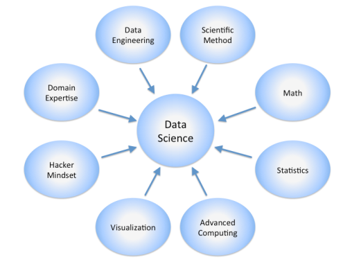

Como hemos visto, la ciencia de datos requiere de habilidades que van desde la informática tradicional hasta el arte de las matemáticas. Jeff Hammerbacher dijo que “un día cualquiera, un miembro del equipo podría crear un pipeline de procesamiento de varios niveles en Python, diseñar una prueba de hipótesis, realizar un análisis de regresión sobre muestras de datos con R, diseñar e implementar un algoritmo para algunos productos o servicios intensivos en datos en Hadoop, o comunicar los resultados de nuestros análisis a otros miembros de la organización.”

Por tanto, un “científico de datos” es la persona que trata y analiza los datos, posee conocimiento del negocio o del ámbito de aplicación de la información, y es capaz de explorar enormes cantidades de datos que trabaja para marcar y descubrir tendencias de negocio, nuevas estrategias o innovaciones. Es, en resumen, la figura que sabe unir, procesar y visualizar los datos desde múltiples perspectivas para encontrarles un nuevo sentido. Debe ser mitad analista, mitad artista.

Como se puede apreciar, el data scientist es un profesional con un perfil multidisciplinar, y en concreto debe combinar al menos tres características:

- Formación de base en alguna ciencia o disciplina cuantitativa, que incluya conocimientos de aprendizaje automático, algoritmia, optimización, simulación, series temporales y modelos de asociación y clasificación entre otros.
- Habilidades tecnológicas avanzadas, que incluyen el dominio de lenguajes de programación estadística, pero también conocimientos técnicos para la extracción eficiente, el uso y el almacenamiento de información, el manejo de bases de datos relacionales y no relacionales, y la capacidad para extraer datos de internet y procesar grandes cantidades de información.
- Conocimiento profundo del negocio en el que desarrolla su labor como científico de datos.

## 1.2. Etapas en el proceso de Data Science
Mientras que el ingeniero de datos se centra en capturar y recopilar grandes volúmenes de información estructurada, no estructurada y semiestructurada el data scientist se centra más en el análisis, predicción y visualización.

En el libro The Art of Data Science se describe la metodología que subyace a todo proyecto de Data Science, que en opinión de sus autores es un proceso definido como una iteración de cinco etapas:

1. Definición de las cuestiones a resolver: Consiste en establecer la pregunta que mejor defina el proyecto y tenga la mayor relevancia.
2. Exploración analítica de los datos: En esta etapa nos centraremos en evaluar la información disponible y refinar la pregunta inicial para evitar resultados ambiguos, sesgos o detectar la necesidad de recopilar nuevos datos.
3. Construcción del modelo: Consiste en buscar una serie de procesos y algoritmos que se puedan estandarizar y que nos permitan tratar los datos disponibles para mejorar la comprensión de estos, es decir, sería establecer un protocolo para tratar los datos disponibles y extraer de ellos la mayor información relevante posible, convirtiendo así los datos en conocimiento.
4. Interpretación de resultados: Esta etapa del proceso, es en opinión de los autores, un paso que se pone en práctica en todas y cada una de las etapas, pues es inevitable interpretar los distintos resultados parciales que se obtienen a medida que se avanza en el trabajo. No obstante, es necesario fijar una etapa independiente en la que se interpreten los resultados, una vez hayan sido tratados los datos, creados los modelos y cotejados los resultados para sacar las conclusiones.
5. Comunicación de resultados.

> **Importante:** Cada una de estas cinco etapas se centra en un aspecto determinado del análisis, pero al mismo tiempo, es importante revisar continuamente los resultados obtenidos en etapas anteriores para verificar si se mantiene la línea prevista o se ha producido alguna desviación que debamos revisar. Este aspecto del análisis es el más importante: la revisión continúa de los resultados con respecto a las expectativas.

 En todo proyecto de análisis de datos, a medida que se va profundizando, se descubren nuevos enfoques que nos empujan a replantearnos alguna de las etapas anteriores o incluso el propio marco de trabajo. Esto es lo que los autores del libro denominada Epicycles o Analysis, pues se entiende el procese como un proceso iterativo que se aplica a todos los pasos del proceso de análisis de datos, organizado de manera circular. Es decir, cada una de las 5 etapas se dividen a su vez en un proceso de tres bloques:

- **Definición de las expectativas:** Es el proceso de pensar en qué se pretende conseguir antes de hacer nada.
- **Recopilación de datos:** En este paso se recolecta información relacionada con la cuestión definida en la etapa anterior
- **Cotejo de las expectativas con los datos recopilados:** Una vez que tenemos los datos, el siguiente paso es comparar tus expectativas con los datos. En esta etapa pueden darse dos situaciones: que tus expectativas casen con los datos lo que nos haría avanzar a la siguiente etapa en el nivel superior, o que no lo que provocaría una revisión del proceso.

La ejecución de cada una de las etapas anteriores puede provocar un cambio en la estrategia de los niveles superiores, dando lugar a que se vuelva a una etapa anterior en el proceso de análisis, de ahí que la representación gráfica de esta teoría sea a modo de engranajes interconectados.

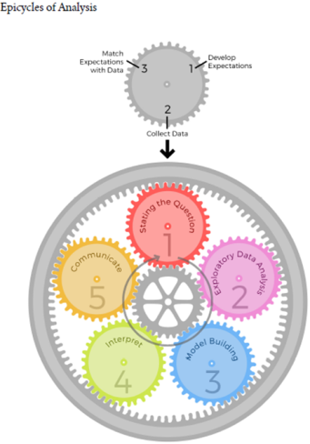

Para cada una de estas etapas del proyecto, se hará uso de diferentes herramientas y tecnologías englobadas dentro del universo del Big Data y Business Intelligence.

# 2. Herramientas necesarias para el científico de datos

Como se ha comentado, un científico de datos debe tener conocimientos en Matemáticas y Estadística, pero además precisa de diversos conocimientos tecnológicos como:

- Bases de datos relacionales, SQL.
- Bases de datos no relacionales, NoSQL.
- Lenguajes de programación como R y Python.
- Machine Learning.
- Programación de altas prestaciones, programación distribuida en herramientas como Hadoop.

Por tanto, un data scientist debe ser capaz de hacer gestión de grandes volúmenes de datos, análisis y visualización de estos. De un científico de datos se espera que tenga una gran comprensión de la informática y desarrolle herramientas o utilice algunas no estándar para las necesidades de productos o las necesidades de la empresa.

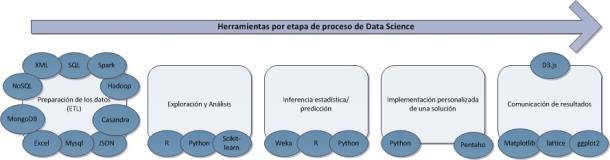

En la imagen anterior se exponen algunas de las herramientas y tecnologías que debe dominar un científico de datos en cada una de las etapas que componen el proceso.

La ciencia de datos implica como hemos visto una iteración en una secuencia de tareas: encontrar, cargar y preprocesar los datos, crear y probar modelos e implementar los modelos para su uso en aplicaciones inteligentes, para ello los científicos de datos usan varias herramientas, lo que en ocasiones puede ralentizar el proceso al tener que integrar diferentes versiones de software.

> **Para saber más:** Con el objetivo de reducir esta carga de trabajo, aparecen algunas herramientas como Microsoft Data Science Virtual Machine, que proporciona una imagen con las herramientas más populares preinstaladas y configuradas, y que se puede aprovisionar en Azure.

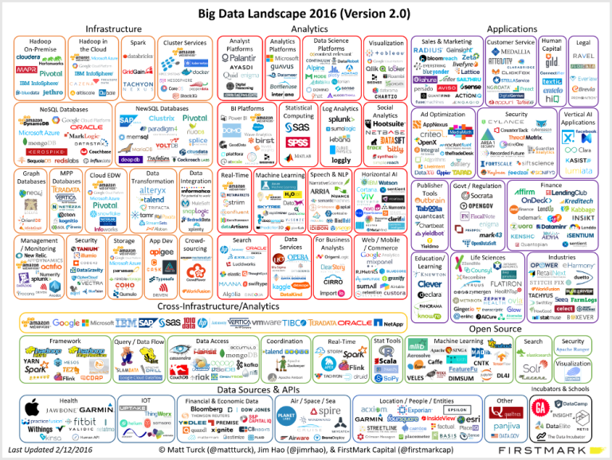

A la vista de la imagen anterior, en la que aparecen algunas de las herramientas de las que se puede hacer uso en el proceso de Data Science, no es raro que entre los profesionales de este entorno se conozca al Data Scientist como el “unicornio” de los datos, ya que es muy difícil que una única persona abarque todas las necesidades y tecnologías de esta área, por lo que generalmente para un proyecto de Data Science se formará un equipo multidisciplinar donde cada miembro dispondrá de unas habilidades concretas.

En el libro “Analyzing the Analyzers. An Introspective Survey of Data Scientists and their work” se concluye que existen 4 tipos de científicos de datos diferenciados:

- El empresario de datos: Es el que está centrado en la organización y en cómo a través de los proyectos de datos se pueden obtener beneficios.
- El creativo de datos: Son aquellos que realizan todo el proceso de análisis por su cuenta, desde la extracción de datos a la representación o visualización adecuada para su interpretación.
- El desarrollador de datos: Están más centrados en el problema técnico de los datos, cómo conseguirlos, almacenarlos y aprender de ellos.
- El investigador de datos: Aquellos con una base académica potente en ciencias sociales, estadísticas etc., y cuyo conocimiento puede conducir a investigar sobre resultados de los datos.

De forma gráfica podemos ver en la siguiente representación que áreas o disciplinas deben dominar y en qué medida cada uno de los miembros del equipo de data science.

# 3. Data Science - Cloud Compunting

El análisis y almacenamiento de los datos son dos de los conceptos más importantes hoy en día en las grandes y pequeñas empresas.

La gran cantidad de datos generados ha acelerado la necesidad de almacenar esta información de la manera más económica y segura posible, convirtiendo el almacenamiento en el cloud en una alternativa real para las organizaciones. Este hecho ha generado que el científico de datos tenga que analizar, en la mayoría de los casos, diferentes tipos de datos almacenados en la nube.

## 3.1. Definiendo el concepto de cloud computing

El concepto de cloud computing representa un nuevo modelo de informática que puede tener tanta o más relevancia que la propia Web. Se trata de la evolución de una serie de tecnologías que afectan a las distintas estrategias de las organizaciones en el momento en el que tienen que plantearse sus infraestructuras de tecnologías de la información.

Con la entrada del cloud computing, las empresas ya no tienen tanta necesidad de disponer de dispositivos de almacenamiento físico para gestionar su información ya que, a través de la nube, pueden acceder a sus datos prácticamente desde cualquier ubicación con acceso a Internet.

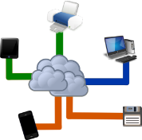

La informática en la nube en sí no ha conllevado la creación de nuevas tecnologías, sino que está formado por un compendio de estas como, por ejemplo:

- Virtualización.
- Almacenamiento físico.
- Almacenamiento en la web.
- Centros de datos.
- Software sobre servicio (Saas).
- Aplicaciones web.
- Sistemas operativos web.

Aunque en un principio cuando escuchamos hablar de “la nube” podemos compararla con la definición de Internet, no es así. La nube va mucho más allá: se trata de un nuevo modelo a través del cual se permite al usuario utilizar tecnología justo en el momento en el que se necesita sin necesidad de instalar prácticamente nada en el ordenador personal. Con la utilización de la nube además, se permite a los usuarios pagar sólo por la tecnología que necesitan en el momento en el que vayan a utilizarla, sin más; cuando no se utiliza no se paga, pudiendo incluso llegar a ser gratuita en numerosas ocasiones.

En cuanto a la definición de cloud computing, hay que decir que no existe una definición estándar que esté aceptada de forma universal. No obstante, hay ciertos organismos internacionales dedicados a la estandarización de las tecnologías de la información y, especialmente, del cloud computing.

Uno de los organismos más reconocidos es el NIST (National Institute of Standards and Technology) y define el cloud computing o computación en la nube como:

“Un modelo que permite el acceso bajo demanda a través de la red a un conjunto compartido de recursos de computación configurables (por ejemplo redes, servidores, almacenamiento, aplicaciones y servicios) que pueden aprovisionar rápidamente con el mínimo esfuerzo de gestión o interacción del proveedor de servicios”.

Según el NIST, el modelo de la nube está formado de cinco características fundamentales, tres modelos de servicio y cuatro modelos de despliegue. De hecho, la nube se considera como un conjunto formado por elementos de software y hardware, almacenamiento, servicios e interfaces que facilitan la entrada de datos e información como un servicio y se pueden presentar como componentes independientes o bien, como una plataforma completa.

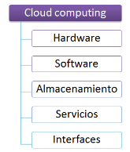

Los grupos de interés que forman parte de la computación en la nube son también de lo más diversos y cuantiosos. Los principales actores del cloud computing son los siguientes:

- **Proveedores o vendedores:** Son los que facilitan las aplicaciones y la tecnología, infraestructura, plataformas e información necesarios para llevarlas a cabo.
- **Socios de los proveedores:** Son los que ponen en contacto a los proveedores y a los clientes. Su tarea básica es crear servicios para la nube y ofrecerlos y soportarlos a los clientes.
- **Líderes de negocios:** Se encargan de evaluar los servicios de la nube para contratarlos e implementarlos en sus organizaciones.
- **Usuarios finales:** Son aquellos que utilizan finalmente los servicios que se ofrecen a través de la nube, ya sea de forma gratuita o realizando algún tipo de pago (periódico o puntual).

El cloud computing engloba por tanto tecnologías, servicios y aplicaciones similares a las que se utilizan con Internet y las transforma en utilidades de autoservicio. La utilización de la palabra “cloud” hace referencia a dos conceptos principales:

- **Abstracción:** El cloud computing está fundamentada en la abstracción. Las aplicaciones se ejecutan en dispositivos físicos que no están especificados y los datos se almacenan en ubicaciones desconocidas. Por otra parte, la administración de los sistemas está externalizada y los usuarios pueden acceder sus datos en cualquier momento, desde cualquier dispositivo y desde cualquier ubicación. Esto permite al cliente no requerir de personal especializado en la gestión y mantenimiento de la infraestructura, actualización de los sistemas y demás tareas asociadas al servicio contratado.
- **Virtualización:** La computación en la nube virtualiza los sistemas compartiendo, combinando y agrupando los recursos. Además, los recursos pueden estar disponibles con un elevado grado de agilidad y flexibilidad sin necesidad que los usuarios conozcan con profundidad cuáles son los recursos físicos disponibles.

Como ya se ha comentado anteriormente, es muy frecuente escuchar que la computación en la nube no es nada más que Internet con otra denominación.

La confusión tiene su punto de lógica ya que Internet y cloud computing comparten bastantes características. No obstante, no hay que olvidar que, a pesar de que ambos ofrecen abstracción y utilizan los mismos protocolos, estándares, sistemas operativos y aplicaciones, el cloud computing es un modelo nuevo que ofrece recursos virtuales a través de la agrupación y compartición de recursos de carácter físico.

Son ejemplos de utilización de servicios de computación en la nube como herramientas para cambiar los hábitos y modelos de utilización de las tecnologías de la información los siguientes:

- **Google:** Esta gran corporación cuyo servicio principal es un potente motor de búsquedas se ha ido extendiendo por todo el mundo y ha ido incluyendo cada vez más aplicaciones complementarias. Un ejemplo lo encontramos en Google Apps, donde Google ofrece servicios tan variados como correo electrónico, agenda, calendario o software ofimático a través de la nube. Además, estos servicios podemos encontrarlos tanto de forma gratuita como de pago de un modo más completo.

- **Azure Platform:** Se trata de una plataforma de desarrollo de aplicaciones a través de la nube desarrollada por Microsoft. Ofrece un conjunto de funcionalidades tan variadas como:

    - **Windows Azure:** Servicio de computación para las aplicaciones.
    - **Windows Azure Storage:** Almacenamiento de datos no relacionales
    - **SQL Azure:** Base de datos relacional en la nube.
    - **Windows Azure AppFabric:** Servicio de control de accesos que permite integrar servicios y aplicaciones que se ejecutan en la nube.

- **Amazon Web Services:** La librería virtual más cuantiosa del mundo Amazon, decidió introducirse en el negocio del aprovisionamiento de infraestructuras virtuales. Comenzó ofreciendo almacenamiento virtual y ha llegado a crear su propia infraestructura AWS (Amazon Web Services) a través de la cual ofrece servicios globales de informática, bases de datos, análisis, aplicaciones e implantaciones que ayudan a las empresas a gestionar su información con mayor rapidez y un menor coste en tecnologías de la información.

## 3.2. Características del cloud computing

Según el **NIST (National Institute of Standards and Techology)**, el modelo de cloud computing está formado por cinco características fundamentales:

- **Autoservicio bajo demanda:** Cualquier usuario puede autoproveerse de los servicios ofrecidos a través del cloud computing, sin necesidad alguna de interacción humana con el proveedor del servicio.
- **Acceso ubicuo a la Red, ilimitado y multiplataforma:** Los servicios de la nube están disponibles en la Red, lo que permite el acceso a los mismos desde cualquier ubicación y cualquier tipo de dispositivo (PDA’s, portátiles, smartphones, etc.). Para acceder a la información sólo es necesario un navegador web y conexión a Internet, no es necesario disponer un sistema operativo concreto o instalar un software específico en cada cliente. Esta característica supone una gran ventaja frente a otras tecnologías, aunque también tiene ciertas limitaciones como la necesidad de conexión a Internet y la dependencia de la calidad y velocidad de la conexión.
- **Deslocalización de datos y procesos:** En un sistema informático tradicional, el administrador del sistema puede saber en todo momento en dónde se almacena cada dato y en qué servidor se gestionan los procesos. Sin embargo, el cloud computing a través de la virtualización de los servicios, ofrece todas las funcionalidades necesarias sin necesidad de conocer dónde se ubican; se pierde el control sobre la localización. Los proveedores pueden compartir y agrupar sus recursos para una mayor disponibilidad de estos y una reducción de los costes. De este modo, los recursos son más fáciles de compartir entre sus clientes: se reasignan dinámicamente conforme los van demandando los distintos consumidores.
- **Escalabilidad y flexibilidad:** La computación en la nube permite añadir o eliminar recursos de forma rápida y sencilla. La capacidad de almacenamiento es cambiante, es decir, tiene un elevado grado de adaptabilidad y flexibilidad según las necesidades de los consumidores. Se trata de ofrecer las funcionalidades justas, en el mismo momento en el que son demandadas.
- **Servicio supervisado:** Los sistemas de cloud computing controlan y optimizan la utilización de los recursos de forma automática. De este modo, la utilización de recurso puede ser monitorizada, medida, controlada e informada, añadiendo así transparencia tanto al proveedor como al consumidor de los distintos servicios.

Aunque no está específicamente comentada por el NIST una característica de especial relevancia del cloud computing es la alta dependencia de terceros. Se trabaje con el tipo de nube que se trabaje, siempre habrá una empresa contratada que sirva de proveedor de los servicios necesarios en cada momento, siempre hay un intermediario. La ventaja de la existencia del intermediario es que será el que se encargue del mantenimiento del hardware y del establecimiento de los recintos especializados para la gestión de los recursos. Los proveedores de servicios no sólo hospedan un servidor web, sino que también se encargan de todos los procesos y de la seguridad de la información.

## 3.3. Modelos de nubes

La **clasificación** más utilizada para los modelos de la nube los divide en dos **conjuntos claramente diferenciados:**

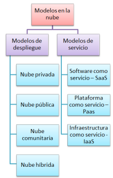

- **Modelos de despliegue:** Hacen referencia a la localización y a la administración o gestión de la infraestructura de la nube. Hacen referencia a las nubes:
    - **Privada:** Se trata de nubes cuyos servicios no se ofrecen al público en general sino que la gestión de la infraestructura la gestiona una organización de carácter privado.
    - **Pública:** Al contrario que en las nubes privadas, los servicios de las nubes públicos son ofrecidos por un proveedor al público en general.
    - **Comunitaria:** Las nubes comunitarias (community) son aquellas que se han organizado para servir a un fin común, para una o varias organizaciones que comparten objetivos comunes.
    - **Híbrida:** Combinación de varias nubes individuales, públicas o compartidas que pueden aportar datos y aplicaciones entre ellas.
- **Modelos de servicio:** Hacen referencia a los tipos específicos de servicios a través de los cuales se puede acceder en una plataforma de cloud computing.
Son los siguientes:

- **Infraestructura como servicio (IaaS):** El proveedor ofrece al usuario una serie de recursos (capacidad de procesamiento, almacenamiento o comunicaciones) para ejecutar cualquier tipo de software.

Este modelo facilita al usuario una infraestructura de recursos generalmente bajo una infraestructura de virtualización. En ésta, el usuario puede instalar, gestionar y administrar el sistema operativo y las aplicaciones que desee. En este caso, es el usuario el que elige la configuración que quiere utilizar y paga una cuota determinada atendiendo a los recursos utilizados y al tiempo de utilización de estos.

- **Plataforma como servicio (PaaS):** En este modelo el usuario puede desplegar infraestructuras propias en la infraestructura cloud de su proveedor siendo este el que ofrece la plataforma de desarrollo y las herramientas de programación. El control de la aplicación lo lleva a cabo el usuario, aunque no de toda la infraestructura.

En este caso, ya no sólo se facilita la infraestructura de recursos, sino que también se suministran todos los elementos necesarios para que el usuario construya y ponga en funcionamiento aplicaciones y servicios web disponibles en la red. Aquí ya no es necesario instalar software en el equipo del desarrollador ya que todo se realiza a través de la nube.

- **Software como servicio (SaaS):** Las aplicaciones que suministra el proveedor al usuario corren en una infraestructura cloud, donde el usuario no dispone ningún tipo de control sobre las aplicaciones salvo algunas personalizaciones o configuraciones de usuario permitidas expresamente.

Es lo que generalmente se identifica como “cloud”. El usuario accede a una aplicación determinada a través de internet, sin que tenga que instalar y ejecutar la aplicación en su equipo. Normalmente, el acceso al servicio se produce a través de un navegador web y es la empresa suministradora la que se encarga del mantenimiento y soporte de la información durante el tiempo que esté contratado el servicio.

- **Everything as a Service (XaaS o EaaS) o Todo como servicio:** Se trata del modelo más avanzado de nube, un nuevo tipo de servicios. En este caso, los servicios se ofrecen al cliente como un solo paquete y están diseñados para sustituir a los tradicionales paquetes de software informático instalados en cualquier ordenador personal.

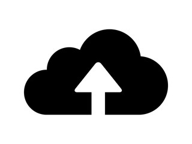

## 3.4. Virtualización

Uno de los pilares fundamentales del **cloud computing** es la virtualización. Se trata de la utilización de los recursos de los ordenadores para simular a otros recursos de estos o los propios ordenadores en su totalidad.

La virtualización consiste en la abstracción de los recursos de un ordenador, creando una capa de la abstracción entre el hardware de la máquina física (llamada host o anfitrión) y el sistema operativo de la máquina virtual (llamada también virtual machine o huésped). Así, se crea una versión virtual de un dispositivo o recurso que puede ser desde un servidor, un dispositivo de almacenamiento, una red o, incluso un sistema operativo o bases de datos. En otras palabras, la **virtualización** es un mecanismo de abstracción para separar recursos de software de sus implementaciones físicas.

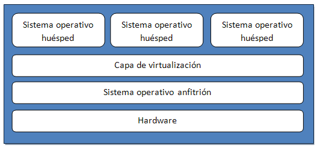

Si lo vemos desde un punto de vista más práctico, la virtualización permite que varias máquinas virtuales con sistemas operativos heterogéneos puedan ejecutarse de forma individual pero en la misma máquina. Cada máquina virtual tiene su propio hardware virtual, donde se cargan tanto el sistema operativo como las aplicaciones. De esta forma, el sistema operativo trata al hardware como un conjunto independientemente de los componentes físicos que formen parte de este.

Las principales ventajas que aporta la virtualización son las siguientes:

- Permite incorporar rápidamente nuevos recursos para los servidores virtualizados.
- Se reducen los costes de espacio y consumo.
- Permite la monitorización de los recursos de las máquinas de forma centralizada y simplificada desde un único panel.
- Permite gestionar el centro de procesamiento de datos (data center o CPD) como una agrupación de toda la capacidad de procesamiento, memoria, red y almacenamiento disponible en la infraestructura.
- Agilización de los procesos de prueba de nuevas aplicaciones gracias a las mejoras de los procesos de clonación y copia de sistemas. Resulta más sencillo crear entornos de prueba sin que se produzca impacto alguno en la producción.
- Aislamiento de las máquinas virtuales, por lo que si hay un fallo general de sistema de alguna de ellas, las demás no se ven afectadas.
- Reducción de los tiempos de parada.
- Reducción de los costes de mantenimiento de hardware al requerir menos recursos físicos.
- Se elimina la necesidad de realizar paradas planificadas para el mantenimiento de los servidores físicos.
- Se consigue un consumo de recursos homogéneo y óptimo en toda la infraestructura ya que se logra que cada máquina virtual ejecute los procesos en el servidor físico más apropiado.

La implementación de la virtualización puede realizarse de múltiples y distintas formas. Los dos modos más utilizados son: la virtualización completa (full virtualization) y la paravirtualización (paravirtualization).

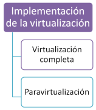

### Virtualización completa

En la **virtualización completa** se produce una abstracción total del **sistema físico fundamental**; todo el hardware es emulado en un sistema virtual completo. No se requiere ningún tipo de modificación en el sistema operativo o en la aplicación huésped.

En este tipo de implantación, el sistema operativo o la aplicación cliente no denotan el entorno virtualizado de modo que pueden ejecutarse en la máquina virtual (VM) como si se tratase de un sistema físico.

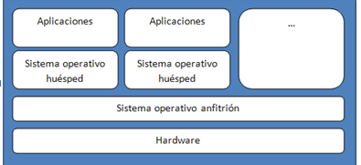

Las principales ventajas de la virtualización completa son las siguientes:

- Se aíslan por completo las máquinas virtuales entre sí y con el sistema operativo anfitrión.
- Permite el control del acceso de las máquinas virtuales a los recursos del sistema y previene que las inestables afecten al sistema.
- A través de la emulación de un conjunto consistente de hardware independiente del hardware real, las máquinas virtuales pueden trabajar con distintos hardware sin presentar ningún tipo de problema.

Sin embargo, también conlleva una serie de inconvenientes:

- Conlleva un coste en rendimiento elevado.
- Los núcleos de los sistemas operativos están diseñados para que corra en modo privilegiado, lo que conlleva pérdidas de agilidad en la ejecución de ciertas operaciones.

### Paravirtualización

A través de la paravirtualización, las máquinas virtuales presentan una abstracción del hardware similar al hardware físico fundamental, sin ser idéntico a este, por lo que las técnicas de paravirtualización necesitan realizar una serie de modificaciones sobre los sistemas operativos cliente que se ejecutan en las máquinas virtuales.

A diferencia de la virtualización completa, en la paravirtualización los sistemas operativos clientes saben que están siendo ejecutados en máquinas virtuales.

En estos casos ya no se emula el sistema completo, sino que se opera con un sistema operativo que se ha ajustado previamente para operar en una máquina virtual. Además, ofrece la posibilidad que varios sistemas operativos se ejecuten simultáneamente en un único dispositivo de hardware utilizando recursos del sistema de una forma más eficiente

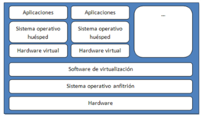

La paravirtualización se recomienda sobre todo en los siguientes supuestos:

- **Recuperación de desastres:** Ante la ocurrencia de algún tipo de desastre o catástrofe, los sistemas operativos cliente pueden trasladarse a otro hardware hasta que pueda separarse el equipo.
- **Migración:** La migración de un sistema a otro es mucho más sencillo y rápido.
- **Gestión de la capacidad:** Al facilitarse las tareas de migración, se simplifica también la gestión de la capacidad ya que resulta más sencillo incrementar la potencia de un proceso o la capacidad de un disco en un entorno virtualizado.

### Categorías de virtualización

Como ya se ha comentado anteriormente, la virtualización es la abstracción de los recursos de un ordenador, facilitando acceso lógico a los recursos físicos. De este modo, la virtualización produce una separación lógica de la petición de algún servicio y los recursos físicos que realmente proporcionan dicho servicio. Asimismo, según el recurso que se pretenda abstraer y según quién utilice ese recurso podemos distinguir entre varias categorías de virtualización.

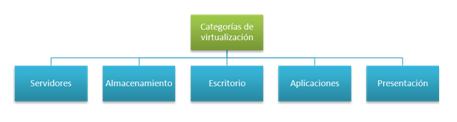

### Virtualización de servidores

En la **virtualización de servidores,** se divide un servidor físico en varios servidores de forma que cada uno tenga las mismas capacidades y la misma apariencia como si fuese una máquina dedicada. Así, los servidores individuales están divididos en dominios independientes, aislados entre ellos para garantizar que no se produzcan interferencias entre un dominio y otro.

De este modo, con el aislamiento de los dominios se garantiza que los clientes de los distintos sistemas no puedan interferir en la integridad de los demás sistemas. En otras palabras, con la utilización de sistemas virtualizados, varios sistemas operativos pueden ejecutarse de forma simultánea en un mismo equipo sin que ninguno de ellos interfiera sobre los demás. El cómputo del equipo físico se reparte entre los distintos sistemas operativos atendiendo a las reglas de proporcionalidad establecidas previamente.

Son varias las ventajas que proporciona la virtualización de servidores:

- Impide cortes de servicio en el negocio ya que hay un sólido aislamiento de los fallos, incrementando la seguridad de los equipos y de la información que estos contienen.
- La independencia del hardware permite la utilización de aplicaciones antiguas con entornos más modernos.
- Se produce un ahorro en costes al requerir menos consumo energético de máquinas físicas.
- Permite un mejor aprovechamiento de los recursos disponibles.
- Permite disponer de un entorno de pruebas sin que ello repercuta en los procesos reales.
- Se produce una mayor agilidad por la capacidad de aprovisionar nuevas aplicaciones en un periodo de tiempo muy reducido.

### Virtualización del almacenamiento (Storage Virtualization)

Se trata de uno de los métodos de virtualización más utilizado en el mundo empresarial. Consiste en vincular varios dispositivos de almacenamiento en lo que es percibido como una única unidad de almacenamiento en red.

A través de la virtualización de almacenamiento se pretende:

- Facilitar la creación de redes virtuales de almacenamiento.
- Minimizar el consumo energético (eléctrico y de refrigeración) a través de la optimización de los recursos de almacenamiento.
- Optimización del almacenamiento distribuyendo la información entre discos de mayor calidad para datos críticos y discos de menor calidad para datos menos imprescindibles.
- Facilitar la movilidad y la creación de discos lógicos entre distintas cabinas de almacenamiento.

### Virtualización del escritorio

La virtualización del escritorio consiste en manipular el escritorio del usuario de modo remoto. En un escritorio virtual, el equipo no ejecuta las aplicaciones que tiene instaladas en él sino que se ejecutan en un servidor de un centro de datos. De este modo, las aplicaciones, datos, ficheros y cualquier otro tipo de aplicación gráfica son completamente independientes del escritorio real y están almacenados en dicho servidor en lugar de estarlo en el equipo real.

Así, se permite que el usuario acceda de forma remota a su escritorio desde múltiples dispositivos (otros ordenadores, dispositivos móviles, …) ya que el recurso que se abstrae consiste en el almacenamiento físico del entorno de escritorio del usuario.

En el mundo de los negocios el método de virtualización del escritorio es ampliamente utilizado ya que permite que cualquier trabajador con acceso pueda trabajar remotamente en un escritorio virtual facilitado por su empresa sin necesidad de estar en la oficina de trabajo.

### Virtualización de aplicaciones

La virtualización de aplicaciones consiste en ejecutar una aplicación utilizando los recursos locales en una máquina virtual adecuada para ello. Estas aplicaciones son ejecutadas en un entorno virtual que les facilita todos los componentes que requieren.

> **Para saber más:** Una aplicación virtualizada totalmente no se instala en el equipo aunque sí es cierto que se ejecuta como si lo estuviese. De hecho, cuando se ejecuta la aplicación, da la sensación de que esta está directamente conectada con el sistema operativo original.

Este tipo de virtualización se utiliza sobre todo para permitir a aplicaciones con características **especiales de compatibilidad** ser ejecutadas en sistemas operativos para los cuales no fueron implementadas.

### Virtualización de presentación

En el método de virtualización de presentación se ejecuta una aplicación en el servidor pero su control se ejerce desde el equipo cliente gracias al aislamiento del procesamiento de los gráficos y de la E/S (periférico de entrada/salida de información como, por ejemplo, teclados, ratones, monitores, discos rígidos, etc.).

De esta forma se utiliza una sesión virtual a través de la cual las aplicaciones proyectan sus interfaces en los clientes. Este tipo de virtualización puede darse en una sola aplicación o, incluso, presentar un escritorio al completo.

## 3.5. Cloud storage

En la actualidad, la cantidad de datos que llegamos a generar a lo largo de un simple día es prácticamente incontable. El universo digital de información es de tal magnitud que cada vez resulta más difícil su control y su gestión óptimos. Este es uno de los principales motivos por los que un elevado porcentaje de datos que manejamos están almacenados en la nube o se almacenarán en ella.

El almacenamiento en la nube o cloud storage consiste en almacenar la información en un proveedor de servicios en la nube en lugar de en un equipo o sistema local. Así, el almacenamiento de la información pasa a convertirse en un servicio al que los clientes pueden acceder con un simple enlace a Internet.

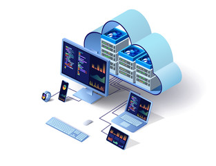

Formalmente, aunque existen numerosas definiciones del término cloud storage, todas coinciden en una serie de propiedades del mismo:

- Acceso a la Red a través de un navegador (Internet Explorer, Mozilla Firefox, Google Chrome, …).
- Aprovisionamiento del servicio sujeto a la demanda.
- Alta capacidad de control por parte del usuario.
- Adaptado a estándares abiertos de modo que se pueda utilizar en todo comento independientemente del sistema operativo y de los sistemas de archivos utilizados.

El cloud storage cada día está más solicitado, lo que requiere el cumplimiento de una serie de estándares de calidad y de unas funcionalidades que garanticen la fiabilidad del servicio y su seguridad. Los aspectos más relevantes del servicio de almacenamiento en la nube son los siguientes:

- Seguridad de la información en la nube.
- Confidencialidad.
- Integridad.
- Disponibilidad.
- Fiabilidad.
- Cortes en suministros.
- Robo de información.
- Servidores y virtualización en el cloud storage.

### Seguridad de la información en la nube

Si la seguridad de la información es uno de los grandes problemas de los sistemas de almacenamiento convencionales, cuando hablamos de almacenamiento en la nube debemos considerar que los riesgos a los que se exponen los datos almacenados son bastante más cuantiosos y peligrosos en su mayor parte.

Por ello, todo proveedor de servicios de almacenamiento en la nube debe cumplir especialmente las consideraciones de seguridad críticas de la información:

- **Confidencialidad:** Propiedad que impide la divulgación de información a usuarios no autorizados. La información sólo debe estar accesible a aquellas personas que tengan la debida autorización.
- **Integridad:** La información debe mantenerse exactamente tal como fue generada, sin ser manipulada o alterada por usuarios o procesos sin autorización.
- **Disponibilidad:** La información debe estar siempre a disposición de los usuarios, procesos o aplicaciones que tengan permiso para acceder a ella.

Para garantizar el cumplimiento de los estándares de seguridad de la información, es siempre conveniente que se incluyan en el acuerdo de nivel de servicio (SLA) que firmen el cliente y el proveedor del servicio.

### Confidencialidad

Como ya se ha comentado anteriormente, el proveedor de servicios de almacenamiento de datos en la nube debe ser capaz de garantizar que la información almacenada esté sólo disponible a aquellos usuarios, procesos y aplicaciones que dispongan del debido permiso de acceso.

La gran capacidad de atracción de usuarios hacia los servicios de la nube hace que nos debamos proponer dos interrogantes:

- ¿Cómo se protegen los datos almacenados en la nube?
- ¿Cuáles son los controles de acceso para proteger estos datos?

Para garantizar la confidencialidad de la información se suele utilizar una combinación de las siguientes herramientas:

- **Encriptación o cifrado:** Consiste en la utilización de algoritmos complejos para codificar la información. Así, cuando el usuario quiere acceder a la información necesita una clave que le permita decodificar los datos. Aunque es posible que un usuario no autorizado acceda a información cifrada, este requerirá siempre mecanismos de mayor complejidad para ello.
- **Autenticación:** Consiste en la utilización de nombres de usuario y contraseñas personalizadas necesarias para acceder a la información en la nube.
- **Autorización:** El cliente es el que decide quién o quiénes van a ser los que estén autorizados para acceder a la información almacenada en la nube. Además, existe la posibilidad de conceder permisos de acceso de varios niveles. Por ejemplo, una empresa puede dar acceso ilimitado a la información al director general y, sin embargo, dar acceso a información sobre ventas al director del departamento comercial.

### Integridad

Además de la confidencialidad de la información almacenada en la nube, es imprescindible tener en consideración la importancia de mantener la integridad de los datos. Como ya se ha comentado, la integridad consiste en la capacidad de mantener la información tal como se generó, impidiendo vulneraciones, alteraciones o modificaciones de usuarios no autorizados.

El hecho de mantener la **confidencialidad** de los datos no garantiza su **integridad**. Es más, es posible que los datos estén debidamente cifrados para fines de confidencialidad pero, sin embargo no se esté utilizando una herramienta adecuada que verifique su integridad. Mientras que la encriptación sólo es suficiente para garantizar la confidencialidad, para la integridad es necesaria la utilización de mensajes de códigos de autenticación.

### Disponibilidad

Si garantizamos la confidencialidad y la integridad de la información de un cliente, también es necesario tomar especial atención para garantizar su disponibilidad; es decir, el cliente debe poder a la información siempre que lo requiera.

En cuanto a la disponibilidad, pueden considerarse tres amenazas fundamentales que afectan especialmente al cloud storage:

- Ataques basados en red.
- La disponibilidad de la información que ofrece el proveedor de servicio: Aunque es bastante complicado que un proveedor ofrezca una disponibilidad del 100%, si es muy recomendable que ésta sea como mínimo del 99,9%.
- Los clientes de la nube deben tener en cuenta también la capacidad de continuidad de su proveedor de servicios. En otras palabras, deberá encontrar un proveedor con una cierta trayectoria que no corte su servicio sin previo aviso.

Además, también es fundamental para el cliente que el proveedor esté realizando con cierta periodicidad copias de seguridad de sus datos para evitar pérdidas inesperadas de información.

### Fiabilidad

Otra propiedad fundamental que debe considerarse siempre en un servicio del almacenamiento de datos en la nube es la fiabilidad. Si un sistema de almacenamiento no es fiable, el riesgo que conlleva puede ser bastante considerable. Los datos importantes no pueden almacenarse en sistemas inestables o con proveedores que no tengan una cierta estabilidad financiera.

La gran mayoría de los proveedores de este tipo de servicios garantizan su fiabilidad en sus servicios de redundancia, pero hay que considerar que siempre hay una elevada posibilidad que el sistema sufra algún tipo de caída y deje a los clientes sin poder acceder a su información.

Por ello, es muy recomendable que cuando queramos contratar a un proveedor nos aseguremos que este tenga sistemas y herramientas que prevengan estas caídas y situaciones imprevistas.

> **Importante:** En el momento de la elección del proveedor, un indicador bastante fiable es su reputación. No importa tanto el tamaño de la empresa que nos ofrece el servicio de almacenamiento de datos, lo que realmente nos indicará si el servicio es de calidad será su reconocida reputación, su prestigio y su solvencia dentro del sector.

### Cortes en suministros

Toda organización debe ser consciente del riesgo que conlleva almacenar su información en la red y, más concretamente, en la nube. Aunque no se trate de un hecho muy frecuente, existe la posibilidad que los proveedores de servicios tengan en ocasiones algún corte en sus servicios.

El resultado de un corte en el suministro del servicio conlleva que tanto los clientes como sus datos permanezcan fuera de línea y que, por tanto, no se tenga acceso a los mismos.

Aunque los grandes proveedores siempre intentan minimizar estos cortes y que, en caso de producirse, la interrupción sea lo más corta posible, el cliente debe ser consciente en todo momento de la existencia de esa posibilidad y tener preparado un plan de contingencia a modo de previsión.

### Robo de información

Además de los aspectos anteriores referentes a la integridad, confidencialidad y disponibilidad de la información, cuando pretendemos utilizar los servicios de almacenamiento en la nube debemos ser también conscientes de que la información puede ser robada o visualizada por algún usuario ajeno a la organización y sin autorización para ello.

Existe la posibilidad que si una organización almacena datos en la nube, la competencia acceda a ellos y los utilice con fines no deseables. Por ello, además de las precauciones de seguridad comentadas en los apartados anteriores, las organizaciones deben asegurarse que, si se almacenan datos en la nube, éstos estén debidamente cifrados y se asegure su transferencia y movimiento con protocolos de cifrado como SSL (Security Socket Layer) para que se establezca un canal seguro entre el emisor y el receptor de la información.

### Servidores y virtualización en el cloud storage

La abstracción de los componentes de hardware en la nube no sólo hace referencia a la virtualización de los servidores y al reemplazo de las unidades físicas por unidades lógicas, sino que también se refiere al reemplazo de los dispositivos físicos de almacenamiento de una organización.

El almacenamiento de datos en la nube permite que una organización pueda despreocuparse de saber cómo y dónde se almacenan o de si se hacen o no copias de seguridad ya que esto es asunto de los proveedores del servicio.

Cuando una organización necesita los datos almacenados, solo tiene que conectarse a la red y descargar los datos que requiera. Del mismo modo, no se conoce la ubicación en la que se almacena la información ni qué ocurre en los distintos sistemas de hardware desde el momento en el que se suben los datos a la nube hasta que éstos se recuperan.

El principal beneficio del cloud storage es que un usuario puede recuperar la información almacenada desde cualquier ubicación con acceso a Internet sin necesidad, tan siquiera, de utilizar los mismos dispositivos para ello.

## 3.6. Proveedores fiables de cloud para Data Science

Aunque la cantidad de proveedores de **servicios de cloud storage** crece día a día, no todos ellos son lo suficientemente fiables como para confiar nuestros datos en sus servidores. Por ello, es conveniente que nombremos algunos servicios de almacenamiento en la nube fiables y seguros que garanticen una cierta protección en los datos que almacenan, aparte de proporcionar los servicios e infraestructuras necesarias para proyectos de data science.

Amazon Web Services, Google Cloud Plataform y Azure se han convertido en este sentido, en los principales proveedores de tecnología Cloud hoy en día. Dentro del amplio abanico de soluciones IaaS y PaaS que ofrecen estos proveedores destacan los componentes que ofrecen soluciones específicas para el área de Big Data y ciencia de datos.

Paradigma muestra de una manera visual los servicios y productos que ofrecen estos proveedores.

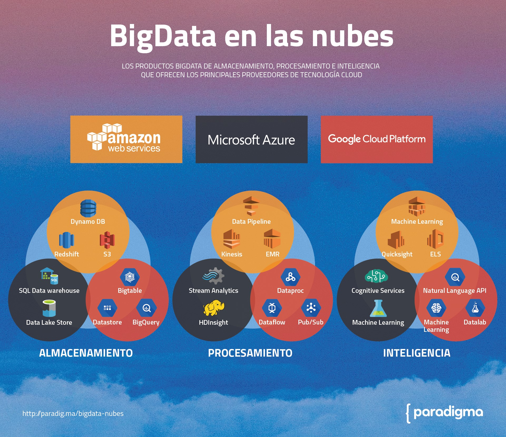

### Amazon Web Services

AWS ofrece una serie de servicios a través del concepto de cloud computing, fue lanzado oficialmente en 2006 y es usado por aplicaciones tan populares como Dropbox, Foursquare, HootSuite.

Principalmente Amazon Web Services, aporta una gran potencia de cómputo, almacenamiento de bases de datos y entrega de contenido, lo que permite crear proyectos sofisticados, flexibles, escalables y fiables de Data Science. Además, la inversión inicial en infraestructuras por parte de la empresa es prácticamente nula, ya que no necesita preocuparse por la seguridad física, invertir en hardware como servidores, fuentes de alimentación de respaldo o enrutadores lo que implica por otro lado no tener que invertir en la gestión de este hardware.

Por otro lado, permite la escalabilidad ya que se puede disponer de las infraestructuras necesarias justo a tiempo, antes si tu proyecto adquiría cierta carga y los sistemas o infraestructuras de las que disponías no eran ampliadas te podía llevar al fracaso. También en el caso contrario, si como empresa invertías en más infraestructura de la necesaria, fracasabas. Con el servicio de computación en la nube de AWS esto queda solventado, ya que se puede ir ampliando las necesidades que se demanden conforme crezca nuestro negocio, además el modelo de negocio de AWS reside precisamente en este principio, ya que a diferencias de otras soluciones de este tipo, solo se paga por lo que se usa, es decir que se paga en función de los recursos de los que hacemos uso y no tenemos que pagar una cuota fija por unos servicios fijos, de hecho lo que paga una empresa puede ir variando en el tiempo en función de los recursos que necesite.

### Infraestructuras que ofrece AWS

Son varias las infraestructuras de servicios elásticas donde alojar, almacenar o gestionar sistemas empresariales.

- Amazon Elastic Cloud (EC2)
- Amazon Simple Storage Service (S3)
- Amazon SimpleDB
- Amazon Simple Queue Service (SQS)
- Amazon Ralational Database Service (RDS)
- Amazon CloudFront

Estos son algunos ejemplos de los servicios que ofrece AWS como soluciones empresariales.

### Microsoft Azure

Azure es un servicio en la nube ofrecida como servicio y alojado en los Data Centers de Microsoft. Fue anunciado en el Professional Developers Conference de Microsoft en 2008, pero no pasó a ser un producto comercial hasta el 1 de enero de 2010.

Entre los productos que ofrece nos encontramos con:

- **IaaS:** Servicios orientados a que le usuario tenga en control total de la infraestructura virtual. Aquí incluimos todo lo relacionado con servidores (máquinas virtuales) donde escoger sistema operativo (Windows Server, Linux, Oracle, Open Logic, etc.), número de núcleos de procesamiento, tamaño de la RAM o discos virtuales. Azure cuenta con una larga lista de máquinas virtuales ya creadas dentro de su galería, como servidores de Sharepoint, de desarrollo con Visual Studio y la mayoría de server Enterprise de las distribuciones de Linux en Ubuntu, CentOS u Oracle.
- **PaaS:** En este punto nos encontramos con una plataforma ya creada que Azure gestiona por el usuario, escalando y desplegando según las necesidades de nuestras aplicaciones. Así el usuario podrá instalar un Wordpress, o cualquier otro CMS (Drupal, Joomla, etc.) y frameworks (Django, CakePHP, etc.)
- **SaaS:** En este caso el servicio oculto baja una capa de abstracción la infraestructura y la plataforma. El cliente consume directamente las aplicaciones en formato de servicios. En este sentido contamos con base de datos SQL, servicios de Big Data como Hadoop o el propio de Microsoft HDInsight integrado con LINQ y Hive, servicios de comunicaciones, servicios de Directorio Activo o los Service Bus para difundir material audiovisual.

En el ámbito del Data Science, Azure ofrece una serie de herramientas que permiten a los expertos construir soluciones en la plataforma de Microsoft, algunas de los servicios más destacados que se ofrecen podemos nombrar:

- **Azure Machine Learning:** Permite crear y desplegar modelos predictivos en pocos minutos, permitiendo enviar datos desde un SQL Server, un SQL Azure Database o incluso desde una aplicación móvil o un libro de Excel.
- **Power BI:** Permite convertir las operaciones de procesamiento y análisis de datos en informes que proporcionen información detallada en tiempo real sobre un negocio. Tanto si el procesamiento de datos está basado en la nube como si es local, sencillo o complejo, de uno o varios orígenes, almacenado o de tiempo real, Azure y Power BI ofrecen la capacidad de integración y conectividad para hacer real los esfuerzos en Business Intelligence.

Será posible transformar, modelar y combinar los datos de la nube desde diferentes orígenes y crear informes diferentes para distintos públicos objetivo, con las mismas conexiones de datos e incluso las mismas consultas.

- **Cortana Analytics Suite:** Es un servicio relativamente reciente, en el que se aglutinan tecnologías cloud en Azures como el Aprendizaje Automático, Power BI, almacenamiento de Big Data y procesamiento con inteligencia perceptual como la visión, el rostro y el análisis del lenguaje. Según Satya Nadella (CEO de Microsoft), Cortana Analytics está pensado para ayudar a cualquier negocio a transformarse a través del poder de los datos, permitiéndoles realizar acciones inteligentes a partir de los datos que recopilan.

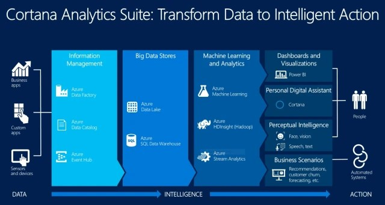

### Google Cloud Platform

Google Cloud Platform lo podemos definir como una plataforma en la que **Google** ha reunido todas sus aplicaciones de solución tecnológica almacenadas en la nube.

Dentro de la ciencia de datos, Google Cloud ofrece un espectro de servicios bastante amplio, por un lado proporciona API de aprendizaje automático como Vision API, Speech API, Translate API que hacen que sea fácil empezar el desarrollo. **Cloud ML**, por otro lado, permitirá a los científicos de datos entrenar modelos ML sin preocuparse por la infraestructura, en incluso se pueden desarrollar nuevos modelos utilizando TensorFlow (de código abierto).

Además cuenta también con **Google Cloud Prediction API** que permite a los usuarios entrenar fácilmente modelos categóricos o de regresión en función de la naturaleza del conjunto de entrenamiento. Esto simplemente requiere que los usuarios carguen un conjunto de datos de entrenamiento y especifiquen una columna de respuesta para predecir, y el API de predicción hará el resto del trabajo. Para explorar los datos mediante ad hoc, contamos como Cloud Datalab, una versión hospedada de IPython Notebook, que se integra muy bien con BigQuery y Cloud Storage.

**Cloud Dataproc**, ofrece una administración completa sobre **Hadoop** y **Spark de Google**, como característica significativa podemos indicar que Google cuenta con un tiempo de 90 segundos para iniciar o escalar los clústeres en Cloud Dataproc, siendo el más rápido de los proveedores que hemos visto hasta el momento. Cuenta además con una conexión compatible de HDFS que permite almacenar en la nube los datos que se necesiten tras haber cerrado el clúster. No hay soporte integrado para los clústeres bajo demanda, sin embargo, el control total sobre el clúster está disponible a través de gcloud cli, REST API o del SDK, por lo que puede automatizarse si es necesario.

Pueden crearse así mismos pipelines de procesamiento de datos usando Cloud Dataflow. Google ha adoptado un enfoque diferente de AWS y Azure, ambos han usado un modelo declarativo que delega el trabajo de procesamiento a otros servicios como Hadoop. Cloud Dataflow, por otro lado, proporciona un marco completamente programable, disponible para Java y Python, y una plataforma de computación distribuida. Admite tanto el procesamiento por lotes y en streaming, por defecto el número de trabajos está predefinido cuando se crea el servicio, aunque los trabajos por lotes tienen la opción de auto-escalado por demanda.

### Recuerda

- La ciencia de datos o Data Science es una disciplina entendida como el conjunto de métodos, técnicas y teorías para extraer ideas y nuevas perspectivas de la información, en datos provenientes de múltiples fuentes. Además, pretende enfocar sus resultados a numerosos ámbitos como marketing y publicidad, mejora de los procesos productivos, servicios públicos, investigación científica y médica, Business Intelligence, etc.
- Podemos decir que el Data Science, nace del método científico y es la evolución natural de lo que hasta ahora se conocía como Análisis de datos, pero a diferencia de éste que sólo se dedica a analizar datos de una única fuente, la ciencia de datos debe explorar y analizar datos de múltiples fuentes, por regla general con formato diferentes entre ellas, y que afectan de manera muy significativa a la investigación actual de muchos campos.
- El concepto de cloud computing representa un nuevo modelo de informática que puede tener tanta o más relevancia que la propia Web. Se trata de la evolución de una serie de tecnologías que afectan a las distintas estrategias de las organizaciones en el momento en el que tienen que plantearse sus infraestructuras de tecnologías de la información.
