**Introducción**

Las bases de datos son parte fundamental de cualquier sistema informático, ya que todos los programas necesitan recurrir a multitud de datos mientras se ejecutan o generan otros. Una base de datos relacional es una colección de elementos de datos organizados en tablas formalmente descritas desde las que se puede acceder a los datos o volver a montarlos de maneras diferentes sin tener que reorganizarlas.

En esta Unidad veremos en qué consiste el modelo relacional, el lenguaje de consulta SQL y un ejemplo de base de datos relacional.

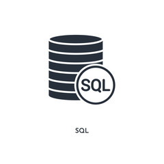

**Objetivos**

- Definir el concepto de base de datos y entender la diferencia entre una base de datos relacional y una no relacional.
- Comprender qué es el lenguaje de consulta SQL.
- Conocer el funcionamiento de MySQL.

**Mapa Conceptual**

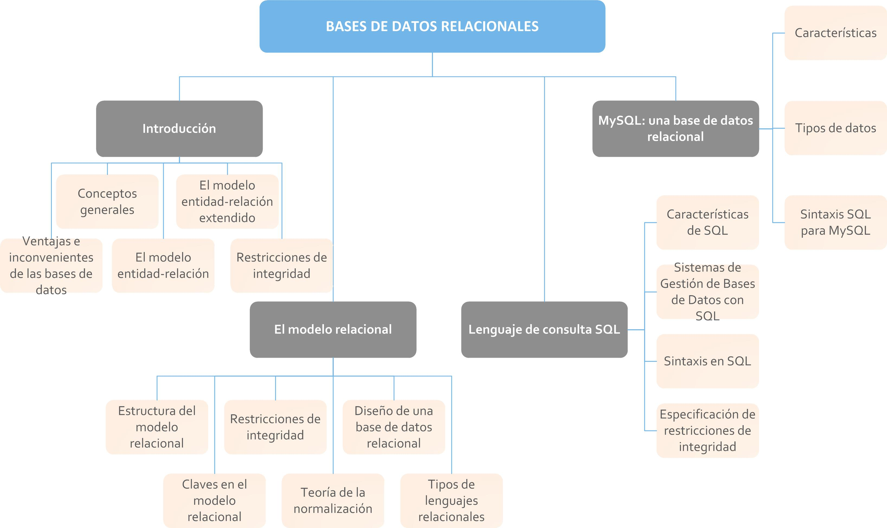

# 1. Introducción

A partir de la necesidad de almacenar grandes cantidades de datos, las industrias desarrollaron un sistema de bases de datos automatizado, para su posterior consulta. Vamos a ver brevemente cómo fue su evolución.

- **1950:** El sistema de bases de datos automatizadas comenzó con el uso de cintas magnéticas, las cuales grababan la información en pistas, sobre una banda plástica, para luego ser leídas y pasar los datos a otras, a modo de backup.
- **1960:** En la década de los 60, se pasó de las cintas magnéticas a los discos, lo que supuso un gran adelanto ya que por este soporte se podía acceder a la infor- mación directamente sin la necesidad de saber dónde estaban ubicados los datos exactamente y en cuestión de milisegundos.

En este momento, nace el modelo de Base de Datos Jerárquica y de Red, donde los datos se guardan en forma de listas y árboles y un mismo nodo podía tener varios padres.

- **1970:** Es esta década, Edgar Frank Codd, definió el concepto de Base de Datos Relacional y una serie de reglas que tenían que cumplir los administradores de bases de datos.

Así fue como nacieron las Bases de Datos Relacionales, comenzando con Oracle y el lenguaje SQL.

- **1980:** Ahora, gracias a su bajo nivel de programación y su sencillez, las Bases de Datos Relacionales fueron un fuerte competidor en el mercado con las Bases de Datos Jerárquicas y de Red. Se comienza a investigar en otras técnicas, como las Bases de Datos orientadas a objetos.
- **1990:** A principio de esta década se crea el lenguaje SQL para realizar consultas sobre datos de manera más específica, pudiendo aplicar filtros para la búsqueda. A finales de los 90 apareció la World Wide Web (WWW) y con esto se facilitó la consulta a las bases de datos, con capacidad ya para el almacenamiento de grandes cantidades de datos.

En la actualidad, existen multitud de herramientas, tanto en línea como en local, para la administración y consulta de bases de datos.

## 1.1. Ventajas e inconvenientes de las bases de datos

El uso de bases de datos en la actualidad genera una serie de ventajas y desventajas a la hora de almacenar la información en ellas.

### Ventajas

- Permite modificar datos rápidamente.
- Se puede obtener más información con la misma cantidad de datos, más específica y con una forma de acceder más sencilla a través de consultas.
- Proporciona métodos para compartir datos entre varias personas que tengan permiso de acceso a la base.
- No es necesario repetir los datos, sino indicar la manera en que se relacionan.
- Integridad de los datos, generando mayor dificultad para posibles pérdidas de información o malas relaciones entre los datos.
- Seguridad en los datos, prohibiendo el acceso a toda persona ajena a la organización o restringiendo ese acceso a los usuarios de esta.
- Se reduce el espacio de almacenamiento de datos, gracias a una estructuración más eficiente.

### Desventajas

- La inversión inicial puede ser elevada debido a la adquisición de hardware, licencias de software y contratación de personal con conocimientos técnicos.
- La dependencia de un proveedor concreto puede limitar la portabilidad de los sistemas, ya que no todos los gestores de bases de datos implementan las mismas funcionalidades o estándares de manera uniforme.
- El retorno de la inversión suele apreciarse a medio o largo plazo, especialmente en organizaciones que requieren una infraestructura robusta y segura para gestionar grandes volúmenes de información.

## 1.2. Conceptos generales

Para entender mejor de qué se trata una base de datos, cómo puede administrarse y qué nos ofrece, vamos a observarlas más detalladamente.

### Concepto de bases de datos

Entendemos una base de datos como un almacén de información donde se organizan los datos de manera que luego podamos acceder a ellos lo más rápidamente posible.

Desde el punto de vista informático, una base de datos es un sistema de almacenamiento de datos, organizados y relacionados entre sí, que se almacenan en discos y a los que se puede acceder a través de programas específicos de administración.

### Objetivos de los sistemas de bases de datos

- **Redundancia e inconsistencia de datos.** En las bases de datos, los registros no se repiten si no es necesario, puesto que se estructuran por medio de relaciones. Esto evitaría la inconsistencia de los datos, ya que la modificación de un dato afecta sólo a ese registro.
- **Dificultad para tener acceso a los datos.** Este problema se mejora con las sentencias de consulta a la base de datos. Los sistemas gestores de bases de datos (SGBD) proporcionan lenguajes y generadores de estadísticas para acceder directamente a la base de datos sin tener que programar una aplicación específica para esta tarea.

[](https://www.youtube.com/watch?v=ZPUvyI_x8Ko)

Teorema de CAP

En este video te voy a explicar qué es el Teorema de CAP y porqué es importante. 

CAP es un acrónimo de Consistency, Availability y Partition Tolerance que traducido al español son Consistencia, Disponibilidad y Tolerancia al particionado.
El teorema de CAP dice que es imposible, para un sistema distribuido, garantizar simultáneamente más de dos de estas características.

Voy a explicar brevemente en qué consiste cada una.
Por un lado, la consistencia (C) hace referencia a que todos los nodos deben ver los mismos datos al mismo tiempo. Es decir, cualquier cambio realizado en los datos del sistema se deben aplicar en todos los nodos y deben ser los mismos datos en todos. Esto se llama consistencia atómica y se consigue aplicando la información en todos los nodos
La Disponibilidad (A) por su parte garantiza que cada petición a un nodo reciba una respuesta por parte del nodo consultado.
Por último, la Tolerancia al Particionado (P) hace referencia a que el sistema debe funcionar a pesar de que los nodos tengan un fallo de comunicación, garantizando la disponibilidad a pesar de que un nodo se separe del grupo sin importar la causa.

Como en los sistemas distribuidos no es posible cumplir estas 3 características al mismo tiempo, se pueden producir alguna de las siguientes combinaciones:
*imagen 1*
 
En primer lugar, tenemos la opción CP, es decir, consistencia y tolerancia a la partición. En este caso el sistema aplicara los cambios de forma consistente y aunque se pierda la comunicación entre nodos ocasionando el particionado, pero no se asegura la disponibilidad entre los nodos
Algunos ejemplos de sistemas con esta combinación pueden ser HBase, MongoDB o Redis.
En segundo lugar, está AP que sería disponibilidad y tolerancia a la partición. Para este caso el sistema siempre estará disponible a las peticiones, aunque se pierda la comunicación entre los nodos ocasionando el particionado. En consecuencia, por la pérdida de comunicación existirá inconsistencia porque no todos los nodos serán iguales
Ejemplos de sistemas gestores de bases de datos AP son Cassandra, CouchDB o DynamoDB.
La última combinación posible es CA que sería consistencia y disponibilidad. Aquí, el sistema siempre estará disponible respondiendo a todas las peticiones y los datos procesados serán consistentes. Sin embargo, en esta combinación, no se puede permitir el particionado.
Para esta última opción, algunos ejemplos son MySQL, MariaDB o PostgreSQL.

CONCLUSIÓN

Aunque es cierto que en entornos Big Data hay que hacer frente a grandes volúmenes de información y se debe garantizar la flexibilidad, es necesario tener en cuenta el Teorema de CAP para elegir una base de datos que se adapte a las diferentes exigencias de cada empresa u organización. 
Por ejemplo, si deseamos procesar y almacenar las transacciones de una entidad bancaria, normalmente nos interesará una base de datos que asegure la consistencia de los datos y la tolerancia a particiones, siendo una opción muy interesante MongoDB o Redis.
El problema es que la elección entre una u otra de estas características puede no ser fácil ni lógica, por lo que es necesario conocer el funcionamiento de un sistema distribuido y los diferentes escenarios del teorema CAP.


- **Aislamiento de los datos.** Los SGBD se encargan de aislar los datos para no crear confusión con resultados no reales, entre los usuarios que acceden a ella, a través de una serie de validaciones de registros y unos niveles de aislamiento que permitirán, en mayor o menor medida, el acceso a los datos que aún no han sido validados.
- **Anomalías del acceso concurrente.** Cuando se trabaja sobre una misma base de datos de forma simultánea y desde equipos diferentes, el SGBD debe evitar que dos o más usuarios distintos operen a la vez sobre un mismo dato. Este sistema bloquea el registro que está siendo modificado hasta que el usuario que lo tiene cogido lo libere.
- **Problemas de seguridad.** Para proteger las bases de datos de intrusos o de su mal uso por parte de los usuarios que la gestionan, se debe establecer una serie de permisos de accesibilidad a ésta. Para garantizarnos su seguridad ante pérdidas de información, lo conveniente es hacer frecuentemente copias de seguridad de los datos que contiene, bien mediante consultas o bien mediante herramientas que proporcionan los SGBD.
- **Problemas de integridad.** Para que los registros no puedan contener valores fuera de rango en ninguno de sus campos, y por lo tanto quedarse huérfanos, se provee una serie de atributos para especificar el tipo y los valores admitidos por ese campo, evitando así que puedan introducirse registros que no cumplan las normas.

### Administración de los datos y administración de bases de datos.

Los datos han sido y serán la parte más importante de cualquier organización y hay que preservarlos y gestionarlos debidamente para un buen funcionamiento del sistema.

> **Importante:** En toda base de datos, siempre existirá una persona que se encargue de administrar los datos y, por tanto, la base de datos en su conjunto. Esa persona es el administrador y sus tareas comprenderán desde supervisar que todo está correcto y el rendimiento es el adecuado, hasta dar permisos a los demás usuarios para que éstos puedan manipular los datos. Esta persona no procesa los datos, sino que administra la actividad de los mismos proporcionando procedimientos de control y la documentación necesaria para garantizar que los usuarios trabajen de forma cooperativa en la base de datos.


### Niveles de Arquitectura: interno, conceptual y externo.

Como los usuarios de una base de datos no tienen por qué conocer cómo están organizados y almacenados los datos, ésta tiene que presentar los datos de forma que el usuario pueda interpretarlos y modificarlos.

Para manipular los datos, existen tres niveles principales según la visión y la función que realice el usuario sobre la base de datos:

- **Nivel Interno.** En este nivel se crean los archivos de configuración, es decir, se generan los archivos que contienen la información, la ubicación y la organización de los datos en la base de datos. Es el nivel más cercano al almacenamiento físico de los datos.
- **Nivel conceptual.** En el nivel conceptual se describe la estructura de la base de datos con los datos que se van a utilizar, ocultando aspectos como los del nivel interno.
- **Nivel externo.** Es el nivel que va orientado al usuario. Muestra los datos, o la parte de datos, que corresponden a ese usuario y para los cuales tiene permiso de lectura y modificación.

Estos tres niveles de tratamiento de la base de datos por parte de los usuarios son proporcionados por los sistemas gestores de base de datos. Una base de datos definida solo puede tener un nivel interno y un solo nivel conceptual, pero varios niveles externos conforme a los grupos de usuarios que trabajen en ella.

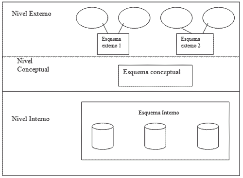

Esquema de los niveles de una base de datos.

### Modelos de datos. Clasificación.

El modelo de datos es la parte esencial de la estructura de una base de datos. Se trata del lenguaje utilizado para definir los datos y las relaciones entre estos.

Para clasificar los modelos de datos, vamos a agruparlos en dos grandes grupos:

- **Modelo relacional.** Este modelo consta de objetos del mundo real (entidades) y las relaciones entre estos objetos. Considera la base de datos como un grupo de relaciones expresadas en tablas, vinculadas entre sí por un campo en común.

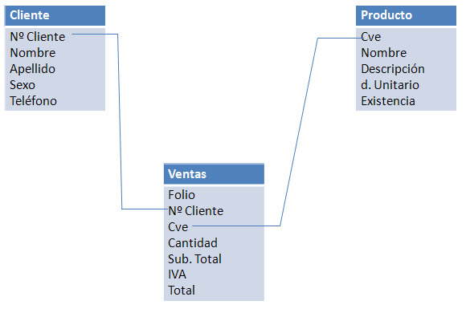

Diagrama de un modelo relacional.

- **Modelo jerárquico.** El modelo jerárquico estructura los datos como si fuesen un árbol. Por tanto, las relaciones existentes son del tipo padre/hijo donde cada padre puede tener muchos hijos pero cada hijo puede tener un solo padre.


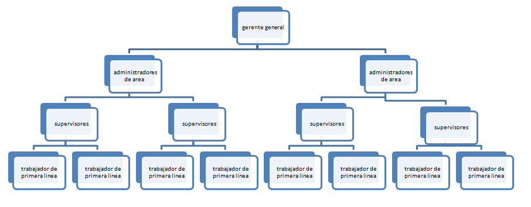

Diagrama de un modelo jerárquico.

### Independencia de los datos

La independencia de los datos determina la relación de dependencia entre un programa y su base de datos.

Se pueden definir dos tipos de independencia:

- **Independencia física.** Se trata de la capacidad para modificar el esquema interno de los datos, como actualizar el hardware que los manipula o cambiarlos de ubicación, sin afectar a las aplicaciones con que los usuarios acceden a la base de datos.
- **Independencia lógica.** Proporciona la libertad para poder modificar el esquema lógico, como añadir un campo a una tabla existente, sin que esto afecte a los programas con los que los usuarios acceden a los datos.

### Lenguaje de definición de datos

Dentro del lenguaje de modelado de datos, podemos diferenciar dos sublenguajes. Uno de ellos es el lenguaje de definición de datos (DDL) que gestiona el esquema de la base de datos.

El lenguaje DDL (Data Definiton Language), es un lenguaje orientado a definir la arquitectura de los datos y las restricciones de integridad o, dicho de otra forma, las sentencias que permiten estructurarlos.

Para crear esta estructura se utiliza un lenguaje llamado SQL (Structured Query Languaje), cuya sintaxis veremos en puntos posteriores del tema:

### Lenguaje de manejo de bases de datos. Tipos.

El lenguaje de manejo (manipulación) de datos es otro de los sublenguajes que conforman el modelado de datos.

DML (Data Manipulation Language) es el lenguaje que permite a los usuarios, por medio de consultas, operar con los datos de la base de datos.

En este lenguaje podemos citar 4 tipos principales de consultas: La selección, la inserción, la eliminación y la actualización de los registros que se encuentran en las tablas.

La sintaxis de estos cuatro tipos de consultas lo veremos en puntos posteriores del tema.

### El Sistema de Gestión de la Base de Datos (DBMS).Funciones.

Un Sistema Gestor de Base de Datos (DBMS, siglas en inglés de Data Base Management System) es un conjunto de herramientas ideadas para gestionar las bases de datos. Se compone de un lenguaje para definición de bases de datos (DDL) y otro para manipulación de los datos (DML), usando para ello el lenguaje de consultas SQL.

Sus funciones son las siguientes:

- Administrar la base de datos. Se encargan de la creación y modificación de la estructura de la base de datos.
- Administrar los datos. Esto supone el almacenamiento, modificación y extracción de los datos que contiene la base de datos.
- Presentar y transformar de los datos. Los DBMS se encargan de separar el formato, lógico y físico, y de transformar los datos introducidos para poder ser almacenados en la estructura de la base de datos.
- Administrar la seguridad. Por medio de permisos a los distintos usuarios que manipulen la base de datos.
- Controlar los accesos. Para que los datos no sean perjudicados por la manipulación concurrente de varios usuarios en la misma base de datos.
- Recuperar los datos. Provee mecanismos para crear copias de respaldo frecuentes por si hubiese algún fallo o pérdida de éstos, para luego poder ser recuperados.
- Preservar la integridad. Proporciona reglas de integridad de datos para eliminar los problemas de redundancia.
- Lenguajes de acceso e interfaces de aplicaciones. Utiliza los lenguajes DDL y DML para operar con la estructura y datos y, además, permite interactuar a las aplicaciones creadas en lenguajes de alto nivel con la base de datos.
- Interfaces de comunicación. Muestra una interfaz amigable entre la base de datos y el usuario para que éste pueda operar con ella de manera más sencilla.

### El Administrador de la base de datos (DBA). Funciones.

La persona responsable de gestionar el correcto funcionamiento de la base de datos y de los usuarios que la manipulan es el administrador de la base de datos (DBA, siglas en inglés de Data Base Administrator). También deberá emplear mecanismos para evitar cualquier tipo de daño o pérdida de los datos que administre.

Entre sus funciones más importantes podemos encontrar:

- Administrar el sistema gestor de la base de datos (DBMS), configurándolo y poniéndolo a disposición de los usuarios.
- Administrar la estructura de la base de datos, participando en el diseño y la implementación.
- Administrar la actividad de los datos, protegiendo los datos, pero no procesándolos.
- Verificar que se está preservando la integridad de los datos y que éstos están disponibles.
- Garantizar la seguridad de la base de datos, identificando a cada uno de los usuarios de la misma y protegiéndola contra accesos no autorizados.

### Usuarios de las bases de datos

El usuario de una base de datos es toda aquella persona que, de manera consciente o inconsciente, interactúa con la base de datos.

Entre estos usuarios os encontramos con cuatro tipos:

- Usuarios normales. Son los usuarios que, sin ser profesionales, se ponen en contacto con la base de datos mediante alguna aplicación informática a través de formularios o leyendo cualquier información que se encuentre alojada en una base de datos. Estos usuarios pueden conocer, o no, que la información que están tratando forma parte de una base de datos.
- Programadores de aplicaciones. Los programadores son las personas que construyen la aplicación, en algún lenguaje de alto nivel, que será puesta en contacto con la base de datos. Proveen una interfaz, normalmente de formularios, que hace de intermediaria entre el usuario normal y la base de datos.
- Usuarios sofisticados. Trabajan con la base de datos usando directamente el lenguaje de consulta necesario en las operaciones que van a realizar.
- Administradores de a base de datos (DBA). Son los usuarios que controlan la base de datos y su sistema gestor.

### Estructura general de la base de datos. Componentes funcionales.

Una base de datos está compuesta, esencialmente, por tablas. Tablas entre las que pueden existir una serie de relaciones que definirán el tipo de estructura de la base de datos.

Los componentes principales que vamos a encontrarnos en una base de datos son:

- Tablas o tuplas. Compuestas a su vez por columnas (atributos) y filas (registros), son el corazón de la base de datos. Cada tabla es una unidad de organización que almacena los datos recogidos por un programa, cuyas columnas pueden estar relacionadas, a su vez, con otras columnas de otras tablas de esa misma base de datos.
- Registros. Cada registro representa un valor único en la base de datos. Para evitar la redundancia, en toda tabla debe haber un campo identificador exclusivo de ese registro o una relación o varias relaciones con otra u otras tablas que haga diferenciar a ese registro de los demás.
- Consultas. Ya sean de selección, inserción, modificación o borrado, las consultas son la herramienta que nos facilita la comunicación con la base de datos. Cada consulta lleva una sintaxis asociada y esa sintaxis va a depender de la base de datos con la que estemos trabajando (MySQL, SQLServer, Oracle,...).
- Formularios. Es la representación gráfica de la base de datos, o sea, la interfaz que se presenta entre la base de datos y el usuario. Los formularios nos van a servir para introducir datos o modificarlos, y cada campo del formulario representa una columna de un registro en concreto, pudiendo ser de una sola tabla o de una tabla y sus tablas relacionadas.
- Máscara. La máscara nos muestra los datos recogidos de la base de datos a través de una consulta que hayamos realizado, bien mediante un formulario filtrando la información, o bien de manera general sin opción de filtrado. Normalmente se representa en tablas gráficas y se utilizan para mostrar informes.

### Arquitectura de sistemas de bases de datos.

Como vimos en un punto anterior, la arquitectura de las bases de datos se asienta sobre tres niveles o esquemas, el interno, el conceptual y el externo. Pues bien, si nos fijamos en la forma en la que podemos encontrar almacenada una base de datos, veremos dos tipos diferentes:

- Arquitectura centralizada. Se da en bases de datos que se almacenan en un solo sitio, o sea, la base de datos en su totalidad está guardada en una sola máquina y una sola CPU.
- Arquitectura distribuida. Cuando una base de datos se encuentra localizada en varios nodos, esto es, varios equipos informáticos distintos, cada uno con su CPU, en una red de computadoras, y compartiendo la información entre los nodos, nos encontramos ante una arquitectura distribuida o descentralizada.

## 1.3. El modelo entidad-relación

El modelo entidad-relación, nos proporciona un método de modelado de datos basado en la representación de entidades, u objetos, diferenciados claramente entre sí.

Con respecto a estos objetos, el modelo nos muestra también sus relaciones con otras entidades y las propiedades de ese vínculo.

### Entidades

Las entidades representadas en el diagrama entidad-relación, hacen referencia a objetos, de la vida real o abstractos, diferenciados unívocamente entre sí, con una serie de propiedades o atributos.

Por ejemplo, en la entidad cliente nos encontramos con la ocurrencia "11111111A","Manolo Pérez", donde el objeto cliente tiene dos atributos, DNI y nombre completo.

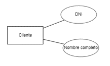

### Interrelaciones: Cardinalidad, Rol y Grado

Los objetos conllevan una serie de relaciones con otros objetos de la misma naturaleza.

Por ejemplo, siguiendo con la entidad cliente, la relación cliente-provincia se llamaría "ES DE" y nos diría la provincia de cada ocurrencia(o caso) de la entidad cliente. A cada una estas entidades se les llamarán participación, puesto que participan en la relación cliente-provincia.

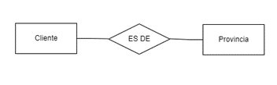

Estos datos, en su interrelación con otros, deben mantener una serie de reglas con respecto al grado de la relación, la cardinalidad de la misma y el rol.

- **Grado:** El grado de una relación nos va a decir cuántas entidades participan en dicha relación. Pueden ser de grado 1(reflexivas), de grado 2(binarias), etc.
- **Rol:** Define la función que desempeña cada entidad en una relación. Estos papeles no suelen especificarse, pero son útiles a la hora de aclarar el significado de una interrelación e imprescindibles en las relaciones de grado 1(reflexivas).
- **Cardinalidad:** La cardinalidad indica el grado de participación de cada entidad en una relación. Por ejemplo, en el caso de Cliente "ES DE" Provincia tendríamos una cardinalidad de M:1, significando que, un cliente sólo puede ser de una provincia, pero una provincia puede corresponder a muchos clientes. En cambio, si existiera una relación cliente-cónyuge, la cardinalidad sería 1:1, puesto que, un cliente puede tener sólo un cónyuge y un cónyuge puede pertenecer a un único cliente. el último caso de cardinalidad corresponde a la relación N:M, donde varias ocurrencias de la entidad 1 pueden tener varias ocurrencias de la entidad 2; en este caso hablaríamos de la relación cliente-empresa, ya que un cliente puede tener varias empresas y una sola empresa puede pertenecer a varios socios, cada uno un cliente distinto.

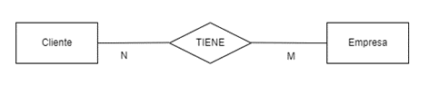

### Dominios y valores

El dominio, en un modelo entidad relación, se define como el conjunto de valores que puede tener un determinado atributo en una entidad.

Un dominio, dicho de otra forma, es una restricción impuesta a un determinado atributo, determinándolo a estar encuadrado en una escala de valores.

Por ejemplo, en una relación cliente-vehículo, llamada "tiene", el campo que referencia a la entidad vehículo sólo podría contener como valores 0(sin vehículo), o el número identificador del modelo de vehículo que posea.

### Atributos

Los atributos de un objeto son aquellas características propias de la entidad que la identifican y definen.

Por ejemplo, como vimos antes, a la entidad cliente le vamos a dar dos atributos, nombre completo y provincia. Estos atributos no son identificadores puesto que varios clientes pueden tener el mismo nombre completo y/o ser de la misma provincia.

Para identificar unívocamente una instancia de la entidad cliente, esta entidad debe tener además un atributo identificador.

### Propiedades identificadoras

La propiedad que identifica una ocurrencia de un objeto en concreto, de las demás ocurrencias de ese mismo objeto, se llama atributo identificador o ID.

Este atributo, por lo general, es un número que se va autoincrementando conforme se van añadiendo registros a la tabla. Aunque puede tener también cualquier otro valor en el que no exista posibilidad de réplica como, por ejemplo, la matrícula de un vehículo, el DNI o el número de identificación de la seguridad social de una persona.

En las relaciones creadas entre dos entidades, siempre la una va a referenciar a la otra por medio de su ID. Por ejemplo, en la relación cliente-vehículo hemos visto que si el atributo tiene presentaba un valor igual a 0, quiere decir que el cliente NO "tiene" vehículo. En cambio si el atributo lleva un valor diferente de 0, ese valor va a apuntar al atributo identificador de la entidad vehículo, definiendo qué tipo de vehículo tiene ese cliente.

### Diagramas entidad-relación. Simbología.

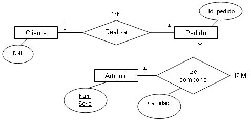

Un modelo entidad relación se representa por medio de diagramas como el que vemos en la imagen.

Si los analizamos detenidamente podemos encontrarnos con cuatro símbolos distintos:

- El cuadrado representa a la entidad.
- El círculo muestra el atributo que va a identificar a cada entidad dentro de la relación.
- El rombo identifica la relación.
- La cardinalidad que, como ya sabemos, nos va a decir el grado de participación de cada entidad en la relación a la que pertenece.

En este ejemplo vemos como un cliente puede realizar muchos pedidos, en cambio cada pedido sólo puede pertenecer a un cliente. En la relación "Realiza", cada ocurrencia va a estar identificada por dos atributos, el DNI del cliente y el ID del pedido.

A su vez, cada pedido se compone de una serie de artículos, bajo la cardinalidad N:M, en una relación llamada "se compone", que además de identificar al artículo por su número de serie y al pedido por su ID, tendrá un atributo que nos dirá la cantidad de artículos con el mismo número de serie, contiene el pedido.

## 1.4. El modelo entidad-relación extendido

El modelo entidad-relación extendido se compone de los mismos conceptos que el modelo entidad-relación, añadiendo a este los conceptos de subclase (especialización) y superclase (generalización).

El proceso de generalización consiste en crear una superclase que contiene varios atributos provenientes de diferentes entidades con características comunes.

En cambio la especialización hace lo contrario, separa una entidad en varias subclases con iguales características, quedándose la entidad principal como superclase de la especialización.

> **Ejemplo:** Por ejemplo, si nos situamos en una entidad colegio, esta puede tener tanto alumnos como empleados y estos a su vez son personas. Tenemos entonces que, un colegio tiene personas (superclase), con una serie de atributos comunes a todos, en cambio, la persona puede ser alumno (subclase), empleado (subclase) o ambas cosas a la vez. En caso de ser empleado, aparte de los atributos correspondientes a la persona, tendrá otros como el sueldo, y en caso de ser estudiante, además también de los atributos de persona, conllevará un atributo que defina la especialidad que está estudiando.

En definitiva, una superclase agrupa todos los atributos comunes de una entidad y cada subclase define los atributos específicos, pudiendo cada ocurrencia de la superclase pertenecer a una subclase, a ambas o a ninguna.


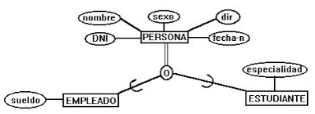

## 1.5. Restricciones de integridad

Con restricción de integridad nos referimos a uno de los aspectos más importantes a la hora de mantener la consistencia de los datos en una base de datos. Estas restricciones nos aseguran que, en caso de modificación de algún dato, no se va a provocar la pérdida de la consistencia del esquema.

Entre los tipos de restricciones de integridad nos encontramos con:

- Declaración de claves primarias.
- Cardinalidad.
- Restricción en los dominios (valores).
- Integridad referencial (claves referenciales o ajenas).

La forma más simple para mantener la integridad en nuestra base de datos se asienta sobre declarar una restricción en los dominios, especificando para cada atributo una escala de posibles valores.

### Restricciones inherentes

Cada modelo de datos tiene asociado un conjunto de restricciones propias del mismo modelo, las restricciones inherentes. Las restricciones inherentes son:

- No pueden existir dos registros iguales de una misma entidad.
- Cada atributo de una entidad puede hacer referencia a un solo valor de su dominio.
- Cualquier relación puede ser normalizada.

### Restricciones explícitas

Las restricciones explícitas son las restricciones de integridad que impone el usuario al crear la estructura de la base de datos. Estas pueden ser:

- Crear claves primarias (identificadoras).
- Hacer único un campo (unicidad).
- Marcar la obligatoriedad de un campo (no nulo).
- Crear claves referenciales (ajenas o foráneas).

# 2. El modelo relacional

Desde que se comenzó a usar el modelo de base de datos relacional, en 1970, ha ido sufriendo una serie de transformaciones hasta convertirse, hoy en día, en el modelo más utilizado para administrar las bases de datos.

Creado por Edgar Frank Codd, no tardó en asentarse como una nueva técnica en el modelado de datos y adquirir una gran aceptación por los usuarios.

Este modelo se basa fundamentalmente en establecer relaciones o vínculos entre los datos, imaginando una tabla aparte por cada relación existente con sus propios registros y atributos.

A causa de estas relaciones, surgió el problema de actualizar los datos asociados a otros datos principales cuando estos últimos sufrían alguna modificación sustancial. El error se encontraba en la pérdida de la consistencia de los datos, perdiendo incluso registros al no poder ya asociarse a su tabla padre.

Con el tiempo se ideó la manera de solucionar ese problema creando lo que hoy se llama modificación o eliminación de datos "en cascada", "cambiando a nulo" o "no hacer nada". Esto quiere decir que, al modificar un registro se puede elegir qué hacer con sus registros asociados en el campo que referencia al dato modificado en el registro principal.

Gracias a esta técnica, y como hemos dicho antes, hoy en día es el tipo de modelado de datos más implementado.

## 2.1. Estructura del modelo relacional

En el modelo relacional, una base de datos se encuentra estructurada de forma que los datos son almacenados en tablas que proveen conexiones para relacionarlos con datos almacenados en otras tablas.

En una base de datos relacional, el acceso a los datos que contiene almacenados se hará a través de las relaciones que los interconexionan creando incluso tablas nuevas con dichas conexiones.

### 2.1.1 El concepto de relación. Propiedades de las relaciones

Una relación es un vínculo que une registros de varias tablas por medio de algún atributo común.

Cualquier relación existente entre una o varias entidades de una base de datos tiene que cumplir las siguientes propiedades:

- Registros no repetidos.
- Las tuplas no tienen por qué estar ordenadas.
- Los atributos de una entidad no tienen por qué estar ordenados.
- Los atributos sólo pueden contener un único valor.

### 2.1.2. Atributos y dominio de los atributos

Llamamos atributo de una entidad a aquellos campos que describen el registro. Son la información que se nos muestra como columnas al consultar los datos de la base de datos.

La selección de los atributos de una entidad se hará en función de los datos que se quieran almacenar sobre las ocurrencias de dicha entidad. Por ejemplo, en una entidad Alumno se necesitará guardar sus datos personales, por lo que algunos de los atributos de la entidad Alumno serán su nombre, sus apellidos, su dirección, su teléfono y su dirección de correo electrónico.

Con dominio de los atributos nos estamos refiriendo a la escala de valores que puede tomar un atributo en concreto. Por ejemplo, refiriéndonos otra vez la entidad Alumno. Un alumno puede pertenecer a un grupo en concreto de un curso determinado. Lo primero, existen los cursos 1, 2 y 3, valores restringidos, y dentro de cada curso están los grupos a, b y c, valores restringidos también. Entonces podemos decir que, en la relación alumno-curso, el atributo curso sólo podrá tomar un valor comprendido entre 1 y 3, rechazando cualquier otro valor que no sea uno de estos 3. En la relación alumno-grupo pasará exactamente igual, la propiedad grupo sólo podrá tomar como valor a, b o c, desechando cualquier otro valor que se le intente dar.

### 2.1.3. Tupla, grado y cardinalidad

Como hemos dicho antes, una tupla es un registro cualquiera perteneciente a una entidad. También hemos descrito lo que significa grado y cardinalidad en la relación entre entidades.

Volviendo al ejemplo del alumno, en la relación alumno-curso-grupo vemos que intervienen 3 entidades distintas. Entonces diremos que es de grado ternario, ya que cada tupla de la entidad principal, Alumno, se va a relacionar con un registro de la entidad Curso y otra ocurrencia del objeto Grupo.
Si nos fijamos en la cardinalidad de dichas relaciones, podremos deducir que un registro de la entidad Alumno, dadas unas condiciones concretas como el año de esa escolarización, sólo puede pertenecer tanto a un curso como a un grupo; en cambio un curso y un grupo puede pertenecer a muchos alumnos. En este caso diremos que la cardinalidad de la relación alumno-grupo y alumno-curso es N:1.

Siguiendo este caso, el o los alumnos están matriculados en un curso, el cual contiene muchas materias, con lo que obtenemos que muchos cursos contienen muchas materias y que muchos alumnos reciben clases de muchas materias; Diremos entonces que la relación cursos-materias es N:M y la relación alumnos materias sería N:M también. Además, cada una de estas relaciones sería de grado binario puesto que incurren 2 entidades.


En la escuela hay también una serie de taquillas para que el alumno guarde cómodamente los libros que no vaya a usar en el momento. A cada alumno se le va a asignar una taquilla exclusiva para él, por lo que la relación alumno-taquilla será de cardinalidad 1:1.

Ahora, se puede dar otro caso con respecto al grado de la relación, que es el de tipo reflexivo, en el que solo interviene una entidad.
Digamos que el alumno está en último curso y tiene asignado un profesor para su tesis. Vamos a suponer también que tenemos una superclase Persona, en lugar de una entidad alumno y que allí se almacenan tanto profesores como alumnos. Un atributo de esa entidad sería el identificador de la persona y otro el del tutor que lleva su tesis. La propiedad que identifica al profesor que lleva la tesis va a referenciar al atributo de identificación de la misma entidad, persona. Como no necesita otro objeto aparte para crear el vínculo, éste es de grado 1. En este caso la cardinalidad sería 1:1.

### 2.1.4. Relaciones y tablas

Recordemos que una relación entre dos o más entidades o tablas es un vínculo que las une, haciendo referencia entre uno de sus atributos.

Sabemos que una tabla suele estar identificada por un campo único que va a hacer que cada registro, aunque contenga valores iguales que otros registros de la misma entidad en otros de sus atributos, sea una ocurrencia exclusiva de ese objeto y así evitar la duplicidad, lo que provocaría inconsistencia en los datos.

Pues bien, podemos deducir entonces que, cada tabla que se vaya a relacionar con la tabla principal, va a hacerlo a través de su campo único o clave primaria, aunque esta segunda entidad tenga su atributo identificador distinto y lo haga con otra de sus propiedades.

> **Ejemplo:** En el ejemplo del objeto Alumno, podemos decir que un alumno tiene un expediente. Cada expediente va a tener un número de referencia único que va a ser su clave principal. Además de esto, cada registro de la tabla expediente va a estar relacionado con otro registro de la tabla Alumno por medio del identificador de este último, por ejemplo el DNI. Entonces, sería requisito imprescindible que la entidad Expediente tuviese un atributo llamado, por ejemplo, alumno, el cual almacenase el DNI del alumno al que pertenezca el registro, y este campo apuntase hacia el campo identificador de la tabla Alumno.
> El campo alumno de la tabla Expediente debería definirse como una clave foránea o ajena dentro de la entidad Expediente, que referencia al identificador de la tabla Alumno.

## 2.2 Claves en el modelo relacional

Toda entidad, de cualquier modelo, contiene una serie de claves con el objeto de preservar su integridad y consistencia en los datos.

Estas claves pueden ser candidatas, primarias, alternativas foráneas o índices.

### 2.2.1. Claves candidatas

Llamamos clave candidata a aquellos campos que identifican a la entidad que los contiene.

Puede constar de varios campos y, entre estos, se seleccionará uno o dos atributos que actuarán como clave primaria de la entidad.

### 2.2.2. Claves primarias

La clave primaria (Primary Key) de una entidad es el campo que identifica al registro, único y sin posibilidad de adoptar un valor nulo. Es común definirlo como autoincrementable para que, cada nuevo registro, añada una unidad a la última tupla insertada.

### 2.2.3. Claves alternativas

La clave alternativa de una entidad es aquel campo que fue elegido como clave candidata en un principio, pero que luego no fue seleccionado como clave principal por existir otro campo mejor para realizar esta tarea. A pesar de esto, una clave alternativa puede ser utilizada en cualquier momento para identificar un registro en concreto de la entidad.

### 2.2.4. Claves ajenas

También llamadas claves foráneas (Foreign Key) o externas se definen como un campo que hace referencia a la clave primaria de otra entidad existente, creando el vínculo entre ambas tablas.

Cuando queremos ver la información de un registro concreto, lo buscaremos por medio de su clave principal. Pero si parte de la información se encuentra almacenada en otra tabla que, a través de una clave ajena referencia a la tabla principal, no tenemos más que buscar ese registro en la tabla principal, añadiendo los campos que deseemos de la otra entidad e indicando que existe un vínculo entre ambas.

### 2.2.5. Índices

Esta clave se crea para indexar los registros de la entidad y así acceder más rápido al dato que se está buscando. En la búsqueda de un registro en concreto, por medio de su atributo o atributos índice, los registros primero son ordenados de manera secuencial por su/s campo/s índice, agilizando la tarea de búsqueda. Se puede decir que la clave primaria de una entidad actúa siempre como un campo índice, aunque no se especifique.


## 2.3. Restricciones de integridad

Las restricciones de integridad, en cualquier modelo de base de datos, son las encargadas de preservar la integridad y la consistencia de los datos que almacenan.

Existen varias reglas básicas que hay que cumplir a la hora de asegurarnos que nuestra base de datos no va a sufrir inconsistencias, fallos o pérdidas de información.

A continuación vamos a revisarlas.

### 2.3.1. Valor «Null» en el modelo

En una entidad, pueden existir uno o varios atributos que carezcan de valor en ciertos casos. Si dejásemos es campo vacío, podríamos considerarlo como cualquier campo no vacío del objeto. En cambio, dándole un valor nulo (NULL) estamos indicando la ausencia de valor en esa propiedad.

Este valor nos va a permitir trabajar, en el modelo relacional, con datos desconocidos.

El valor nulo nos va a decir que el atributo que lo contenga no tiene ninguno de los valores posibles dentro del dominio de esa propiedad, así que podremos asignarlo cuando no se nos proponga ninguna opción en ese atributo que encaje con el registro en concreto.

### 2.3.2. Integridad de las entidades

La integridad en las entidades proporciona un seguro para evitar la redundancia entre entidades de la misma base de datos, estableciendo que cada nueva tabla que se almacene puede identificarse de modo único dentro de la estructura.

También define un registro de la entidad como una ocurrencia única dentro de dicha entidad. Exige la integridad de los datos mediante la aplicación de claves primarias, únicas o índices.

Las claves primarias de una entidad pueden estar formadas por uno o varios campos de la misma. En cualquier caso, ninguno de estos campos admitirá valores nulos.

### 2.3.3. Integridad referencial

La integridad referencial se encarga de proteger las relaciones establecidas entre las tablas cuando se modifica o elimina alguno de sus registros. Para esta tarea se vale de las restricciones creadas en la entidad, como la clave ajena.

Comprueba que los valores sean siempre coherentes en las tablas vinculadas antes de realizar cualquier acción, rechazando las que van a provocar inconsistencia. Para esto desecha las referencias a valores inexistentes y aplica los cambios producidos, en modo cascada, dentro de las tablas vinculadas.

## 2.4. Teoría de la normalización

Cuando nos referimos a bases de datos, hablamos de normalizar como el proceso por el cual se aplican una serie de reglas a las relaciones obtenidas después de pasar una base de datos de un modelo entidad-relación a otro relacional.

La normalización se realiza, entre otros, para evitar la redundancia de los datos y proteger su integridad.

### 2.4.1. El proceso de normalización. Tipos de dependencias funcionales

El proceso de normalización consiste en la organización de los datos de una base de datos, creando tablas, estableciendo relaciones entre ellas y eliminando las redundancias.

Las dependencias funcionales son las conexiones entre atributos y se representan, dentro del diagrama, por medio de flechas que unen los atributos del vínculo.

Existen tres tipos dentro de las dependencias funcionales:

- Dependencia funcional reflexiva. Los atributos que pertenecen a la clave primaria, pueden deducirse mediante ésta. Por ejemplo, nombre y dirección de una entidad Persona, pertenecen a su DNI. Entonces conociendo el DNI se puede determinar la dirección y el nombre.
- Dependencia funcional aumentativa. Si con un atributo identificamos otros atributos de la misma entidad, con varios atributos de esa entidad seguiremos obteniendo los demás.
- Dependencia funcional transitiva. Cuando tenemos tres o más atributos de una entidad, A, B y C, se dice que un atributo depende de manera transitiva de otro cuando se da la relación AàBàC y AàC. Entonces podemos decir que C depende transitivamente de A.

### 2.4.2. Primera forma normal (1FN)

Para pasar una tabla a primera forma normal hay que:
- Crear una clave primaria única sin valores nulos.
- Hacer que los atributos de una entidad contengan un solo valor tomado de un dominio (atomización) y así evitar la variación de columnas entre registros de una misma entidad.
- Debe existir una dependencia funcional.

### 2.4.3. Segunda forma normal (2FN)

La segunda forma normal garantiza que la relación está en primera forma normal y, además, los atributos que no son clave dependen de manera completa de la clave principal de la entidad.

Esta forma está basada en el concepto de dependencia plena funcional. Siendo que, en una relación A, B y C, con clave primaria A y B, y C un atributo de la relación creada entre A y B y que va a depender funcionalmente de la clave primaria, sin la cual no sería atributo de la entidad creada a partir de la relación. Si sólo dependiese de A o B hablaríamos de una dependencia parcial y no estaría en segunda forma normal.

### 2.4.4. Tercera forma normal (3FN)

Una tabla que se encuentra en tercera forma normal ha de estarlo también en segunda forma normal y, además, que no exista ninguna dependencia transitiva entre los atributos que no son clave.

Esto es, si tenemos una relación AàBàC , existiendo la correspondencia AàB y BàC , la dependencia AàC se convertirá en funcional en lugar de mantenerse como transitiva.

### 2.4.5. Otras formas normales (4FN, 5FN)

Para seguir normalizando nuestras entidades podemos pasar por una cuarta y una quinta forma normal más, de manera siempre secuencial, es decir, no se puede pasar a una sin haber cumplido la anterior.

Así en la 4FN van a dejar de existir los atributos que dependan de valores múltiples, dividiendo las relaciones, y en la 5FN dejarán de existir las restricciones impuestas por el creador de la base de datos, como la de que una tabla se divida en subtablas.

### 2.4.6. Desnormalización. Razones para la desnormalización

Podemos decir que la mayor ventaja de la normalización reside en dividir una gran tabla en tablas de menor tamaño para facilitar la accesibilidad. Aunque esta opción puede traer problemas asociados a la excesiva partición de las tablas y, por tanto, dificultar el uso de la base de datos.

Para salvar este problema se ideó el concepto de desnormalización, el cual consiste en volver hacia atrás en los pasos dados durante el proceso de normalización hasta llegar a la forma que proporcione más facilidad en el uso de la base de datos. Esta es la razón principal de la desnormalización: prevenir la excesiva partición de las tablas estableciendo relaciones menos específicas y aumentar la facilidad en el uso del conjunto de ellas.

## 2.5. Diseño de una base de datos relacional

Un diseño incorrecto en la arquitectura y modelado de una base de datos se debe principalmente a una la falta de información de los requerimientos y necesidades de los usuarios de la aplicación final y una escasa experiencia en el modelado de bases de datos.

Esto da lugar a una mala elección de la estructura de la base de datos, provocando inconsistencia en los datos y relaciones incoherentes entre las entidades que la componen.

Por esto mismo es de extremada importancia el documentar de manera detallada las necesidades que se deben cubrir para seleccionar el proceso que se va a seguir en la elaboración de nuestro producto, además de elegir un personal técnico que sea capaz de realizar un trabajo minucioso y preciso.

### Enfoque de análisis. Ventajas y desventajas

En organizaciones que consuman volúmenes importantes de información, resulta necesario adoptar un enfoque de Sistema de Gestión de Datos (DBMS) para el almacenamiento de los datos. En este caso, el uso de una base de datos es imprescindible.

Si enfocamos esta cuestión dependiendo del análisis de los requisitos y necesidades de los usuarios, podremos obtener un modelado correcto y seleccionar el DBMS que mejor se adapte a la tarea.

Las ventajas de utilizar este enfoque son:

- Una reducción de la redundancia en la base de datos, al tener bien especificados todos los requisitos.
- Mayor facilidad y control del acceso a los datos, por el estudio preciso de la información que se quiere manejar, los caminos que se quieren utilizar para acceder a la información, el tipo de datos más frecuentemente consultados y los conocimientos de los usuarios finales de la aplicación.
- Rapidez en las consultas, al conocer el funcionamiento interno de la organización gracias al estudio del análisis de ésta.

Aunque puede parecer que este es el modo correcto de enfocar el trabajo, conlleva una serie de desventajas que hay que tener en cuenta:

- La elección del sistema informático que va a dar soporte a la base d datos no es punto de vital importancia y puede ocurrir que, aunque en principio su potencia sea la necesaria, con el tiempo se convierta en insuficiente y haya que actualizarlos, con el consiguiente aumento de coste.
- La selección del personal especializado pasa a un segundo plano, no analizando en profundidad las cualidades profesionales de los aspirantes y pudiendo dar lugar a incompetencia y malas prácticas en el tratamiento de los datos.

### Enfoque de síntesis. Ventajas y desventajas

Cuando vamos a elegir un modelo adecuado para desarrollar nuestra base de datos, enfocado a la simplificación de los procesos, debemos de tener en cuenta aspectos sobre la cantidad de volumen de información que vamos a tratar y la importancia de la accesibilidad del usuario hacia los datos.

Las ventajas de este enfoque son:

- Al reducir al máximo los procesos que se van a ejecutar y los campos sobre los que se va a buscar, la velocidad de recuperación de datos va a aumentar.
- Como en este enfoque el aspecto gráfico, tanto de la entrada de registros y de consultas, como la salida de los resultados, es minimalista, se van a reducir los costes del proyecto en tanto a los equipos informáticos que van a dar soporte al sistema, como de los especialistas que van a utilizar una serie de recursos más básicos y, por lo tanto, menos costosos.
- En caso de que el sistema se bloquee por un error, la recuperación del propio sistema e incluso de los datos que puedan haber sufrido pérdidas, va resultar menos laboriosa, lo que va a reducir considerablemente la pérdida de tiempo en la ejecución de los pedidos.

Como desventajas de este enfoque podemos citar:

- Al tratar toda la información tan resumida, puede ocurrir que no se especifique claramente los resultados de una búsqueda concreta y dé lugar a que el usuario final tenga que dar vueltas entre los datos extraídos para llegar al que realmente estaba buscando.
- Si los usuarios de la aplicación no tienen un medio-alto nivel de formación sobre el uso del programa que les ofrece interactuar con la información, éstos pueden no llegar a acceder de una forma concreta a lo que realmente están solicitando.

### Metodologías de diseño

La creación de una base de datos es una tarea larga y costosa, por lo que resulta imprescindible contar con herramientas que faciliten el desarrollo del producto.

Un buen diseño va a ser la clave de un eficiente desarrollo del proyecto.

La metodología del diseño de bases de datos es un conjunto de modelos y herramientas que nos va a permitir pasar de una fase a otra en el proceso de desarrollo del producto.

Tiene como propósito ayudar al administrador a planificar, gestionar y evaluar el proyecto mediante una serie de fases.

Entre estas fases podemos encontrarnos con el diseño conceptual, el lógico y el físico.

### Diseños conceptual, lógico y físico

El diseño conceptual de una base de datos comprende básicamente dos etapas:

- Análisis de requisitos. Que debe dar respuesta a la pregunta de qué información se va a representar.
- Conceptualización. Debe orientar al diseñador sobre el tema de cómo vamos a representar la información.

En la fase del diseño lógico transformaremos el esquema que ha resultado de la etapa conceptual a un esquema relacional. Este paso se basa en tres principios:

- Toda entidad se convierte en una relación.
- Toda interrelación N:M se trasforma en una relación.
- Toda interrelación 1:N causa una propagación de la clave o crea una nueva relación.

La etapa del diseño físico va a depender del Sistema Gestor de Base de Datos que elijamos para administrar la base de datos.

Algunos elementos del diseño físico que podemos citar son:

- Índices. Sirven para acceder más rápidamente a la información y son independientes de los datos, pudiendo crearse o borrarse sin que esto afecte a la base de datos.
- Secuencias. Generan números secuenciales, que luego se utilizan como valor único para un atributo de una relación.
- Agrupaciones. Una o varias tablas en las cuales hay registros que comparten el mismo valor de claves, se almacenan físicamente juntas.
- Vistas. Generadas para ofrecer a los usuarios sólo la información que les interesa, facilitando así el control de la seguridad de la base de datos.

### Entradas y salidas del proceso

La definición de la entrada va a describir la forma en que los usuarios registrarán la información en a base de datos para su procesamiento. Su diseño consiste en el desarrollo de herramientas para la puesta a disposición de los datos a una transacción. Las características de su diseño establecerán la seguridad del sistema que va a generar los resultados a partir de los datos introducidos.

Con el término salida nos estamos refiriendo a los resultados que se obtienen en el tratamiento de los datos. La salida de datos es la principal razón del desarrollo de la aplicación para la mayoría de los usuarios finales. Para una correcta salida, los diseñadores deben determinar la información que se va a mostrar, la manera de presentarla y su distribución entre los destinatarios.

### Estudio del diseño lógico de una base de datos relacional

Si nos adentramos en el diseño lógico de una base de datos relacional, vamos a estudiar cómo se transforma debidamente el esquema conceptual y cuáles son las reglas para hacerlo. Este proceso va a ser bastante complejo y abarcará decisiones a muy distintos niveles.

Como dijimos, la etapa de creación del diseño lógico se basa en transformar el esquema obtenido en la etapa conceptual, a un esquema relacional, con el objetivo de obtener una representación que use los recursos para estructurar los datos de la manera más eficiente posible.


En la metodología para construir y validar un modelo lógico, se recorren los siguientes pasos:

- Convertir los esquemas conceptuales en esquemas lógicos.
- Derivar un conjunto de tablas para cada esquema lógico.
- Validar cada esquema mediante la normalización.
- Validar cada esquema frente a las transacciones de los usuarios.
- Dibujar el diagrama entidad-relación.
- Definir las restricciones de integridad.
- Revisar cada esquema lógico con el usuario correspondiente.

Para construir el esquema conceptual en un esquema lógico coherente se deben seguir las siguientes normas:

- Sustituir cada relación entre tres o más entidades por una entidad intermedia.
- Cada entidad del esquema conceptual se transformará en una relación dentro de una nueva tabla.
- Eliminar las relaciones redundantes.
- Transformar algunos de los atributos de las entidades por medio de la normalización.
- Si las entidades relacionadas son sinónimos, se integrarán en una sola tabla.
- Hacer una propagación de la clave primaria en las relaciones 1:N.
- Crear una entidad aparte en las relaciones N:M.

### El Diccionario de Datos: concepto y estructura

El Diccionario de Datos es un conjunto de metadatos donde se encuentra la lista de todos los elementos que forman el flujo de datos del sistema.

Este diccionario se desarrolla durante el análisis del flujo de datos y ayuda a los programadores a determinar los requerimientos del sistema, para qué sirve cada elemento y con qué debe relacionarse.

Un diccionario de datos se estructura teniendo en cuenta que hay que separar cada parte de la información, para distinguirla de las demás, en dos dimensiones: una estructura de registros y estructura de columnas.

Los elementos que conforman la estructura de un diccionario de datos son:

- Elemento dato. Agrupados para formar la estructura de datos.
- Descripción. Cada entrada del diccionario contiene detalles que describen los datos utilizados o producidos por el sistema.
- Notación. Usando símbolos especiales para describir y mostrar con claridad las relaciones entre datos.

### Estudio del diseño de la BBDD y de los requisitos de usuario

Para generar una eficiente base de datos, hay que llevar a cabo un estudio pormenorizado de los requisitos del usuario que va a usarla y, en función de eso, implementar un diseño adecuado.


En el proceso de estudio del diseño de la base de datos y los requisitos de los usuarios, se van a tener que tomar diversas decisiones hasta encontrar la más acertada para elegir la metodología del diseño y el modelado de la base de datos.

Una planificación consciente de los recursos que disponemos, tanto humanos, como informáticos, nos llevará a decidir los pasos que se seguirán durante el análisis de la aplicación.

## 2.6. Tipos de lenguajes relacionales

En 1972 Edgard Frank Codd, amplía el modelo relacional básico implementando el comportamiento dinámico mediante la propuesta de dos lenguajes teóricos de referencia:

- El álgebra relacional.
- El cálculo relacional.

Codd propuso un salto cualitativo sobre los lenguajes de datos dando respuesta a la especificación de consultas sobre una base relacional. Tanto el álgebra como el cálculo relacional son lenguajes de especificación (permite mediante primitivas de manipulación acceder en general a un conjunto de datos). Se apoyan en la base matemática formal del modelo relacional básico para dar respuesta a las consultas de bases de datos. El cálculo relacional podemos a su vez dividirlo en Cálculo relacional de tuplas y en cálculo relacional de dominios, los cuales explicaremos en profundidad a lo largo de este tema.

### 2.6.1. Operaciones en el modelo relacional.

Las operaciones del modelo relacional deben permitir la manipulación de datos que estén almacenados en bases de datos relacionales, estructurados en forma de relaciones. Sobre los datos se puede básicamente hacer dos cosas: actualizar y consultar.

A su vez dentro de la actualización de datos podemos distinguir tres operaciones básicas:

- Inserción (añadir una o más tuplas a una relación).
- Borrado (eliminar una o más tuplas de una relación).
- Modificación (cambiar valores que tienen una o más tuplas de una relación para uno o más de sus atributos).

Según como se realicen las consultas podemos clasificar los lenguajes relacionales en

- Lenguajes basados en álgebra relacional.
- Lenguajes basados en cálculo relacional.

### Álgebra relacional:

El álgebra relacional se basa en la teoría de conjuntos y en la implementación de operadores que transforman las relaciones de la base de datos en relaciones derivadas.


Son un conjunto de operaciones que describen como computar una respuesta sobre las relaciones.

Podemos describir una tupla como una función finita que asocia los nombres de los atributos de una relación con los valores de una instancia de esta. En Pocas palabras podemos decir que es una fila de una tabla relacional.

### Clasificación de operadores.

Aunque más adelante los explicaremos más en profundidad vamos a enumerarlos.

Podemos definir básicamente dos grupos de operadores algebraicos:

#### 1 - Operadores a nivel de conjunto (Propios de la teoría de conjuntos)

- Unión.
- Intersección.
- Diferencia.
- Producto.

#### 2 - Operadores relacionales

- Renombrado.
- Restricción, o selección.
- Proyección.
- División.
- Concatenación.

### Denominación de atributos.

Una relación nominada se define categóricamente sobre un esquema relacional.

A la relación S se le asocian los siguientes nombres calificados de atributos:

S.At1, S.At2,… SAtn

Para un atributo usaremos su nombre calificado o bien su nombre sin calificar cuando no exista ambigüedad.

### Relaciones derivadas.

Podemos decir que una relación es derivada cuando se define mediante una expresión del álgebra relacional. El resultado de aplicar un operador o programa algebraico a una base de datos es una relación derivada, por lo que una consulta también sería una relación derivada.

### Operaciones primitivas: selección, proyección, producto cartesiano, unión y diferencia.

**Selección,** o restricción, operador unario, define una relación con los mismos atributos que A y que contiene sólo aquellas filas de A que satisfacen la condición especificada.

**Proyección,** es un operador unario, define una relación que contiene un subconjunto vertical de A con los valores de los atributos especificados, eliminando filas duplicadas.

**Producto Cartesiano** (A por B), concatenación de cada una de las tuplas de la relación A con cada una de las de la relación B.

**Unión** (A unión B), la unión de dos relaciones es otra relación que contiene las tuplas que se encuentran e A o en B o en ambas retirándose las duplicadas. A y B deben ser compatibles.

**Diferencia** (A menos B), es otra relación que contiene las tuplas que están en la relación A, pero no en la B. Deben ser compatibles.

### Otras operaciones: intersección, join, división, etc.

**Intersección** (A intersección B), Contiene el conjunto de las tuplas que están tanto en la relación A como B. Deben ser compatibles.

Concatenación, también llamada unión natural (natural Join). El resultado es una relación con los atributos de ambas relaciones. Normalmente se realiza entre los atributos comunes de dos tablas.

División (A dividido B), define una relación sobre el conjunto de atributos C, incluido en la relación A, y que contienen el conjunto de valores de C, que en las tuplas de A están combinadas con cada una de las tuplas de B.

Renombrado, aplica cada atributo de A sobre cada atributo de B, estableciendo una nueva denominación para los atributos y para la relación.

### Cálculo relacional:

Es una aplicación del cálculo de predicados. El cálculo relacional está basado en la lógica de primer orden. Describe la respuesta sobre una Base de datos sin especificar como obtenerla.

 El cálculo relacional se basa en la lógica de primer orden.

### Cálculo relacional orientado a dominios.

En el cálculo orientado a dominios, las variables toman sus valores en dominios. En contraposición al cálculo orientado en tuplas, en el cálculo orientado a dominios hay un tipo adicional de comparación (al que denominamos ser miembro de). Basa sus expresiones en variables-dominio.

Están basadas en expresiones de comparación denominadas condiciones de pertenencia.

El lenguaje de consulta relacional QBE que explicaremos más adelante está basado en el cálculo relacional orientado a dominios.

### Cálculo relacional orientado a tuplas.

Como dijimos anteriormente, podemos describir una tupla como una función finita que asocia los nombres de los atributos de una relación con los valores de una instancia de la misma. En Pocas palabras podemos decir que es una fila de una tabla relacional.

Una variable tupla puede definirse como la unión de un conjunto de relaciones compatibles.

En el cálculo relacional orientado a tuplas, se basa en el uso de variables tupla, es decir lo que nos interesa es encontrar tuplas para las que se cumpla cierta condición.

El lenguaje SQL está basado en cálculo relacional orientado a tuplas.

# 3. Lenguaje de consulta SQL

El **lenguaje de consulta SQL** (siglas en inglés de “Structured Query Language”, que significa "Lenguaje de Consulta Estructurado"), es el lenguaje más usado y estandarizado para acceder a bases de datos relacionales. A partir de la propuesta del modelo relacional nace, vinculado a este, un sublenguaje de acceso a los datos, fundamentado en el cálculo de predicados.

Según estas teorías, IBM crea el lenguaje SEQUEL (Structured English Query Language). Más tarde sería implementado ampliamente por el SGBD (Sistema de Gestión de base de datos) experimental System R, desarrollado también por IBM en 1977. En 1979 Oracle fue la primera compañía que lo introdujo en un producto comercial.

SEQUEL acabó siendo el predecesor de SQL, el cual es una evolución del primero. SQL pasó a ser el lenguaje más extendido utilizado por los SGBD relacionales surgidos en los años posteriores. En 1986 es estandarizado por el ANSI, creando la primera versión estándar de este lenguaje, el SQL-86 o SQL1. ISO adopta también este estándar al año siguiente.

Como este estándar no cumplía con todas las necesidades en 1992 se creó un nuevo estándar revisado y ampliado, el SQL-92 o SQL2.

## 3.1. Características de SQL

SQL es un lenguaje de acceso a las bases de datos que ofrece gran diversidad de operaciones aprovechando la potencia y flexibilidad de los sistemas relacionales.

Es un lenguaje de alto nivel o de no procedimiento, que favorecido por su base teórica y su orientación a la manipulación de conjuntos de registros y no individuales, ofrece una alta productividad en codificación y la orientación a objetos.

Podemos destacar las siguientes características de SQL:

- DDL, es el lenguaje de definición de datos de SQL, el cual proporciona comandos para definir esquemas de relación, borrado y modificación de esquemas de relación.
- DML, el lenguaje interactivo de manipulación de datos implementa lenguajes de consulta basados tanto en cálculo relacional de tuplas como en álgebra relacional.
- Definición de vistas, comandos específicos para definir las vistas.
- Integridad, DDL de SQL implementa comandos para garantizar la integridad de los datos.
- SQL incorporado y dinámico, posibilidad de integrar instrucciones SQL en diversos lenguajes de programación como: C, C++, Java, PHP, etc.
- Control de transacciones, comandos para definir el inicio y final de las transacciones.
- Autorización, DDL permite mediante comandos especificar derechos de acceso a relaciones y vistas.

## 3.2. Sistemas de Gestión de Bases de Datos con soporte SQL
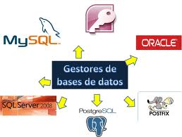

Vamos a hacer una lista con los algunos de los SGBD (sistemas de gestión de base de datos) que soportan SQL:

DB2, Firebird, HSQL, Informix, Internase, MariaDB, Microsoft SQL Server (para pequeña y mediana empresa Microsoft Access), MySQL, Oracle, PostgreSQL, PervasiveSQL, SQLite, Sybase.

Vamos a hablar un poco sobre las más implementadas:

- MySQL porque ofrece la posibilidad de generar bases de datos para usar en muchas aplicaciones Web, y lenguajes de creación Web como PHP. Permiten usar entornos gráficos como PhpMyadmin.
- Oracle es utilizado por grandes corporaciones ya que ofrece la posibilidad de gestionar un gran número de usuarios y grandes volúmenes de información de una manera muy avanzada.
- Informix es el SGBD utilizado por los sistemas operativos de la familia Unix. Gran versatilidad para la utilización por pymes o grandes empresas.

[](https://www.youtube.com/watch?v=G3y3rZLRl3M)

## 3.3. Sintaxis en SQL

Un programa en cualquier lenguaje se puede concebir como un string de caracteres escogidos de algún conjunto o alfabeto de caracteres. Las reglas que determinan si un string es un programa válido o no, constituyen la sintaxis de un lenguaje. Posteriormente, se estudiarán ciertas notaciones denominadas expresiones regulares y gramáticas libres de contexto, muy usadas no sólo para especificar las sintaxis de los lenguajes de programación sino también para contribuir en la construcción de sus compiladores.

En SQL, el Lenguaje de Definición de Datos o DDL sirve para definir estructuras de almacenamiento, y por tanto para crear esquemas conceptuales.

El compilador DDL convierte las instrucciones DDL en una serie de tablas que contienen los metadatos o datos acerca de los datos. El resultado de compilar todas las instrucciones DDL se almacena en el Diccionario de Datos.

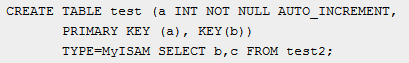

Por otro lado, DML es definido como el idioma facilitado por los sistemas gestores de bases de datos, el cual permite que los usuarios de la base de datos puedan realizar tareas de modificación o consulta de datos alojados en la base de datos mediante un sistema gestor de base de datos.

### 3.3.1 Sentencias de creación: CREATE

La sentencia CREATE, es utilizada en el lenguaje de base de datos para crear, base de datos, tablas, vistas, procedimientos y triggers. A continuación veremos la sintaxis para crear cada uno de los nombrados.

#### Bases de datos.

CREATE DATABASE nombre_de_la_BD;

Hay que tener en cuenta que en Unix los nombres de las bases de datos son case sensitive, es decir, se diferencia entre mayúsculas y minúsculas. Esto también se aplica a los nombres de tablas. En Windows no existe esta restricción.


Al crear una base de datos, esta no queda seleccionada por defecto como la base de datos que se va a usar, debe hacerse explícitamente mediante:

USE nombre_de_la_BD

#### Tablas

Con la sentencia CREATE TABLE introducimos la definición de una tabla en el catálogo de la base de datos, le asignamos un espacio inicial y le asociamos las restricciones de integridad que sean oportunas.
```
CREATE [TEMPORARY] TABLE [IF NOT EXISTS] tbl_name

[(create_definition,...)]

[table_options] [select_statement]
```

CREATE TABLE crea una tabla con el nombre dado. Debe tener el permiso CREATE para la tabla.

Por defecto, la tabla se crea en la base de datos actual. Ocurre un error si la tabla existe, si no hay base de datos actual o si la base de datos no existe.

SQL incorpora una serie de tipos de datos estándar para de la definición de los dominios de las columnas de una tabla. Los de uso más común se muestran en la tabla siguiente.


| Tipo de dato | Descripción |
| --- | --- |
| INT o INTEGER o NUMERIC | Enteros con signo (su rango depende de la implementación del sistema). |
| REAL o FLOAT | Datos numéricos en como flotante.|
| CHAR(n) | Cadena de longitud fija n. |
| VARCHAR(n) | Cadena de longitud variable de hasta n caracteres. |
| VARCHAR2(n) | De mínimo 1 carácter y máximo 4000. Otra implementación de cadena más eficiente (específico de Oracle). |
| NUMBER(p,s) | Número con precisión p y escala s, donde precisión indica el número de dígitos, y escala el número de cifras decimales. |
| LONG | Cadena de caracteres de longitud variable de hasta 2 gigabytes (específico de Oracle). |
| LONG RAW (size) | Cadena de datos binarios de longitud variable de hasta 2 gigabytes (específico de Oracle). |
| DATA o TIME o TIMESTAMP | Fecha. |

### Vistas

Una vista en SQL es una representación alternativa de mostrar datos seleccionados de varias tablas. Es como una tabla “virtual” que guarda una consulta SQL.

```
CREATE [OR REPLACE] [ALGORITHM = {UNDEFINED | MERGE | TEMPTABLE}]

VIEW nombre_vista [(columnas)]

AS sentencia_select

[WITH [CASCADED | LOCAL] CHECK OPTION]
```
Esta sentencia crea una vista nueva o reemplaza una existente si se incluye la cláusula OR REPLACE. La sentencia_select es una sentencia SELECT que proporciona la definición de la vista. Puede estar dirigida a tablas de la base o a otras vistas.

Se requiere que posea el permiso CREATE VIEW para la vista, y algún privilegio en cada columna seleccionada por la sentencia SELECT. Para columnas incluidas en otra parte de la sentencia SELECT debe poseer el privilegio SELECT. Si está presente la cláusula OR REPLACE, también deberá tenerse el privilegio DELETE para la vista.

Toda vista pertenece a una base de datos. Por defecto, las vistas se crean en la base de datos actual. Pera crear una vista en una base de datos específica, indíquela con base_de_datos.nombre_vista al momento de crearla.

`CREATE VIEW test.v AS SELECT * FROM t;`

### Disparadores o Triggers

```
CREATE TRIGGER nombre_disp momento_disp evento_disp

ON nombre_tabla FOR EACH ROW sentencia_disp

```
Un disparador es un objeto con nombre en una base de datos que se asocia con una tabla, y se activa cuando ocurre un evento en particular para esa tabla.

El disparador queda asociado a la tabla nombre_tabla. Esta debe ser una tabla permanente, no puede ser una tabla TEMPORARY ni una vista.

### Procedimientos

```
CREATE {OR REPLACE} PROCEDURE nombre_proc (param1 [IN | OUT | IN OUT] tipo,...)

IS
```
Declaración de variables locales

`BEGIN`

Instrucciones de ejecución

`[EXCEPTION]`

Instrucciones de excepción

`END;`

Un procedimiento [almacenado] es un subprograma que ejecuta una acción específica y que no devuelve ningún valor por sí mismo, como sucede con las funciones.

### 3.3.2 Sentencias de modificación: ALTER

La sentencia ALTER, es utilizada en el lenguaje de base de datos para modificar datos, pueden ser desde una base de datos o una tabla hasta una vista, un procedimiento o un trigger. A continuación veremos la sintaxis para modificar cada uno de los nombrados.


#### Bases de datos

```
ALTER {DATABASE | SCHEMA} [db_name]

alter_specification [, alter_specification]

[DEFAULT] CHARACTER SET charset_name

| [DEFAULT] COLLATE collation_name
```
`ALTER DATABASE` nos da la opción para modificar las características generales de una base de datos. Estas características se guardan en el fichero db.opt en el directorio de la base de datos. Para usar ALTER DATABASE, es necesario tener el permiso ALTER en la base de datos.

#### Tablas

```
ALTER [IGNORE] TABLE tbl_name

alter_specification [, alter_specification] ...

alter_specification:

ADD [COLUMN] column_definition [FIRST AFTER col_name ]
```
`ALTER TABLE` le permite cambiar la estructura de una tabla existente. Por ejemplo, puede añadir o borrar columnas, crear o destruir índices, cambiar el tipo de columnas existentes, o renombrar columnas o la misma tabla. Puede cambiar el comentario de la tabla y su tipo.

#### Vistas

```
ALTER [ALGORITHM = {UNDEFINED | MERGE | TEMPTABLE}]

VIEW nombre_vista [(columnas)]

AS sentencia_select

[WITH [CASCADED | LOCAL] CHECK OPTION]
```

Esta sentencia modifica la definición de una vista existente. La sintaxis es semejante a la empleada en `CREATE VIEW`. Se requiere que posea los permisos `CREATE VIEW` y `DELETE` para la vista, y algún privilegio en cada columna seleccionada por la sentencia SELECT.

#### Disparadores o Triggers

`alter trigger nombre_disparador opcion_a_modificar`

La sentencia alter trigger, modifica cualquier opción especificada en la creación de este.

Por ejemplo, la sintaxis para deshabilitar un trigger sería:

`alter trigger NOMBREDISPARADOR disable`;

#### Procedimientos.

```
ALTER {PROCEDURE | FUNCTION} sp_name [characteristic ...]

characteristic:

{ }

| SQL SECURITY { DEFINER | INVOKER }

| COMMENT 'string'
```
Este comando puede usarse para cambiar las características de un procedimiento o función almacenada.

### 3.3.3 Sentencias de borrado: DROP, TRUNCATE

La sentencia DROP, es utilizada en el lenguaje de base de datos para borrar base de datos, tablas, vistas, procedimientos y triggers. A continuación veremos la sintaxis para borrar cada uno de los nombrados.

#### Bases de datos.

`DROP DATABASE [IF EXISTS] nombre_db`

`DROP DATABASE` borrar todas las tablas en la base de datos y borrar la base de datos. Para usar `DROP DATABASE`, es necesario tener asignado el permiso `DROP` en la base de datos. `IF EXISTS` se usa para evitar un error si la base de datos no existe.


#### estTablas

```
DROP [TEMPORARY] TABLE [IF EXISTS]

tbl_name [, tbl_name] ...

[RESTRICT | CASCADE]
```
`DROP TABLE` borra una o más tablas. Debe tener el permiso `DROP` para cada tabla. Todos los datos de la definición de tabla son borrados, así que tenga cuidado con este comando.

Use `IF EXISTS` para evitar un error para tablas que no existan. Un NOTE se genera para cada tabla no existente cuando se usa `IF EXISTS`.

`RESTRICT` y `CASCADE` se permiten para hacer la portabilidad más fácil. De momento, no hacen nada.

#### Vistas

```
DROP VIEW [IF EXISTS]

nombre_vista [, nombre_vista] ...

[RESTRICT | CASCADE]
```
`DROP VIEW` elimina una o más vistas de la base de datos. Se debe poseer el privilegio `DROP` en cada vista a eliminar.

La cláusula `IF EXISTS` se emplea para evitar que ocurra un error por intentar eliminar una vista inexistente. Cuando se utiliza esta cláusula, se genera una NOTE por cada vista inexistente.

`RESTRICT` y `CASCADE` son ignoradas.

#### Disparadores o Triggers.

`DROP TRIGGER nombre_disp`

La sentencia drop trigger elimina un disparador.

#### Procedimientos.

`DROP PROCEDURE [IF EXISTS] nombre_procedimiento`

Este comando se usa para borrar un procedimiento. Es necesario disponer del permiso ALTER. Este permiso se le asigna de forma automática al creador de la rutina.

### 3.3.4 Sentencias de consulta: SELECT

Las consultas de selección, las utilizamos para que nuestro motor de datos nos devuelva información de la base de datos. Los datos devueltos tendrán forma de conjunto de registro y se podrán almacenar en un objeto recordset. El conjunto de registros será modificable.

Dentro de las consultas de selección, podemos diferenciar entre:

- Consultas básicas.
- Consultas con predicado, el predicado lo incluiremos entre la cláusula y el primer nombre del campo a recuperar. Los predicados disponibles son:
    - ALL, nos devuelve todos los campos de la tabla.
    - TOP, nos devuelve un determinado número de registros.
    - DISTINCT, omite los registros cuyos campos sean coincidentes totalmente.
    - DISTINCTROW, omite los registros duplicados.
- La cláusula inicial de la sentencia SELECT contiene las columnas que queremos mostrar
    ```
    SELECT <id_columna> [{,<id_columna>}]
    FROM
    [WHERE <condicion>];
    ```
- La cláusula FROM indica la tabla sobre la que queremos consultar
- La cláusula opcional WHERE impone una condición booleana que deben cumplir las tuplas para ser recuperadas

Para devolver el resultado de la consulta ordenado, SQL incorpora la cláusula adicional ORDER BY, que permite establecer los criterios de ordenación. Esta cláusula es opcional y se escribe a continuación de la cláusula WHERE, con la siguiente sintaxis:

```
ORDER BY id_columna [ASC|DESC] [{,id_columna [ASC|DESC]}]
```

### 3.3.5 Sentencias de inserción: INSERT

Para insertar datos en una tabla, SQL dispone de la sentencia INSERT. La sintaxis de la sentencia INSERT es la siguiente:

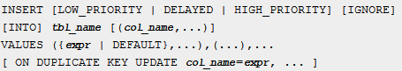

Un ejemplo de `INSERT` sería:

`INSERT INTO tienda (artículo,vendedor,precio) VALUES(1,’Pepito’,12);`

### 3.3.6 Sentencias de modificación: UPDATE

Para la modificación o actualización de filas de una tabla se utiliza la sentencia UPDATE de SQL. Con UPDATE podremos actualizar los datos de una tabla o de varias tablas a la vez.

La sintaxis de UPDATE para una tabla es:

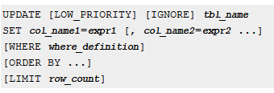

La sintaxis para múltiples tablas es:

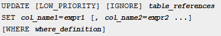

Un ejemplo de utilización de `UPDATE` para la tabla “Tienda” si se quisiera incrementar el precio de los artículos un 3% sería:

`UPDATE tienda SET precio=precio*1.03;`

### 3.3.7 Sentencias de borrado de datos: DELETE

Para borrar de datos de una tabla se realiza con la sentencia DELETE. Se puede hacer la eliminación de los datos de una tabla o de múltiples tablas:

La sintaxis para una tabla es la siguiente:

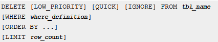

La sintaxis para múltiples tablas es:

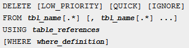

Por ejemplo, si se quisieran eliminar los registros de la tabla “Tienda” a cuando el artículo sea el 1, se haría:

`DELETE FROM tienda WHERE articulo=1;`

### 3.3.8 Otros elementos de manipulación de datos

Además de las sentencias que se acaban de ver para llevar a cabo la manipulación de datos existen otras no tan habituales.

#### DO.

Es un tipo de sentencia que se utiliza para ejecutar un bloque de código anónimo, aunque no es una sentencia de SQL estándar.

Veamos un ejemplo en postgreSQL para darle todos los permisos al rol webuser sobre todas las vistas del esquema public:

```
DO $$DECLARE r record;

BEGIN

FOR r IN SELECT table_schema, table_name FROM information_schema.tables

WHERE table_type = 'VIEW' AND table_schema = 'public'

LOOP

EXECUTE 'GRANT ALL ON ' || quote_ident(r.table_schema) || '.' || quote_ident(r.table_name) || ' TO webuser';

END LOOP;

END$$;

```

#### REPLACE.

Con esta función se puede reemplazar un texto por otro dentro de una consulta sobre una cadena de texto,

Por ejemplo, en SQL Server, si hiciéramos la consulta:

`SELECT Replace(‘Hola Mundo’, ‘Mundo’, ‘a todos!’);`

La salida será: ‘Hola a todos!’

#### Otros elementos.

Existen otras muchas sentencias, para llevar a cabo la manipulación de datos, aunque la mayoría de ellas no son estándar.

Por ejemplo:

- **DISCARD:** Se utiliza para descartar el estado de la sesión, y libera los recursos internos asociados a la sesión de la base de datos. Estos recursos se liberan normalmente al final de la sesión si no se especifica nada antes. Así, por ejemplo se podrían borrar las tablas temporales creadas en la sesión, los planes para las consultas en la memoria caché, etc.

- **DECLARE:** Sirve para definir cursores. Los cursores se pueden usan para recuperar un número relativamente pequeño de filas de una consulta que devuelva un número elevado de filas.

### 3.3.9 Operadores de conjunto: UNION, INTERSECT y MINUS

El álgebra relacional dispone de una serie de operadores de conjunto (unión, intersección y diferencia) que permiten operar sobre los resultados de dos consultas y obtener el resultado equivalente de aplicar la operación correspondiente a la teoría de conjuntos.

SQL también incorpora operadores equivalentes a dichas operaciones, son `UNION`, `INTERSECT` y `MINUS`. Para poder aplicarlos sobre dos consultas, los resultados de ambas han de ser compatibles desde el punto de vista estructural (mismo número de columnas y concordancia o compatibilidad de tipos).

El operador UNION elimina repetidos; UNION ALL mantiene duplicados en caso de que existan.

### 3.3.10 Funciones de agregación

En muchas ocasiones, puede interesar resumir la información relativa a un determinado conjunto de tuplas. Este tipo de cálculos requieren la agregación de resultados y no tienen cabida en el Álgebra relacional básico. Sin embargo, SQL incorpora una serie de funciones que permiten solucionar este tipo de consultas. Entre ellas suelen encontrarse las siguientes:

- sum(): Suma de una distribución de valores.
- min(): Valor mínimo de una distribución de valores.
- max(): Valor máximo de una distribución de valores.
- avg(): Media de una distribución de valores.
- stddev(): Desviación de una distribución de valores.
- count(): Cardinal de una distribución de valores.

Este tipo de funciones se aplican sobre valores de un atributo concreto en un conjunto de tuplas determinado.

### 3.3.11 Subconsultas

Una subconsulta es un comando SELECT dentro de otro comando.

`SELECT * FROM ti WHERE columnl = (SELECT columnl FROM t2);`

En este ejemplo, `SELECT * FROM ti` es la consulta externa (o comando externo), y (`SELECT columnl FROM t2`) es la subconsulta. Decimos que la subconsulta está anidada dentro de la consulta exterior, y de hecho, es posible anidar subconsultas dentro de otras subconsultas hasta una profundidad considerable. Una subconsulta debe siempre aparecer entre paréntesis.

Las principales ventajas de subconsultas son:

Permiten consultas estructuradas de forma que es posible aislar cada parte de un comando.

Proporcionan un modo alternativo de realizar operaciones que de otro modo necesitarían joins y uniones complejos.

Son, en la opinión de mucha gente, leíbles. De hecho, fue la innovación de las subconsultas lo que dio a la gente la idea original de llamar a SQL “Structured Query Language.”


Una subconsulta puede retornar un escalar (un valor único), un registro, una columna o una tabla (uno o más registros de una o más columnas). Éstas se llaman consultas de escalar, columna, registro y tabla. Las subconsultas que retornan una clase particular de resultado a menudo pueden usarse sólo en ciertos contextos, como se describe en las siguientes secciones.

Hay pocas restricciones sobre los tipos de comandos en que pueden usarse las subconsultas. Una subconsulta puede contener cualquiera de las palabras claves o cláusulas que puede contener un `SELECT` ordinario: `DISTINCT`, `GROUP BY`, `ORDER BY`, `LIMIT`, joins, trucos de índices, constructores `UNION`, comentarios, funciones, y así.

Una restricción es que el comando exterior de una subconsulta debe ser: `SELECT, INSERT, UPDATE, DELETE, SET`, o `DO`. Otra restricción es que actualmente no puede modificar una tabla y seleccionar de la misma tabla en la subconsulta. Esto se aplica a comandos tales como `DELETE, INSERT, REPLACE`, y `UPDATE`

### 3.3.12 Manipulación del diccionario de datos

El diccionario de datos contiene información relevante o metadatos sobre los datos que se almacenan en la base de datos, y por tanto estos datos también se almacenarán como el resto de datos, en la propia base de datos, pero sólo el sistema o un usuario concreto podrá mantener estos datos. El SGBD podrá gestionar los recursos haciendo uso de esta información. Esta información sobre los datos definirá la estructura de los datos, el tipo de datos que se van a usar, las restricciones que van a tener, índices para un acceso más rápido, etc.

El diccionario de datos se crea a la vez que se crea la base de datos y es mantenido o actualizado por el SGBD cada vez que hay una modificación en la estructura de la base de datos.

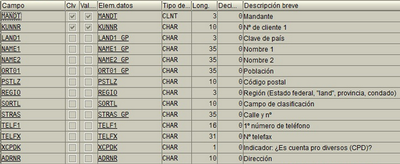

Como veíamos antes, el diccionario de datos está compuesto por datos debe almacenarse en la propia base de datos, y por tanto habrá una serie de tablas y vistas que conformarán la estructura del diccionario de datos. Estas tablas estarán dedicadas exclusivamente a proporcionar información sobre los objetos de la base de datos. Suele haber una tabla en el diccionario de datos para cada tipo de objeto posible: tablas, vistas, usuarios, roles, secuencias, disparadores, etc.

## 3.4. Especificación de restricciones de integridad

Si no se gestiona adecuadamente una base de datos podría haber registros duplicados, actualizaciones perdidas y datos inconsistentes, y por tanto no habría integridad en los datos.

En general, podemos decir que la integridad de los datos se refiere a que los datos deben ser datos correctos y estar completos, englobando por supuesto las características de los datos como: definiciones, fechas, reglas que les afecten, etc.

Los SGBD deben encargarse de mantener la integridad de los datos con respecto a las definiciones y restricciones que se hayan definido en la base de datos, pero la integridad de los datos también puede controlarse a la hora de introducir los datos, por ejemplo cuando se lleva a cabo la validación de un campo a través de un formulario, es decir, si se introducen letras en un campo dedicado a cantidades numéricas, esto estaría violando la integridad de los datos ya que no sería un dato correcto y se podría gestionar mediante una validación del tipo de dato o del rango donde debe estar incluido, etc.

A grandes rasgos podemos clasificar las restricciones que garantizan la integridad de los datos en dos grandes grupos: las condiciones que impone el usuario (como por ejemplo, podría imponer que en una tabla de salarios el campo dedicado al sueldo no fuera inferior al salario mínimo), y las condiciones o restricciones que son propias del modelo, en este caso el modelo relacional.

Las restricciones de integridad que imponga el usuario se mantendrán para una base de datos concreta, pero no para cualquier base de datos que se cree, sin embargo, las restricciones del modelo son unas restricciones implícitas que se van a cumplir para cualquier base de datos que se cree siguiendo dicho modelo. Entre las reglas de integridad del modelo podemos destacar:

- Regla de unicidad de clave primaria, es decir, la clave primaria que se elija para una tabla debe ser única para cada registro, por tanto, no puede haber valores repetidos en el conjunto de valores de la clave primaria.
- Regla de entidad de la clave primaria, que quiere decir que el valor nulo no puede ser un valor válido para la clave primaria.
- Regla de integridad referencial, que quiere decir que los valores que tomen las claves externas tienen que ser valores que existan en la clave primaria a la que hacen referencia o ser nulos.
- Regla de integridad de dominio, que a grandes rasgos se refiere a la definición del conjunto de posibles valores que puede tomar un determinado campo de una tabla y los operadores que pueden operar con dichos valores. Esto determinará la integridad del dominio del campo.

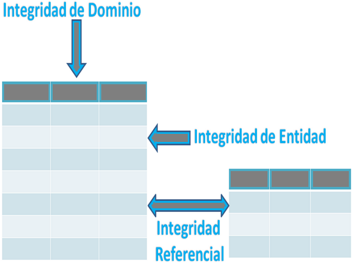

Además, hay otra serie de restricciones importantes como la del borrado, para que no se puedan eliminar filas de la tabla que son referenciadas por otras, la actualización en cascada de las filas que hacen referencia a una fila actualizada, etc.

# 4. MySQL. Una base de datos relacional.


MySQL es el servidor de bases de datos relacionales más popular, desarrollado y proporcionado por MySQL AB. MySQL AB es una empresa cuyo negocio consiste en proporcionar servicios entorno al servidor de bases de datos MySQL.

MySQL es un sistema de administración de bases de datos
Una base de datos es una colección estructurada de datos. La información que puede almacenar una base de datos puede ser tan simple como la de una agenda, un contador, o un libro de visitas, o tan vasta como la de una tienda en línea, un sistema de noticias, un portal, o la información generada en una red corporativa. Para agregar, acceder, y procesar los datos almacenados en una base de datos, se necesita un sistema de administración de bases de datos, tal como MySQL.

MySQL es un sistema de administración de bases de datos relacionales
Una base de datos relacional almacena los datos en tablas separadas en lugar de poner todos los datos en un solo lugar. Esto agrega velocidad y flexibilidad. Las tablas son enlazadas al definir relaciones que hacen posible combinar datos de varias tablas cuando se necesitan consultar datos. La parte SQL de "MySQL" significa "Lenguaje Estructurado de Consulta", y es el lenguaje más usado y estandarizado para acceder a bases de datos relacionales.


Cuando Oracle compró MySQL, apareció MariaDB, un fork (derivación) de MySQL, para asegurar que MySQL siempre fuera libre. Está implementada por los desarrolladores originales de MySQL y garantiza que se mantendrá de código abierto. Es parte de la mayoría de las ofertas en la nube y el valor predeterminado en la mayoría de las distribuciones de Linux.

MariaDB y MySQL son dos de las bases de datos relacionales de código abierto más ampliamente implementadas en el mundo y, aunque comparten una ascendencia común y mantienen la compatibilidad a través del protocolo MySQL (los clientes de MySQL pueden conectarse a MariaDB y viceversa), han evolucionado a su manera, convirtiéndose en bases de datos separadas con características únicas y diferentes visiones de productos. Organizaciones de todos los tamaños están reemplazando MySQL por MariaDB para aprovechar el espíritu innovador de MariaDB y evitar el paraguas de Oracle.

Sin embargo, son altamente compatibles, y todo lo que vamos a ver en este curso servirá tanto para MySQl como para MariaDB, y serán sinónimos.

### MySQL Open Source

Open Source significa que la persona que quiera puede usar y modificar MySQL. Cualquiera puede descargar el software de MySQL de Internet y usarlo sin pagar por ello. Inclusive, cualquiera que lo necesite puede estudiar el código fuente y cambiarlo de acuerdo a sus necesidades. MySQL usa la licencia GPL (Licencia Pública General GNU), para definir qué es lo que se puede y no se puede hacer con el software para diferentes situaciones. Sin embargo, si uno está incómodo con la licencia GPL o tiene la necesidad de incorporar código de MySQL en una aplicación comercial es posible comprar una versión de MySQL con una licencia comercial. Para mayor información, ver la página oficial de MySQL en la que se proporciona información acerca de los tipos de licencias.

### ¿Por qué usar MySQL?

El servidor de bases de datos MySQL es muy rápido, seguro, y fácil de usar. Si eso es lo que se está buscando, se le debe dar una oportunidad a MySQL. Se pueden encontrar comparaciones de desempeño con algunos otros manejadores de bases de datos en la página de MySQL.

El servidor MySQL fue desarrollado originalmente para manejar grandes bases de datos mucho más rápido que las soluciones existentes y ha estado siendo usado exitosamente en ambientes de producción sumamente exigentes por varios años. Aunque se encuentra en desarrollo constante, el servidor MySQL ofrece hoy un conjunto rico y útil de funciones. Su conectividad, velocidad, y seguridad hacen de MySQL un servidor bastante apropiado para acceder a bases de datos en Internet.

### Algunos detalles técnicos de MySQL

El software de bases de datos MySQL consiste en un sistema cliente/servidor que se compone de un servidor SQL multihilo, varios programas clientes y bibliotecas, herramientas administrativas, y una gran variedad de interfaces de programación (APIs). Se puede obtener también como una biblioteca multihilo que se puede enlazar dentro de otras aplicaciones para obtener un producto más pequeño, más rápido, y más fácil de manejar. Para obtener información técnica más detallada, es necesario consultar la guía de referencia de MySQL.


## 4.1. Características

Inicialmente, MySQL carecía de elementos considerados esenciales en las bases de datos relacionales, tales como integridad referencial y transacciones. A pesar de ello, atrajo a los desarrolladores de páginas Web con contenido dinámico, justamente por su simplicidad.

Poco a poco los elementos de los que carecía MySQL están siendo incorporados tanto por desarrollos internos, como por desarrolladores de software libre. Entre las características disponibles en las últimas versiones se puede destacar:

- Amplio subconjunto del lenguaje SQL. Algunas extensiones son incluidas igualmente.
- Disponibilidad en gran cantidad de plataformas y sistemas.
- Posibilidad de selección de mecanismos de almacenamiento que ofrecen diferente velocidad de operación, soporte físico, capacidad, distribución geográfica, transacciones...
- Transacciones y claves foráneas.
- Conectividad segura.
- Replicación.
- Búsqueda e indexación de campos de texto.

MySQL es un sistema de administración de bases de datos. Una base de datos es una colección estructurada de tablas que contienen datos. Esta puede ser desde una simple lista de compras a una galería de pinturas o el vasto volumen de información en una red corporativa. Para agregar, acceder a y procesar datos guardados en un computador, usted necesita un administrador como MySQL Server. Dado que los computadores son muy buenos manejando grandes cantidades de información, los administradores de bases de datos juegan un papel central en computación, como aplicaciones independientes o como parte de otras aplicaciones.

MySQL es un sistema de administración relacional de bases de datos. Una base de datos relacional archiva datos en tablas separadas en vez de colocar todos los datos en un gran archivo. Esto permite velocidad y flexibilidad. Las tablas están conectadas por relaciones definidas que hacen posible combinar datos de diferentes tablas sobre pedido.

MySQL es software de fuente abierta. Fuente abierta significa que es posible para cualquier persona usarlo y modificarlo. Cualquier persona puede bajar el código fuente de MySQL y usarlo sin pagar. Cualquier interesado puede estudiar el código fuente y ajustarlo a sus necesidades. MySQL usa el GPL (GNU General Public License) para definir qué puede hacer y qué no puede hacer con el software en diferentes situaciones. Si usted no se ajusta al GPL o requiere introducir código MySQL en aplicaciones comerciales, usted puede comprar una versión comercial licenciada.


### Características distintivas

Las siguientes características son implementadas únicamente por MySQL:

Permite escoger entre múltiples motores de almacenamiento para cada tabla. En MySQL 5.0 éstos debían añadirse en tiempo de compilación, a partir de MySQL 5.1 se pueden añadir dinámicamente en tiempo de ejecución:

Los hay nativos como MyISAM, Falcon, Merge, InnoDB, BDB, Memory/heap, MySQL Cluster, Federated, Archive, CSV, Blackhole y Example

Desarrollados por partners como solidDB, NitroEDB, ScaleDB, TokuDB, Infobright (antes Brighthouse), Kickfire, XtraDB, IBM DB2). InnoDB Estuvo desarrollado así pero ahora pertenece también a Oracle

Desarrollados por la comunidad como memcache, httpd, PBXT y Revision.

Agrupación de transacciones, reuniendo múltiples transacciones de varias conexiones para incrementar el número de transacciones por segundo.


## 4.2. Tipos de datos

**MySQL** soporta un número de tipos de columnas divididos en varias categorías: tipos numéricos, tipos de fecha y hora, y tipos de cadenas de caracteres

Varias descripciones de los tipos de columnas usan estas convenciones:

- M: Indica la máxima anchura al mostrar los datos. El máximo ancho de muestra es 255.
- D: Se aplica a tipos de coma flotante y de coma fija e indica el número de dígitos a continuación del punto decimal. El valor máximo posible es 30, pero no debe ser mayor que M-2.

Los corchetes ('[' y ']') indican partes de especificadores de tipos que son opcionales.

### Numéricos

Algunas consideraciones a tener en cuenta para este tipo de datos son las siguientes:

- Si especifica ZEROFILL para columnas numéricas, MySQL añade automáticamente el atributo UNSIGNED en la columna.
- SERIAL es un alias para BIGINT UNSIGNED NOT NULL AUTO_INCREMENT.
- SERIAL DEFAULT VALUE en la definición de una columna de tipo entero es un alias para NOT NULL AUTO_INCREMENT UNIQUE.

| Tipo de dato | Descripción |
| --- | --- |
| BIT[(M)] | En un tipo de dato BIT, M indica el número de bits por valor, de 1 a 64. EL valor por defecto es 1 si se omite M. BIT es un sinónimo de TINYINT(1) |
| TINYINT[(M)][UNSIGNED][ZEROFILL] | Un entero muy pequeño. El rango con signo es de -128 a 127. El rango sin signo es de 0 a 255. |
| BOOL, BOOLEAN | Son sinónimos para TINYINT(1). Un valor de cero se considera falso. Valores distintos a cero se consideran ciertos. |
| SMALLINT[(M)][UNSIGNED][ZEROFILL] | Un entero pequeño. El rango con signo es de -32768 a 32767. El rango sin signo es de 0 a 65535. |
| MEDIUMINT[(M)][UNSIGNED][ZEROFILL] | Entero de tamaño medio. El rango con signo es de -8388608 a 8388607. El rango sin singo es de 0 a 16777215. |
| INT[(M)][UNSIGNED][ZEROFILL] | Un entero de tamaño normal. El rango con signo es de -2147483648 a 2147483647. El rango sin signo es de 0 a 4294967295. |
| INTEGER[(M)][UNSIGNED][ZEROFILL] | Es un sinónimo de INT. |
| BIGINT[(M)][UNSIGNED][ZEROFILL] | Un entero grande. El rango con signo es de -9223372036854775808 a 9223372036854775807. El rango sin signo es de 0 a 18446744073709551615. |
| FLOAT(p) [UNSIGNED] [ZEROFILL] | Número con coma flotante. p representa la precisión. Puede ir de 0 a 24 para números de coma flotante de precisión sencilla y de 25 a 53 para números de coma flotante con doble precisión. Estos tipos son como los tipos FLOAT y DOUBLE descritos a continuación. FLOAT(p) tiene el mismo rango que los tipos correspondientes FLOAT y DOUBLE, pero la anchura de muestra y el número de decimales no están definidos. |
| FLOAT[(M,D)] [UNSIGNED] [ZEROFILL] | Un número de coma flotante pequeño (de precisión simple). Los valores permitidos son de -3.402823466E+38 a -1.175494351E-38, 0, y de 1.175494351E-38 a 3.402823466E+38. Si se especifica UNSIGNED, los valores negativos no se permiten. M es la anchura de muestra y D es el número de dígitos significativos. FLOAT sin argumentos o FLOAT(p) (donde p está en el rango de 0 a 24) es un número de coma flotante con precisión simple. |
| DOUBLE[(M,B)] [UNSIGNED] [ZEROFILL] | Número de coma flotante de tamaño normal (precisión doble). <br> Los valores permitidos son de: -1.7976931348623157E+308 a -2.2250738585072014E-308, 0, y de 2.2250738585072014E-308 a 1.7976931348623157E+308. Si se especifica UNSIGNED, no se permiten valores negativos. M es la anchura de muestra y B es el número de bits de precisión. DOUBLE sin parámetros o FLOAT(p) (donde p está en el rango de 25 a 53) es un número de coma flotante con doble precisión. Un número de coma flotante con precisión sencilla tiene una precisión de 7 decimales aproximadamente; un número con coma flotante de doble precisión tiene una precisión aproximada de 15 decimales. |
| DOUBLE PRECISION[(M,D)] [UNSIGNED] [ZEROFILL], REAL[(M,D)] [UNSIGNED] [ZEROFILL] | Son sinónimos de DOUBLE. Excepción: Si el modo del servidor SQL incluye la opción REAL_AS_FLOAT, REAL es un sinónimo para FLOAT en lugar de DOUBLE. |
| DECIMAL[(M[,D])][UNSIGNED][ZEROFILL] | Número de punto fijo exacto y empaquetado. M es el número total de dígitos y D es el número de decimales. El punto decimal y (para números negativos) el signo '-' no se tiene en cuenta en M. Si D es 0, los valores no tienen punto decimal o parte fraccional. <br> El máximo número de dígitos (M) para DECIMAL es 64. El máximo número de decimales soportados (D) es 30. Si UNSIGNED se especifica, no se permiten valores negativos. <br> Si se omite D, el valor por defecto es 0. Si se omite M, el valor por defecto es 10. <br> Todos los cálculos básicos (+, -, *, /) con columnas DECIMAL se hacen con precisión de 64 dígitos decimales. |
| DEC[(M[,D])] [UNSIGNED] [ZEROFILL], NUMERIC[(M[,D])] [UNSIGNED] [ZEROFILL], FIXED[(M[,D])] [UNSIGNED] [ZEROFILL] | Son sinónimos para DECIMAL. El sinónimo FIXED está disponible por compatibilidad con otros servidores. |

### Fecha y hora

Un resumen de los tipos de columnas temporales se muestra a continuación.

#### DATE

Una fecha. El rango soportado es de '1000-01-01' a '9999-12-31'. MySQL muestra valores DATE en formato 'YYYY-MM-DD', pero permite asignar valores a columnas DATE usando cadenas de caracteres o números.

#### DATETIME

Combinación de fecha y hora. El rango soportado es de '1000-01-01 00:00:00' a '9999-12-31 23:59:59'.

MySQL muestra valores DATETIME en formato 'YYYY-MM-DD HH:MM:SS', pero permite asignar valores a las columnas DATETIME usando cadenas de caracteres o números.

#### TIMESTAMP[(M)]

Una marca temporal. El rango es de '1970-01-01 00:00:00' hasta el año 2037.

Una columna TIMESTAMP es útil para registrar la fecha y hora de una operación INSERT o UPDATE. La primera columna TIMESTAMP en una tabla se rellena automáticamente con la fecha y hora de la operación más reciente si no le asigna un valor.

Puede asignar a cualquier columna TIMESTAMP la fecha y hora actual asignándole un valor NULL.

#### TIME

Una hora. El rango es de '-838:59:59' a '838:59:59'. MySQL muestra los valores TIME en formato 'HH:MM:SS', pero permite asignar valores a columnas TIME usando números o cadenas de caracteres.

#### YEAR[(2|4)]

Un año en formato de dos o cuatro dígitos. El valor por defecto está en formato de cuatro dígitos. En formato de cuatro dígitos, los valores permitidos son de 1901 a 2155, y 0000. En formato de dos dígitos, los valores permitidos son de 70 a 69, representando los años de 1970 a 2069. MySQL muestra los valores YEAR en formato YYYY pero permite asignar valores a columnas.

### String o cadena de caracteres

Un resumen de los tipos de columnas de cadenas de caracteres se muestra a continuación.

En algunos casos, MySQL puede cambiar una columna de cadena de caracteres a un tipo diferente para un comando CREATE TABLE o ALTER TABLE.

Los tipos de cadenas de caracteres MySQL incluyen algunas características como:

Las definiciones de columnas para varios tipos de datos de cadenas de caracteres incluyen un atributo CHARACTER SET para especificar el conjunto de caracteres y, ocasionalmente, una colación. (CHARSET es sinónimo de CHARACTER SET.) Estos atributos se aplican a los tipos CHAR, VARCHAR, TEXT, ENUM, y SET.

Por ejemplo:

```
CREATE TABLE t

(

c1 CHAR(20) CHARACTER SET utf8,

c2 CHAR(20) CHARACTER SET latin1 COLLATE latin1_bin

);
```

Esta definición de tabla crea una columna llamada c1 que tiene un conjunto de caracteres utf8 con la colación por defecto para ese conjunto de caracteres, y una columna llamada c2 que tiene el conjunto de caracteres latin1 y la colación binaria para el conjunto de caracteres. La colación binaria no es sensible a mayúsculas.

- MySQL interpreta las especificaciones de longitud en las definiciones de las columnas en unidades de caracteres. (En algunas versiones anteriores de MySQL la longitud se interpreta en bytes.)
- Para los tipos CHAR, VARCHAR, y TEXT, el atributo BINARY hace que se asigne a la columna la colación binaria del conjunto de caracteres.
- Las ordenaciones y comparaciones de las columnas de tipo carácter se basan en el conjunto de caracteres asignado a la columna.

#### [NATIONAL] CHAR( M ) [BINARY | ASCII | UNICODE]

Una cadena de caracteres de longitud fija que siempre tiene el número necesario de espacios a la derecha para ajustarla a la longitud especificada al almacenarla. M representa la longitud de la columna. El rango de M a partir de MySQL 5.0 es de 0 a 255 caracteres.

> Nota: Los espacios a la derecha se borran cuando se obtiene los valores CHAR.

CHAR es una abreviatura para CHARACTER. NATIONAL CHAR (o su forma equivalente de, NCHAR) es la forma estándar de SQL de definir que una columna CHAR debe usar el conjunto de caracteres por defecto. Este es el comportamiento por defecto en MySQL.

El atributo BINARY es una abreviatura para especificar la colación binaria del conjunto de caracteres de la columna. La ordenación y comparación se basa en los valores numéricos de los caracteres.

El tipo de columna CHAR BYTE es un alias para CHAR BINARY. Esta es una característica de compatibilidad.

El atributo ASCII puede especificarse para CHAR. Asigna el conjunto de caracteres latin1.

El atributo UNICODE asigna el conjunto de caracteres ucs2.

MySQL le permite crear un tipo de columna CHAR (0). Esto es útil cuando tiene que cumplir con las especificaciones de alguna aplicación vieja que dependa de la existencia de una columna pero que no usa realmente el valor. Esto es también útil cuando necesita una columna que sólo pueda tener dos valores: Una columna CHAR (0) que no esté definido como NOT NULL ocupa sólo un BIT y sólo puede tener dos valores NULL y '' (la cadena de caracteres vacía).

#### CHAR

Es un sinónimo de CHAR (1).

#### [NATIONAL] VARCHAR ( M ) [BINARY]

Cadena de caracteres de longitud variable. M representa la longitud de columna máxima.

#### VARCHAR es la abreviación de CHARACTER VARYING.

el atributo BINARY es abreviatura para especificar la colación binaria del conjunto de caracteres de la columna.

La ordenación y la comparación se basan en los valores numéricos de los caracteres.

Desde MySQL 5.0.3, VARCHAR se guarda con un prefijo de longitud de uno o dos bytes + datos. La longitud del prefijo es de dos bytes si la columna VARCHAR se declara con una longitud mayor a 255.

#### BINARY (M)
El tipo BINARY es similar al tipo CHAR, pero almacena cadenas de datos binarios en lugar de cadenas de caracteres no binarias.

#### VARBINARY (M)
El tipo VARBINARY es similar al tipo VARCHAR, pero almacena cadenas de caracteres binarias en lugar de cadenas de caracteres no binarias.

#### TINYBLOB
Una columna BLOB con una longitud máxima de 255 (2^8 - 1) bytes.

#### TINYTEXT
Una columna TEXT con longitud máxima de 255 (2^8 - 1) caracteres.

#### BLOB[(M)]
Una columna BLOB con longitud máxima de 65,535 (2^16 - 1) bytes.

Una longitud opcional M puede darse para este tipo en MySQL 5.0. Si se hace, MySQL creará las columnas como el tipo BLOB de tamaño mínimo para tratar los valores de M bytes.

#### TEXT[(M)]
Una columna TEXT con longitud máxima de 65,535 (2^16 - 1) caracteres.

En MySQL, se puede dar una longitud opcional M . En ese caso MySQL creará las columnas con el tipo TEXT de longitud mínima para almacenar los valores de longitud M.

#### MEDIUMBLOB
Una columna BLOB con longitud de 16,777,215 (2^24 - 1) bytes.

#### MEDIUMTEXT
Una columna TEXT con longitud máxima de 16,777,215 (2^24 - 1) caracteres.

#### LONGBLOB
Una columna BLOB con longitud máxima de 4,294,967,295 o 4GB (2^32 - 1) bytes. La longitud máxima efectiva (permitida) de las columnas LONGBLOB depende del tamaño máximo configurado para los paquetes en el protocolo cliente/servidor y la memoria disponible.

#### LONGTEXT
Una columna TEXT con longitud máxima de 4,294,967,295 o 4GB (2^32 - 1) caracteres. La longitud máxima efectiva (permitida) de columnas LONGTEXT depende del tamaño máximo de paquete configurado en el protocolo cliente/servidor y la memoria disponible.

#### ENUM('value1','value2',...)

Una enumeración. Un objeto de cadena de caracteres que sólo puede tener un valor, elegido de una lista de valores 'value1', 'value2', ..., NULL o el valor de error especial ''. Una columna ENUM puede tener un máximo de 65,535 valores distintos.

Los valores ENUM se representan internamente como enteros.

#### SET('value1','value2',...)

Un conjunto. Un objeto de cadena de caracteres que puede tener cero o más valores que deben pertenecer a la lista de valores 'value1', 'value2', ... Una columna SET puede tener un máximo de 64 miembros. Los valores SET se representan internamente como enteros.

## 4.3. Sintaxis SQL para MySQL

```
ALTER {DATABASE | SCHEMA} [db_name]

alter_specification [, alter_specification] ...

alter_specification:

[DEFAULT] CHARACTER SET charset_name

| [DEFAULT] COLLATE collation_name

```
ALTER DATABASE le permite cambiar las características globales de una base de datos. Estas características se almacenan en el fichero db.opt en el directorio de la base de datos. Para usar ALTER DATABASE, necesita el permiso ALTER en la base de datos.

La cláusula CHARACTER SET cambia el conjunto de caracteres por defecto de la base de datos. La cláusula COLLATE cambia la colación por defecto de la base de datos.

### Sintaxis de ALTER TABLE

```
ALTER [IGNORE] TABLE tbl_name

alter_specification [, alter_specification] ...

alter_specification:

ADD [COLUMN] column_definition [FIRST AFTER col_name ]

|ADD [COLUMN] (column_definition,... )


|ADD INDEX [index_name] [index_type] (index_col_name,...)

|ADD [CONSTRAINT [symbol]]

PRIMARY KEY [index_type] (index_col_name,...)

| ADD [CONSTRAINT [symbol]]

UNIQUE [index_name] [index_type] (index_col_name,...)

| ADD [FULLTEXT|SPATIAL] [index_name] (index_col_name,...)

| ADD [CONSTRAINT [symbol]]

FOREIGN KEY [index_name] (index_col_name,...)

[reference_definition]

| ALTER [COLUMN] col_name {SET DEFAULT literal | DROP DEFAULT}

| CHANGE [COLUMN] old_col_name column_definition

[FIRST|AFTER col_name]

| MODIFY [COLUMN] column_definition [FIRST | AFTER col_name]

| DROP [COLUMN] col_name

| DROP PRIMARY KEY

| DROP INDEX index_name

| DROP FOREIGN KEY fk_symbol

| DISABLE KEYS

| ENABLE KEYS

| RENAME [TO] new_tbl_name

| ORDER BY col_name

| CONVERT TO CHARACTER SET charset_name [COLLATE collation_name]

| [DEFAULT] CHARACTER SET charset_name [COLLATE collation_name]

| DISCARD TABLESPACE

| IMPORT TABLESPACE

| table_options


```

ALTER TABLE le permite cambiar la estructura de una tabla existente. Por ejemplo, puede añadir o borrar columnas, crear o destruir índices, cambiar el tipo de columnas existentes, o renombrar columnas o la misma tabla. Puede cambiar el comentario de la tabla y su tipo.

La sintaxis para varias de las alteraciones permitidas es similar a cláusulas del comando CREATE TABLE. Esto incluye modificaciones table_options , para opciones tales como ENGINE, AUTO_INCREMENT, y AVG_ROW_LENGTH.

Algunas operaciones pueden producir advertencias si se intentan en una tabla para que el motor de almacenamiento no soporte la operación. Estas advertencias pueden mostrarse con SHOW WARNINGS.

Si usa ALTER TABLE para cambiar la especificación de una columna pero DESCRIBE tbl_name indica que la columna no ha cambiado, es posible que MySQL haya ignorado las modificaciones por alguna de las razones “Cambios tácitos en la especificación de columnas”. Por ejemplo, si intenta cambiar una columna VARCHAR a CHAR, MySQL usa VARCHAR si la tabla contiene otras columnas de longitud variable.

ALTER TABLE funciona creando una copia temporal de la tabla original. La alteración se realiza en la copia, luego la tabla original se borra y se renombra la nueva. Mientras se ejecuta ALTER TABLE la tabla original es legible por otros clientes. Las actualizaciones y escrituras en la tabla se esperan hasta que la nueva tabla esté lista, luego se redirigen automáticamente a la nueva tabla sin ninguna actualización fallida.

Tenga en cuenta que si usa cualquier otra opción en ALTER TABLE distinta a RENAME, MySQL siempre crea una tabla temporal, incluso si los datos no necesitan ser copiados (tales como cuando cambia el nombre de una columna). Planeamos arreglar esto en el futuro, pero debido a que ALTER TABLE no es un comando que se use frecuentemente, no es un tema demasiado urgente. Para tablas MyISAM puede incrementar la velocidad de la operación de recrear índices (que es la parte más lenta del proceso de alteración) mediante la variable de sistema myisam_sort_buffer_size poniendo un valor alto.

- Para usar ALTER TABLE, necesita ALTER, INSERT, y permisos CREATE para la tabla.
- IGNORE es una extensión MySQL a SQL estándar. Controla cómo funciona ALTER TABLE si hay duplicados en las claves primarias en la nueva tabla o si ocurren advertencias cuando está activo el modo STRICT. Si no se especifica IGNORE la copia se aborta y no se ejecuta si hay errores de clave duplicada. Si se especifica IGNORE , entonces para duplicados con clave única, sólo se usa el primer registro. El resto de registros conflictivos se borran. Los valores erróneos se truncan al valor más cercano aceptable.

- Puede ejecutar múltiples cláusulas ADD, ALTER, DROP, y CHANGE en un único comando ALTER TABLE . Esta es una extensión MySQL al estándar SQL, que permite sólo una de cada cláusula por comando ALTER TABLE . Por ejemplo, para borrar múltiples columnas en un único comando:
    `mysql> ALTER TABLE t2 DROP COLUMN c, DROP COLUMN d;`

- CHANGE col_name, DROP col_name,y DROP INDEX son extensiones MySQL al estándar SQL.
- MODIFY es una extensión de Oracle a ALTER TABLE.
- La palabra COLUMN es opcional y puede omitirse.
- Si usa ALTER TABLE tbl_name RENAME TO new_tbl_name sin ninguna otra opción, MySQL simplemente renombra cualquier fichero que se corresponda a la tabla tbl_name. No es necesario crear una tabla temporal. (Puede usar el comando RENAME TABLE para renombrar tablas.
- Las cláusulas column_definition usan la misma sintaxis para ADD y CHANGE así como CREATE TABLE. Tenga en cuenta que esta sintaxis incluye el nombre de la columna, no sólo el tipo.
- Puede renombrar una columna usando CHANGE old_col_name column_definition. Para ello, especifique el nombre de columna viejo y nuevo y el tipo de la columna actual. Por ejemplo, para renombrar 
una columna INTEGER de "a" a "b", puede hacer:
    `mysql> ALTER TABLE t1 CHANGE a b INTEGER;`


Si quiere cambiar el tipo de una columna pero no el nombre, la sintáxis CHANGE necesita un nombre viejo y nuevo de columna, incluso si son iguales. Por ejemplo:

`mysql> ALTER TABLE t1 CHANGE b b BIGINT NOT NULL;`

Puede usar MODIFY para cambiar el tipo de una columna sin renombrarla:

`mysql> ALTER TABLE t1 MODIFY b BIGINT NOT NULL;`

- Si usa CHANGE o MODIFY para acortar una columna para la que existe un índice en la columna, y la longitud de la columna resultante es menor que la del índice, MySQL reduce el índice automáticamente.
- Cuando cambia un tipo de columna usando CHANGE o MODIFY, MySQL intenta convertir valores de columna existentes al nuevo tipo lo mejor posible.
- Puede usar FIRST o AFTER col_name para añadir una columna a una posición específica sin un registro de tabla. Por defecto se añade al final. Puede usar FIRST y AFTER en operaciones CHANGE o MODIFY
- ALTER COLUMN especifica un nuevo valor por defecto para una columna o borra el antiguo valor por defecto. Si el antiguo valor por defecto se borra y la columna puede ser NULL, el nuevo valor por defecto es NULL. Si la columna no puede ser NULL, MySQL asigna un valor por defecto.
- DROP INDEX borra un índice. Es una extensión MySQL al estándar SQL.
- Si las columnas se borran de una tabla, las columnas también se borran de cualquier índice del que formaran parte. Si todas las columnas que crean un índice se borran, también se borra el índice.
- Si una tabla contiene sólo una columna, la columna no puede borrarse. Si lo que quiere es borrar la tabla, use DROP TABLE.
DROP PRIMARY KEY borra el índice primario. Nota: En versiones anteriores de MySQL, si no existe clave primaria, entonces DROP PRIMARY KEY borraría el primer índice UNIQUE de la tabla. Esto ya no es así cuando trata de usar DROP PRIMARY KEY en una tabla sin clave primaria daría lugar a un error.
- Si añade UNIQUE INDEX o PRIMARY KEY a una tabla, se almacena antes que cualquier índice no único para que MySQL pueda detectar claves duplicadas tan rápido como sea posible.
- Si usa ALTER TABLE en una tabla MyISAM, todos los índices no únicos se crean en un batch separado (como para REPAIR TABLE). Esto debe hacer ALTER TABLE mucho más rápido cuando tiene muchos índices.
- Las cláusulas FOREIGN KEY y REFERENCES son soportadas por el motor InnoDB, que implementa ADD [CONSTRAINT [symbol]] FOREIGN KEY (...) REFERENCES... (...). Para otros motores de almacenamiento, las cláusulas se parsean pero se ignoran. La cláusula CHECK se par- sea pero se ignora por todos los motores de almacenamiento. La razón para aceptar pero ignorar las cláusulas es para compatibilidad, para hacer más fácil portar código de otros servidores SQL, y para ejecutar aplicaciones que crean tablas con referencias
- ALTER TABLE ignora las opciones DATA DIRECTORY e INDEX DIRECTORY.

Si quiere cambiar el conjunto de caracteres por defecto de la tabla y todas las columnas de caracteres (CHAR, VARCHAR, TEXT) a un nuevo conjunto de caracteres, use un comando como:

`ALTER TABLE tbl_name CONVERT TO CHARACTER SET charset_name;`

Atención: La operación precedente convierte los valores de columnas entre conjuntos de caracteres. Esto no es lo que quiere hacer si tiene una columna en un conjunto de caracteres (como latin1) pero los valores almacenados realmente usan otro conjunto de caracteres incompatible (como utf8). En este caso, tiene que hacer lo siguiente para cada una de tales columnas:

`ALTER TABLE ti CHANGE ci ci BLOB;`

`ALTER TABLE ti CHANGE ci ci TEXT CHARACTER SET utf8;`

La razón de que esto funcione es que no hay conversión cuando convierte desde o hacia columnas BLOB.

Si especifica CONVERT TO CHARACTER SET binary, las columnas CHAR, VARCHAR, y TEXT se converten a sus cadenas de caracteres binarias (BINARY, VARBINARY, BLOB). Esto significa que las columnas no tendrán un conjunto de caracteres y que siguientes operaciones CONVERT TO no se les aplicarán.

Para sólo cambiar el conjunto de caracteres por defecto de una tabla, use este comando:

`ALTER TABLE tbl_name DEFAULT CHARACTER SET charset_name;`

La palabra DEFAULT es opcional. El conjunto de caracteres por defecto es el que se usa si no especifica uno para una nueva columna que añada a la tabla (por ejemplo, con ALTER TABLE... ADD column).

Algunos ejemplos que muestran usos de ALTER TABLE. Comienza con una tabla t1 que se crea como se muestra:

`mysql> CREATE TABLE t1 (a INTEGER,b CHAR(10));`

Para renombrar la tabla de t1 a t2:

`mysql> ALTER TABLE t1 RENAME t2;`

Para cambiar la columna a desde INTEGER a TINYINT NOT NULL (dejando el mismo nombre), y para cambiar la columna b desde CHAR(10) a CHAR(20) así como dejarla de b a c:

`mysql> ALTER TABLE t2 MODIFY a TINYINT NOT NULL, CHANGE b c CHAR(20);`

Para añadir una nueva columna TIMESTAMP llamada d:

`mysql> ALTER TABLE t2 ADD d TIMESTAMP;`

Para añadir índices en las columnas d y a:

`mysql> ALTER TABLE t2 ADD INDEX (d), ADD INDEX (a);`

Para borrar la columna c:

`mysql> ALTER TABLE t2 DROP COLUMN c;`

Para añadir una nueva columna entera AUTO_INCREMENT llamada c:

```
mysql> ALTER TABLE t2 ADD c INT UNSIGNED NOT NULL AUTO_INCREMENT,

-> ADD PRIMARY KEY (c);
```

Tenga en cuenta que indexamos c (como PRIMARY KEY), ya que las columnas AUTO_INCREMENT deben indexarse, y también que declaramos c como NOT NULL, ya que las columnas de clave primara no pueden ser NULL.

Cuando añade una columna AUTO_INCREMENT los valores se rellenan con números secuenciales automáticamente. Para tablas MyISAM puede asignar el primer número de secuencia ejecutando SET INSERT_ID=value antes de ALTER TABLE o usando la opción de tabla AUTO_INCREMENT=value.

### Sintaxis de CREATE DATABASE
```
CREATE {DATABASE SCHEMA} [IF NOT EXISTS] db_name

[create_specification [, create_specification] ...]

create_specification:

[DEFAULT] CHARACTER SET charset_name

| [DEFAULT] COLLATE collation_name

```

CREATE DATABASE crea una base de datos con el nombre dado. Para usar CREATE DATABASE, necesita el permiso CREATE en la base de datos.

Ocurre un error si la base de datos existe y no especifica IF NOT EXISTS.

Las bases de datos en MySQL se implementan como directorios que contienen ficheros que se corresponden a tablas en la base de datos. Como no hay tablas en la base de datos cuando se crean inicialmente, el comando CREATE DATABASE desde MySQL 5.0 crea sólo un directorio bajo el directorio de datos de MySQL y el fichero db.opt file.

Si crea manualmente un directorio bajo el directorio de datos (por ejemplo, con mkdir), el servidor lo considera como un directorio de base de datos y muestra la salida de SHOW DATABASES.

CREATE SCHEMA puede usarse desde MySQL 5.0.2.

También puede usar el programa mysqladmin o Phpmyadmin para crear bases de datos.


#### CREATE INDEX

CREATE [UNIQUEIFULLTEXTISPATIAL] INDEX index_name

[USING index_type]

ON tbl_name (index_col_name,...)

index_col_name:

col_name [( length)] [ASC | DESC]

Normalmente, crea todos los índices en una tabla cuando se crea la propia tabla con CREATE TABLE.

Una lista de columnas de la forma (col1,col2,...) crea un índice de múltiples columnas. Los valores de índice se forman al concatenar los valores de las columnas dadas.

Para columnas CHAR y VARCHAR, los índices pueden crearse para que usen sólo parte de una columna, usando col_name (length) para indexar un prefijo consistente en los primeros length caracteres de cada valor de la columna.

El comando mostrado aquí crea un índice usando los primeros 10 caracteres de la columna name:

CREATE INDEX part_of_name ON customer (name(10));

Como la mayoría de nombres usualmente difieren en los primeros 10 caracteres, este índice no debería ser mucho más lento que un índice creado con la columna name entera. Además, usar columnas parcialmente para índices puede hacer un fichero índice mucho menor, que puede ahorrar mucho espacio de disco y además acelerar las operaciones INSERT. Una especificación index_col_name puede acabar con ASC o DESC. Estas palabras se permiten para extensiones futuras para especificar almacenamiento de índice ascendente o descendente. Actualmente se parsean pero se ignoran; los valores de índice siempre se almacenan en orden ascendente.

Sintaxis de CREATE TABLE
CREATE [TEMPORARY] TABLE [IF NOT EXISTS] tbl_name

[(create_definition,...)]

[table_options] [select_statement]

O:

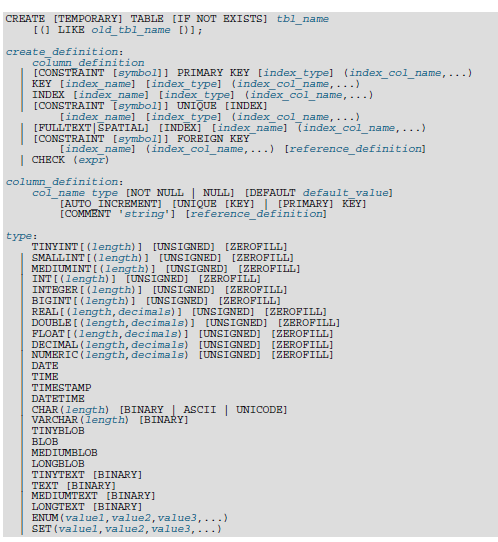

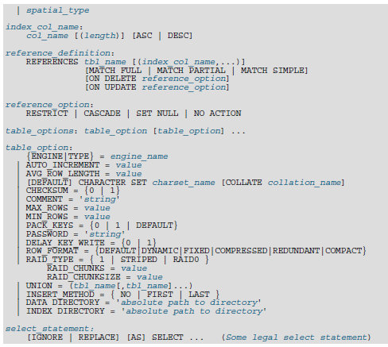


CREATE TABLE crea una tabla con el nombre dado. Debe tener el permiso CREATE para la tabla.

Por defecto, la tabla se crea en la base de datos actual. Ocurre un error si la tabla existe, si no hay base de datos actual o si la base de datos no existe.

Puede usar la palabra TEMPORARY al crear una tabla. Una tabla TEMPORARY es visible sólo para la conexión actual, y se borra automáticamente cuando la conexión se cierra. Esto significa que dos conexiones distintas pueden usar el mismo nombre de tabla temporal sin entrar en conflicto entre ellas ni con tablas no TEMPORARY con el mismo nombre. (La tabla existente se oculta hasta que se borra la tabla temporal.) Debe tener el permiso CREATE TEMPORARY TABLES para crear tablas temporales.

MySQL soporta las palabras IF NOT EXISTS para que no ocurra un error si la tabla existe. Tenga en cuenta que no hay verificación que la tabla existente tenga una estructura idéntica a la indicada por el comando CREATE TABLE . Nota: Si usa IF NOT EXISTS en un comando CREATE TABLE ... SELECT ,cualquier registro seleccionado por la parte SELECT se inserta si la tabla existe o no.

MySQL representa cada tabla mediante un fichero .frm de formato de tabla (definición) en el directorio de base de datos. El motor para la tabla puede crear otros ficheros también. En el caso de tablas MyISAM , el motor crea ficheros índice y de datos. Por lo tanto, para cada tabla MyISAM tbl_name, hay tres ficheros de disco:

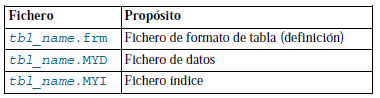

Una columna entera puede tener el atributo adicional AUTO_INCREMENT. Cuando inserta un valor de NULL (recomendado) o 0 en una columna AUTO_INCREMENT autoindexada, la columna se asigna al siguiente valor de secuencia. Típicamente esto es value+1, donde value es el mayor valor posible para la columna en la tabla. Secuencias AUTO_INCREMENT comienzan con 1. Tales columnas deben definirse como uno de los tipos enteros, “Panorámica de tipos numéricos” (el valor 1.0 no es un entero).

Nota: Sólo puede haber una columna AUTO_INCREMENT por tabla, debe estar indexada, y no puede tener un valor DEFAULT. Una columna AUTO_INCREMENT funciona correctamente sólo si contiene sólo valores positivos. Insertar un número negativo se trata como insertar un número positivo muy grande. Esto se hace para evitar problemas de precisión cuando los números “cambian” de positivos a negativos y asegura que no obtiene accidentalmente una columna AUTO_INCREMENT que contenga 0.

### Sintaxis de DROP DATABASE

`DROP {DATABASE | SCHEMA} [IF EXISTS] db_name`

DROP DATABASE borrar todas las tablas en la base de datos y borrar la base de datos. Sea muy cuidadoso con este comando! Para usar DROP DATABASE, necesita el permiso DROP en la base de datos.

IF EXISTS se usa para evitar un error si la base de datos no existe.

Si usa DROP DATABASE en una base de datos enlazada simbólicamente, tanto el enlace como la base de datos se borran.

DROP DATABASE retorna el número de tablas que se eliminan. Se corresponde con el número de ficheros .frm borrados.

El comando DROP DATABASE borrar del directorio de base de datos los ficheros y directorios que MySQL puede crear durante operaciones normales:

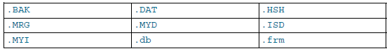

### Sintaxis de DROP INDEX
`DROP INDEX index_name ON tbl_name`

DROP INDEX borra el índice llamado index_name de la tabla tbl_name.

### Sintaxis de DROP TABLE

`DROP [TEMPORARY] TABLE [IF EXISTS]`

tbl_name [, tbl_name] ...

[RESTRICT | CASCADE]

DROP TABLE borra una o más tablas. Debe tener el permiso DROP para cada tabla. Todos los datos de la definición de tabla son borrados, así que tenga cuidado con este comando.

Use IF EXISTS para evitar un error para tablas que no existan. Un NOTE se genera para cada tabla no existente cuando se usa IF EXISTS.

RESTRICT y CASCADE se permiten para hacer la portabilidad más fácil. De momento, no hacen nada.

Nota: DROP TABLE hace un commit automáticamente con la transacción activa, a no ser que use la palabra TEMPORARY.

La palabra TEMPORARY tiene el siguiente efecto:

- El comando sólo borra tablas TEMPORARY.

- El comando no acaba una transacción en marcha.

- No se chequean derechos de acceso (una tabla TEMPORARY es visible sólo para el cliente que la ha creado, así que no es necesario).

Usar TEMPORARY es una buena forma de asegurar que no borra accidentalmente una tabla no TEMPORARY.

### Sintaxis de RENAME TABLE

RENAME TABLE tbl_name TO new_tbl_name

[, tbl_name2 TO new_tbl_name2] ...

Este comando renombra una o más tablas.

La operación de renombrar se hace automáticamente, lo que significa que ningún otro flujo puede acceder a ninguna de las tablas mientras se ejecuta el renombrado. Por ejemplo, si tiene una tabla existente old_table, puede crear otra tabla new_table con la misma estructura pero vacía, y luego reemplazar la tabla existente con la vacía como sigue:

CREATE TABLE new_table (...);

RENAME TABLE old_table TO ba.ckup_ta.ble, new_table TO old_table;

Si el comando renombra más de una tabla, las operaciones de renombrado se realizan de izquierda a derecha. Si quiere intercambiar dos nombres de tablas, puede hacerlo así (asumiendo que no existe ninguna tabla llamada tmp_table):

RENAME TABLE old_table TO tmp_table,

new_table TO old_table,

tmp_table TO new_table;

Mientras haya dos bases de datos en el mismo sistema de ficheros puede renombrar una tabla para moverla de una base de datos a otra:

RENAME TABLE current_db.tbl_name TO other_db.tbl_name;

Cuando ejecuta RENAME, no puede tener ninguna tabla bloqueada o transacciones activas. Debe tener los permisos ALTER y DROP en la tabla original, y los permisos CREATE e INSERT en la nueva tabla.

Si MySQL encuentra cualquier error en un renombrado múltiple, hace un renombrado inverso para todas las tablas renombradas para devolver todo a su estado original.

### Sintaxis de DELETE

#### Sintaxis para una tabla:

DELETE [LOW_PRIORITY] [QUICK] [IGNORE] FROM tbl_name

[WHERE where_definition]

[ORDER BY ...]

[LIMIT row_count]

#### Sintaxis para múltiples tablas:

DELETE [LOW_PRIORITY] [QUICK] [IGNORE]

tb1_name[.*] [, tbl_name[.*] ...]

FROM table_references

[WHERE where_definition]

O:

DELETE [LOW_PRIORITY] [QUICK] [IGNORE]

FROM tbl_name[.*] [, tbl_name[.*] ...]

USING table_references

[WHERE where_definition]

DELETE borra los registros de tbl_name que satisfacen la condición dada por where_definition, y retorna el número de registros borrados.

Si realiza un comando DELETE sin cláusula WHERE se borran todos los registros. Una forma más rápida de hacerlo, cuando no quiere saber el número de registros borrados, se usa TRUNCATE TABLE.


Si borra el registro conteniendo el máximo valor para una columna AUTO_INCREMENT, el valor se reutiliza para una tabla BDB, pero no para tablas MyISAM o InnoDB . Si borra todos los registros en la tabla con DELETE FROM tbl_name (sin cláusula WHERE) en modo AUTOCOMMIT, la secuencia comienza para todos los tipos de tabla.

- El comando DELETE soporta los siguientes modificadores:

- Si especifica LOW_PRIORITY, la ejecución de DELETE se retarda hasta que no hay más clientes leyendo de la tabla
IGNORE hace que MySQL ignore todos los errores durante el proceso de borrar registros. (Los errores encontrados durante la etapa de parseo se procesan de la forma habitual.) Los errores que se ignoran debido al uso de esta opción se retornan como advertencias.
Si el comando DELETE incluye una cláusula ORDER BY, los registros se borran en el orden especificado por la cláusula. Esto es muy útil sólo en conjunción con LIMIT. Por ejemplo, el siguiente ejemplo encuentra registros coincidentes con la cláusula WHERE ordenados por timestamp_column, y borra el primero (el más viejo).

DELETE FROM somelog

WHERE user = 'jcole'

ORDER BY timestamp_column

LIMIT 1;

Puede especificar múltiples tablas en un comando DELETE para borrar registros de una o más tablas dependiendo de una condición particular en múltiples tablas. Sin embargo, no puede usar ORDER BY o LIMIT en un DELETE de múltiples tablas.

La parte table_references lista las tablas involucradas en el join.

Para la primera sintaxis, sólo los registros coincidentes de las tablas listadas antes de la cláusula FROM se borran. Para la segunda sintaxis, sólo los registros coincidentes de las tablas listadas en la cláusula FROM (antes de la cláusula USING) se borran. El efecto es que puede borrar registros para varias tablas al mismo tiempo y tienen tablas adicionales que se usan para buscar:

DELETE t1, t2 FROM t1, t2, t3 WHERE t1.id=t2.id AND t2.id=t3.id;

O:

DELETE FROM t1, t2 USING t1, t2, t3 WHERE t1.id=t2.id AND t2.id=t3.id;

Estos comandos usan las tres tablas al buscar registros a borrar, pero borrar los registros coincidentes sólo para las tablas t1 y t2.

Los ejemplos anteriores muestran inner joins usando el operador coma, pero comandos DELETE de varias tablas pueden usar cualquier tipo de join permitido por comandos SELECT tales como LEFT JOIN.

La sintaxis permite.* tras los nombres de tabla para compatibilidad con Access.

Si usa un comando DELETE de varias tablas, el optimizador MySQL puede procesar tablas en un orden distinto del de su relación padre/hijo. En este caso, el comando falla y se deshace. En su lugar, debe borrar de una tabla única y confiar en la capacidad de ON DELETE para hacer que las otras tablas se modifiquen correctamente.

### Sintaxis de INSERT

```
INSERT [LOW_PRIORITY | DELAYED | HIGH_PRIORITY] [IGNORE]

[INTO] tbl name [(col name,...)]

VALUES ({expr | DEFAULT},...),(...),...

[ON DUPLICATE KEY UPDATE col_name=expr, ...]
```
O:
```
INSERT [LOW_PRIORITY | DELAYED | HIGH_PRIORITY] [IGNORE]

[INTO] tbl_name

SET col_na.me={expr | DEFAULT}, ...

[ ON DUPLICATE KEY UPDATE col_name=expr, ... ]
```
O:
```
INSERT [LOW_PRIORITY HIGH_PRIORITY] [IGNORE]

[INTO] tbl_name [(col_name,...)]

SELECT...

[ON DUPLICATE KEY UPDATE col_name=expr, ... ]
```

INSERT inserta nuevos registros en una tabla existente. Las formas INSERT... VALUES y INSERT ... SET del comando insertan registros basados en valores explícitamente especificados. La forma INSERT... SELECT inserta registros seleccionados de otra tabla o tablas. INSERT...

tbl_name es la tabla en que los registros deben insertarse. Las columnas para las que el comando proporciona valores pueden especificarse como sigue:

La lista de nombres de columna o la cláusula SET indican las columnas explícitamente.

Si no especifica la lista de columnas para INSERT... VALUES o INSERT ... SELECT, los valores para cada columna en la tabla deben proporcionarse en la lista VALUES o por el SELECT. Si no sabe el orden de las columnas en la tabla, use DESCRIBE tbl_name para encontrarlo.

Los valores de columna pueden darse de distintos modos:

Si no está ejecutando el modo estricto, cualquier columna que no tenga un valor asignado explícitamente recibe su valor por defecto (explícito o implícito). Por ejemplo, si especifica una lista de columnas que no nombra todas las columnas en la tabla, las no nombradas reciben sus valores por defecto.

Si quiere que un comando INSERT genere un error a no ser que especifique explícitamente valores para todas las columnas que no tienen un valor por defecto, debe usar modo STRICT.

Use DEFAULT para asignar a una columna explícitamente su valor por defecto. Esto hace más fácil escribir comandos INSERT que asignan valores a todas las columnas excepto unas pocas, ya que le permite evitar la escritura de una lista de valores VALUES incompleta. De otro modo, tendría que escribir la lista de los nombres de columna correspondientes a cada valor en la lista VALUES.

Si la lista de columnas y la lista VALUES están vacías, INSERT crea un registro con cada conjunto de columnas con sus valores por defecto:

`mysql> INSERT INTO tbl_name () VALUES();`

En modo STRICT obtendrá un error si una columna no tiene un valor por defecto. De otro modo, MySQL usará el valor implícito para cualquier columna sin un valor explícito por defecto definido.

Puede especificar una expresión expr para proporcionar un valor de columna. Esto puede involucrar conversión de tipos si el tipo de la expresión no coincide con el tipo de la columna, y la conversión de un valor dado puede resultar en distintos valores insertados dependiendo del tipo de columna. Por ejemplo, insertar la cadena '1999.0e-2' en una columna INT, FLOAT, DECIMAL (10,6) , o YEAR resulta en los valores 1999, 19.9921, 19.992100,y 1999 insertados, respectivamente. La razón de que el valor almacenado en las columnas INT y YEAR sea 1999 es que la conversión cadena-a-entero consulta sólo el trozo de la parte inicial de la cadena que se puede considerar como un entero válido o año. Para las columnas de coma flotante o punto fijo, la conversión cadena-a-coma-flotante considera la cadena entera un valor válido.

Una expresión expr puede referirse a cualquier columna que se haya asignado antes en una lista de valores. Por ejemplo, puede hacer esto porque el valor para col2 se refiere a col1, que se ha asignado previamente:

`mysql> INSERT INTO tbl_name (col1,col2) VALUES(15,col1*2);`

Una excepción involucra a columnas que contienen valores AUTO_INCREMENT. Como el valor AUTO_INCREMENT se genera tras otras asignaciones de valores, cualquier referencia a una columna AUTO_INCREMENT en la asignación retorna un 0.

El comando INSERT soporta los siguientes modificadores:

Si usa la palabra DELAYED, el servidor pone el registro o registros a ser insertados en un búffer, y el cliente realizando el comando INSERT DELAYED puede continuar. Si la tabla está en uso, el servidor trata los registros. Cuando la tabla se libera, el servidor comienza a insertar registros, chequeando periódicamente para ver si hay alguna petición de lectura para la tabla. Si la hay, la cola de registros retardados se suspende hasta que la tabla se libera de nuevo.

Si usa la palabra LOW_PRIORITY, la ejecución de INSERT se retrasa hasta que no hay otros clientes leyendo de la tabla. Esto incluye a otros clientes que comiencen a leer mientras que los clientes existentes están leyendo, y mientras el comando INSERT LOW_PRIORITY está en espera. Es posible, por lo tanto, para un cliente que realice un comando INSERT LOW_PRIORITY esperar durante mucho tiempo (o incluso para siempre) en un entorno de muchas lecturas. (Esto es un contraste de INSERT DELAYED, que deja al cliente continuar.

Si especifica HIGH_PRIORITY, deshabilita el efecto de la opción --low-priority-updates si el servidor se arrancó con esa opción. Hace que las inserciones concurrentes no se usen.

Los valores afectados por un INSERT pueden usarse usando la función mysql_affected_rows() de la API de C.

Si usa la palabra IGNORE en un comando INSERT, los errores que ocurren mientras se ejecuta el comando se tratan como advertencias. Por ejemplo, sin IGNORE, un registro que duplique un índice UNIQUE existente o valor PRIMARY KEY en la tabla hace que un error de clave duplicada en el comando se aborte. Con IGNORE, el registro todavía no se inserta, pero no se muestra error. Las conversiones de datos dispararían errores y abortarían el comando si no se especificara IGNORE. Con IGNORE, los valores invalidados se ajustan al valor más cercano y se insertan; las advertencias se producen pero el comando no se aborta. Puede determinar con la función mysql_info() de la API de C cuántos registros se insertan realmente en la tabla.

Si especifica ON DUPLICATE KEY UPDATE, y se inserta un registro que duplicaría un valor en un índice UNIQUE o PRIMARY KEY, se realiza un UPDATE del antiguo registro. Por ejemplo, si la columna a se declara como UNIQUE y contiene el valor 1, los siguientes dos comandos tienen efectos idénticos:

```
mysql> INSERT INTO table (a,b,c) VALUES (1,2,3)

-> ON DUPLICATE KEY UPDATE c=c+1;
```

`mysql> UPDATE table SET c=c+1 WHERE a=1;`

El valor de registros afectados es 1 si el registros se inserta como un nuevo registro y 2 si un valor existente se actualiza.

Nota: Si la columna b es única, el INSERT sería equivalente a este comando UPDATE :

`mysql> UPDATE table SET c=c+1 WHERE a=1 OR b=2 LIMIT 1;`

Si a=1 OR b=2 se cumple para varios registros, sólo un registro se actualiza. En general, debería intentar evitar usar una cláusula ON DUPLICATE KEY en tablas con claves únicas múltiples.

### Sintaxis de INSERT ... SELECT
```

INSERT [LOW_PRIORITY HIGH_PRIORITY] [IGNORE]

[INTO] tb1_name [(col_name,...)]

SELECT...

[ON DUPLICATE KEY UPDATE col_name=expr, ...]
```

Con INSERT... SELECT, puede insertar rápidamente varios registros en un atabla desde una o varias tablas.

Por ejemplo:

```
INSERT INTO tbl_temp2 (fld_id)

SELECT tbl_temp1.fld_order_id

FROM tbl_temp1 WHERE tbl_temp1.fld_order_id > 100;
```

La siguiente condición sirve para un comando INSERT... SELECT :

En MySQL 5.0, especifique IGNORE explícitamente para ignorar registros que causarían violaciones de clave duplicada.

No use DELAYED con INSERT ... SELECT.

A partir de MySQL 5.0, la tabla objetivo del comando INSERT puede aparecer en la cláusula FROM de la parte SELECT de la consulta (esto no era posible en algunas versiones antiguas de MySQL).

Las columnas AUTO_INCREMENT funcionan normalmente.

Para asegurar que el log binario puede usarse para recrear las tablas originales, MySQL no permite inserciones concurrentes durante INSERT... SELECT.

Actualmente, no puede insertar en una tabla y seleccionar de la misma tabla en una subconsulta.

En las partes de valores de ON DUPLICATE KEY UPDATE puede referirse a una columna en otras tablas, mientras no use GROUP BY en la parte SELECT. Un efecto lateral es que debe calificar los nombres de columna no únicos en la parte de valores.

Puede usar REPLACE en lugar de INSERT para sobreescribir registros antiguos REPLACE es la contraparte de INSERT IGNORE en el tratamiento de nuevos registros que contienen valores de clave única que duplican registros antiguos: Los nuevos registros se usan para reemplazar los antiguos registros en lugar de descartarlos.

### Sintaxis de LOAD DATA INFILE

```
LOAD DATA [LOW_PRIORITY | CONCURRENT] [LOCAL] INFILE 'file_name.txt'

[REPLACE | IGNORE]

INTO TABLE tbl_name

[FIELDS

[TERMINATED BY 'string']

[[OPTIONALLY] ENCLOSED BY 'char']

[ESCAPED BY 'char']

]

[LINES

[STARTING BY 'string']

[TERMINATED BY 'string']

]

[IGNORE number LINES]

[(col_name_or_user_var,...)]

[SET col_name = expr,...)] 
```

El comando LOAD DATA INFILE lee registros desde un fichero de texto a una tabla a muy alta velocidad. El nombre de fichero debe darse como una cadena literal.

### Sintaxis de REPLACE

```
REPLACE [LOW_PRIORITY | DELAYED]

[INTO] tbl_name [(col_name,...)]

VALUES ({expr | DEFAULT},...),(...),...
```
O:
```
REPLACE [LOW_PRIORITY | DELAYED]

[INTO] tbl_name

SET col_name={expr | DEFAULT}, ...
```
O:
```
REPLACE [LOW_PRIORITY | DELAYED]

[INTO] tbl_name [(col_name,...)]

SELECT...
```

REPLACE funciona exactamente como INSERT, excepto que si un valor de la tabla tiene el mismo valor que un nuevo registro para un índice PRIMARY KEY o UNIQUE, el antiguo registro se borra antes de insertar el nuevo.

Tenga en cuenta que a menos que la tabla tenga un índice PRIMARY KEY, o UNIQUE usar un comando REPLACE no tiene sentido. Es equivalente a INSERT, ya que no hay índice para determinar si un nuevo registro duplica otro.

Para ser capaz de usar REPLACE, debe tener los permisos INSERT y DELETE para la tabla.

### Sintaxis de SELECT

```
SELECT

[ALL | DISTINCT | DISTINCTROW]

[HIGH_PRIORITY]

[STRAIGHT_JOIN]

[SQL_SMALL_RESULT] [SQL_BIG_RESULT] [SQL_BUFFER_RESULT]

[SQL_CACHE | SQL_NO_CACHE] [SQL_CALC_FOUND_ROWS]select_expr, ...

[INTO OUTFILE 'file_name' export_options

| INTO DUMPFILE 'file_name']

[FROM table_references

[WHERE where_definition]

[GROUP BY {col_name | expr | position}

[ASC | DESC], ... [WITH ROLLUP]]

[HAVING where_definition]

[ORDER BY {col_name | expr | position}

[ASC | DESC] , ...]

[LIMIT {[offset,] row_count | row_count OFFSET offset}]

[PROCEDURE procedure_name(argument_list)]

[FOR UPDATE | LOCK IN SHARE MODE]]
```

SELECT se usa para recibir registros seleccionados desde una o más tablas.

- Cada select_expr indicaba una columna que quiere recibir.
table_references indicaba la tabla o tablas desde la que recibir registros.
- where_definition consiste en la palabra clave WHERE seguida por una expresión que indica la condición o condiciones que deben satisfacer los registros para ser seleccionados
- Todas las cláusulas usadas deben darse exactamente en el orden mostrado en la descripción de la sintaxis. Por ejemplo, una cláusula HAVING debe ir tras cualquier cláusula GROUP BY y antes de cualquier cláusula ORDER BY.
- Una select_expr puede tener un alias usando AS alias_name. El alias se usa como el nombre de columna de la expresión y puede usarse en cláusulas GROUP BY, ORDER BY, o HAVING. Por ejemplo:
```
mysql> SELECT CONCAT(last_name,', ',first_name) AS full_name
-> FROM mytable ORDER BY full_name;
```
La palabra clave AS es opcional cuando se usa un alias para select_expr.

El ejemplo precedente podría haberse escrito como:

```
mysql> SELECT CONCAT(last_name,', ',first_name) full_name

-> FROM mytable ORDER BY full_name;
```

Como AS es opcional, puede ocurrir un sutil problema si olvida la coma entre dos expresiones select_expr: MySQL interpreta el segundo como un nombre de alias. Por ejemplo, en el siguiente comando, columnb se tata como un nombre de alias:

`mysql> SELECT columna columnb FROM mytable;`

Por esta razón, es una buena práctica poner los alias de columnas usando AS.

- No se permite usar un alias de columna en una cláusula WHERE, ya que el valor de columna puede no estar determinado cuando se ejecuta la cláusula WHERE.
- La cláusula FROM table_references indica la tabla desde la que recibir registros. Si nombra más de una tabla, está realizando un join. Para cada tabla especificada, puede opcionalmente especificar un alias.
- En la cláusula WHERE, puede usar cualquiera de las funciones que soporta MySQL, excepto para funciones agregadas (resumen).
- La forma SELECT... INTO OUTFILE 'file_name' de SELECT escribe los registros seleccionados en un fichero. El fichero se crea en el equipo servidor, así que debe tener el permiso FILE para usar esta sintaxis. El fichero no puede existir, que entre otras cosas evita destruir ficheros cruciales tales como /etc/passwd y tablas de la base de datos.
- El comando SELECT... INTO OUTFILE existe principalmente para dejarle volcar una tabla rápidamente en la máquina servidor. Si quiere crear el fichero resultante en un equipo cliente distinto al equipo servidor, no puede usar SELECT... INTO OUTFILE. En tal caso, debería usar algún comando como mysql -e "SELECT..." > file_name en el equipo cliente para generar el fichero.
- SELECT... INTO OUTFILE es el complemento de LOAD DATA INFILE; la sintaxis para la parte export_options del comando consiste en las mismas cláusulas FIELDS y LINES usadas con el comando LOAD DATA INFILE .

FIELDS ESCAPED BY controla cómo escribir caracteres especiales. Si el carácter FIELDS ESCAPED BY no está vacío, se usa como prefijo para los siguientes caracteres en la salida:

- El carácter FIELDS ESCAPED BY
- El carácter FIELDS [OPTIONALLY] ENCLOSED BY
- El primer carácter de FIELDS TERMINATED BY y LINES TERMINATED BY
- ASCII 0 (que se escribe siguiendo el carácter de escape ASCII '0', no un byte con valor cero)
- Si el carácter FIELDS ESCAPED BY está vacío, no hay ningún carácter de escape y NULL se muestra por salida como NULL, no \N. Probablemente no es buena idea especificar un carácter de escape vacío, particularmente si los valores de los campos de sus datos contienen cualquiera de los caracteres en la lista dada.
- La razón de lo anterior es que debe escapar cualquier carácter FIELDS TERMINATED BY, ENCLOSED BY, ESCAPED BY, o LINES TERMINATED BY para ser capaz de volver a leer el fichero correctamente. ASCII NUL se escapa para hacer más fácil visualizarlo con algunos visores.
- El fichero resultante no tiene que estar conforme a la sintaxis SQL, así que nada más debe escaparse.
- Este es un ejemplo que produce un fichero en formato de valores separados por comas usado por varios programas:
```
SELECT a,b,a+b INTO OUTFILE '/tmp/result.text'
FIELDS TERMINATED BY ',' OPTIONALLY ENCLOSED BY '"'

LINES TERMINATED BY '\n'

FROM test_table;
```
- Si usa INTO DUMPFILE en lugar de INTO OUTFILE, MySQL escribe sólo un registro en el fichero, sin ninguna terminación de línea o columna y sin realizar ningún proceso de escape. Esto es útil si quiere almacenar un valor BLOB en un fichero.
> Nota: cualquier fichero creado por INTO OUTFILE o INTO DUMPFILE es modificable por todos los usuarios en el equipo servidor. La razón es que el servidor MySQL no puede crear un fichero con un propietario distinto al usuario que está en ejecución (nunca debe ejecutar mysqld como root por esta y otras razones). El fichero debe ser modificable por todo el mundo para que pueda manipular sus contenidos.
 - Una cláusula PROCEDURE nombra a un procedimiento que debe procesar los datos en el conjunto de resultados.
- Si usa FOR UPDATE en un motor de almacenamiento que usa bloqueo de páginas o registros, los registros examinados por la consulta se bloquean para escritura hasta el final de la transacción actual. Usar LOCK IN SHARE MODE crea un bloqueo compartido que evita a otras transacciones actualizar o borrar los registros examinados.
- Tras la palabra clave SELECT, puede usar un número de opciones que afectan la operación del comando.
- Las opciones ALL, DISTINCT, and DISTINCTROW especifican si deben retornarse los registros duplicados. Si no se da ninguna de estas opciones, por defecto es ALL (se retornan todos los registros coincidentes). DISTINCT y DISTINCTROW son sinónimos y especifican que los registros duplicados en el conjunto de resultados deben borrarse.
- HIGH_PRIORITY, STRAIGHT_JOIN, y opciones que comiencen con SQL_ son extensiones de MySQL al estándar SQL.
- HIGH_PRIORITY da a SELECT prioridad más alta que un comando que actualice una tabla. Debe usar esto sólo para consultas que son muy rápidas y deben realizarse una vez. Una consulta SELECT - - - HIGH_PRIORITY que se realiza mientras la tabla está bloqueada para lectura se efectúa incluso si hay un comando de actualización esperando a que se libere la tabla.
- HIGH_PRIORITY no puede usarse con comandos SELECT que sean parte de una UNION.
- STRAIGHT_JOIN fuerza al optimizador a hacer un join de las tablas en el orden en que se listan en la cláusula FROM. Puede usarlo para acelerar una consulta si el optimizador hace un join con las tablas en orden no óptimo.
- SQL_BIG_RESULT puede usarse con GROUP BY o DISTINCT para decir al optimizador que el conjunto de resultados tiene muchos registros. En este caso, MySQL usa directamente tablas temporales en disco si son necesarias con una clave en los elementos GROUP BY.
- SQL_BUFFER_RESULT fuerza a que el resultado se ponga en una tabla temporal. Esto ayuda a MySQL a liberar los bloqueos de tabla rápidamente y ayuda en casos en que tarda mucho tiempo en enviar el resultado al cliente.
- SQL_SMALL_RESULT puede usarse con GROUP BY o DISTINCT para decir al optimizador que el conjunto de resultados es pequeño. En este caso, MySQL usa tablas temporales rápidas para almacenar la tabla resultante en lugar de usar ordenación. En MySQL 5.0, esto no hará falta normalmente.
- SQL_CALC_FOUND_ROWS le dice a MySQL que calcule cuántos registros habrán en el conjunto de resultados, sin tener en cuenta ninguna cláusula LIMIT. El número de registros pueden encontrarse con SELECT FOUND_ROWS().
- SQL_CACHE le dice a MySQL que almacene el resultado de la consulta en la caché de consultas si está usando un valor de query_cache_type de 2 o DEMAND. Para una consulta que use UNION o subconsultas, esta opción afecta a cualquier SELECT en la consulta.
- SQL_NO_CACHE le dice a MySQL que no almacene los resultados de consulta en la caché de consultas. Para una consulta que use UNION o subconsultas esta opción afecta a cualquier SELECT en la consulta.

### Sintaxis de UNION

```
SELECT ...

UNION [ALL | DISTINCT]

SELECT ...

[UNION [ALL | DISTINCT]

SELECT ... ]

```

UNION se usa para combinar el resultado de un número de comandos SELECT en un conjunto de resultados.

- Las columnas seleccionadas listadas en posiciones correspondientes de cada comando SELECT deben tener el mismo tipo.
- Los nombres de columna usados por el primer comando SELECT se usan como nombres de columna para los resultados retornados.
- Los comandos SELECT son comandos select normales, pero con las siguientes restricciones:
    - Sólo el último comando SELECT puede usar INTO OUTFILE.
    - HIGH_PRIORITY no puede usarse con comandos SELECT que sean parte de una UNION. Si lo específica para el primer SELECT, no tiene efecto. Si lo específica para cualquier SELECT posterior, aparece un error de sintaxis.
- Si no usa la palabra clave ALL para UNION, todos los registros retornados son únicos, como si hubiera hecho un DISTINCT para el conjunto de resultados total. Si especifica ALL, obtiene todos los registros coincidentes de todos los comandos SELECT usados.
- La palabra clave DISTINCT es una palabra opcional que no tiene efecto, pero se permite en la sintaxis como requiere el estándar SQL (en MySQL, DISTINCT representa el comportamiento por defecto de una unión).
- Si quiere usar una cláusula ORDER BY o LIMIT para ordenar o limitar el resultado UNION entero, ponga entre paréntesis los comandos SELECT individuales y ponga el ORDER BY o LIMIT tras el último. El siguiente ejemplo usa ambas cláusulas:

```
(SELECT a FROM tbl_name WHERE a=10 AND B=1)`

UNION

(SELECT a FROM tbl_name WHERE a=11 AND B=2)

ORDER BY a LIMIT 10;
```

Este tipo de ORDER BY no puede usar referencias de columnas que incluyan un nombre de columna (esto es, nombres en formato tbl_name.col_name). En su lugar, proporcione un alias de columna al primer comando SELECT y refiérase al alias en el ORDER BY, o a la columna en el ORDER BY usando su posición de columna (un alias es preferible porque el uso de la posición de la columna está obsoleto).

Para aplicar ORDER BY o LIMIT a un SELECT individual, ponga la cláusula dentro de los paréntesis alrededor del SELECT:

```
(SELECT a FROM tbl_name WHERE a=10 AND B=1 ORDER BY a LIMIT 10)

UNION

(SELECT a FROM tbl_name WHERE a=11 AND B=2 ORDER BY a LIMIT 10);
```

Los ORDER BY para comandos SELECT individuales entre paréntesis tienen efecto sólo al combinarlos con LIMIT. De otro modo, el ORDER BY se optimiza aparte.

### Sintaxis de JOIN

MySQL soporta las siguientes sintaxis de JOIN para la parte table_references de comandos SELECT y DELETE y UPDATE de múltiples tablas:

```
table_reference, table_reference

table_reference [INNER | CROSS] JOIN table_reference [join_condition]

table_reference STRAIGHT_JOIN table_reference

table_reference LEFT [OUTER] JOIN table_reference join_condition

table_reference NATURAL [LEFT [OUTER]] JOIN table_reference

{ ON table_reference LEFT OUTER JOIN table_reference

ON conditional_expr }

table_reference RIGHT [OUTER] JOIN table_reference join_condition

table_reference NATURAL [RIGHT [OUTER]] JOIN table_reference

table_reference se define como:

tbl_name [[AS] alias]

[[USE INDEX (key_list)]

| [IGNORE INDEX (key_list)]

| [FORCE INDEX (key_list)]]

join_condition se define como:

ON conditional_expr | USING (column_list)
```

Generalmente no debería tener ninguna condición en la parte ON que se usa para restringir qué registros desea en el conjunto de resultados, pero en su lugar especificar esas condiciones en la cláusula WHERE. Hay excepciones a esta regla.

Puede poner un alias en una referencia de tabla usando tbl_name AS alias_name o tbl_name alias_name:

```
mysql> SELECT t1.name, t2.salary FROM employee AS t1, info AS t2

-> WHERE t1.name = t2.name;

mysql> SELECT t1.name, t2.salary FROM employee t1, info t2

-> WHERE t1.name = t2.name;
```

El condicional ON es cualquier expresión condicional de la forma que puede usarse en una cláusula WHERE.

Si no hay ningún registro coincidente para la tabla de la derecha en la parte ON o USING en un LEFT JOIN, se usa un registro con todas las columnas a NULL para la tabla de la derecha. Puede usar este hecho para encontrar registros en una tabla que no tengan contraparte en otra tabla:

```
mysql> SELECT table1.* FROM table1 -> LEFT JOIN table2 ON table1.id=table2.id

-> WHERE table2.id IS NULL;
```

Este ejemplo encuentra todos los registros en table1 con un valor id no presente en table2 (esto es, todos los registros en table1 sin registro correspondiente en table2). Esto asume que table2.id se declara NOT NULL.

- La cláusula USING (column_list) muestra una lista de columnas que deben existir en ambas tablas. Las siguientes dos cláusulas son semánticamente idénticas:
    - a LEFT JOIN b USING (c1,c2,c3)
    - a LEFT JOIN b ON a.c1=b.c1 AND a.c2=b.c2 AND a.c3=b.c3
-El NATURAL [LEFT] JOIN de dos tablas se define semánticamente equivalente a un INNER JOIN o LEFT JOIN con una cláusula USING que nombra todas las columnas que existen en ambas tablas.
-INNER JOIN y, son semánticamente equivalentes en la ausencia de una condición de join: ambos producen un producto Cartesiano entre las tablas especificadas (esto es, cada registro en la primera tabla se junta con cada registro en la segunda tabla).
-RIGHT JOIN funciona análogamente a LEFT JOIN. Para mantener el código portable entre bases de datos, se recomienda que use LEFT JOIN en lugar de RIGHT JOIN.
- STRAIGHT_JOIN es idéntico a JOIN, excepto que la tabla de la izquierda se lee siempre antes que la de la derecha. Esto puede usarse para aquéllos casos (escasos) en que el optimizador de join pone las tablas en orden incorrecto.
- Puede proporcionar pistas de qué índice debe usar MySQL cuando recibe información de una tabla. Especificando USE INDEX (key_list), puede decirle a MySQL que use sólo uno de los posibles índices para encontrar registros en la tabla. La sintaxis alternativa IGNORE INDEX (key_list) puede usarse para decir a MySQL que no use algún índice particular. Estos trucos son útiles si EXPLAIN muestra que MySQL está usando el índice incorrecto de la lista de posibles índices.
- También puede usar FORCE INDEX, que actúa como USE INDEX (key_list) pero con la adición que un escaneo de tabla se asume como operación muy cara. En otras palabras, un escaneo de tabla se usa sólo si no hay forma de usar uno de los índices dados para encontrar registros en la tabla.
- USE KEY, IGNORE KEY, y FORCE KEY son sinónimos de USE INDEX, IGNORE INDEX, y FORCE INDEX.
> Nota: USE INDEX, IGNORE INDEX, y FORCE INDEX sólo afecta los índices usados cuando MySQL decide cómo encontrar registros en la tabla y cómo hacer el join. No afecta si un índice está en uso cuando se resuelve un ORDER BY o GROUP BY.

Algunos ejemplos de join:
```
mysql> SELECT * FROM table1,table2 WHERE table1.id=table2.id;

mysql> SELECT * FROM table1 LEFT JOIN table2 ON table1.id=table2.id;

mysql> SELECT * FROM table1 LEFT JOIN table2 USING (id);

mysql> SELECT * FROM table1 LEFT JOIN table2 ON table1.id=table2.id -> LEFT JOIN table3 ON table2.id=table3.id;

mysql> SELECT * FROM table1 USE INDEX (key1,key2)

-> WHERE key1=1 AND key2=2 AND key3=3;

mysql> SELECT * FROM table1 IGNORE INDEX (key3)
```

### Casos prácticos MySQL

Para poder practicar sentencias MySQL, necesitaremos un servidor de base de datos. A continuación, vamos a instalar MariaDB.

Accedemos al sitio oficial de MariaDB

https://mariadb.com/downloads/

Y descargamos la última versión estable.


Una vez descargado el instalador, lo lanzamos.

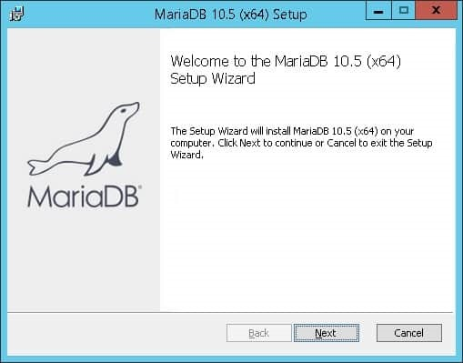

Seleccionamos las opciones de configuración de la instalación (las opciones por defecto servirán) y hacemos clic en el botón Siguiente.

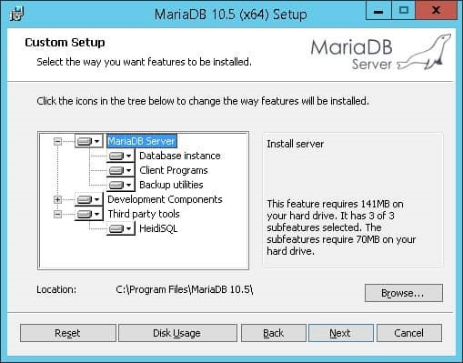

Es muy importante para garantizar la seguridad, escribir una contraseña de la cuenta root para el servicio MariaDB.

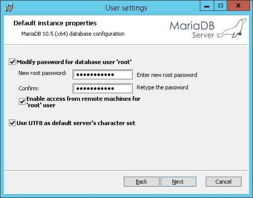

En la siguiente pantalla, mantenemos la configuración predeterminada y hacemos clic en el botón Siguiente. De esta forma, instalamos MariaDB como un servicio. Esto iniciará automáticamente el servicio MariaDB durante el arranque del equipo.

Si queremos arrancar MariaDB de forma manual solamente cuando lo necesitemos, desmarcaremos la opción “Install as service”.

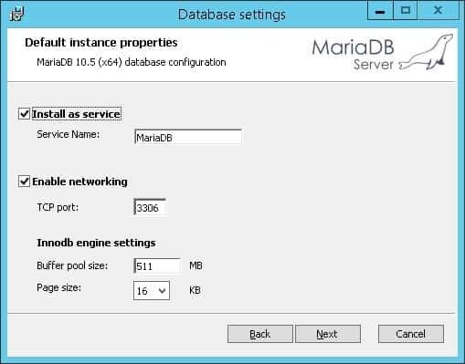

Hacemos clic en el botón Instalar y esperamos a que finalice la instalación.

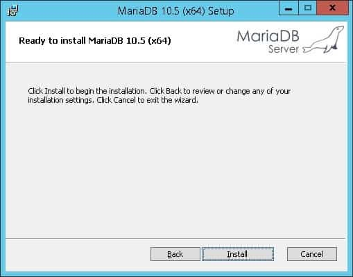

Una vez finalizada la instalación, en el menú de MariaDB, seleccionamos el cliente de línea de comandos MySQL.

Se solicita la contraseña de la cuenta root de MariaDB.

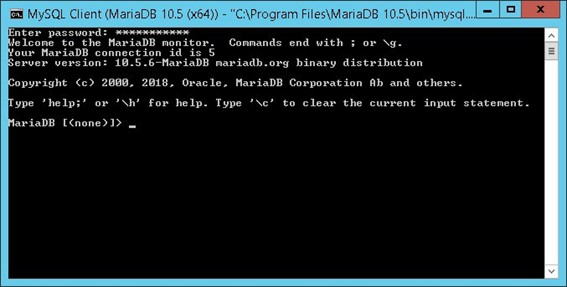

Este es el terminal desde el que lanzaremos los comandos SQL sobre la base de datos MariaDB.

MariaDB es multiplataforma, por ejemplo, para instalarla en Ubuntu lanzamos los siguientes comandos en el terminal:

$ sudo apt update

$ sudo apt install mariadb-server

$ sudo mysql_secure_installation

Otras opciones para trabajar con MariaDB sería instalar XAMPP. XAMPP es una distribución de Apache gratuita y fácil de instalar que contiene MariaDB, PHP y Perl. Se puede descargar en la siguiente url: https://www.apachefriends.org/es/index.html

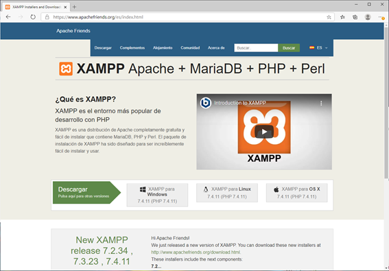

Dentro de las aplicaciones que incluye XAMPP está phpMyAdmin, que es una herramienta de software libre escrita en PHP, destinada a manejar la administración de MySQL a través de la Web. phpMyAdmin soporta una amplia gama de operaciones en MySQL y MariaDB. Las operaciones de uso frecuente (administración de bases de datos, tablas, columnas, relaciones, índices, usuarios, permisos, etc.) se pueden realizar a través de la interfaz de usuario, mientras que todavía tiene la capacidad de ejecutar directamente cualquier instrucción SQL.

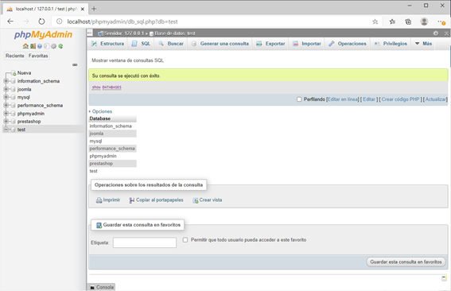

Pero la mejor opción, si no queremos instalar nada, es utilizar un editor on line, uno muy sencillo es SQL Fiddle:

http://sqlfiddle.com/

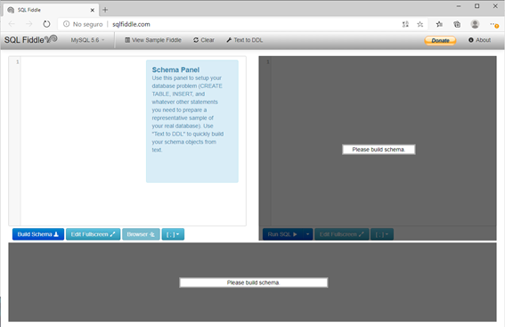

En este editor, en el panel izquierdo se incluyen las sentencias de creación de tablas e inserción de los datos. En el panel derecho, vamos lanzando nuestras consultas sobre la base de datos, y el resultado se ve en el panel inferior.

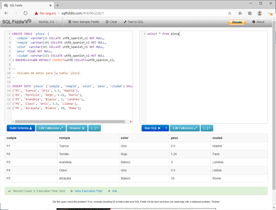

Este es el editor que vamos a utilizar para esta práctica. 

### Base de datos de venta de piezas

El objetivo del ejercicio es definir una base de datos que representa la compra de piezas a unos determinados proveedores. Cada venta de un proveedor tiene un proyecto asignado.

El diagrama Entidad/Relación sería el de la siguiente imagen.

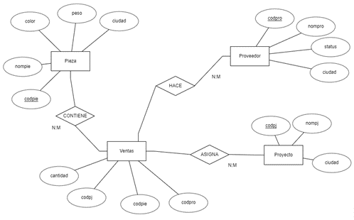

Vemos que todas las tablas tienen relaciones de muchos a muchos, y que las entidades pieza, proveedor y proyecto se relacionan entre sí a través de la entidad ventas.

Si queremos trabajar con nuestra propia instalación de MariaDB o con XAMPP, necesitaremos una base de datos propia con la que trabajar, por tanto, tendríamos que crear esta base de datos. Para eso lanzamos las siguientes consultas, que crean una base de datos llamada “Prueba”:

CREATE DATABASE IF NOT EXISTS `Prueba` DEFAULT CHARACTER SET utf8 COLLATE utf8_general_ci;

USE `Prueba`;

Esto no será necesario si utilizamos el editor online Fiddle, ya que utiliza una base de datos vacía por defecto, donde vamos a crear nuestras tablas e insertar datos.

### Creación de tablas e inserción de datos

A continuación, se listan las sentencias de creación de tablas y de inserción de datos en cada tabla. Al final se encuentran las sentencias de creación de índices y de claves primarias.

**Estructura de tabla para la tabla `pieza`**


```
CREATE TABLE `pieza` (

 `codpie` varchar(3) COLLATE utf8_spanish_ci NOT NULL,

 `nompie` varchar(10) COLLATE utf8_spanish_ci NOT NULL,

 `color` varchar(10) COLLATE utf8_spanish_ci NOT NULL,

 `peso` float NOT NULL,

  `ciudad` varchar(15) COLLATE utf8_spanish_ci NOT NULL

) ENGINE=InnoDB DEFAULT CHARSET=utf8 COLLATE=utf8_spanish_ci;

```

### Volcado de datos para la tabla `pieza`

```

INSERT INTO `pieza` (`codpie`, `nompie`, `color`, `peso`, `ciudad`) VALUES

('P1', 'Tuerca', 'Gris', 2.5, 'Madrid'),

('P2', 'Tornillo', 'Rojo', 1.25, 'Madrid'),

('P3', 'Arandela', 'Blanco', 3, 'Barcelona'),

('P4', 'Clavo', 'Gris', 5.5, 'Londres'),

('P5', 'Alcayata', 'Blanco', 10, 'Madrid');
```

### Estructura de tabla para la tabla `proveedor`

>Importante
No es necesario que el nombre esté escrito en minúsculas en la base de datos. La función lower() convierte el texto a minúsculas durante la búsqueda, por lo que se encuentran coincidencias aunque el registro original esté en mayúsculas o con mayúscula inicial.

```
CREATE TABLE `proveedor` (

 `codpro` char(3) COLLATE utf8_spanish_ci NOT NULL,

 `nompro` varchar(30) COLLATE utf8_spanish_ci NOT NULL,

 `status` int(11) DEFAULT NULL,

 `ciudad` varchar(15) COLLATE utf8_spanish_ci DEFAULT NULL

) ENGINE=InnoDB DEFAULT CHARSET=utf8 COLLATE=utf8_spanish_ci;
```

### Volcado de datos para la tabla `proveedor`

```
INSERT INTO `proveedor` (`codpro`, `nompro`, `status`, `ciudad`) VALUES

('S1', 'José Fernandez', 2, 'Madrid'),

('S2', 'Manuel Vidal', 1, 'Granada'),

('S3', 'Luisa Gómez', 3, 'Cáceres'),

('S4', 'Carlos Sanchez', 4, 'Madrid'),

('S5', 'María Reyes', 5, 'Barcelona');
```

### Estructura de tabla para la tabla `proyecto`

```
CREATE TABLE `proyecto` (

 `codpj` char(3) COLLATE utf8_spanish_ci NOT NULL,

 `nompj` varchar(20) COLLATE utf8_spanish_ci DEFAULT NULL,

 `ciudad` varchar(15) COLLATE utf8_spanish_ci DEFAULT NULL

) ENGINE=InnoDB DEFAULT CHARSET=utf8 COLLATE=utf8_spanish_ci;
```

### Volcado de datos para la tabla `proyecto`

```
INSERT INTO `proyecto` (`codpj`, `nompj`, `ciudad`) VALUES

('J1', 'proyecto 1', 'Madrid'),

('J2', 'Proyecto 2', 'Madrid'),

('J3', 'Proyecto 3', 'Londres'),

('J4', 'Proyecto 4', 'Roma');
```

### Estructura de tabla para la tabla `ventas`

```
CREATE TABLE `ventas` (

 `codpro` char(3) COLLATE utf8_spanish_ci DEFAULT NULL,

 `codpie` char(3) COLLATE utf8_spanish_ci DEFAULT NULL,

 `codpj` char(3) COLLATE utf8_spanish_ci DEFAULT NULL,

 `cantidad` int(11) DEFAULT NULL

) ENGINE=InnoDB DEFAULT CHARSET=utf8 COLLATE=utf8_spanish_ci;
```

### Volcado de datos para la tabla `ventas`

```
INSERT INTO `ventas` (`codpro`, `codpie`, `codpj`, `cantidad`) VALUES

('S1', 'P1', 'J1', 400),

('S1', 'P2', 'J1', 600),

('S1', 'P3', 'J1', 100),

('S2', 'P2', 'J1', 200),

('S5', 'P4', 'J2', 300),

('S5', 'P5', 'J2', 200),

('S3', 'P5', 'J3', 100),

('S4', 'P5', 'J3', 100),

('S5', 'P5', 'J3', 250),

('S4', 'P2', 'J4', 500),

('S4', 'P3', 'J4', 250);

```

### Índices para tablas volcadas


#### Indices de la tabla `pieza`

```
ALTER TABLE `pieza`

ADD PRIMARY KEY (`codpie`);
```

#### Indices de la tabla `proveedor`

```
ALTER TABLE `proveedor`

ADD PRIMARY KEY (`codpro`);
```

#### Indices de la tabla `proyecto`

```
ALTER TABLE `proyecto`

 ADD PRIMARY KEY (`codpj`);

COMMIT;
```

### Consultas sobre los datos

A continuación, se muestran consultas sobre los datos, y el resultado obtenido.

Listado de todas las piezas

Select * from pieza;

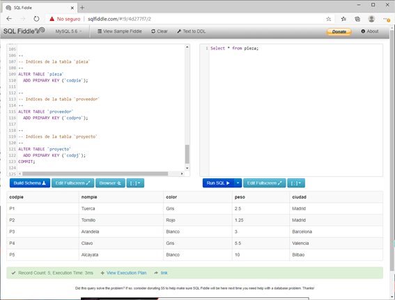

Nombres de los proveedores que han vendido la pieza p2.

select nompro from proveedor, ventas where proveedor.codpro=ventas.codpro and codpie='P2';

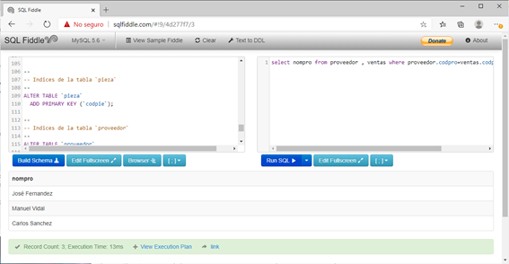

Nota: Si queremos que los nombres salgan ordenados, utilizaremos la claúsula order by:

select nompro from proveedor, ventas where proveedor.codpro=ventas.codpro and codpie='P2' order by nompro;

Ciudades donde hay un proyecto:

Select distinct ciudad from proyecto;

Nota: utilizamos distinct para que no se repitan las ciudades.

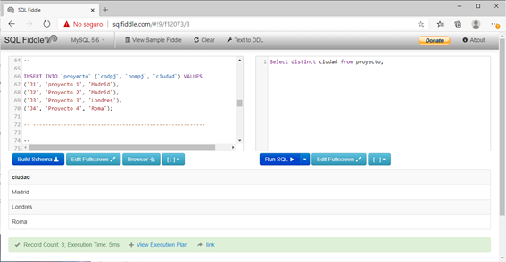

Códigos de los proveedores que suministran al proyecto 'J1'.

Select codpro from ventas where codpj='J1';

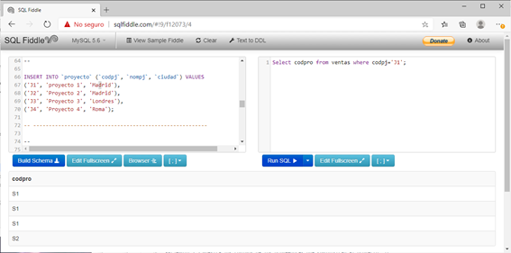

Piezas de Madrid que son grises o rojas.

select nompie from pieza where ciudad='Madrid' and color='Gris' or color='Rojo';

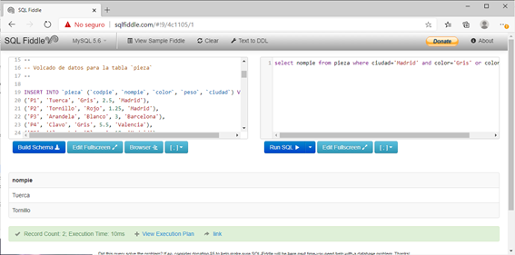

Ventas con cantidad entre 200 y 300, ambos inclusive.

select codpro, codpie, codpj from ventas where cantidad between 200 and 300;

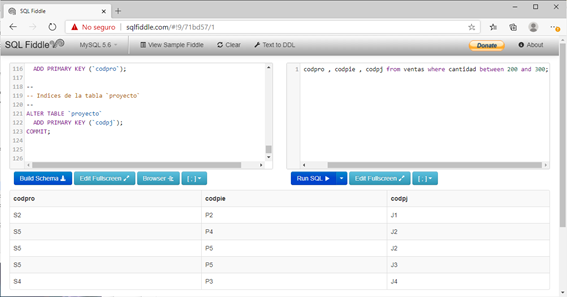

Piezas cuyo nombre contiene la palabra "tornillo", sin importar si está escrita con mayúsculas o minúsculas.

select nompie from pieza where lower(nompie) like '%tornillo%';

La función lower() convierte todos los nombres de las piezas a minúsculas antes de buscar, por lo que la consulta mostrará cualquier pieza que tenga "tornillo" en su nombre, independientemente de cómo esté escrita en la base de datos.

En el caso de los datos actuales, solo aparece una pieza cuyo nombre contiene la palabra "Tornillo".

Piezas vendidas por proveedores cuya ciudad es Madrid.

select DISTINCT pieza.nompie from ventas, pieza, proveedor where (ventas.codpro=proveedor.codpro and ventas.codpie=pieza.codpie and proveedor.ciudad='Madrid');

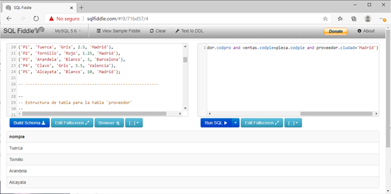

Ciudad y códigos de las piezas suministradas a cualquier proyecto. Por un proveedor que esté en la misma ciudad donde esté el proyecto.

select DISTINCT pieza.ciudad, pieza.codpie from ventas, pieza, proveedor, proyecto where (ventas.codpro=proveedor.codpro and ventas.codpie=pieza.codpie and ventas.codpj=proyecto.codpj and proveedor.ciudad=proyecto.ciudad);

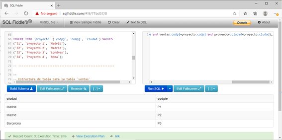

Nota: En el resultado se muestra la ciudad de producción de la pieza, no la ciudad del proveedor ni del proyecto.

Piezas vendidas por proveedores de Madrid. El operador IN facilita la consulta.

select distinct codpie from ventas where codpro in (select codpro from proveedor where ciudad='Madrid');

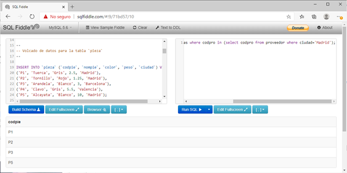

Proyectos que están en una ciudad donde se fabrica alguna pieza.

select * from proyecto where ciudad in (select ciudad from pieza);

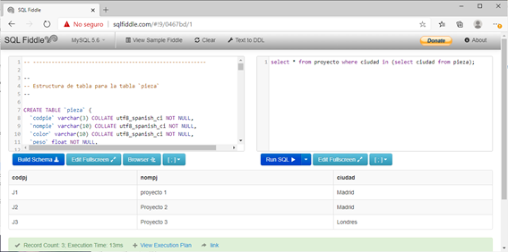


### Pieza de menor peso

select * from pieza where peso <= all (select peso from pieza);

o también

select codpie from pieza where peso = (select min(peso) from pieza);

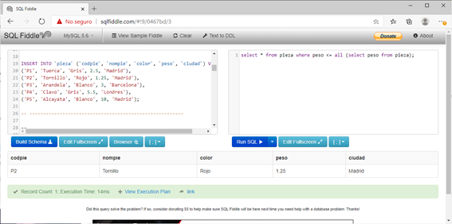


Número de envíos con más de 300 unidades.

select count(*) from ventas where cantidad>300;

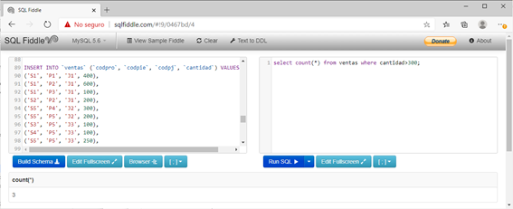

Nombres de proveedores tales que el total de sus ventas superen la cantidad de 800 unidades.

select proveedor.nompro, sum(cantidad) from proveedor, ventas

where proveedor.codpro=ventas.codpro 

group by nompro 

having sum(cantidad) >800;

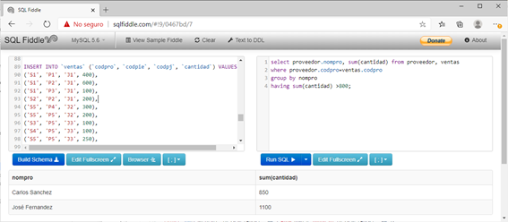

### Máxima cantidad vendida para cada pieza

select codpie, max(cantidad) from ventas group by codpie;

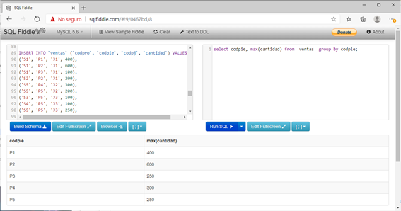

Cantidad de piezas vendidas agregadas por código de pieza y proyecto

Select sum(cantidad) 'cantidad agregada', codpie,codpj from ventas group by codpj, codpie;

Nota: Con ‘cantidad agregada’ damos nombre a la columna, de lo contrario el título sería ‘sum(cantidad)’

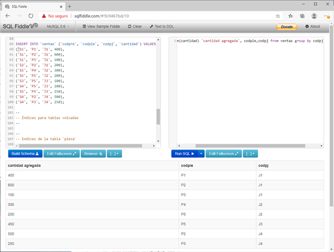

Cantidad media de piezas suministrada a aquellos proveedores que venden la pieza P3.

select codpro,avg(cantidad) 'media' from ventas where (codpie='P3') group by codpro;

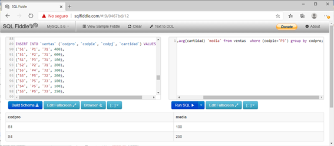


> Recuerda

- A partir de la necesidad de almacenar grandes cantidades de datos, las industrias desarrollaron un sistema de bases de datos automatizado, para su posterior consulta.
- Entendemos una base de datos como un almacén de información donde se organizan los datos de manera que luego podamos acceder a ellos lo más rápidamente posible.
- Los datos han sido y serán la parte más importante de cualquier organización y hay que preservarlos y gestionarlos debidamente para un buen funcionamiento del sistema.
- Como los usuarios de una base de datos no tienen por qué conocer cómo están organizados y almacenados los datos, ésta tiene que presentar los datos de forma que el usuario pueda interpretarlos y modificarlos.
- DML(Data Manipulation Language) es el lenguaje que permite a los usuarios, por medio de consultas, operar con los datos de la base de datos.
- Un Sistema Gestor de Base de Datos(DBMS, siglas en inglés de Data Base Management System) es un conjunto de herramientas ideadas para gestionar las bases de datos. Se compone de un lenguaje para definición de bases de datos(DDL) y otro para manipulación de los datos(DML), usando para ello el lenguaje de consultas SQL.
- La persona responsable de gestionar el correcto funcionamiento de la base de datos y de los usuarios que la manipulan es el administrador de la base de datos(DBA, siglas en inglés de Data Base Administrator).
- El usuario de una base de datos es toda aquella persona que, de manera consciente o inconsciente, interactúa con la base de datos.
- Una base de datos está compuesta, esencialmente, por tablas. Tablas entre las que pueden existir una serie de relaciones que definirán el tipo de estructura de la base de datos.
- El modelo entidad-relación, nos proporciona un método de modelado de datos basado en la representación de entidades, u objetos, diferenciados claramente entre sí.
- Las entidades representadas en el diagrama entidad-relación, hacen referencia a objetos, de la vida real o abstractos, diferenciados unívocamente entre sí, con una serie de propiedades o atributos.
- La propiedad que identifica una ocurrencia de un objeto en concreto, de las demás ocurrencias de ese mismo objeto, se llama atributo identificados o ID.
- Los atributos de un objeto son aquellas características propias de la entidad que la identifican y definen.
- Con restricción de integridad nos referimos a uno de los aspectos más importantes a la hora de mantener la consistencia de los datos en una base de datos.
- Un dominio, dicho de otra forma, es una restricción impuesta a un determinado atributo, determinándolo a estar encuadrado en una escala de valores.
- La cardinalidad indica el grado de participación de cada entidad en una relación.
- El lenguaje de consulta SQL (siglas en inglés de “Structured Query Language”, que significa "Lenguaje de Consulta Estructurado"), es el lenguaje más usado y estandarizado para acceder a bases de datos relacionales. A partir de la propuesta del modelo relacional nace, vinculado a éste, un sublenguaje de acceso a los datos, fundamentado en el cálculo de predicados.
- En SQL, el Lenguaje de Definición de Datos o DDL sirve para definir estructuras de almacenamiento, y por tanto para crear esquemas conceptuales.
- El diccionario de datos contiene información relevante o metadatos sobre los datos que se almacenan en la base de datos, y por tanto estos datos también se almacenarán como el resto de datos, en la propia base de datos, pero sólo el sistema o un usuario concreto podrá mantener estos datos.
- En general, podemos decir que la integridad de los datos se refiere a que los datos deben ser datos correctos y estar completos, englobando por supuesto las características de los datos como: definiciones, fechas, reglas que les afecten, etc.
- Entre las reglas de integridad del modelo podemos destacar:
    - Regla de unicidad de clave primaria, es decir, la clave primaria que se elija para una tabla debe ser única para cada registro, por tanto, no puede haber valores repetidos en el conjunto de valores de la clave primaria.
    - Regla de entidad de la clave primaria, que quiere decir que el valor nulo no puede ser un valor válido para la clave primaria.
    - Regla de integridad referencial, que quiere decir que los valores que tomen las claves externas tienen que ser valores que existan en la clave primaria a la que hacen referencia o ser nulos.
    - Regla de integridad de dominio, que a grandes rasgos se refiere a la definición del conjunto de posibles valores que puede tomar un determinado campo de una tabla y los operadores que pueden operar con dichos valores. Esto determinará la integridad del dominio del campo.