# Bases de Datos NOSQL y el Almacenamiento Escalable

## Introducción
Las bases de datos NoSQL representan una evolución frente a los sistemas relacionales tradicionales, diseñadas para gestionar grandes volúmenes de información y estructuras de datos diversas. Estas bases ofrecen flexibilidad y escalabilidad horizontal, permitiendo un rendimiento eficiente en entornos distribuidos y de alta disponibilidad. NoSQL no significa “sin SQL”, sino “Not Only SQL”, reflejando la posibilidad de emplear distintos modelos de datos según las necesidades de la aplicación. Entre estos modelos destacan los de documentos, grafos, clave-valor y columnas, cada uno adaptado a distintos escenarios de uso. Se utilizan ampliamente en aplicaciones web, redes sociales, comercio electrónico y Big Data, donde la rapidez y la adaptación son esenciales. 

Las bases NoSQL permiten gestionar datos heterogéneos, con consistencia eventual y estructuras implícitas que facilitan la integración con programas. Asimismo, ofrecen estrategias de distribución como fragmentación y replicación, garantizando disponibilidad y tolerancia a fallos. El teorema CAP es un marco clave para entender las decisiones de diseño y priorización entre consistencia y disponibilidad. Finalmente, NoSQL se ha consolidado como una alternativa versátil frente a los desafíos de la era digital y del procesamiento de datos masivos.

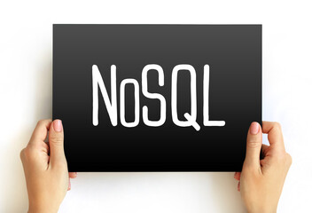

## Objetivos
- Comprender el concepto de base de datos NoSQL.
- Diferenciar las bases de datos relacionales de las NoSQL.
- Entender su funcionamiento y los tipos de bases de datos NoSQL que hay.

## Mapa Conceptual

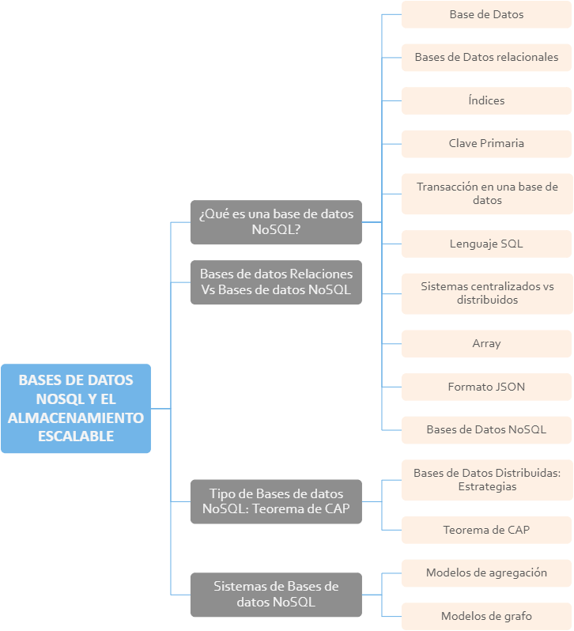

## 1. ¿Qué es una base de datos NoSQL?

Las bases de datos NoSQL son sistemas de almacenamiento y gestión de datos que surgieron como alternativa a las bases de datos relacionales tradicionales, especialmente para responder a las necesidades de grandes volúmenes de información, alta velocidad de procesamiento y estructuras de datos no siempre bien definidas. A diferencia del modelo relacional, que organiza los datos en tablas y requiere esquemas rígidos, las bases de datos NoSQL ofrecen mayor flexibilidad, escalabilidad y rendimiento al trabajar con información distribuida en diferentes servidores.

El término NoSQL no significa ausencia total de SQL, sino “Not Only SQL”, lo que refleja su capacidad de manejar datos con enfoques diferentes. Dentro de este tipo de bases se encuentran varios modelos, entre los más destacados: las bases de datos de documentos, que almacenan información en estructuras tipo JSON o XML; las bases de datos de grafos, diseñadas para analizar relaciones complejas entre entidades; las clave-valor, que permiten accesos muy rápidos a datos simples; y las orientadas a columnas, útiles para grandes volúmenes de información analítica.

Estas bases de datos son ampliamente utilizadas en aplicaciones web, redes sociales, comercio electrónico, sistemas de recomendación y entornos de Big Data, donde la rapidez y la capacidad de adaptación resultan críticas. Entre los sistemas más conocidos se encuentran MongoDB, Cassandra, Redis y Neo4j.

> Importante
En conclusión, las bases de datos NoSQL representan una solución eficiente y flexible para los retos actuales del manejo de datos masivos y heterogéneos, aportando herramientas adaptadas a las demandas de la era digital.

### 1.1. Base de Datos
Se llama base de datos a un repositorio donde se almacenan datos relacionados y desde donde se pueden también recuperar. Deben poder ser usadas desde diferentes programas y por distintos usuarios. Cada base de datos se compone de una o más tablas que guarda un conjunto de datos. Cada tabla está compuesta por una o más columnas y filas. Cada columna es un atributo o característica del dato que se guarda en la fila de la tabla. Cada fila conforma un registro.

> Ejemplo
Por ejemplo, en una empresa la tabla empleados se podría representar con la siguiente tabla:

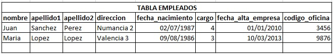

### 1.2. Bases de Datos relacionales
Es un tipo de base de datos que cumple con el modelo relacional que garantiza la unicidad de registros, la integridad referencial y la normalización.

Siguiendo el ejemplo anterior, podríamos tener además la tabla de oficinas:

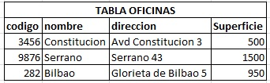

> Importante
Donde el campo código es el mismo que se encuentra en la tabla EMPLEADOS como codigo_oficina, así ambas tablas están relacionadas.

### 1.3. Índices
Un índice de una base de datos es una estructura de datos que sirve para mejorar la velocidad de las operaciones, por medio de un identificador de cada fila de una tabla y permite así un rápido acceso a los registros de una tabla en una base de datos. Pueden contener una o varios atributos es decir columnas.

Los índices pueden construirse sobre una o varias columnas de la tabla, lo que permite optimizar diferentes tipos de consultas. Cuando se utilizan varios atributos, se crean índices compuestos que facilitan búsquedas que involucren más de un criterio al mismo tiempo, haciendo más eficientes las operaciones de filtrado y ordenación. Además de acelerar la recuperación de datos, algunos índices cumplen funciones adicionales. 

> **Ejemplo:** Por ejemplo, los índices únicos evitan la duplicidad de valores en columnas específicas, garantizando la integridad de la información. Otros tipos de índices, como los basados en árboles o tablas hash, están diseñados para optimizar distintos patrones de consulta según el tipo de base de datos y la estructura de los datos.

### 1.4. Clave Primaria
La clave primaria de una tabla en una base de datos es un índice que es único, es decir identifica de forma unívoca cada fila de la tabla. Puede contener una o varias columnas de la tabla.

> **Para saber más:** Además, la clave primaria garantiza la integridad de los datos, evitando que se inserten registros duplicados y asegurando que cada fila tenga una identidad propia dentro del sistema. Esto permite mantener relaciones consistentes entre distintas tablas.

También facilita la eficiencia en las búsquedas y operaciones, ya que los sistemas de gestión de bases de datos utilizan la clave primaria como referencia principal para localizar registros de manera rápida. Gracias a ello, procesos como consultas, actualizaciones y eliminaciones se realizan de forma más ágil.

Por último, la clave primaria suele emplearse para establecer relaciones con otras tablas mediante claves externas, lo que permite estructurar la información en un modelo relacional coherente y bien organizado. Esto contribuye a mantener la lógica interna y la calidad del diseño de la base de datos.

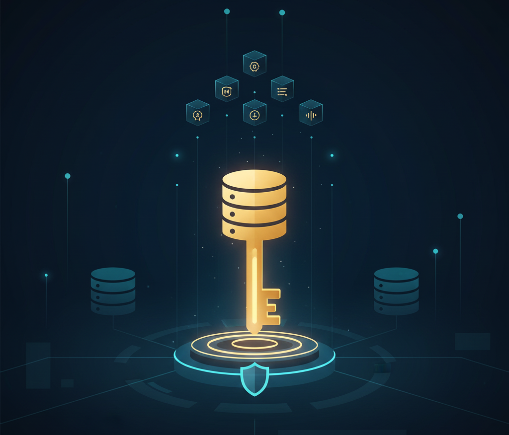

### 1.5. Transacción en una base de datos
Es un conjunto de órdenes que se han de ejecutar como una única unidad o un único trabajo. Si una de las órdenes falla ninguna se llevará a cabo finalmente. Es condición necesaria que todas y cada una de las órdenes se ejecute correctamente. Por ejemplo, se tienen las siguientes órdenes:

1. Actualizar un dato en la tabla A.
2. Añadir una nueva fila a la tabla B.
3. Eliminar una fila en la tabla C.
4. Actualizar un dato en la tabla N.

> **Para saber más:**  Si están dentro de la misma transacción, es decir antes de ejecutar la primera abrimos una transacción BEGIN_TRANS en la base de datos y se ejecuta una y a continuación la siguiente etc. y cada una finaliza bien, finalmente al cerrar la transacción COMMIT_TRANS se transmite a la base de datos que todo ha ido bien. Si alguna de las órdenes falla, se producirá un ROLLBACK_TRANS y se transmitirá a la base de datos que algo ha ido mal y que vuelva al punto inicial antes de abrir la transacción. Es muy útil para mantener la consistencia de datos en una base de datos.

### 1.6. Lenguaje SQL
El lenguaje SQL es el estándar para la definición, manipulación y control de bases de datos relacionales. Es declarativo con el que solo hay que indicar qué se quiere hacer. Es un lenguaje muy parecido al lenguaje natural. Por estas razones, y como lenguaje estándar, el SQL es un lenguaje con el que se puede acceder a todos los sistemas relacionales comerciales. 

Siguiendo el ejemplo anterior, si quisiéramos saber el nombre de los empleados que trabajan en la oficina 3456:

Select nombre from EMPLEADOS where codigo_oficina = 3456.

Y nos devolvería ‘Juan’.

### 1.7. Sistemas centralizados vs distribuidos
Un sistema distribuido es un conjunto de elementos (o nodos, es decir pc’s), interconectados a través de una red, que son capaces de ejecutar programas. Estos elementos cooperan en la realización de una serie de tareas que tienen asignadas. Desde el punto de vista del usuario, el sistema se percibe como una sola unidad.

Un sistema centralizado es aquel que se encuentra implementado en un único pc.

Las ventajas de un sistema distribuido con relación a uno centralizado son:

1. Económico: es menos costoso añadir más pc’s con poca capacidad de procesamiento que añadir más capacidad a un pc.
2. Velocidad.
3. Confiabilidad y disponibilidad.
4. Flexibilidad.

Finalmente, un sistema distribuido en comparación a uno centralizado facilita el crecimiento de una organización de acuerdo con sus necesidades. Esto puede ser interesante en el caso de start-ups y de compañías que esperan ratios de crecimiento a medio plazo. También es especialmente útil en el caso de empresas que tienen que gestionar una cantidad masiva de datos que están distribuidos en cientos e incluso miles de nodos. 

> **Para saber más:** A pesar de las ventajas descritas, un sistema distribuido puede imponer ciertos retos, especialmente en el desarrollo de aplicaciones como sería, por ejemplo, la necesidad de coordinación, la depuración de errores o la resolución de los problemas derivados de situaciones de fallo.

### 1.8. Array
Son frecuentemente usados en programación y todo lenguaje de programación permite la creación y uso de arrays por su utilidad. Simplemente son lista de datos. 

> **Ejemplo:** Por ejemplo un array llamado frutas podría ser:
frutas= [melocotón, sandía, melón, uva, fresa, manzana]

Los distintos lenguajes de programación permiten operaciones sobre ellos como añadir elementos, copiar o duplicar el array, eliminar un elemento, eliminar el array etc.

### 1.9. Formato JSON

**JSON (JavaScript Object Notation)** es un formato de datos que se caracteriza por:

- Está basado en JavaScript.
- Es utilizado para el intercambio de datos.
- Es utilizado por muchas APIs (Interfaz de Programación de Aplicaciones, es el conjunto de funciones, rutinas, métodos etc...) de sitios web tales como Facebook, Twitter, etc. para devolver su contenido.
- Es independiente del lenguaje.
- Los archivos tienen extensión .json
- Representa los datos en pares clave-valor.

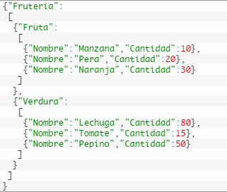

> **Ejemplo:** Por ejemplo, dentro de frutería hemos almacenado dos arrays donde el primero contiene el objeto Fruta y el segundo, Verdura. Dentro de Fruta tenemos un array con los atributos nombre y cantidad y lo mismo para el objeto Verdura. De esta forma podríamos guardar la información de una frutería.

Consideremos el siguiente ejemplo dónde se quiere representar la ficha de un estudiante con sus datos personales y asignaturas matriculadas:

- Nombre=“Pepito Pérez”.
- DNI=“517899R”.
- Edad=“22”.
- Asignaturas matriculadas:
    - Obligatorias: Sistemas Operativos, Compiladores, y Bases de Datos.
    - Optativas: Bases de Datos NoSQL, Minería de Datos, Programación Lógica.
    - Libre Elección: Ajedrez, Música Clásica

La ficha de información se puede representar en un documento JSON de la siguiente manera:

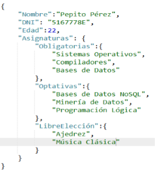

### 1.10. Bases de Datos NoSQL
Desde finales de los años 90 y actualmente también es válido este contexto. Cada vez más empresas y personas se conectan a Internet, aumentando con ello tanto los usuarios que acceden a la red como los servicios que a través de ella se ofrecen. Desde entonces ha aumentado considerablemente el volumen de datos generado en la red. El gestionar este gran volumen de datos ha tenido la importante consecuencia de generar importantes avances en el desarrollo de sistemas altamente distribuidos como, por ejemplo, técnicas MapReduce que veremos más adelante. Para procesar este gran volumen de datos, la visión clásica de guardar los datos de forma centralizada, es decir en un único espacio físico que ofrecen las bases de datos tradicionales no es ni óptimo ni eficiente y son necesarios otros modelos que soporten la distribución de datos de forma masiva.

Otro hecho motivador es la generación de aplicaciones en la red Internet que ofrecen servicios a un número no determinado y muy difícil de prever a priori de usuarios. Y además estas aplicaciones deben responder rápidamente, con independencia de:

- La ubicación del usuario.
- El número de usuarios conectados al servicio.
- La hora del día.

> **Importante:** También, deben evitar que un fallo del sistema deje sin servicio a un gran número potencial de usuarios con lo que deben ser sistemas con una alta disponibilidad.

También, deben evitar que un fallo del sistema deje sin servicio a un gran número potencial de usuarios con lo que deben ser sistemas con una alta disponibilidad.

Una vez analizados los hechos que favorecieron la creación de las bases de datos NoSQL procede responder a…

**… ¿Qué es NoSQL?**

Una base de datos NoSQL es aquella base de datos que no requiere estructuras de datos fijas como tablas; no garantizan completamente las características ACID (ver apartado Teorema CAP más adelante) y escalan muy bien horizontalmente. Se utilizan en entornos distribuidos que han de estar siempre disponibles y operativos y que gestionan un importante volumen de datos.

Veámoslo en detalle.

Las principales características de NoSQL son:

| CARACTERÍSTICAS DE LAS BASES DE DATOS NoSQL | | 
| --- | --------------------------------------- |
| 1 | El lenguaje de consultas no tiene por qué ser SQL.|
| 2 | Tratamiento de datos heterogéneos. |
| 3 | Propiedades ACID no están garantizadas. |
| 4 | Mayor coherencia entre los datos de programas y bases de datos. |
| 5 | Diseñadas para ser escalables generalmente de forma horizontal. |
| 6 | Generalmente son distribuidas. |
| 7 | Frecuentemente son de código abierto. |

1. El lenguaje estándar no tiene por qué ser SQL: hay varios tipos de bases de datos NoSQL y cada una con su lenguaje de consultas específico. En algunos casos el lenguaje es SQL pero que incluye extensiones específicas para NoSQL. Esto facilita el acceso a estas bases de datos a gente que sepa utilizar SQL.
2. El esquema de datos es flexible o no tienen un esquema predefinido: eso quiere decir que se pueden añadir datos sin definir previamente el tipo de estos, como se hace en el modelo relacional donde primero se define qué tipo de dato se va a guardar. Este hecho, por un lado, facilita y mucho el tratar datos heterogéneos, son base de datos muy flexibles pero por otro lado dificulta su programación haciendo que la gestión de los tipos de datos se haga directamente en el código de los programas que acceden a la base de datos. Uno de los riesgos de que el esquema quede implícito es que se compromete la independencia de los datos, uno de los pilares sobre los que se sostiene el desarrollo de las bases de datos relacionales.
3. Las propiedades ACID (ver apartado Teorema CAP más adelante) de las transacciones (Atomicidad, Consistencia, Aislamiento y Durabilidad) no siempre están garantizadas como ocurre en las bases de datos relacionales pero se hace con el objetivo de mejorar el rendimiento y aumentar la disponibilidad.
4. Reducen problemas de falta de concordancia entre las estructuras de datos usadas en los programas y las bases de datos. Es decir, el formato en que se guarda la información en las bases de datos es cercano al formato utilizado en los programas que acceden a ella.
5. Están diseñadas para crecer, es decir que sean escalables, generalmente de forma horizontal (escalabilidad horizontal), mediante la fragmentación de los datos y la existencia de copias idénticas de los datos en múltiples servidores. Se pueden ejecutar en máquinas con pocos recursos y costes reducidos ya que no requieren mucha computación con lo que para aumentar el rendimiento se añaden más máquinas de bajo coste, es decir más nodos.
6. Son generalmente distribuidas.
7. Son de código abierto y tienen unas grandes comunidades de desarrollo detrás.

Por otro lado, las características de las aplicaciones que usan bases de datos NoSQL suelen ser las siguientes:

| CARACTERÍSTICAS DE LAS APLICACIONES QUE USAN BASES DE DATOS NoSQL | | 
| --- | --------------------------------------- |
| 1 | Trabajan con datos cuyo origen y formato es variable.|
| 2 | Trabajan con datos muy relacionados. |
| 3 | Necesidad de una mayor capacidad analítica. |
| 4 | Mayor volumen de datos. |
| 5 | Mayor disponibilidad y flexibilidad. |
| 6 | Trabajan en tiempo real. |

1. El esquema de los datos es variable y es muy costoso de gestionar con bases de datos relacionales. Como ejemplo, las aplicaciones que gestionan datos con múltiples orígenes y formatos, un comparador de precios online.
2. Los datos están muy relacionados por ejemplo en Facebook.
3. Actualmente los sistemas de DataWarehousing necesitan una capacidad analítica más potente ya que se utilizan más datos, los de la competencia, por ejemplo o los provenientes de las redes sociales, por lo que difícilmente se puede implementar en una base de datos relacional.
4. Trabajan con grandes volúmenes de datos por ejemplo, las redes sociales.
5. Necesitan garantizar la disponibilidad y flexibilidad ya que por ejemplo, una tienda online fuera de línea o que tarda demasiado en atender a un cliente no realizará la venta. Estas situaciones son muy peligrosas y hay que evitarlas debido a la gran competencia existente en Internet.
6. Tienen la necesidad de que los datos se procesen en tiempo casi real. Por ejemplo, en aplicaciones de bolsa, los brókeres deben tener información fiable e inmediata, que les permita tomar las decisiones al momento.

Como se deduce de este apartado y de esta unidad una vez finalizada, las Bases de datos NoSQL ofrecen otras opciones para unos escenarios de aplicaciones específicos, es decir no todos los escenarios actuales pueden ser resueltos con una solución basada en una base de datos relacional.

Más correctamente debieran ser llamadas como NoREL (Not Only Relational) pero el término NoSQL está ya ampliamente aceptado.

La gran fuerza de las bases de datos NoSQL reside en su diversidad, en el gran abanico de soluciones que ofrecen. Cada una ofrece diferentes soluciones según el problema sea el coste, el escalamiento, el rendimiento, el modelado de los datos etc.

## 2. Bases de datos Relaciones Vs Bases de datos NoSQL
Las bases de datos relacionales se diferencian de las bases de datos NoSQL principalmente en los siguientes puntos:

- No hay un modelo de datos único: El modelo relacional ofrece una visión uniforme de los datos, la relación, mientras que las bases de datos NoSQL engloban a muchos modelos de datos. La existencia de diferentes modelos de datos causa la existencia de diferentes familias de bases de datos NoSQL.
- En el modelo relacional es necesario definir, a priori, un esquema conceptual que indique qué datos hay, cómo se estructuran, que atributos poseen y como se relacionan. Eso no es necesario en la mayoría de modelos NoSQL. Tienen otros sistemas de almacenamiento como grafos, sistemas clave-valor etc. Las implicaciones de ello es que los modelos NoSQL no disponen de independencia de datos y existe la dificultad de definir restricciones de integridad en la base de datos. Es decir, como ya hemos visto el usuario o programa que maneja la base de datos es el encargado de interpretar y gestionar los datos. Por otro lado, la ventaja es que el proceso de datos heterogéneos es más simple en las bases de datos NoSQL.
- No suelen permitir operaciones JOIN (búsqueda de datos entre varias tablas) ya que al manejar tan grandes volúmenes de datos el coste puede ser muy alto.
- No utilizan el lenguaje SQL en general. Por ejemplo Cassandra utiliza CQL, MongoDB utiliza JSON o Big Table utiliza GQL.
- Las bases de datos relacionales están entre nosotros desde hace muchos años, lo que ha facilitado la creación de estándares, por ejemplo, el lenguaje SQL. Esto aún no ha sido así para las bases de datos NoSQL.

> **Importante:** Aunque estas diferencias son ciertas para la mayoría de bases NoSQL, hay multitud de bases de datos y cada una de ellas tiene funcionalidades distintas. Por tanto, se debería tomar lo dicho hasta ahora simplemente como una guía general, que puede ser más o menos cierta dependiendo del producto NoSQL a considerar.

## 3. Tipo de Bases de datos NoSQL: Teorema de CAP
Una de las características de las bases de datos NoSQL es que generalmente son distribuidas. Esta característica nos lleva a introducir dos conceptos fundamentales para entender mejor tanto el funcionamiento como el ser capaces en un momento dado de para un entorno o para las necesidades de una aplicación, elegir el sistema de bases de datos NoSQL más adecuado. El primer concepto se refiere a cómo se pueden distribuir las bases de datos, es decir, qué estrategias son las que se aplican de forma más común. Y, el segundo concepto, lleva al Teorema de CAP que explica la razón de los tipos de bases NoSQL que hay actualmente.

El Teorema de CAP establece que un sistema distribuido no puede garantizar simultáneamente consistencia, disponibilidad y tolerancia a particiones. Esto implica que, ante fallos en la comunicación entre nodos, el sistema debe priorizar algunos de estos elementos sobre otros, lo que origina distintas arquitecturas de bases NoSQL según la necesidad principal de la aplicación.

El Teorema de CAP, formulado por Eric Brewer y posteriormente demostrado formalmente, indica que en un sistema distribuido solo se pueden garantizar dos de las tres propiedades:

1. **Consistencia (Consistency):** Todos los nodos del sistema ven la misma información al mismo tiempo. Después de una operación de escritura, cualquier lectura devuelve el último valor escrito. Esto es esencial en sistemas donde los datos deben ser exactos y coherentes, como bancos o sistemas de inventario estrictos.
2. **Disponibilidad (Availability):** El sistema siempre devuelve una respuesta válida, independientemente de que algún nodo esté fallando. La prioridad está en responder rápidamente, aunque la respuesta pueda no reflejar la actualización más reciente.
3. **Tolerancia a particiones (Partition Tolerance):** El sistema sigue funcionando aunque haya fallos de comunicación entre nodos. Como las particiones de red son inevitables en entornos distribuidos, esta propiedad es obligatoria: cualquier sistema distribuido real debe soportar particiones.

En este video te voy a explicar qué es el Teorema de CAP y porqué es importante. 

CAP es un acrónimo de Consistency, Availability y Partition Tolerance que traducido al español son Consistencia, Disponibilidad y Tolerancia al particionado.
El teorema de CAP dice que es imposible, para un sistema distribuido, garantizar simultáneamente más de dos de estas características.

Voy a explicar brevemente en qué consiste cada una.
Por un lado, la consistencia (C) hace referencia a que todos los nodos deben ver los mismos datos al mismo tiempo. Es decir, cualquier cambio realizado en los datos del sistema se deben aplicar en todos los nodos y deben ser los mismos datos en todos. Esto se llama consistencia atómica y se consigue aplicando la información en todos los nodos
La Disponibilidad (A) por su parte garantiza que cada petición a un nodo reciba una respuesta por parte del nodo consultado.
Por último, la Tolerancia al Particionado (P) hace referencia a que el sistema debe funcionar a pesar de que los nodos tengan un fallo de comunicación, garantizando la disponibilidad a pesar de que un nodo se separe del grupo sin importar la causa.

Como en los sistemas distribuidos no es posible cumplir estas 3 características al mismo tiempo, se pueden producir alguna de las siguientes combinaciones:
*imagen 1*
 
En primer lugar, tenemos la opción CP, es decir, consistencia y tolerancia a la partición. En este caso el sistema aplicara los cambios de forma consistente y aunque se pierda la comunicación entre nodos ocasionando el particionado, pero no se asegura la disponibilidad entre los nodos
Algunos ejemplos de sistemas con esta combinación pueden ser HBase, MongoDB o Redis.
En segundo lugar, está AP que sería disponibilidad y tolerancia a la partición. Para este caso el sistema siempre estará disponible a las peticiones, aunque se pierda la comunicación entre los nodos ocasionando el particionado. En consecuencia, por la pérdida de comunicación existirá inconsistencia porque no todos los nodos serán iguales
Ejemplos de sistemas gestores de bases de datos AP son Cassandra, CouchDB o DynamoDB.
La última combinación posible es CA que sería consistencia y disponibilidad. Aquí, el sistema siempre estará disponible respondiendo a todas las peticiones y los datos procesados serán consistentes. Sin embargo, en esta combinación, no se puede permitir el particionado.
Para esta última opción, algunos ejemplos son MySQL, MariaDB o PostgreSQL.

**CONCLUSIÓN**

Aunque es cierto que en entornos Big Data hay que hacer frente a grandes volúmenes de información y se debe garantizar la flexibilidad, es necesario tener en cuenta el Teorema de CAP para elegir una base de datos que se adapte a las diferentes exigencias de cada empresa u organización. 
Por ejemplo, si deseamos procesar y almacenar las transacciones de una entidad bancaria, normalmente nos interesará una base de datos que asegure la consistencia de los datos y la tolerancia a particiones, siendo una opción muy interesante MongoDB o Redis.
El problema es que la elección entre una u otra de estas características puede no ser fácil ni lógica, por lo que es necesario conocer el funcionamiento de un sistema distribuido y los diferentes escenarios del teorema CAP.

### 3.1. Bases de Datos Distribuidas: Estrategias
Las bases de datos distribuidas son el resultado de combinar el concepto de base de datos y el concepto de redes de ordenadores.

Una base de datos distribuida no es más que un conjunto de múltiples bases de datos (lógicamente interrelacionadas) que están distribuidas en varios ordenadores. Estas bases de datos están gestionadas por un software específico que hace la distribución de los datos transparente a los usuarios. Es decir, los usuarios creen trabajar con una base de datos que es única, es decir se comporta como si fuese centralizada.

> **Importante:** El uso de sistemas distribuidos es útil por diversos motivos. En primer lugar, el procesamiento distribuido se ajusta a la estructura de muchas organizaciones que por ejemplo se encuentran geográficamente dispersas como aplicaciones de e-commerce. En segundo lugar, un sistema distribuido permite mejorar el rendimiento, la disponibilidad y la capacidad de crecimiento. El rendimiento mejora debido al reparto de tareas entre los nodos. Por otro lado, si una situación de fallo causa que algún nodo no esté operativo, ello no significa que globalmente el sistema no lo esté. Una plataforma de e-commerce por ejemplo, Amazon no puede estar caída durante horas, dado que eso implicaría una pérdida importantísima de ingresos y prestigio.

Hay varias estrategias para implementar la distribución en una base de datos.

La fragmentación se basa en la idea de que las aplicaciones (y, por lo tanto, los usuarios), en general, no necesitan acceder a toda la base de datos, sino que están interesados en acceder a subconjuntos de la misma. Por lo tanto, el objetivo de la fragmentación es encontrar la unidad de acceso a los datos más apropiada para cada dominio de aplicación. Dicha unidad se denomina fragmento y se convierte en la unidad de distribución entre los diferentes nodos que forman la base de datos distribuida. Existen tres tipos de fragmentación:

- La fragmentación horizontal toma conjuntos de datos relacionados como unidad de distribución. Por ejemplo se podrían dividir los datos de oficinas en dos fragmentos, aquellos que cumplan la condición superficie menor que 1500 y aquellos con superficie mayor o igual a 1500.

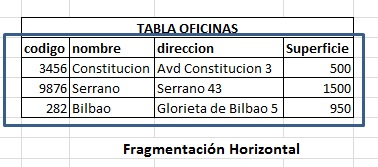

- La fragmentación vertical consiste en usar grupos de atributos de los objetos y los datos asociados a ellos como unidad de distribución. Por ejemplo dividir la relación Oficinas en (código, nombre, dirección) y en (código, superficie)

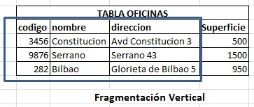

- La fragmentación híbrida combina la fragmentación horizontal y vertical.

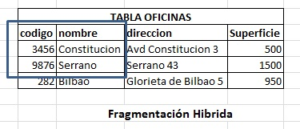

La segunda estrategia de distribución es la replicación. Esta consiste en almacenar todos o una parte de los fragmentos en más de un nodo. Esto permite maximizar la disponibilidad de los datos pero es necesario garantizar la consistencia de las réplicas. La consistencia se refiere a que todas las réplicas de unos mismos datos deben contener los mismos valores. La gestión de la consistencia de las réplicas se puede implementar de manera:

- Síncrona o asíncrona, es decir los cambios se propagan al momento o en diferido.
- A través de una réplica destacada o primaria: se hacen los cambios en la primaria y luego se propagan al resto (replicación máster-slave o maestro-esclavo), o sin replica destacada en cuyo caso todas las réplicas son iguales (replicación P2P).

En consecuencia a la hora de implementar la distribución en una base de datos podemos optar por usar:

- Únicamente fragmentación, entonces la base de datos se divide en fragmentos que se distribuyen entre los diferentes nodos, pero ningún fragmento estará replicado.
- No fragmentar la base de datos pero sí replicarla.
- Utilizar una combinación de ambas estrategias. Esta última acostumbra a ser la elección habitual en el caso de una base de datos distribuida.

| FRAGMENTACIÓN | REPLICACIÓN |
|---- | ---- |
| + Permite acceder a los datos donde se necesiten | + Permite acceder a los datos donde se necesiten |
| + Incrementa la concurrencia y facilita el paralelismo | + Incrementa la disponibilidad de los datos |
| - El rendimiento empeora cuando hay que recuperar varios fragmentos de diferentes nodos | + Mejora la eficiencia de las operaciones de consulta |
| - El control de los datos se puede complicar | - La inserción y actualización de datos es menos eficiente |
| | - Todas las réplicas de un mismo objeto deben ser idénticas |

### 3.2. Teorema de CAP
Cuando se acomete el desarrollo de un sistema distribuido es necesario tener en cuenta el teorema CAP. El profesor Eric Brewer introdujo el teorema CAP en una charla invitada de un congreso de computación distribuida. Brewer comentó que las propiedades de un sistema distribuido son la Consistencia, la Disponibilidad y la Tolerancia a particiones (acrónimo CAP).

El teorema trata de las tres características que son deseables que un sistema distribuido pueda verificar. Estas características son:

1. **Consistencia (C onsistency):** Que se relaciona con la existencia de réplicas y que exige que los usuarios del sistema puedan recuperar siempre los mismos valores para unos mismos datos en un instante de tiempo determinado.
2. **Disponibilidad (A vailability):** Que exige que las peticiones de servicio enviadas por los usuarios a un nodo que está disponible deben obtener su debida respuesta.
3. **Tolerancia a particiones (P artition Tolerance):** Que exige que el sistema proporcione servicio a los usuarios a pesar de que se puedan producir situaciones de avería que causen que el sistema quede particionado en diferentes componentes.

> **Importante:** Desafortunadamente, en un sistema distribuido solo dos de estas propiedades pueden ser garantizadas de forma simultánea. Es decir, el teorema CAP establece que es imposible garantizar las tres a la vez en un sistema distribuido.

Dado que las bases de datos NoSQL están pensadas para trabajar en entornos altamente distribuidos, una exigencia es la capacidad de que el sistema, en conjunto, sea capaz de operar en presencia de particiones. Por lo tanto, deben cumplir la propiedad P. Es imprescindible garantizar la tolerancia a particiones. En consecuencia, la decisión se restringe a decidir que se desea priorizar, si la disponibilidad (la propiedad A) o la consistencia de los datos (la propiedad C).

- Si se elige AP el sistema siempre está disponible, aunque temporalmente puede mostrar datos inconsistentes en presencia de particiones. Un ejemplo de este tipo de bases de datos sería Cassandra o Riak.
- Por el contrario, si se elige CP el sistema siempre contiene una visión consistente de los datos, aunque no esté totalmente disponible en presencia de particiones. Un ejemplo de este tipo es MongoDB o Hbase.

Comentar que las bases de datos distribuidas relacionales son sistemas CA. Esto significa que la calidad del servicio se puede ver comprometida cuando el sistema se particiona (es la P del teorema CAP).

La última característica para examinar de las bases de datos NoSQL se relaciona con la gestión de transacciones. Como ya hemos visto, las bases de datos relacionales se basan en el modelo ACID. Una transacción incluye un conjunto de sentencias SQL que verifica las propiedades de atomicidad, consistencia, aislamiento y la durabilidad (ACID):

1. **Atomicidad (A tomicity):** Una transacción u operación consiste en una serie de pasos que o bien se ejecutan todos o ninguno.
2. **Consistencia (C onsistency):** La operación o transacción llevará a la base de datos de un estado valido a otro valido.
3. **Aislamiento (I solation):** Una transacción u operación no afecta a otras.
4. **Durabilidad (D urability):** Una vez realizada la transacción, persiste y no se puede deshacer.

Soportar un modelo de transacciones ACID en bases de datos que almacenan grandes volúmenes de datos, que están distribuidas y con replicación de datos es complejo y puede causar problemas de rendimiento.

Además, y relacionado con el teorema CAP, las bases de datos NoSQL de tipo AP (es decir, las que priorizan la disponibilidad de los datos sobre su consistencia) se basan en el modelo BASE. Este modelo trabaja con una noción de consistencia que se conoce como “consistencia final en el tiempo” y que se relaciona con la existencia de réplicas. En este modelo se espera que, pasado un cierto tiempo, sin cambios en unas mismas réplicas, todas las réplicas converjan a unos mismos valores. En el caso de conflictos que no puedan resolverse, se acepta que se puedan perder algunos datos.

Una de las características atribuidas a las bases de datos NoSQL es su versatilidad. Por ejemplo, MongoDB utiliza una variante de la replicación master-slave, maestro-esclavo, y que se denomina replica sets. Todas las escrituras sobre una réplica se realizan sobre la copia primaria y se propagan de forma asíncrona y eficiente (según sus especificaciones) al resto de réplicas (las secundarias). Las lecturas también se realizan sobre la copia primaria. En caso de fallo del máster, se elige otro de forma dinámica. A pesar de ello, MongoDB también permite que las aplicaciones puedan efectuar lecturas sobre las copias secundarias. En este caso no se garantiza que las operaciones de lectura devuelvan el valor más recientemente confirmado. En consecuencia, estaría exhibiendo un comportamiento similar a un sistema AP.

## 4. Sistemas de Bases de datos NoSQL
Bajo el nombre NoSQL conviven principalmente 2 familias de modelos de datos: los modelos de agregación y el modelo en grafo. Los modelos de agregación, a su vez, incluye tres modelos de datos: el clave-valor, el orientado a columnas y el orientado a documentos.

Comenzaremos hablando del modelo clave-valor, para el que el agregado es una caja negra. Este modelo es el menos expresivo de todos los modelos de agregación. Después avanzaremos en el modelo de agregación documental, donde los agregados son definidos mediante documentos, generalmente en formato XML, JSON o similar. Finalmente trataremos con el modelo agregado de columnas. Este modelo organiza los datos en primera instancia por filas y luego en columnas, permitiendo obtener una visión de los datos en forma de matriz, donde la clave permite identificar los agregados y las características o propiedades del agregado se representan mediante columnas y/o agrupaciones de columnas.

¿QUÉ SON LOS SISTEMAS GESTORES DE BASES DE DATOS NOSQL?

En primer lugar, hay que saber que es una base de datos no relacional o NoSQL. Es aquella base de datos que:

·         No requiere de estructuras de datos fijas como tablas

·         No garantiza completamente las características ACID

·         Escala muy bien horizontalmente.

Se utilizan en entornos distribuidos que han de estar siempre disponibles y operativos y que gestionan un importante volumen de datos.

Para la administración de este tipo de bases de datos, voy a indicar actualmente los principales sistemas gestores de bases de datos que se están usando. 

**MONGODB**   

Cuando hablamos de bases de datos NoSQL, el rey actualmente es MongoDB. Estamos ante el Sistema Gestor de Bases de Datos no relacionales más popular y utilizado hoy día.

Está orientado a ficheros y almacena la información en estructuras.

Empresas como Google, Facebook, eBay, Cisco o Adobe utilizan MongoDB diariamente.

 

**REDIS**

Redis está basado en el almacenamiento clave-valor. Se podría ver como un vector enorme que almacena todo tipo de datos, desde cadenas hasta hashses o listas.

El principal uso de este SGBD es para el almacenamiento en memoria caché y la administración de sesiones.

Empresas como Twitter, GitHub, Pinterest o Snapchat utilizan Redis.

CASSANDRA

Al igual que Redis, Cassandra también utiliza almacenamiento clave-valor. Es un Sistema gestor de bases de datos NoSQL distribuido y masivamente escalable.

Facebook, Twitter, Instagram, Spotify o Netflix utilizan Cassandra.

Además, dispone de un lenguaje propio para las consultas denominado CQL o Cassandra Query Language.

**OTROS SGBD NOSQL**

Otros Sistemas Gestores de bases de datos no relacionales muy utilizados son:

·         Azure Cosmos DB

·         RavenDB

·         ObjectDB

·         Apache CouchDB

·         Neo4j

·         Google BigTable

·         Apache Hbase

·         Amazon DynamoDB

**CONCLUSIÓN**

Para terminar, es importante entender que, para elegir el Sistema gestor de bases de datos NoSQL más adecuado, se debe comenzar por el estudio del tipo de datos que se van a almacenar y cómo se van a administrar buscando la opción que más se adapte a tus necesidades de acuerdo con la inversión a realizar, volumen de información a almacenar o tipo de consultas a realizar.

### 4.1. Modelos de agregación
En estos modelos de agregación lo primero que hay que hacer es el diseño del agregado y esto está guiado por las necesidades del usuario y los requerimientos de la aplicación. Es decir, hay que recoger cuál es la información relevante para el usuario y unirla en un objeto llamado agregado donde estará toda esa información clave para el usuario.

#### 4.1.1 Modelo clave-valor
El modelo clave-valor es el modelo más simple dentro de los modelos de agregación, dado que el agregado constituye un par (clave, valor) es decir, almacena los datos, valores identificados a través de una clave. De esta forma el tipo de dato no es importante, tan solo la clave y el valor que tiene asociado. El sistema gestor de la base de datos desconoce la estructura interna asociada al agregado, lo que no significa necesariamente que el agregado no tenga estructura, sino que esta solo será comprendida por los programas que manipulan los agregados. La clave de cada clase de agregado puede tener un significado dentro del dominio que se va a modelar. Este sería el caso, por ejemplo, de claves como nombres de usuario, direcciones de email, coordenadas cartesianas para el almacenamiento de datos de geolocalización, etc.

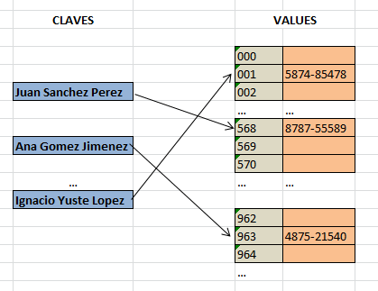

Estas bases de datos son muy eficientes para realizar lecturas y escrituras y son muy fácilmente escalables a partir de su clave. Estas bases de datos son perfectas para entornos altamente distribuidos y aplicaciones que necesiten escalar horizontalmente. El límite está en el modelo de datos tan simple que proporcionan. Algunos ejemplos son Cassandra, Hbase o BigTable

#### 4.1.2 Modelo documental
El modelo documental es una extensión del modelo clave-valor, donde el agregado recibe el nombre de documento y tiene una estructura interna que es conocida por el sistema gestor de la base de datos. Aunque los documentos puedan tener una estructura interna, no es necesario definirla de antemano, sino que será implícita y dependerá de cómo están estructurados los datos en los documentos. 

En consecuencia, distintos documentos que representen el mismo concepto del mundo real (por ejemplo, los datos de dos personas) pueden tener estructuras totalmente distintas o variaciones de la misma estructura. Esta estructura interna simplifica el desarrollo de aplicaciones, pero reduce la flexibilidad del modelo clave-valor. La estructuración interna puede ser aprovechada por el sistema gestor de la base de datos. 

Así, por ejemplo, los documentos se podrán recuperar mediante su clave o mediante el valor que toman sus atributos. También es posible acceder a partes del documento y crear índices que ayuden a recuperar eficientemente los documentos almacenados en la base de datos. Los documentos se pueden agrupar en colecciones.

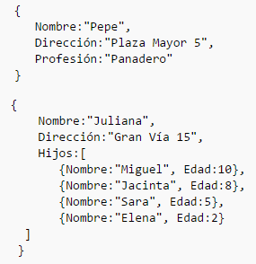

#### 4.1.3. Modelo de columnas
Las bases de datos NoSQL que siguen el modelo de agregación orientada a columnas, organizan los datos por filas que se guardan en tablas. Conceptualmente, podemos ver este modelo como un modelo bidimensional (una matriz), donde cada fila de la tabla representa un agregado y es accesible a partir de una clave. Hasta ahora no hay ninguna novedad respecto a los modelos de agregación vistos anteriormente. No obstante, en este modelo, los datos de los agregados (es decir, cada una de las filas) se organizan en columnas. 

Un agregado en este caso es un conjunto de columnas, donde cada columna está formada por una tripleta compuesta por el nombre de la columna, el valor de la columna y una marca de tiempo que indica cuándo se añadió la columna en la base de datos. 

Un conjunto de columnas puede agruparse en una nueva estructura, llamada normalmente familia de columnas. Una familia de columnas tiene un nombre y una semántica muy definida. Habitualmente, dentro de una agregación, una familia de columnas representa un concepto de la agregación. 

> **Ejemplo:** Por ejemplo, entendiendo un estudiante como un agregado (fila), tres de sus familias de columnas podrían ser, respectivamente, sus atributos personales, su domicilio y los estudios previos realizados por el estudiante. En un modelo de agregación de columnas se puede acceder a una fila (o agregado) concreto a partir de su clave. Pero también es posible obtener información sobre una familia de columnas para todos los agregados. Esto permite realizar búsquedas que pueden ser muy útiles en según qué problemas.

### 4.2. Modelos de grafo
Estos modelos permiten representar los datos utilizando estructuras de grafos. Un grafo es una representación abstracta de un conjunto de objetos. Los objetos de los grafos se representan mediante vértices (también llamados nodos) y aristas.

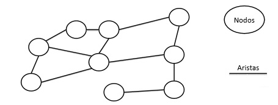

> **Importante:** Los nodos permiten representar objetos de la vida real y las aristas representan la relación entre ellos. Los nodos serían el equivalente a las relaciones en el modelo relacional. Las aristas representan relaciones entre objetos del mundo real y serían el equivalente a las claves foráneas en el modelo relacional.

Los tipos, propiedades y algoritmos sobre grafos se estudian en una rama de las matemáticas denominada matemática discreta. El modelo en grafo es útil cuando los datos a almacenar tienen multitud de relaciones y cuando la importancia recae más en las relaciones entre los datos que en los datos en sí. En consecuencia, este tipo de bases de datos tiende a almacenar pocos datos de los objetos del mundo real, pero muchos datos sobre sus interrelaciones, a diferencia de lo que acostumbra a suceder en bases de datos relacionales, donde hay mucha información de los datos y pocas interrelaciones entre ellos representadas por claves foráneas.

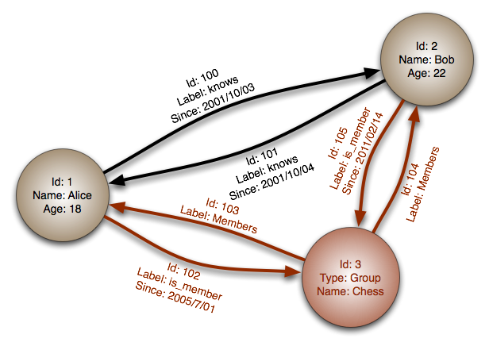

Hay distintos tipos de grafo en función de las características del grafo y de sus elementos. Los modelos NoSQL en grafo no siguen todos los mismos modelos de grafo, no obstante el modelo más utilizado es un modelo de grafo dirigido con propiedades de etiquetado. Bajo esta suposición, los modelos en grafo están compuestos de nodos, aristas, etiquetas y propiedades. Los nodos y las aristas se pueden etiquetar, se puede asignar una cadena de texto a los mismos para facilitar su lectura y proveer mayor semántica. Es común que distintas relaciones compartan la misma etiqueta, ya que la etiqueta en las aristas se utiliza para identificar el tipo de relación al que pertenecen. También es posible definir propiedades, tanto a nivel de nodo como a nivel de arista. Las propiedades son parejas que se asignan a un elemento del modelo. 

La clave es una cadena de caracteres, mientras que el valor puede responder a un conjunto de tipos de datos predefinidos. Los modelos en grafo no son tan fácilmente escalables como los modelos de agregación ya que los datos están altamente relacionados, lo que implica que distribuir los datos en diferentes ordenadores puede suponer eliminar relaciones entre los datos. Por este hecho, la distribución de datos en estos modelos es compleja.

> **Ejemplo:** Ejemplos de bases de datos de grafos es Neo4j.

A continuación en esta gráfica se pueden ver características de algunas de las bases de datos NoSQL.

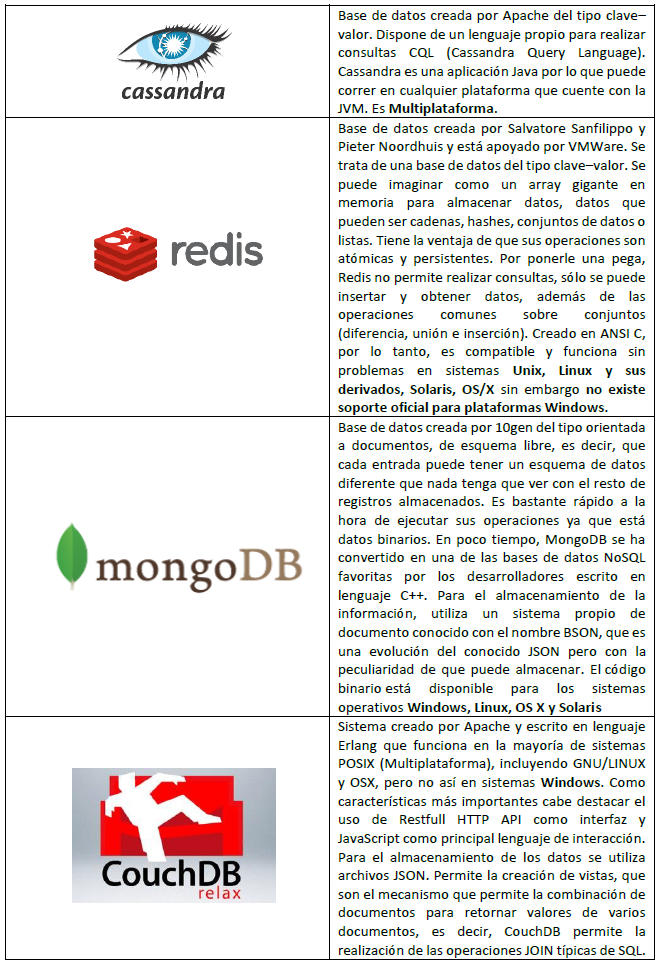

## Recuerda
### Índices en bases de datos
Un índice de una base de datos es una estructura de datos que sirve para mejorar la velocidad de las operaciones, por medio de un identificador de cada fila de una tabla y permite así un rápido acceso a los registros de una tabla en una base de datos.

Pueden contener una o varios atributos, es decir, columnas.

### Lenguaje SQL
El lenguaje SQL es el estándar para la definición, manipulación y control de bases de datos relacionales.

Es declarativo con el que solo hay que indicar qué se quiere hacer. Es un lenguaje muy parecido al lenguaje natural.

### Sistemas distribuidos
Un sistema distribuido es un conjunto de elementos (o nodos, es decir, pc’s), interconectados a través de una red, que son capaces de ejecutar programas. Estos elementos cooperan en la realización de una serie de tareas que tienen asignadas. Desde el punto de vista del usuario, el sistema se percibe como una sola unidad.

Un sistema distribuido en comparación a uno centralizado facilita el crecimiento de una organización de acuerdo con sus necesidades. Esto puede ser interesante en el caso de start-ups y de compañías que esperan ratios de crecimiento a medio plazo.

### Bases de datos NoSQL y teorema CAP
Una base de datos NoSQL es aquella base de datos que no requiere estructuras de datos fijas como tablas; no garantizan completamente las características ACID (ver apartado Teorema CAP más adelante) y escalan muy bien horizontalmente. Se utilizan en entornos distribuidos que han de estar siempre disponibles y operativos y que gestionan un importante volumen de datos.

Cuando se acomete el desarrollo de un sistema distribuido es necesario tener en cuenta el teorema CAP. El profesor Eric Brewer introdujo el teorema CAP en una charla invitada de un congreso de computación distribuida.

