# Introducción a un sistema de Base de Datos NoSQL, MongoDB

## Introducción
En esta unidad realizaremos una aproximación a un sistema de base de datos NoSQL particular: MongoDB.

En primer lugar definiremos que es MongoDB, comprobaremos cómo funciona, que usos tiene, y enumeraremos los primeros pasos que se deben seguir para utilizarlo. Seguidamente, aprenderemos como crear nuestra primera base de datos a través de MongoDB y a actualizar sus datos.

Por último, indagaremos en primer lugar el trabajo con índices en MongoDB para la optimización de datos, profundizando en sus planes de ejecución, ventajas e inconvenientes. Para concluir la unidad aprenderemos como consultar datos en MongoDB.


## Objetivos
- Definir que es MongoDB.
- Conocer el funcionamiento esencial de MongoDB.
- Aprender las utilidades que tiene MongoDB.

## Mapa Conceptual
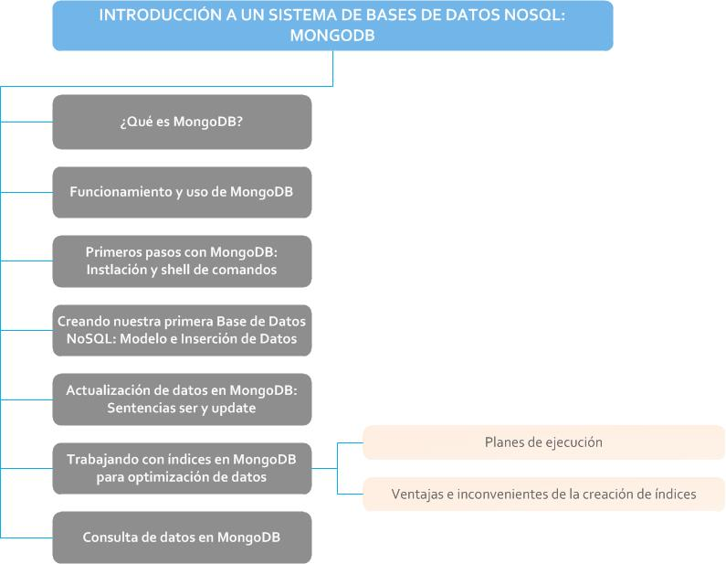

## 1. ¿Qué es MongoDB?
Creada en 2007 por la empresa 10gen, ahora MongoDB Inc. El nombre de MongoDB proviene de “humongous” que significa enorme en inglés. MongoDB es una base de datos NoSQL de software libre, escalable y de alto rendimiento desarrollada en C++ y disponible en multitud de sistemas operativos Linux, Windows, Solaris et. Si recordamos el teorema CAP de la unidad anterior, MongoDB es una base de datos NoSQL CP, es decir contiene una visión consistente de los datos frente a la disponibilidad de las particiones. Es una de las bases de datos NoSQL más populares.

Como características importantes cabe destacar:

- Almacenamiento orientado a documentos BSON, un formato binario de documentos JSON.
- Replicación maestro-esclavo y alta disponibilidad.
- Soporte de índices.
- Consultas, también basadas en documentos.
- APIs y drivers para muchos lenguajes de programación.
- Escalabilidad horizontal.
- GridFS, que permite almacenar ficheros de cualquier tamaño sin necesidad de complicar el entorno.
- No hay transacciones por lo que es más rápida y escalable.

GridFS dentro de MongoDB especifica el almacenamiento y recuperación de ficheros que exceden los 16 MB. Con GridFS en lugar de almacenar un fichero en un único documento se divide este fichero en partes y cada uno de estos se almacena en un documento separado.

Es importante destacar que es una base de datos orientada a documentos, es decir almacena la información en documentos BSON, formato binario de JSON (véase unidad anterior) lo que aporta dinamismo y flexibilidad. MongoDB almacena cada registro en un documento.

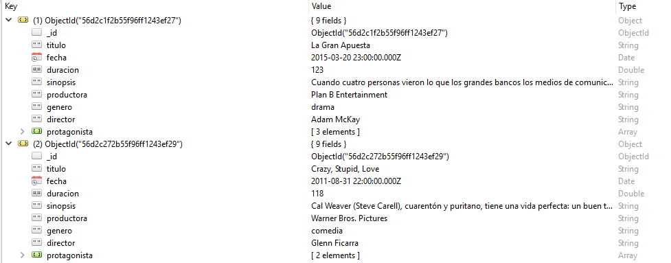

Otra característica importante es que los documentos de una misma colección, este concepto es similar a una tabla de una base de datos relacional, no tienen por qué tener el mismo formato o esquema. Por ejemplo podemos tener un documento en MongoDB tal que:

```
{Nombre: "Enrique",

Apellidos: "López Díaz",

Edad: 32,

Aficiones: ["running", "natación", "ciclismo"],

Amigos: [

{Nombre: “Ana", Edad: 29},

{Nombre: "Juan", Edad: 32}

]

}
```

Y en la misma colección podríamos tener este documento.

```
{Nombre: "Luis",

Estudios: "Ciencias Físicas",

Amigos: 12

}
```

Esta situación no es posible en una misma tabla de una base de datos relacional.

## 2. Funcionamiento y usos de MongoDB
MongoDB sigue un modelo de datos de agregación orientado a documentos. Las consultas de hacen pasando como parámetros documentos JSON, por ejemplo:

`db.Clientes.find({Nombre:"Ana"});`

Devolverá todos los documentos cuyo nombre sea Ana:

MongoDB viene de serie con una consola muy potente en la que podemos ejecutar los comandos pero necesitamos abrir un terminal para cada sesión iniciada en MongoDB y podemos perder los resultados fácilmente. Para evitar esto existen herramientas con las que podemos administrar de forma gráfica y fácil MongoDB. Además la interfaz de MongoDB no es nada atractiva. Una de estas herramientas, fácil de instalar y usar es RoboMongo que toma la Shell de MongoDB y la integra en un entorno gráfico con toda su funcionalidad y añadiendo más facilidades como:

- Múltiples conexiones a bases de datos separadas por pestañas.
- Resaltado de sintaxis y autocompletado de código.

> **Para saber más:** ¿Dónde es útil usar MongoDB? Cualquier aplicación que necesite almacenar datos semi estructurados. Es muy útil en entornos que necesiten escalabilidad ya que es relativamente fácil configurar sus opciones de escalabilidad. También en aplicaciones que almacenan grandes cantidades de datos complejos, por ejemplo aplicaciones como un blog que tiene post, comentarios etc... O aplicaciones de analítica.

## 3. Primeros pasos con MongoDB: Instalación y Shell de comandos
MongoDB se puede descargar e instalar fácilmente en un sistema operativo, permitiendo así que cualquier usuario configure su propio entorno de base de datos local para desarrollo o pruebas.

Para comenzar con la descarga de esta herramienta, el primer paso consiste en acceder a su sitio web oficial a través de la dirección https://www.mongodb.com/es. Desde esta página, se pueden encontrar todos los recursos y productos relacionados con MongoDB.


Una vez dentro del sitio web, es necesario hacer clic en la sección Productos para desplegar todas las opciones disponibles. Entre ellas, se debe buscar y seleccionar Community Edition.

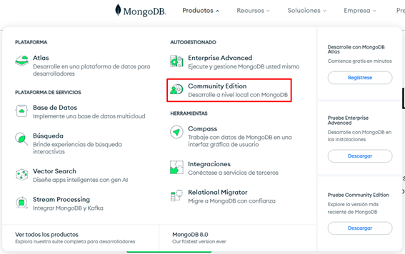

> **Para saber más:** Esta edición, conocida como “edición comunitaria”, es la versión gratuita y de código abierto de MongoDB. Se orienta a desarrolladores y a quienes desean utilizar MongoDB sin coste alguno, ofreciendo funcionalidades esenciales para la mayoría de proyectos y entornos de aprendizaje.

En la página dedicada a la edición de la comunidad de MongoDB, se encontrará un botón destacado con el texto Descargar comunidad. Haciendo clic sobre este botón se accede al formulario de descarga.


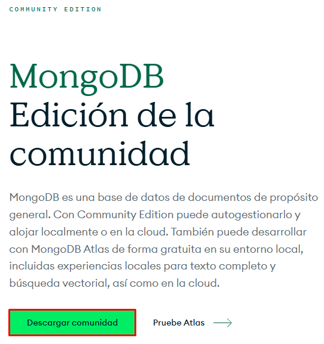

A continuación, se debe seleccionar la versión que se desea instalar (en este caso, la 8.0.9), elegir la plataforma adecuada (por ejemplo, Windows de 64 bits) y escoger el formato del paquete, que habitualmente será msi para instalaciones sencillas en Windows. Tras completar estas opciones, solo queda pulsar en Download para iniciar la descarga del instalador correspondiente.

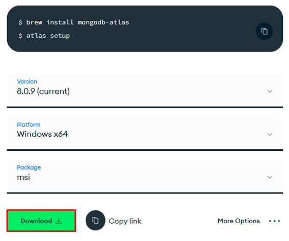

Una vez finalizada la descarga del archivo de instalación, hay que hacer doble clic sobre él para ejecutar el asistente de instalación. El proceso es bastante intuitivo. Como ocurre con la mayoría de los instaladores en Windows, el primer paso consiste en hacer clic en Next para avanzar.

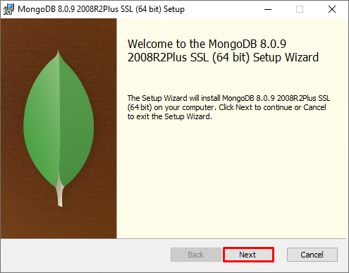
Después, se presenta el acuerdo de licencia de uso, que debe ser aceptado para continuar. Una vez aceptado, se vuelve a hacer clic en Next.

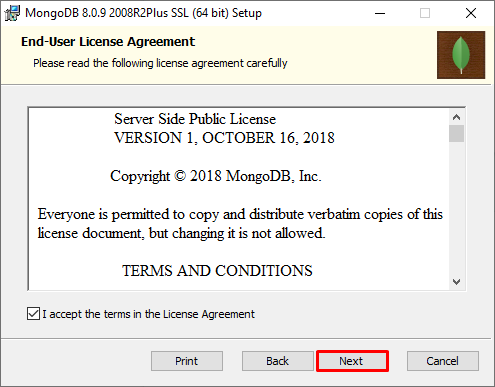

El asistente de MongoDB permite escoger entre una instalación completa o una personalizada. En este caso, se recomienda optar por la instalación completa, ya que así se incluirán todas las herramientas necesarias sin complicaciones adicionales.

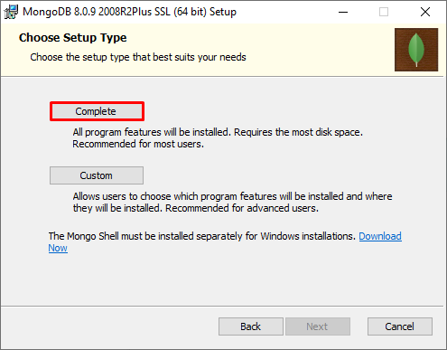

En el siguiente paso, conviene dejar todos los ajustes con los valores por defecto para evitar problemas de compatibilidad o de configuración innecesaria, y de nuevo se hace clic en Next para seguir avanzando.

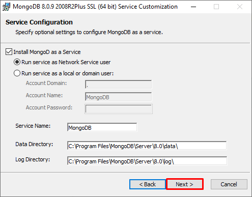

A continuación, aparece una casilla con la opción Install MongoDB Compass. MongoDB Compass es la herramienta gráfica oficial que acompaña a MongoDB, diseñada para facilitar la administración y visualización de bases de datos desde una interfaz visual. Gracias a Compass, es posible explorar colecciones, realizar consultas, insertar y modificar datos sin necesidad de recurrir a la línea de comandos.

> **Importante:** Resulta muy recomendable instalar MongoDB Compass, especialmente para usuarios que prefieren trabajar de manera visual o que están comenzando a familiarizarse con MongoDB. Compass permite gestionar fácilmente la base de datos, entender su estructura y ejecutar operaciones de manera intuitiva, por lo que instalarla aporta ventajas prácticas desde el primer uso.

Una vez marcada la casilla correspondiente a Compass, se hace clic en Next para continuar.

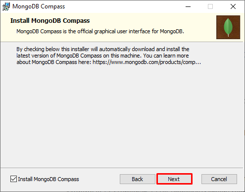

En este punto, el asistente ya está listo para proceder con la instalación. Basta con pulsar en el botón Install para que comience el proceso.

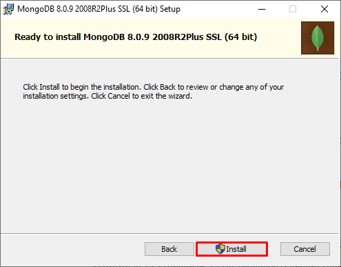

En unos segundos, MongoDB y Compass quedarán instalados correctamente en el sistema. Para finalizar, solo hay que hacer clic en Finish.

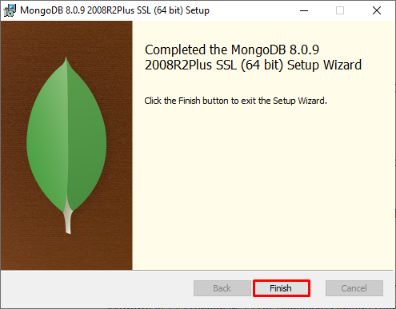

Tras la instalación, para conectarse al servidor recién creado utilizando la interfaz gráfica, basta con abrir MongoDB Compass. En la pantalla principal de Compass se debe introducir la siguiente dirección en el campo correspondiente mongodb://localhost:27017.

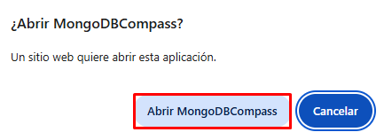

> **Para saber más:** Alternativamente se puede escribir la dirección mongodb://localhost:27017 en un navegador web y pulsar la tecla Enter para obtener el mismo resultado.

De este modo, se establece una conexión directa con el servidor de MongoDB que se acaba de instalar en el ordenador local.

Al acceder por primera vez, la aplicación Compass mostrará una lista vacía de bases de datos, ya que todavía no se ha creado ninguna en este entorno. Esto es completamente normal y significa que el sistema está listo para comenzar a trabajar y crear nuevas bases de datos y colecciones según las necesidades del usuario.

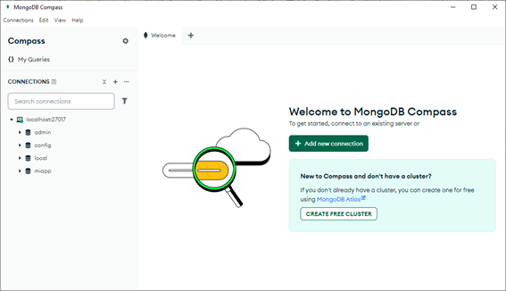

## 4. Creando nuestra primera base de datos NoSQL: Modelo e inserción de datos
En MongoDB, una base de datos se entiende como un espacio lógico en el que se agrupan y almacenan conjuntos de colecciones, las cuales a su vez contienen los documentos donde reside la información real. Cada base de datos sirve para organizar de manera independiente los datos relacionados con una aplicación, proyecto o área funcional concreta, permitiendo mantener separados distintos entornos o dominios de información dentro del mismo servidor MongoDB.

Para crear una base de datos en MongoDB utilizando MongoDB Compass, el primer paso consiste en abrir la aplicación y establecer una conexión con el servidor donde se almacenarán los datos. Una vez conectados, se selecciona la conexión activa y se hace clic en la opción Create database para iniciar el proceso de creación. Esta opción da acceso a un formulario en el que se deben definir los nombres de la base de datos y de la primera colección que se almacenará en ella.

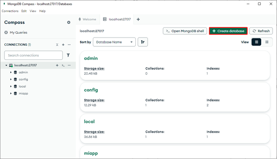

En el formulario de creación, hay que escribir el nombre de la base de datos, que en este ejemplo será "empresa". Este nombre identifica y agrupa todos los datos empresariales que se van a gestionar, diferenciándolos de otras posibles bases de datos existentes en el mismo servidor. A continuación, se solicita un nombre para la colección inicial, en este caso "empleados". El nombre de la colección sirve para organizar los documentos que representan a los empleados de la empresa, permitiendo almacenar sus datos de forma estructurada y accesible. Una vez definidos ambos nombres, se confirma la creación haciendo clic en "Create Database".

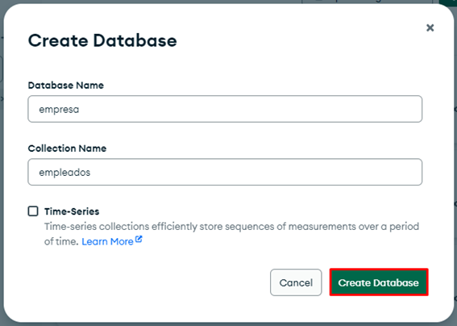

Al completarse este proceso, se puede comprobar cómo, en el panel lateral de conexiones, aparece la colección "empleados" ubicada dentro de la base de datos "empresa". Para trabajar con estos datos, basta con hacer clic en el nombre de la colección, lo que abre su vista principal en la parte central de la interfaz de Compass.

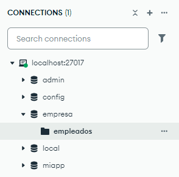

Esta vista central muestra la pestaña "Documents", donde es posible gestionar los documentos que forman parte de la colección. Para añadir un nuevo documento, se debe hacer clic en el signo "+" y seleccionar la opción "Insert document".

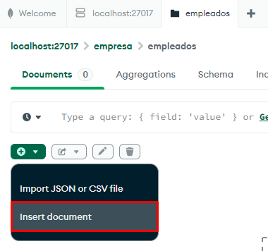

Se abrirá un editor con un campo donde, por defecto, aparece un mensaje indicando "Paste one or more documents here", señalando que aquí se deben introducir los datos que se quieren añadir. Se recomienda borrar el contenido actual y escribir un nuevo documento con los registros de ejemplo deseados. Después de introducir los datos, se hace clic en "Insert" para completar la operación.

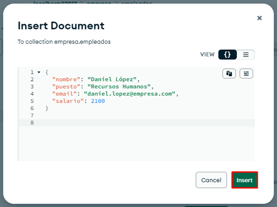

Una vez realizado este paso, los datos quedan registrados correctamente y pueden visualizarse desde la pestaña Documents.

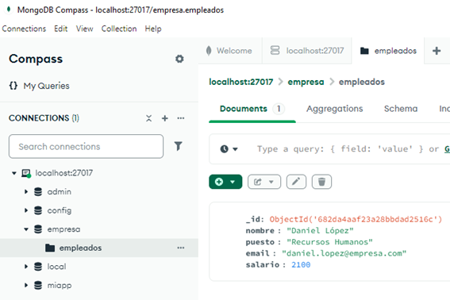

> **Importante:** Esta vista previa permite explorar todos los documentos almacenados en la colección y sería el equivalente visual a realizar una consulta SELECT en una base de datos relacional tradicional, mostrando los resultados de manera inmediata y clara.

## 5. Actualización de datos en MongoDB: Sentencias set y update
La actualización de datos es el proceso mediante el cual se modifican, sustituyen o amplían los valores de uno o varios campos en los documentos almacenados dentro de una colección. Esta operación es necesaria en el ciclo de vida de una base de datos, ya que permite reflejar los cambios que se producen en la información gestionada por una aplicación, ya sea por corrección de errores, evolución de los datos originales o actualización de registros existentes con nueva información relevante.

En MongoDB, la actualización de datos puede realizarse de distintas maneras, dependiendo de la necesidad concreta del usuario o del sistema. Es posible actualizar un único documento que cumpla una determinada condición, modificar varios documentos a la vez si coinciden con un criterio específico, o incluso reemplazar completamente el contenido de un documento, dejando solo el identificador original. La flexibilidad de MongoDB permite además utilizar operadores de actualización, como $set, para cambiar únicamente los campos deseados, o $inc para incrementar valores numéricos, sin que el resto del documento se vea afectado.

Las operaciones de actualización se pueden ejecutar tanto a través de la consola, mediante comandos específicos en la shell de MongoDB, como desde herramientas gráficas como MongoDB Compass, donde la edición de documentos puede realizarse de manera visual e intuitiva.

Para modificar el contenido de un documento en MongoDB utilizando la interfaz gráfica de Compass, el proceso comienza dirigiéndose a la colección en la que se encuentra el documento que se desea actualizar. Una vez dentro de la colección, hay que localizar el documento concreto y hacer clic en el botón en forma de lápiz, que identifica la función de edición. Esta acción permite acceder directamente a la vista de edición del documento seleccionado.

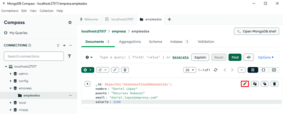

Al abrir la vista de edición, se presenta el contenido actual del documento, listo para ser modificado. Por ejemplo, si se quiere actualizar el salario de un usuario que tiene asignado el valor 2100, basta con cambiar ese valor por 2200 en el campo correspondiente. Tras realizar la modificación, se confirma el cambio haciendo clic en el botón UPDATE, asegurando que la información nueva quede registrada en la base de datos.

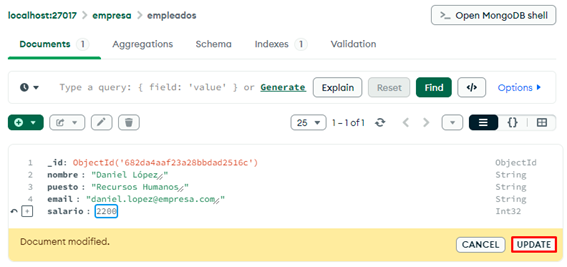

> **Importante:** Internamente, esta acción equivale a ejecutar una operación de actualización con el operador $set, que únicamente cambia el valor del campo indicado sin alterar el resto del documento. Sería comparable a realizar un comando de actualización como el siguiente.

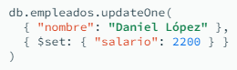

Después de realizar el cambio, se puede regresar a la vista principal de documentos de la colección para comprobar que el contenido se ha modificado correctamente. Como resultado, el valor del salario en el documento aparecerá actualizado, reflejando el cambio realizado a través de la edición gráfica.

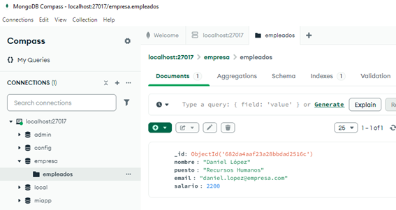

## 6. Trabajando con índices en MongoDB para optimización de datos
Los índices son uno de los mecanismos más importantes para garantizar el rendimiento y la eficiencia en la gestión y recuperación de la información. En MongoDB, los índices desempeñan un papel importante a la hora de optimizar el acceso a los datos almacenados en grandes colecciones.

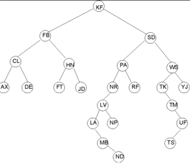

La naturaleza de MongoDB, orientada a documentos y diseñada para trabajar con volúmenes de información cada vez mayores, hace que la presencia de índices sea imprescindible si se pretende mantener una respuesta ágil en las consultas, independientemente del tamaño alcanzado por la base de datos.

Un índice, en términos prácticos, es una estructura de datos que almacena una parte de la información contenida en los documentos de una colección, organizada de forma que las búsquedas sobre campos específicos puedan resolverse de forma mucho más rápida. En ausencia de índices, cualquier consulta sobre una colección requiere recorrer todos y cada uno de los documentos almacenados, proceso conocido como escaneo completo de la colección.

> **Para saber más:** Este método resulta ineficiente y provoca que el tiempo de respuesta aumente proporcionalmente al tamaño de la colección.

Cuando se dispone de un índice adecuado, MongoDB puede saltarse este escaneo y localizar de manera casi instantánea los documentos que cumplen las condiciones indicadas en la consulta.

El propósito principal de los índices es, por tanto, acelerar las operaciones de búsqueda y filtrado sobre los datos. Cuando una aplicación necesita recuperar información basándose en el valor de uno o varios campos, un índice bien definido permite que la base de datos encuentre los resultados deseados en una fracción del tiempo que tomaría sin esta estructura.

Además de mejorar el rendimiento de las consultas, los índices en MongoDB cumplen otras funciones esenciales, como la garantía de unicidad. Es posible crear índices únicos sobre uno o varios campos para impedir que se almacenen documentos con valores duplicados en esos campos, lo que resulta indispensable para mantener la integridad de datos críticos como nombres de usuario, direcciones de correo electrónico o identificadores únicos.

La creación de un índice en MongoDB puede realizarse de diferentes formas, adaptándose tanto a quienes prefieren la línea de comandos como a quienes optan por herramientas gráficas.

Utilizando una interfaz gráfica como MongoDB Compass se puede acceder a la administración de índices de una manera visual e intuitiva, seleccionando la colección deseada y rellenando un formulario donde se especifican los campos y el tipo de índice requerido, sin necesidad de escribir código.

Para crear un índice de manera visual en MongoDB Compass, el primer paso consiste en acceder a la pestaña Indexes, situada en la parte superior de la interfaz de la aplicación. Esta pestaña permite gestionar todos los índices de la colección seleccionada y proporciona una visión clara de los ya existentes, así como de sus propiedades y estado. La navegación hasta esta sección resulta muy sencilla y, una vez dentro, se pueden ver tanto el índice por defecto sobre el campo _id_ como cualquier otro índice que se haya creado previamente.

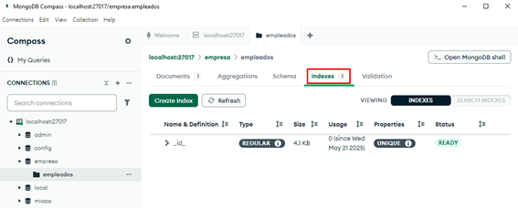

Una vez en la pestaña correspondiente, es necesario hacer clic en el botón Create Index. Esta opción está pensada para facilitar la generación de nuevos índices sin tener que recurrir a la línea de comandos, ofreciendo un entorno gráfico donde definir los detalles necesarios para la indexación. El botón suele estar bien visible y lleva directamente al asistente que guía todo el proceso de creación del índice, permitiendo que cualquier usuario, incluso sin experiencia previa, pueda completar la tarea con unos pocos clics.

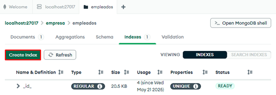

Tras pulsar en Create Index, se abrirá una ventana emergente donde se pueden seleccionar los campos que formarán parte del índice. En el caso de querer indexar el campo “nombre”, bastará con escribirlo en el formulario correspondiente. Además, se debe especificar el tipo de ordenación que tendrá el índice, que puede ser ascendente (1) o descendente (-1). En este ejemplo se elegirá 1 para que el índice sea ascendente. El asistente permite añadir varios campos si se desea crear un índice compuesto, y ofrece también la posibilidad de configurar el índice como único, si fuera necesario. Una vez definidos todos los parámetros, solo resta hacer clic en el botón Create Index para confirmar y ejecutar la creación.

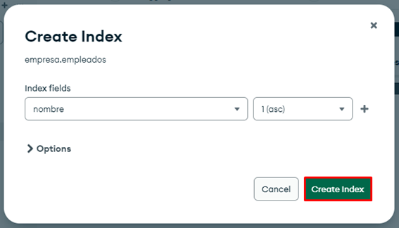

Una vez realizado este último paso, el índice quedará registrado y visible en la lista de la pestaña de índices. A partir de este momento, MongoDB comenzará a utilizar dicho índice para acelerar las búsquedas, ordenaciones y filtrados que involucren el campo “nombre”.

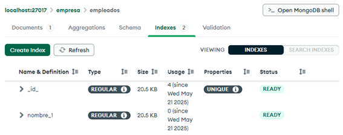

> **Para saber más:** Gracias a la presencia del índice, cualquier consulta que dependa de este campo se ejecutará de manera más eficiente, reduciendo el tiempo de respuesta, especialmente en colecciones con un gran volumen de documentos.

### 6.1. Planes de ejecución
Los planes de ejecución en las bases de datos, y concretamente en MongoDB, representan la estrategia que el motor de la base de datos utiliza para procesar y resolver una consulta. Cuando se realiza una búsqueda, una actualización o cualquier operación que implique recorrer datos almacenados, el sistema debe decidir cómo obtener la información solicitada de la manera más eficiente posible. Este conjunto de decisiones, que abarca desde qué índices utilizar hasta qué orden seguir para examinar los documentos, se conoce como el plan de ejecución de una consulta.

En MongoDB, cada vez que se ejecuta una consulta, el sistema analiza las opciones disponibles para determinar el camino óptimo hacia los resultados. El plan de ejecución describe, por ejemplo, si la base de datos puede utilizar algún índice existente, si necesita realizar un escaneo completo de la colección o si es posible optimizar la operación mediante el uso de varias rutas de acceso a los datos. Esta información resulta muy útil tanto para los desarrolladores como para los administradores de bases de datos, ya que permite identificar posibles cuellos de botella, consultas ineficientes o la necesidad de crear nuevos índices que mejoren el rendimiento.

> **Importante:** La revisión de los planes de ejecución facilita la toma de decisiones informadas sobre la arquitectura y optimización de una base de datos.

En MongoDB Compass, es posible analizar los planes de ejecución de una consulta accediendo de forma muy visual a la información relevante. Para ello, basta con seleccionar la colección sobre la que se desea trabajar, por ejemplo, la colección empleados. Una vez dentro, en la pestaña Documents, se puede escribir el filtro de búsqueda que se quiera analizar. Al lado del campo de filtros aparece el botón Explain, que permite generar el plan de ejecución para la consulta indicada. Este botón se utiliza precisamente para mostrar cómo MongoDB planea y lleva a cabo la operación, desglosando las fases internas del proceso de búsqueda.

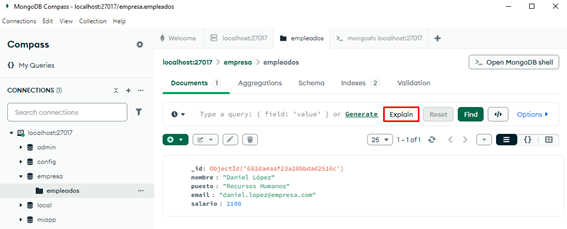

Cuando se pulsa el botón Explain, Compass abre una nueva ventana con dos pestañas principales: Visual Tree y Row Output. En la pestaña Visual Tree se muestra una representación gráfica del plan de ejecución, en forma de árbol, donde se pueden identificar las diferentes etapas del proceso que sigue MongoDB al ejecutar la consulta. Aquí se indica si se ha utilizado un índice, si la operación implica un escaneo de la colección, cuántos documentos han sido examinados en cada paso y cómo se van filtrando los resultados a lo largo del proceso. El diagrama permite ver de un vistazo si la consulta es eficiente o si, por el contrario, recorre toda la colección sin aprovechar los índices existentes.

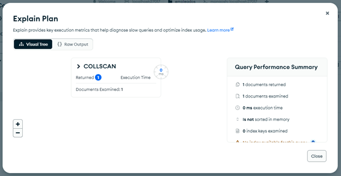

Por otro lado, en la pestaña Row Output se muestra la información en formato tabular, presentando los detalles técnicos de cada etapa del plan de ejecución. Esta vista lista los datos más relevantes, como los tipos de operación realizadas (por ejemplo, “COLLSCAN” para escaneo de colección o “IXSCAN” para escaneo de índice), el número de documentos examinados, los filtros aplicados y otras métricas útiles para comprender cómo se ejecuta la consulta en profundidad.

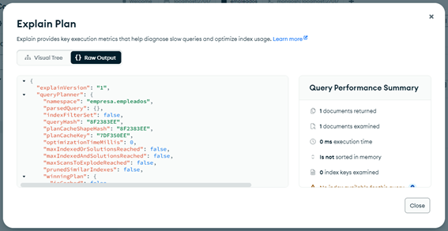

Estos planes de ejecución son especialmente útiles porque permiten identificar posibles problemas de rendimiento en las consultas y comprobar si los índices están siendo utilizados de manera efectiva.
 
> **Importante:** Gracias a esta información, los desarrolladores y administradores pueden tomar decisiones informadas para ajustar sus consultas o crear nuevos índices que mejoren la eficiencia del sistema, evitando operaciones costosas que podrían ralentizar la aplicación a medida que la cantidad de datos crece.

### 6.2. Ventajas e inconvenientes de la creación de índices
La creación de índices representa una decisión estratégica que puede marcar la diferencia en el rendimiento y la eficiencia de las operaciones de consulta. Sin embargo, al igual que ocurre en otros sistemas de gestión de bases de datos, la utilización de índices conlleva tanto beneficios claros como ciertas limitaciones que conviene tener en cuenta antes de planificar su implementación. Analizar las ventajas y los inconvenientes de los índices es esencial para aprovechar sus posibilidades y evitar posibles problemas derivados de su uso indiscriminado o poco adaptado a las necesidades reales de la aplicación.


Las ventajas de la creación de índices en MongoDB son:

- Aceleran en gran medida las búsquedas y consultas sobre campos indexados.
- Mejoran el rendimiento de operaciones de filtrado, ordenación y agrupamiento de datos.
- Permiten la imposición de unicidad en los valores de determinados campos, ayudando a mantener la integridad de la información.
- Reducen el tiempo de respuesta en aplicaciones que requieren acceso rápido y frecuente a los datos.

Por otro lado, los inconvenientes de los índices en MongoDB son:

- Ocupan espacio adicional en disco, ya que cada índice genera una estructura interna aparte.
- Pueden ralentizar las operaciones de inserción, actualización y eliminación de documentos, ya que cada cambio debe reflejarse en los índices afectados.
- Un exceso de índices puede generar sobrecarga en el mantenimiento y dificultar la administración de la base de datos.
- Es posible que, si los índices no se diseñan correctamente, no se obtengan los beneficios esperados y la base de datos acabe gestionando recursos innecesarios.

## 7. Consulta de datos en MongoDB
Una consulta de datos es el mecanismo que permite buscar, filtrar y recuperar información almacenada dentro de las colecciones de la base de datos. A diferencia de los sistemas relacionales, donde las consultas suelen escribirse en lenguaje SQL, MongoDB utiliza una sintaxis basada en JSON que resulta más natural y flexible para manipular documentos. Gracias a esta aproximación, es posible construir consultas que se adapten a la estructura dinámica y variada de los documentos, permitiendo extraer solo aquellos datos que cumplen determinados criterios.

El proceso de consulta en MongoDB puede orientarse a diferentes objetivos, desde obtener todos los documentos de una colección hasta aplicar filtros complejos que combinen varias condiciones. Los resultados pueden limitarse a campos específicos, ordenarse según uno o varios atributos, e incluso agruparse para realizar análisis más avanzados. La potencia de las consultas en MongoDB radica en la capacidad de trabajar con estructuras anidadas, listas y objetos, lo que facilita la recuperación de datos en escenarios donde la información presenta múltiples niveles de detalle o relaciones internas.

La ejecución de consultas puede realizarse tanto desde la consola de comandos, utilizando métodos como find, como desde herramientas gráficas como MongoDB Compass, donde el usuario puede definir los filtros y ver los resultados de manera inmediata.

El diseño eficiente de las consultas y el aprovechamiento de los índices existentes son factores importantes para garantizar un acceso rápido a la información, especialmente cuando se trata de colecciones con grandes volúmenes de documentos.

La consola de MongoDB, conocida como mongosh, es una herramienta que permite interactuar directamente con la base de datos a través de comandos de texto. Su uso resulta fundamental para quienes desean gestionar bases de datos, colecciones y documentos de forma rápida y precisa. Abrir la consola de MongoDB es un proceso sencillo: basta con buscar “Open MongoDB shell” en la pestaña Documents de la colección en MongoDB Compass y hacer clic sobre el botón.

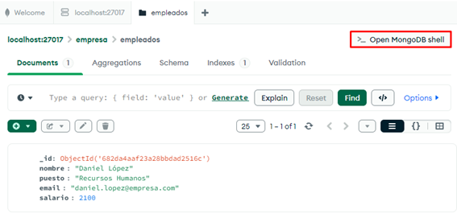

Una vez iniciada la consola, se mostrará un prompt donde es posible introducir comandos de MongoDB. Por defecto, si se trabaja sobre la base de datos y colección adecuada, suele aparecer el comando db["empleados"].find(). Este comando está diseñado para consultar todos los documentos almacenados en la colección denominada “empleados”, permitiendo visualizar de manera inmediata el contenido completo de dicha colección.

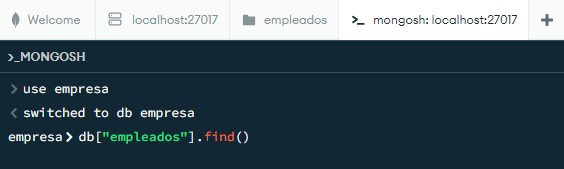

Al presionar la tecla Enter después de escribir o confirmar el comando, la consola mostrará en pantalla el listado de todos los documentos almacenados en la colección “empleados”. De este modo, se obtiene una visión directa y detallada de los datos existentes, lo que facilita tanto su consulta como la posterior gestión o análisis desde la línea de comandos.

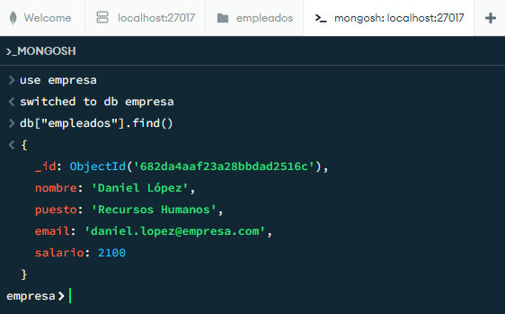

## Recuerda

- MongoDB es una base de datos NoSQL de software libre, escalable y de alto rendimiento desarrollada en C++ y disponible en multitud de sistemas operativos.
- Características principales:
    - Almacenamiento orientado a documentos BSON, un formato binario de documentos JSON.
    - Replicación maestro-esclavo y alta disponibilidad.
    - Soporte de índices.
    - Consultas, también basadas en documentos.
    - APIs y drivers para muchos lenguajes de programación.
    - Escalabilidad horizontal.
    - GridFS, que permite almacenar ficheros de cualquier tamaño sin necesidad de complicar el entorno.
    - No hay transacciones por lo que es más rápida y escalable.
- Para modificar la edad de una persona llamada "David" en la colección empleados de MongoDB, se utiliza el método update indicando el filtro por nombre y el nuevo valor con $set.
- En MongoDB se pueden realizar operaciones habituales de gestión de datos, como seleccionar, insertar, actualizar, eliminar registros, contar documentos y agrupar resultados, entre otras funciones.
- Si se necesita eliminar por completo una colección en MongoDB, basta con emplear el método drop sobre la colección correspondiente.

