# Python y el análisis de datos

## Introducción
Python es un lenguaje de programación interpretado multiparadigma, es decir, soporta la programación orientada a objetos, la programación imperativa y, en menor medida, la programación funcional.

En la presente unidad vamos a realizar una introducción a Python y los requisitos necesarios para su utilización, además vamos a profundizar en las librerías para el análisis de datos en Python.

## Objetivos
- Entender el uso de diferentes lenguajes de programación para el análisis de datos.
- Aprender los conceptos principales de Python.
- Conocer en profundidad las librerías para el análisis de datos en Python
- Saber integrar Python con MongoDB y Hadoop.

## Mapa Conceptual
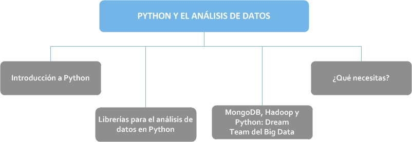

## 1. Introducción a Python
El análisis de datos se ha convertido actualmente en un proceso importante dentro de las empresas, las cuales requieren identificar variables vitales de sus consumidores para poder ofrecer mejores servicios a estos. Como hemos visto, conocer las tendencias del mercado y conocer porqué suceden ciertas situaciones en las empresas son la base para tomar las decisiones correctas.

<video width="100%" controls>
  <source src="videos/introduccion-python.mp4" title="Introducción a python" type="video/mp4">
</video>

Python, por ser un lenguaje muy flexible, ofrece herramientas para realizar el procesamiento de datos de manera muy precisa. Es un lenguaje de programación interpretado multiparadigma, es decir, soporta la programación orientada a objetos, la programación imperativa y, en menor medida, la programación funcional. Fue creado por Guido Van Rossum, usa tipado dinámico, es multiplataforma y debido a que es de código libre, la comunidad de desarrolladores ha creado librerías o módulos para hacer casi cualquier cosa. Su filosofía hace hincapié en una sintaxis que favorezca un código legible, de ahí que la curva de aprendizaje de este lenguaje de programación sea sencilla y rápida.

### 1.1. Principales características de Python
Aunque ya hemos hablado prácticamente de todas ellas, a continuación resumimos algunas de las generalidades o características que presenta Python como:

- **Simple:** Es un lenguaje simple y minimalista. Permite concentrarse en la solución del problema en lugar de la sintaxis.
- **Sencillo de aprender:** Debido a su simplicidad, aprenderlo resulta bastante fácil.
- **Libre y código abierto:** Se puede distribuir libremente, leer su código fuente, hacerle cambios, etc. Esto ha contribuido a que este lenguaje se haya vuelto tan bueno y estable, debido a la comunidad que existe en torno a él con el afán de mejorarlo.
- **Lenguaje de alto nivel:** Abstrae el problema de manejo de memoria u otros detalles de bajo nivel.
- **Portable:** Por ser Open Source, Python ha sido portado a diferentes plataformas. Todos los programas podrán ejecutarse en alguna de esas plataformas sin requerir cambio alguno. Se debe, no obstante, ser cuidadoso de evitar las características con dependencia del sistema.
- **Interpretado:** No existen compilaciones separadas y pasos de ejecución. Solo es necesario ejecutar el código fuente, internamente Python convierte el código fuente en una forma intermedia llamada bytecodes y después lo traduce en el nativo del computador para ejecutarlo.
- **Orientado a objetos:** El programa está construido sobre procedimientos o funciones reutilizables.
Ampliable: Puede ser modificado por la comunidad en el caso de necesitar nuevas funciones o mejorar las existentes.
- **Librerías extendidas:** Python contiene una gran cantidad de librerías, tipos de datos y funciones incorporadas en el propio lenguaje, que ayudan a realizar muchas tareas comunes sin necesidad de tener que programarlas desde cero. Estas librerías pueden ayudas a hacer varias cosas como expresiones regulares, generación de documentos, evaluación de unidades, pruebas, procesos, bases de datos, navegadores web, CGI, ftp, correo electrónico, XML, XML-RPC, HTML, archivos WAV, criptografía, GUI, y otras funciones dependientes del sistema.
- **Modo interactivo:** El intérprete de Python estándar incluye un modo interactivo en el cual se escriben las instrucciones en un intérprete de comandos: las expresiones pueden ser introducidas una a una, pudiendo verse el resultado de su evaluación inmediatamente, lo que da la posibilidad de probar pociones de código en el modo interactivo antes de integrarlo como parte de un programa.

En la última década Python ha experimentado un importantísimo aumento del número de programadores y empresas que lo utilizan. Google por ejemplo, usa Python como uno de sus principales lenguajes de desarrollo (otros son Java y C++). También Youtube usa Python en sus sistemas de explotación. Industrial Light & Magic (la empresa de efectos especiales de George Lucas) y Pixar recurren a Python en sus sistemas de producción cinematográfica.

<video width="100%" controls>
  <source src="videos/python.mp4" type="video/mp4">
</video>

### 1.2. Programando con Python
Cuando programamos utilizamos un conjunto de herramientas a las que denominamos entorno de programación. Entre estas herramientas tenemos editores de texto (que nos permiten escribir programas), compiladores o intérpretes (que traducen los programas a código máquina), depuradores (que ayudan a detectar errores), analizadores de tiempo de ejecución (para estudiar la eficiencia de los programas), herramientas para la ejecución de pruebas unitarias (para asegurarnos de que no introducimos nuevos errores al ir desarrollando), analizadores de cobertura (para asegurarnos de que todo el código ha sido puesto a prueba), generadores de documentación (que generan documentación en formatos como HTML a partir de comentarios en los programas), analizadores estáticos (que detectan patrones típicos en código erróneo y nos advierten de problemas potenciales), sistemas de control de versiones (que permiten que varios programadores colaboren en un mismo programa, recuperar cualquier versión del programa, crear ramas de desarrollo en paralelo…), etc.

Los lenguajes interpretados como Python, suelen ofrecer una herramienta de ejecución interactiva. Con ella es posible dar órdenes directamente al intérprete y obtener una respuesta inmediata para cada una de ellas. Es decir, no es necesario escribir un programa completo para empezar a obtener resultados de ejecución, no obstante cuando tenemos mucho código es preferible guardarlo en un archivo con extensión .py que posteriormente podemos ejecutar desde nuestro intérprete. El entorno interactivo es de gran ayuda para experimentar con fragmentos de programa antes de incluirlos en una versión definitiva.

#### Tipos de datos y variables
En algunos lenguajes de programación, las variables se pueden entender como “cajas” en las que se guardan los datos, pero en Python las variables son “etiquetas” que permiten hacer referencia a los datos (que se guardan en unas “cajas” llamadas objetos).

Python es un lenguaje de programación orientado a objetos y su modelo de datos también está basado en objetos.

Para cada dato que aparece en un programa, Python crea un objeto que lo contiene. Cada objeto tiene:

- Un identificador único (un número entero, distinto para cada objeto). El identificador permite a Python referirse al objeto sin ambigüedades.
- Un tipo de dato (entero, decimal, cadena de caracteres, etc.). El tipo de dato permite saber qué operaciones pueden hacerse con el dato.
- Un valor (el propio dato).

Así, las variables en Python no guardan los datos, sino que son simples nombres para poder hacer referencia a esos objetos. De manera que si escribimos la instrucción:

`a = 2`

Python:

- Crea el objeto “2”. Ese objeto tendrá un identificador único que se asigna en el momento de la creación y se conserva a lo largo del programa. En este caso, el objeto creado será de tipo número entero y guardará el valor 2.
- Asocia el nombre a al objeto número entero 2 creado.

La variable a es como una etiqueta que nos permite hacer referencia al objeto “2”, más cómoda de recordar y utilizar que el identificador del objeto.

Por otro lado, en Python se distingue entre objetos mutables y objetos inmutables:

- Los objetos inmutables: son objetos que no se pueden modificar. Por ejemplo, los números, las cadenas y las tuplas son objetos inmutables.
- Los objetos mutables: son objetos que se pueden modificar. Por ejemplo, las listas y los diccionarios son objetos mutables.

#### Definir una variable
Las variables en Python se crean cuando se definen por primera vez, es decir, cuando se les asigna un valor por primera vez. Para asignar un valor a una variable se utiliza el operador de igualdad (=). Al a izquierda de la igualdad se escribe el nombre de la variable y a la derecha el valor que se le quiere dar a la variable.

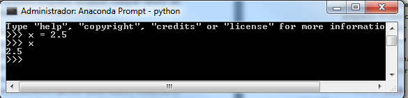

En el ejemplo de la imagen anterior, hemos definido la variable de nombre “x” a la que hemos asignado el valor decimal 2.5. Si escribimos x en el intérprete y pulsamos Enter, éste nos devuelve el valor de la variable definida. En el caso de que intentemos acceder al contenido de una variable que no ha sido definida previamente, se mostrará un mensaje de error.

Una variable puede almacenar diferentes tipos de datos, que veremos más adelante, en el caso de que se desee almacenar una cadena texto dentro de una variable debe escribirse entre comillas simples (‘) o dobles (“), ya que de lo contrario Python supone que estamos haciendo referencia a otra variable en lugar de a una cadena de texto.

El nombre de una variable debe empezar por una letra o por un guion bajo (_) y puede seguir como más letras, números o guiones bajos. Se debe tener en cuenta a la hora de nombrar las variables que Python distingue entre mayúsculas y minúsculas. Así mismo, el nombre de las variables puede contener cualquier carácter alfabético y guiones bajos, lo que no puede incluir es espacios en blanco.

Al igual que en otros lenguajes de programación, en Python existen una serie de palabras reservadas que no pueden usarse como nombres de variables. Estas palabras reservadas son las que forman el núcleo del lenguaje y se incluyen en el cuadro siguiente:


| false | class | finally | is | return |
| --- | ---| --- | --- | --- |
| None | continue | for | lambda | try |
| True | def | from | nonlocal | while |
| and | del | global | not | with |
| as | elif | if | or | yield | |
| assert | else | import | pass | |
| break | except | in | raise | |

#### Asignaciones aumentadas

Cuando una variable se modifica a partir de su propio valor, se puede utilizar la denominada asignación aumentada, una notación compacta que existe también en otros lenguajes de programación.

Así tendríamos las siguientes asignaciones aumentadas y su equivalente:

| Asignación Aumentada | Equivalencia |
| --- | --- |
| a += b | a = a + b |
| a -= b | a = a - b | 
| a *= b | a = a * b | 
| a /= b | a = a / b | 
| a **= b | a = a ** b | 
| a //= b | a = a // b | 
| a %= b | a = a % b | 

Lo que Python no permite son los operadores de incremento (++) o decremento (--) que sí está disponible en otros lenguajes de programación.

#### Definir y modificar varias variables simultáneamente
En una misma línea se pueden definir de forma simultánea varias variables, con el mismo valor o con valores distintos como se muestra a continuación:

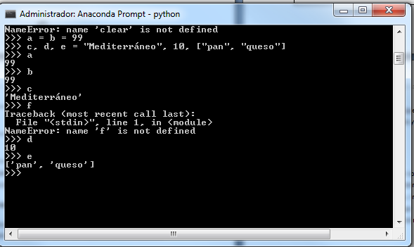

Si el número de variables no coinciden con el de valores, Python genera un mensaje de error, como se muestra a continuación:

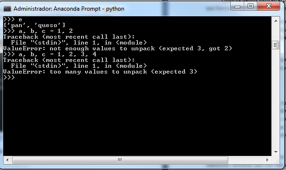

Antes de ver los diferentes tipos de datos, cabe destacar comentar que existe una función en python llamada type (tipo) que nos devuelve el tipo de dato del objeto indicado.

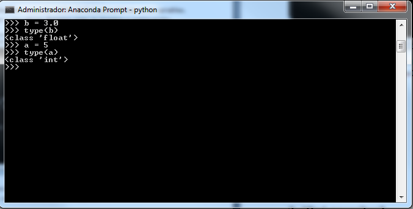

#### Tipo de dato numérico
En python se pueden representar números enteros, reales y complejos.

- **Enteros:** Los números enteros son aquellos que no tienen decimales, tanto positivos como negativos (además del cero). En python se pueden representar mediante el tipo int (integer) o el tipo long (largo). La única diferencia es que el tipo long permite almacenar números más grandes. Es aconsejable no utilizar el tipo long a menos que sea necesario, para no malgastar memoria.

El tipo int de Python se implementa a bajo nivel mediante un tipo long de C, y dado que python utiliza C por debajo, el rango de los valores que puede representar depende de la plataforma. En la mayor parte de las máquinas el long de C se almacena utilizando 32 bits, es decir, mediante el uso de una variable de tipo int de Python podemos almacenar número de -231 a 231-1, o lo que es lo mismo, de -2.147.483.648 a 2.147.483.647.

En plataformas de 64 bits, el rango es de -9.223.372.036.854.775.808 hasta 9.223.372.036.854.7754.807.

El tipo long de Python, permite almacenar números de cualquier precisión, limitado por la memoria disponible en la máquina.

Cuando asignamos un número a una variable, esta pasará a tener tipo int, a menos que el número sea tan grande como para requerir el uso del tipo long.

- **Reales:** Los números reales son los que tienen decimales. En Python se expresan mediante el tipo float, que está implementado a bajo nivel mediante una variable de tipo doublé de C, es decir, utilizando 64 bits, por lo que en Pythin siempre se utiliza doble precisión, en concreto se sigue el estándar IEEE 754: 1 bit para el signo, 11 para el exponente, y 52 para la mantisa. Esto significa que los valores que podemos representar van desde ±2,2250738585072020 x 10-308 hasta ±1,7976931348623157 x 10308.

Debido a las limitaciones, impuesta por el hardware, en lo que respecta al esquema de representación interna para el tipo de dato Real, desde Python 2.4 contamos también con un nuevo tipo Decimal, para el caso de que se necesite representar fracciones de forma más precisa.

Para representar un número real en Pyhton, se escribe primero la parte entera, seguido de un punto y por último la parte decimal. También se puede utilizar notación científica, y añadir una e (de exponente) para indicar un exponente en base 10.

- **Complejos:** Los números complejos son aquellos que tienen parte imaginaria. La mayor parte de lenguajes de programación carecen de este tipo, aunque sea muy utilizado por ingenieros y científicos en general.

En Python estamos ante el tipo de dato complex, también se almacena usando como flotante, debido a que estos números son una extensión de los números reales. En concreto se almacena en una estructura de C, compuesta por dos variables de tipo double, sirviendo una de ellas para almacenar la parte real y la otra para la parte imaginaria.

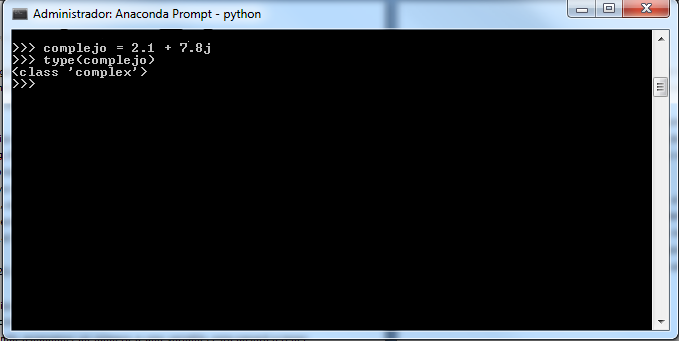

#### Operadores aritméticos
Se tratan de los operadores por defectos para usar con los tipos de datos numéricos definidos. Para operaciones matemáticas más complejas podemos recurrir al módulo math.

| Operador | Descripción | Ejemplo |
| --- | --- | --- |
| + | Suma de elementos | r = 3 + 2 # r es 5 |
| - | Resta de elementos | r = 4 – 7 # r es -3 |
| - | Negación | r = -7 # r es -7 |
| * | Multiplicación | r = 2 * 6 # r es 12 |
| ** | Exponente | r = 2 ** 6 # r es 64 |
| / | División | r = 3.5 / 2 # r es 1.75 |
| // | División entera | r = 3.5 // 2 # r es 1.0 |
| % | Módulo: El resultado es el resto de la división | r = 7 % 2 # r es 1 |

#### Operadores a nivel de bit
Estos operadores actúan sobre las representaciones en binario de los operadores. Por ejemplo, una operación como 3 & 2, se traduce como un and entre los números binarios 11 y 10 (la representación binaria de los números 3 y 2).

El operador and (&), devuelve 1 si el primer bit operando es 1 y el segundo bit operando es 1. Se devuelve 0 en caso contrario.

El operador or (|), devuelve 1 si el primer operando es 1 o el segundo operando es 1. Para el resto de casos devuelve 0.

El operador xor u or exclusivo (^) devuelve 1 si uno de los operandos es 1 y el otro no lo es.

El operador not (~), sirve para negar uno a uno cada bit; es decir si el operando es 0, cambia a 1 y si es 1, cambia a 0.

Por último, los operadores de desplazamiento (<< y >>) sirven para desplazar los bits n posiciones hacia la izquierda o la derecha

| Operador | Descripción | Ejemplo |
| --- | --- | --- |
| `&` | and | `r = 3 & 2 # r es 2` |
| `|` | or | `r = 3 | 2 # r es 3` |
| `^` | xor | `r = 3 ^ 2 # r es 1` |
| `~` | not | `R = ~3 # r es -4` |
| `<<` | Desplazamiento izquierda | `r = 3 << 1 # r es 6` |
| `>>` | Desplazamiento derecha | `r = 3 >> 1 # r es 1` |

#### Tipo de dato Cadena
En python un String o Cadena es una secuencia (ordenada de izquierda a derecha) de caracteres. Las cadenas comienzan y terminan con comillas dobles o simples. Dentro de las comillas se pueden añadir caracteres especiales escapándolos con ‘|’, como ‘\n’, que es el carácter de nueva línea o ‘\t’, el de tabulación.

Una cadena puede estar precedida por el carácter ‘u’ o el carácter ‘r’, los cuales indican que se trata de una cadena que utiliza codificación Unicode o Raw respectivamente. Las cadenas raw se distinguen de las normales en que los caracteres escapados mediante una barra invertida ‘\’ no se sustituyen por sus contrapartidas, lo que es especialmente útil para las expresiones regulares.

Existen diferentes funciones para trabajar con las cadenas, como por ejemplo la función len(), que se utiliza para contar los caracteres de una cadena. También podemos acceder a los caracteres de una cadena mediante [], donde el índice de los caracteres de una cadena comienza en 0 si accedemos desde la izquierda y en -1 si lo hacemos desde la derecha (último).

También es posible encerrar una cadena entre triple comillas (simples o dobles). De esta forma podremos escribir el texto en varias líneas, y al imprimir la cadena, se respetarán los saltos de línea que introdujimos sin tener que recurrir al carácter \n, así como las comillas sin tener que escaparlas.

#### El módulo string
El módulo string contiene funciones útiles que manipulan cadenas. Es necesario importar el módulo antes de poder usarlo.

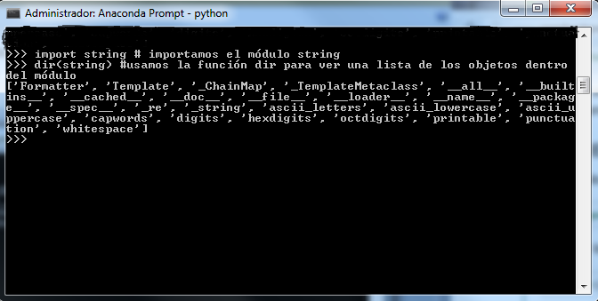

Para averiguar más sobre un objeto de la lista, podemos usar el comando type. Para ello se debe especificar el nombre del módulo seguido por el objeto usando la notación punto.

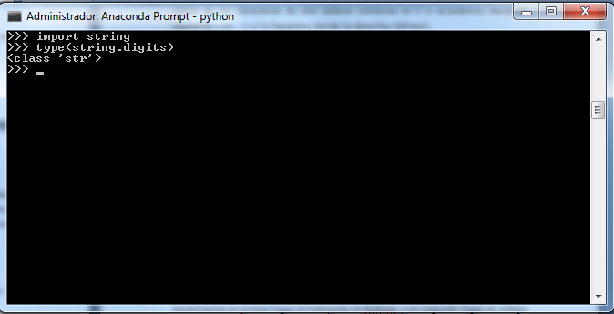

#### Algunas funciones para usar con cadenas
Como vimos en puntos anteriores, un String es una secuencia de caracteres, así, cada uno de ellos tiene asociada una posición, a la que podemos acceder mediante []. Así por ejemplo si queremos imprimir la segunda letra de una cadena, podríamos hacer lo siguiente:

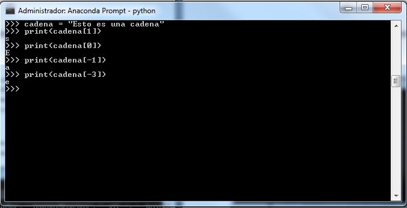

- **Función len():** Sirve para medir la longitud de una cadena

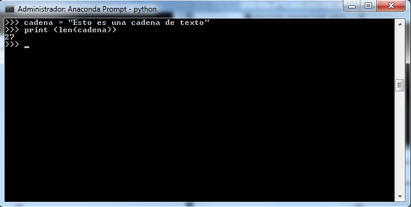

- **Función lower():** Convierte la cadena de texto en minúsculas

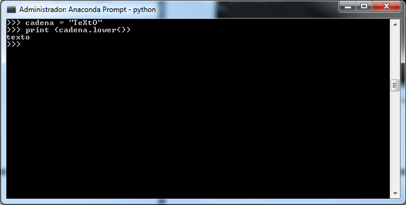

- **Función upper():** Convierte la cadena de texto en mayúsculas

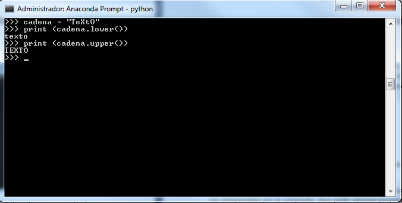

- **Función str():** Con esta función podemos hacer “casting” de variables, lo que nos permite convertir cualquier tipo de dato en cadena.

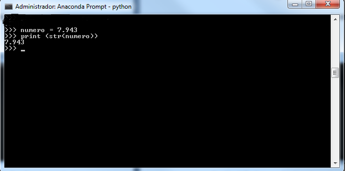

- **+ :** Sirve para concatenar cadenas


- **%:** Nos permite formatear cadenas. Así por ejemplo, el ‘%s’ indica una variable de tipo String (de ahí la ‘s’), y con el ‘% (cadena)’ estamos especificando que se trata del String ‘cadena’.

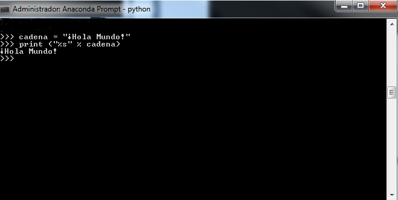

- **input():** Nos permite leer datos desde teclado

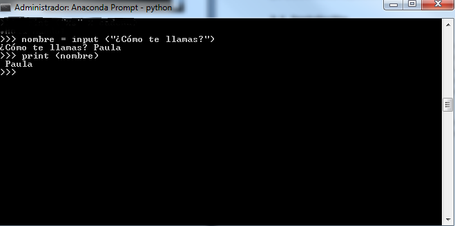

#### Tipo de dato Booleano
Una variable de tipo booleano puede tener dos valores: True (cierto) y False (falso). Estos valores son especialmente importantes para las expresiones condicionales y los bucles.

Entre los operadores con los que podemos trabajar con el tipo de dato bool, son los llamados operadores lógicos o condicionales:

| Operador | Descripción | Ejemplo |
| --- | --- | --- |
| `and` | ¿se cumple a y b? | `r = True and False # r es False` |
| `or` | ¿se cumple a o b? | `r = True or False # r es True` |
| `not` | No a | `r = not True # r es False` |
| `==` | ¿son iguales a y b? | `r = 5 == 3 # r es False` |
| `!=` | ¿son distintos a y b? | `r = 5 != 3 # r es True` |
| `>` | ¿es a mayor que b? | `r = 5 > 3 # r es True` |
| `<` | ¿es a menor que b? | `r = 5 < 3 # r es False` |
| `<=` | ¿es a menor o igual que b? | `r = 5 <= 3 # r es False` |
| `>=` | ¿es a mayor o igual que b? | `r = 5 >= 3 # r es True` |

#### Tipo de dato Tuplas
Las tuplas son un tipo de recipiente que contiene una serie de valores separados por comas entre paréntesis. Las tuplas son inmutables (es decir, no pueden cambiar su contenido una vez creadas).

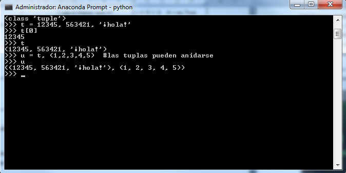

Las tuplas tienen muchos usos. Por ejemplo: pares ordenados (x,y), registros de empleados de una base de datos, etc. Como hemos definido al principio, las tuplas, al igual que las cadenas, son inmutables, esto es que no es posible asignar a los ítems individuales de una tupla. También es posible crear tuplas que contengan objetos mutables como listas (de las que hablaremos más adelante).

Un problema particular es la construcción de tuplas que contengan 0 o 1 ítem: la sintaxis presenta algunas peculiaridades para estos casos. Las tuplas vacías se construyen mediante un par de paréntesis vacío; una tupla con un ítem se construye poniendo una coma a continuación del valor.

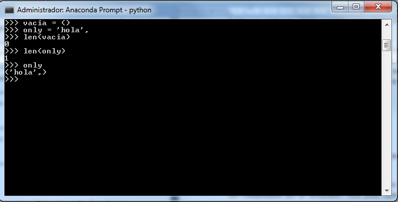

#### Tipo de dato Conjunto
Tipo de dato Conjunto
Un conjunto, es una colección no ordenada y sin elementos repetidos. Los usos básicos de éstos incluyen verificación de pertenencia y eliminación de entradas duplicadas.

Soportan entre otras, las operaciones matemáticas como la unión, intersección, diferencia, y diferencia simétrica.

Para crear un conjunto pueden usarse las llaves {} o la función set(). Se debe tener en cuenta que para crear un conjunto vacío debe usarse set() y no las llaves {}, ya que esto último lo que crearía sería un tipo de dato Diccionario vacío.

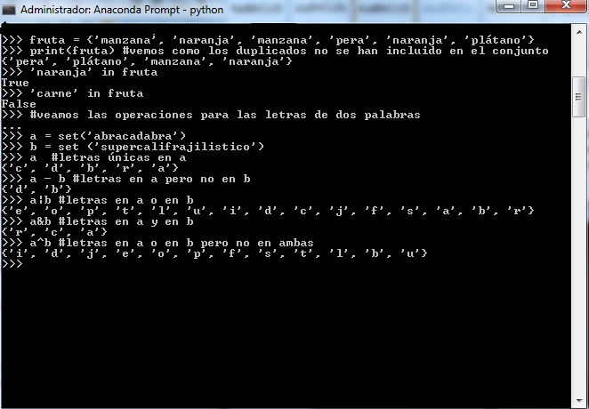

#### Tipo de dato Listas
Las listas en Pythom son variables que almacenan arrays, internamente cada posición puede ser un tipo de dato distinto.

Una lista se puede escribir como una lista de valores separados por comas y entre corchetes.

A continuación se muestran algunos de los métodos de los objetos lista:

| Método | Descripción |
|--------|-------------|
| list.append(x) | Agrega un ítem al final de la lista. Equivale a **a[len(a):] = [x]** |
| list.extend(L) | Extiende la lista agregándole todos los ítems de la lista dada. Equivale a **a[len(a):]= L** |
| list.insert(i,x) | Inserta un ítem en una posición dada. El primer argumento es el índice del ítem delante del cual se insertará, por lo tanto a.insert(0,x) inserta al principio de la lista, y a.insert(len(a),x) equivale a a.append(x). |
| list.remove(x) | Quita el primer elemento de la lista cuyo valor sea x. Dará un error si el ítem a borrar no existe |
| list.pop([i]) | Quita el ítem en la posición dada de la lista, y lo devuelve. Si no se especifica un índice, a.pop() quita y devuelve el último elemento de la lista. (Los corchetes que encierran a *i* en la llamada al método denotan que el parámetro es opcional, no se deben escribir corchetes para indicar la posición). |
| list.clear() | Quita todos los elementos de la lista. Es equivalente a **del a[:]** |
| list.index(x) | Devuelve el índice en la lista del primer ítem cuyo valor sea x. Dará un error si no existe tal ítem. |
| list.sort(key=None, reverse=False) | Ordena los ítems de la lista |
| list.reverse() | Invierte los elementos de la lista |
| list.copy() | Devuelve una copia superficial de la lista. Equivale a **a[:]** |

Estos métodos sobre el tipo de dato lista, hacen que resulte muy fácil usar una lista como una pila, donde el último elemento añadido es el primer elemento retirado (último en entrar, primero en salir). Para agregar un ítem a la cima de la pila usamos append() y para retirar un ítem de la cima de la pila usamos pop() si índice explícito.

También es posible usar una lista como una cola, donde el primer elemento añadido es el primer elemento que se retira (primero en entrar, primero en salir); sin embargo, las listas no son eficientes para este propósito. Agregar y sacar del final de la lista es rápido, pero insertar o sacar del comienzo de una lista es lento (porque el resto de elementos tiene que ser desplazados uno por uno). La mejor opción para implementar una cola es hacer uso de collections.deque, que fue diseñado para sacar y agregar de ambos extremos de forma rápida y eficaz.

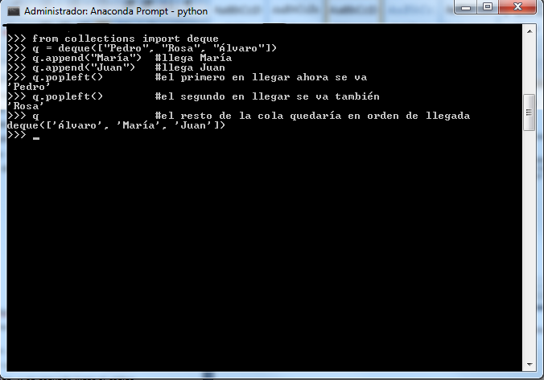

#### Tipo de dato Diccionario
Este tipo de dato, define una relación uno a uno entre claves y valores. Los diccionarios a diferencia de las tuplas, que se indexan mediante un rango numérico, se indexan con claves, que pueden ser cualquier tipo inmutable; las cadenas y números siempre pueden ser claves. Las tuplas asimismo pueden usarse como claves si solamente contienen cadenas, número o tuplas; si una tupla contiene cualquier objeto mutable directa o indirectamente, no puede usarse como clave. No pueden usarse las listas como claves, ya que estas pueden modificarse.

Podemos por tanto definir el tipo de dato diccionario como un conjunto no ordenado de pares clave:valor, con el requerimiento de que las claves sean únicas (dentro de un diccionario particular). Un par de llaves {}, creará un diccionario vacío. Colocar una lista de pares clave:valor separados por comas entre las llaves añade esos pares iniciales al diccionario.

Las operaciones básicas sobre los diccionarios son guardar un valor con una clave y extraer ese valor dada la clave. También es posible borrar un par clave:valor con del. Se puede sobreescribir el valor para una determinada clave.

El método keys() de un diccionario devuelve una lista de todas las claves en uso para un determinado diccionario, en un orden arbitrario (si se quieren ordenadas, será necesario usar el método sort() sobre la lista de claves). Para saber si una clave está en el diccionario utilizamos in.

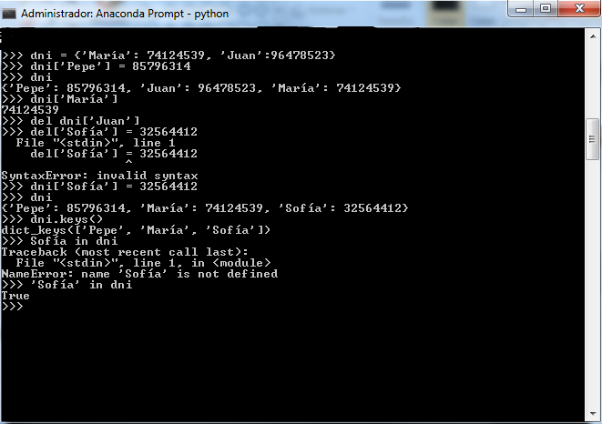

## 2. ¿Qué necesitas?
Como ya hemos visto en el punto anterior, Python es multiplataforma, por lo que funciona tanto en Windows, como MacOs o Linux.

Los archivos de python tienen la extensión .py, son archivos de texto que son interpretados por el compilador. Para poder ejecutar programas en Python, necesitamos en primer lugar el intérprete de Python, y en segundo lugar el código que queremos ejecutar.

Se debe tener en cuenta que Python es “case sensitive” lo que quiere decir que diferencia entre mayúsculas y minúsculas.

### 2.1. Instalación

Para empezar a trabajar con Python en un entorno de Big Data y Business Intelligence, instalaremos una distribución gratuita llamada Anaconda, que pese a estar disponible solo en inglés, incluye multitud de utilidades que facilitarán el trabajo y es ideal para empezar en este entorno. Para instalarla simplemente tendremos que descargar la versión de Anaconda según el sistema operativo en el que estemos trabajando.

Para descargar la herramienta hay que dirigirse a su sitio web oficial en [https://www.anaconda.com/download](https://www.anaconda.com/download) y hacer clic en el botón **Skip registration** para acceder sin iniciar sesión.


Luego hay que hacer clic en **Download** para descargar el archivo de instalación del programa.


El archivo que se descargará será similar al siguiente.


Hay que hacer doble clic sobre él.

El proceso de instalación es automático, pero a continuación se muestran las diferentes ventanas que nos irán apareciendo en un entorno de Windows.


Hacemos clic en **I Agree** para aceptar el acuerdo de licencia.


Seleccionamos la opción de instalación solo para nuestro usuario.


En la ruta de instalación se puede dejar la ruta por defecto.


Dejamos las opciones marcadas por defecto, ya que son clave para que el sistema pueda invocar a Python cuando sea necesario.


> **Importante**
>
> Marcar la casilla **Add Anaconda3 to Path** durante la instalación permite ejecutar los comandos de Anaconda directamente desde la consola de Windows, pero no es imprescindible para usar Anaconda, por lo que no se activará la casilla, ya que todas las tareas y comandos pueden realizarse desde la consola específica Anaconda Prompt. De este modo, se evitan posibles conflictos con otras versiones de Python que puedan estar instaladas en el sistema, manteniendo cada entorno correctamente separado.

Comienza el proceso de instalación.

---


Finalizado el proceso de instalación, pulsamos **next**.


Tras estos sencillos pasos ya tendremos instalado la versión de Anaconda en nuestro ordenador.


## 2.2. Utilidades instaladas

### Spyder

Se puede acceder a **Spyder** desde **Anaconda Navigator** y desde el **menú Inicio** de Windows. En cualquier caso al acceder se mostrará la siguiente interfaz.


Spyder es un entorno de desarrollo en Python, orientado a científicos y con características similares a MATLAB:

- Consola con visualizador de variables.
- Visualizador de sys.path.
- Visualizador de variables de entorno.
- Funciones de dibujo de gráficos integrados.
- Autocompletado.
- Editor con resaltado de sintaxis.
- Navegador de clases/funciones.
- Análisis de código.
- Autocompletado de código.

Está disponible tanto para Windows como para Linux.

### IPython

Para utilizar **IPython** se puede acceder desde **Anaconda Navigator** o desde el **menú Inicio** de Windows.


IPython es un Shell interactivo que añade funcionalidades extra al modo interactivo incluido con Python, como resaltado de líneas y errores mediante colores, una sintaxis adicional para el Shell, autocompletado mediante tabulador de variables, módulos y atributos; entre otras funcionalidades.

Actualmente, multitud de paquetes utilizan IPython como librería o como intérprete interactivo. Es multiplataforma, software libre, y debido a la gran comunidad que tiene detrás, está en constante desarrollo y bien organizado, lo que lo hace extremadamente potente.

---

IPython comenzó en 2001 de la mano de Fernando Pérez, un investigador colombiano en Física de partículas. Lo importante de este programa es que nació en un ámbito científico de la mano de investigadores que demandaban un entorno más interactivo.

#### Funciones básicas de IPython

- **Autocompletado:** El autocompletado es una característica muy útil para no que tener que escribir un código y también, por ejemplo, para inspeccionar objetos rápidamente. Se activa con la tecla Tab. Funciona tanto con opciones instaladas como con variables definidas propias.

- **Historial:** El historial es una manera de recuperar resultados antiguos que no hemos guardado en una variable. Como las entradas en IPython están numeradas, no hay más que hacer referencia a la salida correspondiente: por ejemplo, si queremos recuperar el resultado obtenido en OUT[1], utilizaremos la variable _1.


---

- **Ayuda:** La ayuda de IPython nos permite leer la documentación de objetos, funciones, etc., así como el código fuente donde se definieron. Se invoca utilizando el signo de interrogación **?**.

Así pues, podemos llamar a la ayuda general de IPython como sigue.


También podemos pedir ayuda de cualquier función o método de IPython de forma similar, por ejemplo, si queremos obtener información de '**%magic**' lo podemos hacer como se muestra a continuación:


Otra forma de llamar a la ayuda rápida de IPython sería con el comando **%quickref**:


- **Guardar, editar, cargar:** Con IPython también podemos guardar, editar y ejecutar archivos. De esta forma, podemos aprovechar las ventajas del modo interactivo para llevar un registro de nuestros progresos.
  - El comando `%edit` lanza el editor de texto en consola por defecto.
  - La función `%save` recibe como argumentos el nombre del archivo que queremos y las líneas que queremos guardar en él.
  - El comando `%run` nos permitirá ejecutar o cargar archivos. No debemos olvidar ubicarnos en la carpeta que contiene dicho archivo.

- **Carpetas y consola:** Podemos navegar en las carpetas con el comando '**cd**' de la siguiente forma:


Sin embargo, la política de IPython es que el lenguaje esté primero, por lo cual '**cd**' puede asignarse como nombre de una variable lo que provocará que no podamos usar '**cd**' como comando.


Para solucionar el problema anterior podemos usar el comando '**%**':


- **Otros comandos:** IPython cuenta con otros comandos especiales:
  - **`!ping`**: Para hacer pruebas de red.


  - **`%pwd`**: Para saber en qué directorio nos encontramos actualmente.


  - **`ls`**: Podemos saber qué archivos y carpetas hay en la carpeta actual.


### Jupyter Notebook

Se puede abrir **Jupyter Notebook** desde **Anaconda Navigator** y desde el **menú Inicio** de Windows.


El proyecto Jupyter Notebook, antes conocido como IPython Notebook, proporciona una aplicación Web que nos permite crear y compartir documentos que contienen código vivo, ecuaciones, textos, visualizaciones, etc. Es decir, se trata de un entorno interactivo web de ejecución de código en el que, por ejemplo, se pueden incluir gráficas que ayuden en el análisis y explicación de los datos. Se utiliza para facilitar la explicación y reproducción de estudios y análisis.

---

Desde la página de inicio de Jupyter Notebook, mostrada en la imagen anterior, se pueden o bien crear cuadernos nuevos o abrir los existentes. Si hacemos clic en el botón **New** y seleccionamos **Python 3 (ipykernel)** veremos la página siguiente:


El área marcada con `[ ]:` es el área de entrada y ahí se puede escribir cualquier código Python válido, que se ejecutará cuando se presione `Shift+Enter` o se haga clic en el icono de Play (el triángulo que apunta a la derecha en la barra de herramientas).

Con la tecla `Enter` normal podremos escribir varias líneas, y con `Alt+Enter`, pasaremos a un nuevo bloque. El orden en que se ejecuten las líneas influye en los resultados. Se puede ejecutar todo de nuevo haciendo clic en **Run this cell and advance**. De esta forma todos los cálculos se reiniciarán, permitiendo de una forma muy cómoda hacer modificaciones en los datos iniciales y ejecutar de nuevo todo el proceso.


#### Interfaz de usuario de Jupyter Notebook


- **Nombre del Notebook:** Se puede cambiar el nombre haciendo clic directamente sobre él. La extensión del archivo será `.ipynb`.

- **Menú:** Es el menú de navegación en donde se tienen diferentes opciones para llevar a cabo con el Notebook.

- **Kernel:** Es el nombre del kernel con el que trabaja el notebook actual. Se puede cambiar el lenguaje del kernel desde la opción **Kernel** del Menú.

- **Barra de herramientas:** Contiene los iconos para las acciones más comunes.

- **Celda para código:** Es el espacio en donde se escribirá el código.

### Jupyter QTConsole

Se puede acceder a **Jupyter QTConsole** desde **Anaconda Navigator** y desde la **Anaconda Prompt**.


La consola QT es una aplicación muy ligera que se asemeja en gran medida a un terminal, pero ofrece una serie de mejoras en una única interfaz gráfica de usuario, tales como figuras en línea, edición de varias líneas con resaltado de sintaxis, gráficos, y mucho más.


---

La consola QT puede usarse con cualquier kernel de Jupyter. Una de las características más interesantes que ofrece la consola QT es, como ya hemos hablado, la posibilidad de incrustar figuras en línea, estas pueden representarse con matplotlib en IPython, o la biblioteca plotting elegida en el kernel seleccionado.


## 3. Librerías para el análisis de datos en Python
Una de las grandes ventajas que ofrece Python sobre otros lenguajes de programación, es lo grande y prolifera que es la comunidad de desarrolladores que lo rodean; esta comunidad ha contribuido con una gran variedad de librerías de primer nivel que extienden las funcionalidades del lenguaje.

Gracias a una serie de librerías que veremos a lo largo del presente punto, Python se utiliza habitualmente para el cálculo estadístico y la visualización gráfica de los datos para extraer conclusiones y tomar decisiones. Pero lo que hace interesante a Python es que no simplemente un lenguaje que permite visualizar datos, sino que también tiene una gran capacidad para automatizar procesos, extraer datos o usarlo para aprendizaje automático. Con Python, podremos cambiar grandes grupos de datos a través de programación sencilla y simplificar la utilización de las APIs para capturar datos y extraer información.

## 3.1. Cálculos matemáticos y estadísticos con Numpy y Pandas

Los cálculos matemáticos y estadísticos están íntimamente relacionados con el análisis de datos y la toma de decisiones en Business Intelligence, calcular el comportamiento de los datos y extraer estadísticas de su evolución nos serán de utilidad como analistas de datos.

En Python, existen varias librerías que nos pueden ayudar en estos cálculos, dos de ellas son **Numpy** y **Pandas**, cada una de las cuales está orientada a trabajar con los datos de una manera concreta a través de las funciones que implementan y que definiremos en mayor profundidad a lo largo del presente punto.

##### **Numpy**

Como cualquier otra librería de Python, cuenta con un sitio oficial, a través del cual se generan actualizaciones y documentación, así como tutoriales relacionados con el uso de las funciones que implementa este paquete.

Numpy, está pensada fundamentalmente para la computación científica, por lo que implementa funciones para el manejo de vectores y matrices, así como de álgebra lineal. Otra característica resaltable de este módulo, es que permite incorporar código fuente de otros lenguajes programación como C/C++ o Fortran, permitiendo un incremento en su compatibilidad e implementación.

Antes de comenzar a trabajar con las funcionalidades ofrecidas por esta librería, debemos comprobar si ya la tenemos instalada dentro de nuestro paquete de Python en el entorno de desarrollo que estamos utilizando, o si por el contrario debemos descargárnosla y proceder a su instalación e integración. En Anaconda, el entorno de desarrollo con el que estamos trabajando en la presente unidad didáctica, a partir de su versión 4.2.0 ya se incluye por defecto alrededor de 100 de paquetes relacionados con el testeo y análisis de datos en Python, entre los que se encuentra la librería Numpy, por tanto si nuestra versión se corresponde con esta o alguna posterior ya lo tendremos instalado.

No obstante, para comprobar si tenemos Numpy integrado basta con abrir un terminal (Anaconda Prompt) y ejecutar lo siguiente:


Si tras la ejecución de la línea "**import numpy as np**" no nos aparece ningún error en la terminal es porque tenemos la librería instalada, en caso contrario debemos proceder a su instalación. Por otro lado, cuando importamos la librería para usar sus funciones dentro de nuestro código, nótese que creamos una especie de "**alias**" y la renombramos como **np** (notación que generalmente se usa por convenio), con la finalidad de no tener que escribir el nombre completo de la librería cada vez que utilizamos algunas de las funciones que implementa.

> **Importante**
>
> Si la librería no estuviera instalada se puede instalar con el comando **pip install numpy**.

Otra forma de comprobar si tenemos no solo esta librería sino cualquier otro paquete de nuestro interés, instalado para Python en nuestra versión de Anaconda, sería ejecutar en una consola de comandos la línea siguiente:

conda list

Esto nos devuelve una lista con todos los paquetes y sus versiones que tenemos instalados. A continuación, se muestra la ejecución de este comando en un terminal de Windows (cmd).


Como se aprecia en la imagen anterior, nos aparecen por orden alfabético todos los paquetes que tenemos instalados.

Por último, también podríamos comprobar si tenemos instalado un paquete concreto si ejecutamos en la consola de comandos la instrucción

conda search <nombre del paquete>

Lo que nos dará como resultado información referente al paquete que estamos buscando en el caso de que lo tengamos instalado.


Si, por el contrario, no tenemos el paquete necesario instalado podemos desde un mismo terminal proceder a su instalación mediante la ejecución de la línea siguiente:

conda install <nombre del paquete>


Igualmente, como se observa en la imagen anterior, cuando intentamos instalar un paquete que ya existe, se mostrará información de este paquete, así como la posibilidad de actualizarlo en el caso de que se haya encontrado una versión más reciente.

Como decíamos unas líneas más arriba, Numpy trabaja dentro del ámbito de la computación científica, en este espacio es muy común tener los datos en archivos escrito en código ASCII o en formato de texto plano, para ello dentro de este módulo de Python, se incorporan varias funciones que nos permiten la lectura y escritura de estos archivos, facilitando así su manejo. Mostramos a continuación algunas de estas funciones.

- **loadtxt:** Es la función usada con más frecuencia para cargar datos en forma matricial. El único argumento obligatorio es un nombre de archivo desde el que leer los datos. La función leerá todas las líneas (podemos indicarle que se salte las n primeras con el argumento *skiprows*), excepto las que empiezan por ## (podemos modificar esto utilizando el argumento *comments*). Se presupone que los datos a partir de los que crear la matriz están separados por comas (se puede cambiar el delimitador mediante el argumento *delimiter*), y devuelve un array de Numpy de tipo float (también podemos asignar un nuevo tipo mediante el argumento *dtype*).

La sintaxis completa definida para esta función es:

| numpy.loadtxt(*fname*, *dtype=<type 'float'>*, *comments='#'*, *delimiter=None*, *converters=None*, *skiprows=0*, *usecols=None*, *unpack=False*, *ndmin=0*) |
| :--- |

- **load**: Esta función nos permite cargar datos que estén en el formato comprimido utilizado por Numpy (con extensión .npy o .npz).

La sintaxis completa definida para esta función es:

| numpy.load(*file*, *mmap_mode=None*, *allow_pickle=True*, *fix_imports=True*, *encoding='ASCII'*) |
| :--- |

- **fromfile:** En este caso la función nos permite leer aquellos datos que se encuentren en un fichero con formato binario.

La sintaxis completa definida para esta función es:

| numpy.fromfile(*file*, *dtype=float*, *count=-1*, *sep=''*) |
| :--- |

- **genfromtxt:** El uso de esta función es muy similar al de loadtxt, ya que permite también la carga de datos desde un archivo de texto, pero en este caso genfromtxt nos permite la lectura de documentos mal formateados o a los que les faltan valores en los datos.

La sintaxis completa definida para esta función es:

| numpy.genfromtxt(*fname*, *dtype=<type 'float'>*, *comments='#'*, *delimiter=None*, *skip_header=0*, *skip_footer=0*, *converters=None*, *missing_values=None*, *filling_values=None*, *usecols=None*, *names=None*, *excludelist=None*, *deletechars=None*, *replace_space='_'*, *autostrip=False*, *case_sensitive=True*, *defaultfmt='f%i'*, *unpack=None*, *usemask=False*, *loose=True*, *invalid_raise=True*, *max_rows=None*) |
| :--- |

Al igual que Numpy nos permite la lectura de datos a partir de archivos, es lógico que tenga implementada la opción contraria, la de escritura de nuestros datos en ficheros de texto. Para ello se implementa la función **savetxt** que de entre todos los argumentos de la que puede ir acompañada sólo dos de ellos son obligatorios: el nombre del archivo y el array que se va a guardar. La sintaxis completa definida para esta función es:

| numpy.savetxt(*fname*, *X*, *fmt='%.18e'*, *delimiter=' '* , *newline='\n'*, *header=''*, *footer=''*, *comments='## '*) |
| :--- |

---

##### **Creando arrays con Numpy**

Para la creación de arrays a partir de Numpy podemos optar por cuatro formas distintas:

1. A partir de secuencias de datos (listas o tuplas) de Python
2. Haciendo uso de funciones propias de Numpy
3. Leyendo los datos desde un fichero como ya hemos visto en el punto anterior.
4. Copiando otro array

La principal finalidad del módulo Numpy es la creación y modificación de arrays multidimensionales, lo que se consigue a través de los métodos y funciones de la clase *ndarray* que implementa. A continuación, mostramos un resumen de algunas de las funciones de esta clase.

| **Atributo** | **Descripción** |
| :--- | :--- |
| ndim | Devuelve el número de dimensiones del array |
| shape | Devuelve la dimensión del array, es decir, una tupla de enteros indicando el tamaño del array en cada dimensión. |
| size | Proporciona el número total de elementos del array |
| dtype | Es un objeto que describe el tipo de elementos del array |
| itemsize | Devuelve el tamaño en bytes del array |
| data | El buffer contiene los elementos actuales del array. |

Entre las funciones para crear arrays, y dependiendo de las necesidades que demande el problema a resolver tenemos las siguientes funciones implementadas.

| **Atributo** | **Descripción** |
| :--- | :--- |
| identity(n,dtype) | Crea una matriz identidad, esto es, una matriz cuadrada con unos en la diagonal, donde n es el tamaño de la matriz y dtype el tipo de dato que contiene |
| ones(shape,dtype) | Crea un array de 1s compuesto de shape elementos. |
| zeros(shape,dtype) | Crea un array de 0s compuesto de shape elementos. |
| empty(shape,dtype) | Crea un array de shape elementos sin entrada. |
| eye(N,M,k,dtype) | Crea un array bidimensional con 1s en la diagonal k y 0s en el resto. Es similar a identity. Los argumentos son opcionales, siendo N el número de filas, M el número de columnas y k el índice de la diagonal. Cuando k=0 nos referimos a la diagonal principal. |
| arange([start,]stop[step,],dtype=None) | Crea un array con un rango de valores a partir del valor inicial start y hasta el valor final stop, incrementando según el valor almacenado en la variable step. Si no se establece step, python creará un valor por defecto. |
| linspace(start,stop,num,endpoint=True,retstep=False) | Crea un array con valor inicial start, valor final stop y num elementos. |
| meshgrid(x,y) | Genera una matriz de coordenadas a partir de dos arrays x e y. |

Mostramos a continuación algunos ejemplos de uso de las funciones anteriores.


---

##### **Creando matrices con Numpy**

Los objetos matriz son un subtipo de array bidimensional de Numpy (ndarray), y por tanto heredan todos los atributos y métodos de ndarray. La mayor ventaja que presentan las matrices es que implementan la multiplicación entre este tipo de elementos, que reemplaza a la multiplicación de elemento a elemento de los arrays. Un ejemplo de esta diferencia en el producto, lo podemos ver a continuación:


Como se observa en la imagen anterior, el resultado de multiplicar una matriz definida como un array bidimensional o como un objeto matriz es diferente, esto es debido a lo que explicábamos unas líneas más arriba, la forma en que se implementa el producto en cada una de las clases es diferente. Mientras que el producto de arrays multiplica uno a uno los elementos, en matrix el producto es el definido en el álgebra lineal para matrices.

A parte del producto, dentro de la clase matrix, podemos hacer uso de todas las funciones del álgebra lineal como la transposición, la diagonalización, etc. Veamos algunos ejemplos:


Con el paquete *linalg* podemos calcular el determinante (det), resolver ecuaciones lineales (solve) y calcular autovalores y autovectores.


Entre los recursos del módulo dispone de un enlace a una lista de todas las funciones del álgebra lineal implementadas en el paquete linalg.

---

##### **Polinomios en Numpy**

Como hemos visto hasta ahora Numpy nos permite hacer cálculos de álgebra lineal, para lo que dispone también de una clase para trabajar con polinomios (numpy.polynomial). Entre los recursos del módulo encontrará un enlace a todos los objetos más usuales definidos en esta clase. Mostramos a continuación algunos ejemplos de uso.


##### **Concepto de Broadcasting**

Broadcasting es un mecanismo muy potente que permite a numpy trabajar con arrays de diferentes dimensiones. Así, si los objetos con los que estamos operando no tienen las mismas dimensiones, Numpy puede adaptar algunas de ellas para completar la operación.

Para llevar a cabo este mecanismo, Numpy alinea los arrays a la derecha y empieza a comparar las dimensiones por el final. Si son todas compatibles realiza la operación, y si no lanza un error. Entendemos que dos dimensiones son compatibles si se cumple una de las dos condiciones siguientes:

1. Son iguales.
2. Una de ellas es 1.

Si los objetos no tienen las mismas dimensiones, pero son compatibles, se asume que las restantes son 1 en el array de menor dimensión. Vamos a ver esto mejor con algunos ejemplos.


---

##### **Ejemplos de código con Numpy**

A continuación, se muestran ejemplos de código Python que utiliza Numpy. El código se ejecuta en un nuevo cuaderno de Jupyter.

```python
## crear un nuevo ndarray
import numpy as np
a = np.array([1,2,3])
print (a)

# más de una dimensión
import numpy as np
a = np.array([[1, 2], [3, 4]])
print (a)

# parámetro dtype para forzar un tipo de datos complejo en el array
import numpy as np
a = np.array([1, 2, 3], dtype = complex)
print (a)
```


```python
# crear un nuevo con arange, con valores específicos
import numpy as np
x = np.arange(5)
print (x)

# Crear un array de valores float
import numpy as np
# dtype set
x = np.arange(5, dtype = float)
print (x)

# Crear un array dando inicio, final y espacio entre valores
import numpy as np
x = np.arange(10,20,2)
print (x)
```


```python
# Mostrar la forma del array
import numpy as np
a = np.array([[1,2,3],[4,5,6]])
print (a.shape)

# Redimensionar el array
import numpy as np
a = np.array([[1,2,3],[4,5,6]])
a.shape = (3,2)
print (a)

# Remodelar el array
import numpy as np
a = np.array([[1,2,3],[4,5,6]])
b = a.reshape(3,2)
print (b)
```


```python
# Iterar sobre un array
import numpy as np
a = np.arange(0,60,5)
a = a.reshape(3,4)

print ('Array original:')
print (a)
print ('\n')

print ('Array modificado:')
for x in np.nditer(a):
    print (x)
```


## 3.2. Algoritmos de aprendizaje automático con scikit-learn

Antes de explicar la librería scikit-learn de Python, recordaremos qué es el aprendizaje automático y qué importancia tiene en las técnicas de análisis y minería de datos.

El **aprendizaje automático** (Machine Learning) es una rama de la inteligencia artificial que desarrolla técnicas mediante la implementación de una serie de algoritmos, que permiten aprender a los ordenadores. Es decir, mediante algoritmos matemáticos, se generalizan comportamientos con el fin de encontrar y reconocer patrones a partir de una información facilitada como ejemplo.

Estos algoritmos de aprendizaje automático (que van desde redes bayesianas, redes neuronales artificiales, árboles de decisión, etc.), nos van a permitir por tanto ser capaces de "predecir" el comportamiento futuro de nuestros datos a partir de lo que ha ocurrido en el pasado y de ahí su importancia como herramienta de minería de datos.

##### **Scikit-learn**

Podemos decir que es una de las principales librerías que existen para trabajar con Machine Learning, entre sus ventajas podemos resaltar que se pueden extraer datos de varios repositorios y además cuenta con ciertas bases de datos de muestra que ayudan con la práctica en el uso de los algoritmos de aprendizaje automático.

---

Estamos ante una librería que se centra en el modelado de los datos y no en su manipulación, ya que para esto contamos con Numpy y Pandas. Por otro lado, tiene implementados tanto algoritmos de aprendizaje supervisado como no supervisado, por lo que podemos utilizarla para clasificaciones, extracción de características, regresiones, agrupaciones, reducción de dimensiones, selección de modelos o preprocesamiento.

Para comprobar si disponemos de esta librería en nuestro entorno de programación e instalarla en caso de que no sea así, seguiremos los mismos pasos descritos líneas más arriba para la instalación de paquetes en Python.

##### **Métodos implementados en scikit-learn**

Como cualquier otra librería de Python, tiene una gran comunidad detrás que se encarga de implementar nuevas funcionalidades, así como actualizar las que ya tiene, por lo que en el momento de trabajar con scikit-learn lo mejor es revisar antes su sitio oficial y comprobar qué algoritmos tiene implementados.

Actualmente podemos dividir los algoritmos implementados, dentro de 6 módulos:

- Clasificación
- Regresión
- Clustering
- Selección automática de modelos
- Preprocesamiento
- Reducción de la dimensionalidad

---

##### **Ejemplos de código con scikit-learn**

```python
## Cargar la base de datos Iris
from sklearn.datasets import load_iris
iris = load_iris()
X = iris.data
y = iris.target
feature_names = iris.feature_names
target_names = iris.target_names
print("Feature names:", feature_names)
print("Target names:", target_names)
print("\nFirst 10 rows of X:\n", X[:10])

```


```python
# Dividir el conjunto de datos en un conjunto de entrenamiento para entrenar el modelo
# y un conjunto de pruebas (test) para probar el modelo
# Después se puede evaluar la exactitud del modelo
# 70% de datos para entrenamiento y 30% de datos para prueba
from sklearn.datasets import load_iris
iris = load_iris()

X = iris.data
y = iris.target

from sklearn.model_selection import train_test_split

X_train, X_test, y_train, y_test = train_test_split(
    X, y, test_size = 0.3, random_state = 1)

# Mostrar estructura de los datos
print(X_train.shape)
print(X_test.shape)

print(y_train.shape)
print(y_test.shape)
```


```python
# Entrenar el modelo utilizando el clasificador KNN (K vecinos más cercanos)
from sklearn.datasets import load_iris
iris = load_iris()
X = iris.data
y = iris.target
from sklearn.model_selection import train_test_split
X_train, X_test, y_train, y_test = train_test_split(
    X, y, test_size = 0.4, random_state=1)
from sklearn.neighbors import KNeighborsClassifier
from sklearn import metrics
classifier_knn = KNeighborsClassifier(n_neighbors = 3)
classifier_knn.fit(X_train, y_train)
y_pred = classifier_knn.predict(X_test)
# Finding accuracy by comparing actual response values(y_test)with predicted response value(y_pred)
print("Accuracy:", metrics.accuracy_score(y_test, y_pred))
# Providing sample data and the model will make prediction out of that data

sample = [[5, 5, 3, 2], [2, 4, 3, 5]]
preds = classifier_knn.predict(sample)
pred_species = [iris.target_names[p] for p in preds]
print("Predicciones:", pred_species)
```


## 3.3. Visualización y representación de datos con Matplotlib

Python dispone de una gran cantidad de módulos para la representación y visualización de los datos, pero será objeto de estudio el módulo Matplotlib (que permite la creación de gráficos en 2D y 3D) pues tiene implementada la librería pyplot muy semejante a Matlab, y que nos permitirá una muy buena visualización de los datos.

Matplotlib, se integra a la perfección con los módulos descritos hasta el momento para el análisis de datos, puesto que está implementada y orientada a la generación de gráficos a partir de datos contenidos en listas o arrays. Si no se dispone de esta herramienta se puede instalar con el comando **pip install matplotlib**.


Una vez instalado el módulo (de nuevo siguiendo los pasos descritos en puntos anteriores), para poder usar sus funcionalidades debemos importarlo. Como alias utilizaremos en este caso **plt**.

##### **Tipos de gráficos con pyplot**

Dentro de pyplot disponemos de diferentes tipos de gráficos, aunque los más usuales son:

- Gráfico (clásico) de datos 2D: Usamos la función **plot**
- Histogramas: Usamos la función **hist**
- Campos de vectores: Usamos la función **quiver**
- Gráficos circulares o de "torta": Usamos la función **pie**
- Gráficos de barras: Usamos la función **bar**

Cuando trabajamos con pyplot se puede hacer de dos formas, en modo interactivo, de manera que cada vez que modificamos el código relacionado con el gráfico éste se actualiza, o en modo no interactivo para lo que tendremos que llamar a la función **show()** o **draw()** para mostrar el gráfico modificado. Para conmutar de un modo a otro, podemos usar **ion()** e **ioff()**, que permiten activar y desactivar respectivamente el modo interactivo. Para comprobar si está activo el modo interactivo usamos la función **isinteractive()**, que devuelve *true* o *false*.

---


Como se aprecia en la imagen anterior, al tener el modo interactivo desactivado (por defecto), hasta que llamamos a la función show() no se nos muestra el gráfico, el cual nos aparece en una ventana externa que nos permitirá entre cosas guardar el gráfico como imagen para usarlo después en nuestros informes. A continuación, mostramos un ejemplo con el modo interactivo activado.


Como vemos en la imagen anterior, al activar el modo interactivo no es necesario llamar a ninguna función adicional para mostrar el gráfico, además de que la consola nos permite seguir introduciendo código sin necesidad de cerrar la ventana del gráfico, lo que facilita la visualización de los cambios en el gráfico en tiempo real conforme introducimos o modificamos el código.

##### **Sobreescribiendo gráficos**

Una función muy llamativa de pyplot, es que nos permite dibujar varias gráficas en un mismo gráfico. Por defecto la opción de sobreescribir en mismo gráfico viene activada al iniciar sesión, pero podemos de nuevo cambiar esta opción, para lo que tenemos las funciones **hold()** e **ishold()**. Si **ishold()** es false, solo se conservará la última gráfica dibujada, es decir el último plot() que se llamara desde el código.


En la imagen anterior, podemos observar que ishold() nos devuelve true, por lo que ambas gráficas (la que ya teníamos y la nueva) aparecerán el mismo gráfico.

##### **Figuras, texto y leyenda**

A la representación gráfica que se nos abre en una nueva ventana cuando trabajamos con las opciones gráficas de pyplot, se le llama figura. Por defecto, el nombre será "Figure#", ya que las figuras están numeradas a partir del 1.

Con la función figure, podemos modificar algunas características de la ventana de gráfico, como el nombre, tamaño, resolución, etc. Los argumentos que admite la función son:

| **Argumento** | **Descripción** |
| :--- | :--- |
| num = None | Numeración de la figura, si num=None las figuras se numeran automáticamente |
| figsize = (w,h) | W,h tuplas en pulgadas. Define el tamaño de la figura |
| dpi = x | Establece la resolución de la imagen en puntos por pulgada |
| facecolor = 'color' | Color del fondo para la figura |
| edgecolor = 'color' | Color del borde alrededor del fondo de la figura |
| frameon = 'True' or 'False' | Permite establecer si dibujar la figura en marcos o no |

---

Todos estos argumentos vienen con unos valores por defecto, que podremos especificar en el archivo de recursos para no tener que modificarlos constantemente, ya que lo que cambiaremos con frecuencia es la numeración de las figuras, su nombre, etc.

Pyplot, permite también agregar texto dentro de una figura, para por ejemplo dar nombre a los ejes, un título al gráfico, etc. Para ello se implementan entre otras, las siguientes funciones:

- title("Nombre del gráfico"): Nos permite dar un título al gráfico representado
- xlabel("Nombre al eje x"): Nos permite dar un título al eje x del gráfico
- ylabel("Nombre al eje y"): Nos permite dar un título al eje y del gráfico

Igualmente, podemos incluir la leyenda del gráfico mediante la función **legend()**. Para usar esta función, se debe tener en cuenta que previamente hemos debido definir el argumento "label" de la función de dibujo (por ejemplo en plot()) para establecer el literal de la leyenda a mostrar. Así mismo, la función legend(), tiene un argumento (loc) que nos permite posicionar la leyenda en diferentes puntos entorno al gráfico, cuando asignamos algunos de los siguientes valores o una combinación de ellos: upper, lower, centre, left y right.


En el ejemplo mostrado en la imagen anterior, hemos dibujado un gráfico al que después hemos dado título y etiquetado sus ejes.

Ahora vamos a crear dos ventanas independientes en las que mostrar gráficos, en cada una de ellas definiremos una serie de características para las gráficas que contenga, e incluiremos la leyenda.


##### **Subgráficos en una misma figura**

Si en lugar de superponer gráficos en una misma figura, queremos crear gráficos independientes pero que se nos muestren en la misma ventana, podemos hacer uso del comando **subplot()**. Esta función nos permite dividir el área de dibujo por filas y columnas de manera que luego podemos dibujar en cada espacio definido previamente un gráfico individual. Veamos un ejemplo


---

##### **Cambiar estilos de líneas de un gráfico**

Podemos establecer diferentes estilos, marcadores y colores para las líneas de un gráfico mediante los siguientes argumentos de la función plot:

| **Argumento** | **Valores que puede tomar** |
| :--- | :--- |
| linestyle | - , Línea sólida<br>-- , Línea discontinua<br>: , Línea punteada<br>-. , Línea punteada discontinua<br>None, ninguna línea |
| marker | + , cruz<br>. , punto<br>o , círculo<br>* , estrella<br>p , pentágonos<br>s , cuadrados<br>x , tachados<br>D , diamantes<br>h , hexágonos<br>^ , triángulo |
| color | b , azul<br>g , verde<br>r , rojo<br>c , cyan<br>m , magenta<br>y , amarillo<br>k , negro<br>w , blanco |

---

Mostramos un ejemplo a continuación:


Por último, mostramos a continuación otra serie de métodos de utilidad para trabajar con gráficos:

- plt.cla() : Borra toda la información relacionada con los ejes de un gráfico
- plt.clf() : Borra por completo un gráfico
- plt.close() : Termina el gráfico cerrando su ventana
- savefig("archivo.png") : Permite guardar el gráfico en formato .png
- savefig("archivo.pdf") : Permite guardar el gráfico en formato .pdf

Para guardar los gráficos también podemos usar la pestaña de guardar de la ventana que se nos abre cuando trabajamos con IPython.

Como hemos visto, el paquete matplotlib y en concreto la librería pyplot, tiene multitud de opciones para dibujar gráficos que nos permiten visualizar el resultado del análisis de datos. En este punto hemos hecho una pequeña introducción a este paquete del que se puede obtener más documentación y ejemplos de uso de su sitio oficial.

---

##### **Ejemplos de código con Matplotlib**

```python
## Mostrar una gráfica con Matplotlib
from matplotlib import pyplot as plt
import numpy as np
import math #needed for definition of pi
x = np.arange(0, math.pi*2, 0.05)
y = np.sin(x)
plt.plot(x,y)
plt.xlabel("angle")
plt.ylabel("sine")
plt.title('sine wave')
plt.show()
```


```python
# Gráfica con formato
from pylab import *
x = linspace(-3, 3, 30)
y = x**2
plot(x, y, 'r.')
show()

# Gráficas con varios formatos
from pylab import *
plot(x, sin(x))
plot(x, cos(x), 'r-')
plot(x, -sin(x), 'g--')
show()
```


```python
# Incluir varios subplots
import matplotlib.pyplot as plt
fig,a =  plt.subplots(2,2)
import numpy as np
x = np.arange(1,5)
a[0][0].plot(x,x*x)
a[0][0].set_title('cuadrado')
a[0][1].plot(x,np.sqrt(x))
a[0][1].set_title('raíz cuadrada')
a[1][0].plot(x,np.exp(x))
a[1][0].set_title('exp')
a[1][1].plot(x,np.log10(x))
a[1][1].set_title('log')
plt.show()
```


```python
# Modificar cuadrícula
import matplotlib.pyplot as plt
import numpy as np
fig, axes = plt.subplots(1,3, figsize = (12,4))
x = np.arange(1,11)
axes[0].plot(x, x**3, 'g',lw=2)
axes[0].grid(True)
axes[0].set_title('grid por defecto')
axes[1].plot(x, np.exp(x), 'r')
axes[1].grid(color='b', ls = '-.', lw = 0.25)
axes[1].set_title('grid customizada')
axes[2].plot(x,x)
axes[2].set_title('sin grid')
fig.tight_layout()
plt.show()
```


```python
# Formatear ejes
import matplotlib.pyplot as plt
import numpy as np
fig, axes = plt.subplots(1, 2, figsize=(10,4))
x = np.arange(1,5)
axes[0].plot( x, np.exp(x))
axes[0].plot(x,x**2)
axes[0].set_title("Escala normal")
axes[1].plot (x, np.exp(x))
axes[1].plot(x, x**2)
axes[1].set_yscale("log")
axes[1].set_title("Escala logarítmica (y)")
axes[0].set_xlabel("x axis")
axes[0].set_ylabel("y axis")
axes[0].xaxis.labelpad = 10
axes[1].set_xlabel("x axis")
axes[1].set_ylabel("y axis")
plt.show()
```


```python
# Gráfico de barras
import matplotlib.pyplot as plt
fig = plt.figure()
ax = fig.add_axes([0,0,1,1])
langs = ['C', 'C++', 'Java', 'Python', 'PHP']
students = [23,17,35,29,12]
ax.bar(langs,students)
plt.show()
```


```python
# Histograma
from matplotlib import pyplot as plt
import numpy as np
fig,ax = plt.subplots(1,1)
a = np.array([22,87,5,43,56,73,55,54,11,20,51,5,79,31,27])
ax.hist(a, bins = [0,25,50,75,100])
ax.set_title("histogram of result")
ax.set_xticks([0,25,50,75,100])
ax.set_xlabel('marks')
ax.set_ylabel('no. of students')
plt.show()
```


```python
# Gráfico de pie
from matplotlib import pyplot as plt
import numpy as np
fig = plt.figure()
ax = fig.add_axes([0,0,1,1])
ax.axis('equal')
langs = ['C', 'C++', 'Java', 'Python', 'PHP']
students = [23,17,35,29,12]
ax.pie(students, labels = langs,autopct='%1.2f%%')
plt.show()
```


## 4. MongoDB, Hadoop y Python: Dream Team del Big Data

Antes de comenzar a explicar la integración de Python con MongoDB y Hadoop, haremos un pequeño repaso de estas dos herramientas de software libre utilizadas en el análisis de datos.

**¿Qué es MongoDB?** MongoDB es una base de datos NoSQL de software libre, escalable y de alto rendimiento desarrollada en C++ y multiplataforma. Según el teorema de CAP, MongoDB es una base de datos NoSQL CP, es decir contiene una visión consistente de los datos frente a la disponibilidad de las particiones. Estamos ante una de las bases de datos de tipo NoSQL más populares. Es importante destacar que es una base de datos orientada a documentos, es decir almacena la información en documentos BSON, formato binario de JSON, lo que aporta dinamismo y flexibilidad. MongoDB almacena cada registro en un documento.

Entre sus características más importantes destacamos:

- Almacenamiento orientado a documentos BSON, un formato binario de documentos JSON.
- Replicación maestro-esclavo y alta disponibilidad
- Soporte de índices
- Consultas, también basadas en documentos.
- APIs y drivers para muchos lenguajes de programación.
- Escalabilidad horizontal.
- GridFS, que permite almacenar ficheros de cualquier tamaño sin necesidad de complicar el entorno.
- No hay transacciones por lo que es más rápida y escalable.

**¿Qué es Hadoop?** Podríamos comenzar comentando que Hadoop nace en el momento en que Google necesita urgentemente una solución con la que pueda continuar procesando datos al ritmo que el mercado le demanda, ya que Google en sus inicios creció de forma exponencial. Google decide buscar entonces una solución basada en un sistema de archivos distribuidos a lo que más tarde se le conocerá como Hadoop, que se basa en un gran número de pequeños ordenadores, cada uno de los cuales se encarga de procesar una parte de la información.

---

Lo novedoso y la excelencia del sistema, es que a pesar de que cada uno de ellos funciona de forma independiente y autónoma, todos actúan en conjunto como si fueran un solo ordenador de dimensiones increíbles. En 2006, Google publica todos los detalles acerca de su nuevo descubrimiento, compartiendo su conocimiento y experiencia con todos los usuarios. Esto despierta el interés de la comunidad Open Source, que viendo las nuevas oportunidades que surgirán explotan sus posibilidades desarrollando una implementación a la que denominan Hadoop.

Apache Hadoop es por lo tanto un framework de software libre que permite escribir y ejecutar aplicaciones en sistemas distribuidos para procesar grandes cantidades de datos. Está diseñado para escalar de servidores individuales a miles de máquinas, cada una con el procesamiento y el almacenamiento local. En lugar de confiar en el hardware para ofrecer alta disponibilidad, el framework en sí está diseñado para detectar y controlar los errores en la capa de aplicación, facilitando un servicio de alta disponibilidad en la capa superior, haciendo transparente al usuario la posible caída de un nodo.

##### **Python y MongoDB**

Como hemos visto MongoDB permite trabajar con una gran cantidad de lenguajes de programación diferentes para llevar a cabo la explotación de la base de datos. En el caso de estudio que estamos llevando a cabo, Python ofrece un paquete específico que proporciona un soporte para MongoDB llamado PyMongo, que nos permite interactuar con la base de datos, y que está soportado por 10gen, la empresa creadora de MongoDB.

##### **Configuración de MongoDB con Python**

Como cualquier paquete de Python, previamente debemos instalarlo y configurar el controlador para poder trabajar con MongoDB. PyMongo nos permitirá entre otras cosas conectarnos a una base de datos NoSQL, así como llevar a cabo consultas sobre la misma.

Una vez instalado y configurado el entorno de MongoDB, debemos instalar el paquete *pymongo*. Para llevar a cabo la instalación podemos acceder al sitio oficial de pymongo para anaconda y desde allí descargarnos el instalador en función del sistema operativo en el que estemos trabajando, o bien instalarlo directamente desde el prompt de anaconda.

Desde una terminal de Anaconda Prompt lanzamos el siguiente comando:

**conda install –c anaconda pymongo**


En la imagen anterior, se muestra la instalación desde la consola de comandos de Anaconda de pymongo. En la siguiente se muestra cómo se instalaría directamente en IPython.


Tras llevar a cabo unas verificaciones, se muestra información de los paquetes que se van a proceder a descargar para poder llevar a cabo la instalación de pymongo, debemos contestar *y* (YES) para que continúe la instalación.

Para comprobar que la instalación y configuración se ha realizado de forma correcta, desde el intérprete de comandos de Python importamos el módulo de MongoDB. Para ello ejecutamos en la consola de iPython (o de Python):

##### **import pymongo**

Si tras la ejecución del comando anterior no nos aparece ningún error es la que la instalación se ha realizado correctamente. Comprobamos si podemos obtener conexión para después poder conectarnos a una base de datos. Para ello, debemos ejecutar en primer lugar el servidor de MongoDB como ya vimos, para que se permitan conexiones a la base de datos a través del puerto 27017. A continuación, desde IPython ejecutamos lo siguiente:

---

**Cliente = pymongo.MongoClient('localhost', 27017)**

MongoClient es el cliente de bases de datos que se implementa en pymongo, y a través del que podremos establecer conexión con la base de datos, así como consultar los datos. Si llamamos a MongoClient sin argumentos se abre la conexión por defecto en localhost y el puerto 27017 como con la sentencia anterior.


Se puede comprobar que se ha abierto una conexión con MongoDB tras ver el nombre de las bases de datos creadas anteriormente.

##### **Trabajando con *pymongo***

Como ya vimos, MongoDB emplea el formato JSON para almacenar los datos, en Python usaremos el tipo de dato **diccionario** para emular el formato JSON. Una vez que tengamos nuestro documento, creamos una colección y añadimos dicho documento a la misma, comprobando a continuación que el documento se ha insertado de manera correcta. En resumen, cuando trabajamos con pymongo cada tabla de nuestra base de datos será una colección, y como el paquete de MongoDB para Python, desconoce las clases y objetos Python no podemos pasarle objetos Python a las funciones que nos permitirán hacer queries. Por esta razón hacemos uso de los "diccionarios" de Python, ya que son estructuras de datos que se adaptan a la estructura <clave,valor> de los documentos en formatos JSON.

---

Una vez que estamos conectados a MongoDB, podemos ver la lista de bases de datos disponibles y seleccionar una sobre la que trabajar utilizando la sintaxis de atributos o de diccionario.


Como podemos ver en la imagen anterior, cuando llamamos a **database_names()** nos aparece una lista con todas las bases de datos creadas en MongoDB. En el ejemplo anterior tenemos dos bases de datos 'Prestamos' y 'local' esta última es la creada por defecto por MongoDB. El método database_names() está deprecado, se recomienda utilizar list_database_names() en su lugar.

Algunas de las funciones que nos permiten trabajar con una base de datos en MongoDB desde el módulo pymongo las resumimos a continuación:

| **Función** | **Descripción** |
| :--- | :--- |
| conex.nombredb | Nos permite conectarnos a una base de datos concreta que de no existir se creará. Ejemplo: db = conex.Prestamos |
| db.coleccionnueva | Obtenemos una nueva colección de nuestra base de datos sobre la que trabajar. Ejemplo: collection = db.libros |
| db.collection_names() | Vemos las colecciones que tenemos creadas |
| insert_one({clave:valor, clave:valor…}) insert_many({clave:valor, clave:valor, …},{clave:valor, clave:valor…}) | Insert_one e insert_many lo usaremos para insertar nuevos documentos en la colección. Insert_one nos permite insertar un único documento mientras que con insert_many podremos insertar varios. Ejemplo: collection.insert_one({'name':'Pepe', 'apellido':'Garcia'}) |
| update() | Actualizamos documentos. Ejemplo: collection.update() |
| find() | Realizamos búsqueda de documentos, lo que nos permitirá crear consultas sobre la base de datos Ejemplo: collection.find({"name":"Pepe"}) |
| remove() | Borramos documentos Ejemplo: collection.remove({"name":"Pepe"}) |
| count() | Nos permite contar todos los documentos de una colección: Ejemplo collection.count() |
| drop() | Borramos todos los documentos de una colección Ejemplo: collection.drop() |
| drop_database('nameDB') | Borramos la base de datos con nombre = 'name'. Ejemplo: conex.drop_database('Prestamos') |

---

Resumiendo, para trabajar con una base de datos en MongoDB desde pymongo, se debe conocer cómo están estructuradas las bases de datos NoSQL para saber que función utilizar con qué elementos. En líneas generales cuando se habla de colección se hace referencia a una tabla de la base de datos y cuando hablamos de documentos estamos referenciando a los elementos de una tabla de la base de datos.

Veamos a continuación algunos ejemplos prácticos con lo que entender mejor estos conceptos, pero como siempre para conocer en profundidad todas las funcionalidades que conseguimos con pymongo debemos consultar su sitio oficial. Para los ejemplos trabajaremos con el documento biblioteca.py que se encuentra entre los recursos del módulo, que permite crear una base de datos de gestión de préstamos en una biblioteca universitaria.


Como podemos observar tras crear la base de datos **Prestamos** y comprobar si esta ha sido creada en MongoDB, nos encontramos con que únicamente tenemos la base de datos 'local' y no hay rastro de la que acabamos de crear, esto es debido a que hasta que no creemos alguna de las "colecciones" (tablas) de la base de datos e insertemos "documentos" (filas) en las mismas, ésta no nos aparecerá.


Como se aprecia, con find() podemos ejecutar consultas sobre la base de datos en base a las propiedades que definamos.

Finalmente, vamos a conectar con la base de datos de ítems creada en la unidad anterior.

Comenzamos importando pymongo:

> import pymongo

Creamos un cliente de MongoDB

> from pymongo import MongoClient
> client = MongoClient()

También podemos hacer lo siguiente:

> client = pymongo.MongoClient()

Mostramos las bases de datos del cliente:

> client.list_database_names()


De la lista mostrada, elegimos trabajar con la base de datos DBPruebas

> db=cliente["empresa"]

Insertamos un documento en una base de datos

> db.empleados.insert_one({"nombre": "Prueba"})

Mostramos las colecciones dentro de la base de datos DBPruebas

> print(db.list_collection_names())


Mediante el método pprint(), mostramos el primer elemento de la colección:

> import pprint
> pprint.pprint(empleados.find_one())


##### **Python y Hadoop**

Como hemos vistos, son muy diversas las tecnologías que hoy en día podemos integrar dentro de Big Data, pero si hubiera que destacar una de ellas por encima de las demás, sin duda habría que apuntar al desarrollo del modelo de programación MapReduce. Antes de ver cómo podemos implementar este concepto en Python para Hadoop, recordemos brevemente en qué consiste.

##### **MapReduce**

Con la idea de eliminar la complejidad y añadir simplicidad a un modelo de computación en paralelo para poder distribuir el procesamiento de los datos y los cálculos entre diferentes máquinas, con el fin de reducir el tiempo de estas operaciones, surge el modelo MapReduce. Este modelo, además es lo suficientemente genérico como para ser aplicado a varios problemas.

---

A grandes rasgos, tan solo hay que detallar dos funciones en este modelo, la función **map**: que transforma los datos iniciales en pares claves-valor, y la función **reduce**: que reagrupa los pares clave-valor resultantes de map para producir el resultado final. De esta forma, los datos en el clúster de Hadoop son divididos en pequeñas piezas llamadas bloques y distribuidas a través del clúster con HDFS y posteriormente las funciones map y reduce pueden ser ejecutadas en pequeños subconjuntos que proporciona la escalabilidad necesaria para el procesamiento de grandes volúmenes de datos.

**¿Cómo implementamos esta idea en Python?** El ecosistema Apache Hadoop está primariamente implementado en/para Java, es decir, que el modelo MapReduce se espera que esté escrito en Java. No obstante, con idea de hacer Hadoop un sistema más portable a la comunidad científica, se permite escribir el código map/reduce en otros lenguajes de programación, como Python, c/c++, Perl o Ruby usando **Hadoop streaming.**

---

**Hadoop streaming** es una utilidad que viene en la distribución de Hadoop y que permite crear y ejecutar trabajos Map/Reduce con cualquier archivo ejecutable o script con el mapeador y/o el reductor, canalizando los datos a los scripts. Para Python, tanto el mapeador como el reductor son secuencias de comandos (en Python) que leen desde la entrada estándar (stdin) y emiten los resultados por la salida estándar (stdout). Entendemos, por tanto, en este ámbito a Hadoop Streaming como la forma canónica de suministrar cualquier ejecutable como un mapeador o reductor desde scripts en Python. Una de las desventajas de usar Streaming directamente es que mientras las entradas en el reductor se agrupan por clave, éstas continúan siendo iteradas línea por línea, y los delimitadores claves deben ser detectados por el usuario.

Por tanto, para trabajar con Hadoop Streaming desde Python, únicamente necesitamos hacer uso de sys.stdin para leer desde la entrada y sys.stdout para imprimir por la salida estándar los datos, teniendo en cuenta que Streaming tiene algunas convenciones (configurables) que permiten entender los datos devueltos, lo más importante que se debe tener en cuenta es que por defecto se supone que los pares clave-valor están separados por un tabulador \t.

---

Implementaremos para nuestros trabajos de MapReduce dos scripts en Python, uno que contenga el código para el mapeador y otro con el código para el reductor, que posteriormente pasaremos como parámetros al comando de Hadoop encargado de ejecutar el trabajo.

Retomamos un ejemplo de MapReduce de temas anteriores, que implementaremos en Python, haciendo uso de la utilidad Hadoop Streaming, para entender mejor estos conceptos.

*Hay que implementar un contador de palabras, tomando como muestra el siguiente texto:*

*"En un lugar de la Mancha, de cuyo nombre no quiero acordarme, no ha mucho tiempo que vivía un hidalgo de los de lanza en astillero, adarga antigua, rocín flaco y galgo corredor"*

Para llevar a cabo el ejercicio, asumiremos que cada una de las líneas se envía a una tarea de Mapeo distinta. Por lo tanto, el flujo de datos quedaría de la siguiente forma:


El código para reducir sería el siguiente (el archivo lo tiene disponible entre los recursos con el nombre de reducer.py)


Antes de ejecutar Hadoop, debemos asegurarnos de que los scripts que hemos realizado para mapear y reducir, funcionan correctamente, para ello haremos una pequeña prueba desde la línea de comandos con el texto del quijote (que tenemos almacenado en .txt). Debemos por tanto abrir el Anaconda Prompt y ejecutar la siguiente línea desde el directorio en el que tengamos los archivos:

##### **python mapper.py < quijote.txt | sort | python reducer.py**

donde:

- python mapper.py ejecuta el mapper
- < quijote.txt redirecciona la entrada estándar al archivo quijote.txt, es decir, usaremos el contenido de quijote.txt como entrada
- | indica que la salida de la orden anterior es entrada de la orden siguiente
- sort ordena por orden alfabético la salida de mapper
- python reducer.py ejecuta el reducer tomando como entrada la salida ordenada de mapper


---

Una vez que hemos comprobado que nuestros scripts en Python funcionan como se esperaba, podemos llevar a cabo MapReduce desde Hadoop Streaming, para ello debemos ejecutar el archivo jar Hadoop Streaming. Este archivo hadoop-streaming-X.Y.Z.jar (donde X,Y,Z corresponde al número de versión) viene con la distribución estándar de Apache Hadoop y debe estar en $HADOOP_HOME/contrib/streaming donde $HADOOP_HOME es el directorio base de la instalación de Hadoop. Debemos por lo tanto escribir el siguiente comando:

##### **hadoop \**
##### **jar/$HADOOP_HOME/contrib/streaming/Hadoop-streaming-X.Y.Z.jar \**
##### **-mapper "python $PWD/mapper.py" \**
##### **-reducer "python $PWD/reducer.py" \**
##### **-input "contador/quijote.txt" \**
##### **-output "contador/salida \**
##### **-file mapper.py \**
##### **-file reducer.py**

Nótese en el comando anterior que mapper.py y reducer.py deben especificarse en dos ocasiones, la primera vez para indicar los ejecutables (-mapper y –reducer), mientras que la segunda vez se le indica a Hadoop que distribuya los ejecutables por todos los nodos en el cluster.

---

Se debe haber cargado previamente el texto de entrada quijote.txt dentro de HDFS de Hadoop, para ello podemos realizar lo siguiente:

##### **hadoop dfs –mkdir contador**
##### **hadoop dfs –copyFromLocal ./quijote.txt contador/quijote.txt**

Terminada la ejecución, la salida la tendremos en *contador/salida*

##### **Algunos Frameworks de Python para trabajar con Hadoop Streaming**

Existen diferentes herramientas implementadas en Python que nos permiten hacer MapReduce desde Hadoop Streaming. Estos módulos, simplifican el proceso de envío de trabajos sobre los que mapear/reducir.

***mrjob***

Es un framework open-source de Python, que envuelve Hadoop Streaming y desarrollado por Yelp. Puesto que Yelp opera totalmente dentro de Amazon Web Services, la integración de mrjob con EMR es bastante sencilla. Trabaja en una interfaz de MapReduce abstracta, permite manejar objetos Python de carácter complejo, está disponible para flujos de trabajo MapReduce de pasos múltiples y dispone de una gran solidez documental y de desarrollo.

---

Mrjob solo es necesario tenerla instalada en el nodo cliente donde se presenta el trabajo.

**hadoopy**

Estamos ante otro contenedor de Python para Hadoop Streaming escrito en Cython. Cabe destacar en este caso su facilidad para la depuración, ya que se pueden escribir mensajes directamente a stdout/stderr sin interrumpir el proceso de streaming.

Su interfaz es similar a la API de Hadoop (con patrones de diseño utilizables entre interfaces Python/Java) y permite ser utilizado en clústers de Hadoop sin Python o acceso de administrador.

Una característica interesante es que permite lectura/escritura de archivos TypeBytes directamente a HDFS desde Python (con **readtb y writetb**) y funciona en los clústers sin ningún tipo de instalación extra.

Desde hadoopy, hay dos maneras de lanzar trabajos:

- launch: Requiere que Python/hadoopy se instale en cada nodo del clúster, pero no genera sobrecarga pese a ello
- launch_frozen: No es necesario que Python esté instalado en los nodos, pero conlleva una penalización en la ejecución de unos 15 segundos, el tiempo necesario para que PyInstaller funcione, tiempo que puede ser mitigado con la optimización y trucos de almacenamiento en caché.

Por tanto, los trabajos en hadoopy se deben lanzar desde dentro de un programa en Python, es decir no hay ninguna utilidad de línea de comandos incorporada.

## Recuerda

- El análisis de datos se ha convertido actualmente en un proceso importante dentro de las empresas, las cuales requieren identificar variables vitales de sus consumidores para poder ofrecer mejores servicios a estos.

- Los lenguajes interpretados como Python, suelen ofrecer una herramienta de ejecución interactiva. Con ella es posible dar órdenes directamente al intérprete y obtener una respuesta inmediata para cada una de ellas. Es decir, no es necesario escribir un programa completo para empezar a obtener resultados de ejecución, no obstante cuando tenemos mucho código es preferible guardarlo en un archivo con extensión .py que posteriormente podemos ejecutar desde nuestro intérprete.

- Los archivos de python tienen la extensión .py, son archivos de texto que son interpretados por el compilador. Para poder ejecutar programas en Python, necesitamos en primer lugar el intérprete de Python, y en segundo lugar el código que queremos ejecutar.

- IPython es un Shell interactivo que añade funcionalidades extra al modo interactivo incluido con Python, como resaltado de líneas y errores mediante colores, una sintaxis adicional para el Shell, autocompletado mediante tabulador de variables, módulos y atributos; entre otras funcionalidades.

- Los cálculos matemáticos y estadísticos están íntimamente relacionados con el análisis de datos y la toma de decisiones en Business Intelligence, calcular el comportamiento de los datos y extraer estadísticas de su evolución nos serán de utilidad como analistas de datos.
